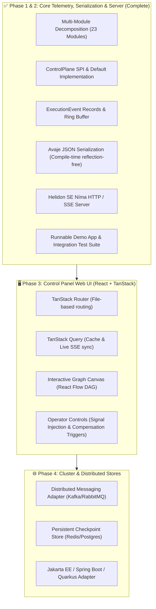

# Dispersion — Roadmap & Next Steps Plan

> **Last Updated:** September 22, 2026
> **Current Git State:** `main` clean, all 23 reactor modules passing (100% test pass rate), Helidon SE Níma standalone HTTP/SSE server, Avaje JSON serialization, and interactive runnable local demo (`DispersionDemoApp`) fully operational.
> **Overall Goal:** Connect the Dispersion distributed state engine to a modern React + TanStack Router Control Panel Web UI for real-time inspection, monitoring, and operator control.

---

## 📍 Where We Are Today

### ✅ Completed Milestones

1. **Multi-Module Decomposition & Reorganization (Hexagonal Boundaries & Nested Domains)**
   - Decomposed monolithic modules into topic-nested directories with zero split-package collisions across 23 modules:
     - `event/api` (`dispersion-event-api`), `event/core` (`dispersion-event-core`), `event/test` (`dispersion-event-test`): Telemetry event hierarchy and high-throughput virtual thread ring buffer dispatcher.
     - `fsm/api` (`dispersion-fsm-api`), `fsm/core` (`dispersion-fsm-core`), `fsm/test` (`dispersion-fsm-test`): Atomic FSM contracts, builders, virtual thread runner, and token-bucket admission control.
     - `routing/api` (`dispersion-routing-api`), `routing/core` (`dispersion-routing-core`), `routing/test` (`dispersion-routing-test`): Location-agnostic workload routing, Canary traffic control, and developer sandboxes.
     - `orchestration/api` (`dispersion-orchestration-api`), `orchestration/core` (`dispersion-orchestration-core`), `orchestration/batch` (`dispersion-orchestration-batch`), `orchestration/messaging` (`dispersion-orchestration-messaging`), `orchestration/test` (`dispersion-orchestration-test`): Macro sagas, automated LIFO rollbacks, turn-based batch barriers, broker-agnostic messaging, and test doubles.
     - `control/api` (`dispersion-control-plane-api`), `control/core` (`dispersion-control-plane-core`), `control/test` (`dispersion-control-plane-test`): Control plane query SPI, registry, and topology discovery.
     - `serialization/json/api` (`dispersion-serialization-json-api`): Zero-dependency SPI for JSON serialization.
     - `serialization/json/avaje` (`dispersion-serialization-avaje`): Compile-time reflection-free Avaje-Jsonb implementation supporting polymorphic `ExecutionEvent` discrimination.
     - `server/api` (`dispersion-server-api`): Clean server SPI (`ControlPlaneServer`, `ServerConfig`, `ControlPlaneServerFactory`) decoupled from web runtime frameworks.
     - `server/standalone` (`dispersion-server-standalone`): Helidon SE 4.x Níma HTTP server running natively on Java 25 virtual threads with SSE streaming and REST endpoints.
     - `testing` (`dispersion-testkit`): Unified static testing facade.
     - `bom` (`dispersion-bom`): Centralized dependency management.
     - `examples` (`dispersion-examples`): High-throughput virtual-thread pipeline bursts, multi-step distributed Saga rollbacks, and interactive developer demo application [`DispersionDemoApp`](file:///C:/Users/faiza/development/dispersion/examples/src/main/java/com/github/f442y/dispersion/examples/DispersionDemoApp.java).

2. **Tier 1: Atomic Finite State Machine Engine (`dispersion-fsm-core`)**
   - Pure thread-confined, lock-free execution model over Java 25 virtual threads.
   - Dynamic conditional transition evaluation (`transitionsTo`).
   - State visit loop detection & fallback thresholds (`maxVisits`).
   - Fast-fail circuit breaker protection (`circuitBreaker`).
   - Direct execution pathway (`executeDirect`) with zero thread allocations when invoked within virtual thread contexts.

3. **Tier 2: Orchestration & Distributed Saga Engine (`dispersion-orchestration-core`)**
   - Turn-based discrete execution lifecycle with thread confinement.
   - Safe execution suspension (`waitForSignal`) and resume on signal delivery.
   - Automated LIFO Saga compensation rollback upon unhandled errors or operator cancellation.
   - Parallel concurrent fork-join execution with fast-fail cancellation and interrupt handling.
   - Child machine composition with automatic retry, recovery, and result mapping.
   - Network idempotency deduplication (`CommandEnvelope`).

4. **Tier 3: Turn-Based Batch Processing (`dispersion-orchestration-batch`)**
   - Item-level virtual thread concurrency with isolated context state.
   - Synchronized stage progression via `ALL_ITEMS` and `QUORUM` barrier policies.
   - Granular item checkpoints for safe workflow resumption.

5. **Observability & Control Plane Subsystem (`dispersion-control-plane-api` & `dispersion-control-plane-core`)**
   - Clean, extensible telemetry event hierarchy in [`ExecutionEvent`](file:///C:/Users/faiza/development/dispersion/event/api/src/main/java/com/github/f442y/dispersion/event/ExecutionEvent.java).
   - Thread-safe functional listener contract [`ExecutionEventListener`](file:///C:/Users/faiza/development/dispersion/event/api/src/main/java/com/github/f442y/dispersion/event/ExecutionEventListener.java).
   - High-throughput, bounded, lock-free ring buffer dispatcher running on dedicated virtual threads.
   - Unified operator control SPI ([`ControlPlane`](file:///C:/Users/faiza/development/dispersion/control/api/src/main/java/com/github/f442y/dispersion/control/ControlPlane.java)) with thread-safe in-memory reference implementation ([`DefaultControlPlane`](file:///C:/Users/faiza/development/dispersion/control/core/src/main/java/com/github/f442y/dispersion/control/core/DefaultControlPlane.java)).
   - Dynamic Mermaid diagram generation and inspection.

6. **Serialization & Standalone Virtual-Thread HTTP Server (`dispersion-serialization-avaje` & `dispersion-server-standalone`)**
   - Reflection-free Avaje-Jsonb binary serializer generating polymorphic records for 21+ event types.
   - Helidon SE Níma HTTP web server serving `/api/v1/machines`, `/api/v1/machines/{machineName}`, `/api/v1/executions`, `/api/v1/executions/signal`, and `/api/v1/events/stream` (SSE).
   - Interactive local demo [`DispersionDemoApp`](file:///C:/Users/faiza/development/dispersion/examples/src/main/java/com/github/f442y/dispersion/examples/DispersionDemoApp.java) runnable directly in IntelliJ IDEA or via Maven CLI.

---

## 🎯 Next Steps & Phased Execution Roadmap

---

### 🖥️ Phase 3: Control Panel Web UI (React + TanStack Router)
> **Stack:** React 19, TypeScript, TanStack Router, TanStack Query, Tailwind CSS, React Flow / `@xyflow/react`.

- [ ] **Step 3.1 — UI Project Scaffolding**
  - Initialize `dispersion-ui` (Vite + React + TypeScript + TanStack Router).
  - Configure TanStack Router file-based routes:
    - `routes/__root.tsx`: App layout, global header, connection status badge (SSE indicator).
    - `routes/index.tsx`: Dashboard with running machine counts, throughput counters, and recent activity.
    - `routes/machines/index.tsx`: Catalog of state machines (Atomic vs. Orchestration sagas).
    - `routes/machines/$machineName.tsx`: Machine details, DAG visualization, state transition matrix.
    - `routes/executions/index.tsx`: Searchable execution table (filter by status: `RUNNING`, `SUSPENDED`, `COMPLETED`, `COMPENSATED`).
    - `routes/executions/$executionId.tsx`: Execution inspector with real-time state timeline, turn durations, and signal injection modal.
- [ ] **Step 3.2 — Interactive DAG Graph Visualization**
  - Render machine topology using React Flow:
    - Nodes styled according to state type (`initial`, `transient`, `terminal`, `suspendable`).
    - Animate active transitions in real-time when `StateEnteredEvent` / `TransitionEvaluatedEvent` arrives.
    - Visually highlight compensated states in red/amber during Saga rollbacks.
- [ ] **Step 3.3 — Live State Synchronization**
  - TanStack Query hooks consuming `/api/v1/events/stream` via EventSource.
  - Optimistic UI updates with cache invalidation on signal injection.

---

### 🌐 Phase 4: Production & Distributed Enhancements

- [ ] **Jakarta EE / Host Framework Adapters (`dispersion-server-jakarta`)**:
  - Expose `@Path` Jakarta REST / Servlet resource endpoints so users deploying to Spring Boot, Helidon MP, Quarkus, or Micronaut can use native container HTTP rather than standalone Helidon SE.
- [ ] **Kafka / RabbitMQ Broker Adapters (`dispersion-messaging-kafka`)**:
  - Connect `CommandEnvelope` transport to Kafka topics with partitioned correlation keys.
- [ ] **Durable Checkpoint Stores (`dispersion-store-postgres`, `dispersion-store-redis`)**:
  - Persistent storage for suspended orchestration checkpoints across node restarts.
- [ ] **Cluster Leadership & Lease Management**:
  - Partition assignment for distributed state machine workers.

---

## 📌 Quick Commands Reference

| Action | Command |
| :--- | :--- |
| **Run All Unit & Integration Tests** | `./mvnw clean test` |
| **Run Examples & Demo App Tests** | `./mvnw test -pl examples -am` |
| **Run Interactive Demo App** | `./mvnw compile exec:java -pl examples -Dexec.mainClass="com.github.f442y.dispersion.examples.DispersionDemoApp"` |
| **Fast Compile (No Tests)** | `./mvnw test-compile -DskipTests` |
| **Check Git Status** | `git status` |
| **View Latest Commits** | `git log --oneline -n 5` |
