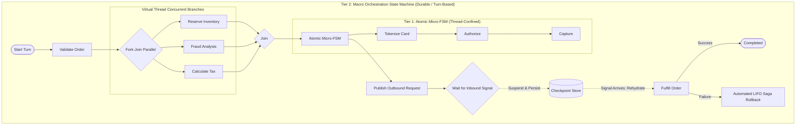
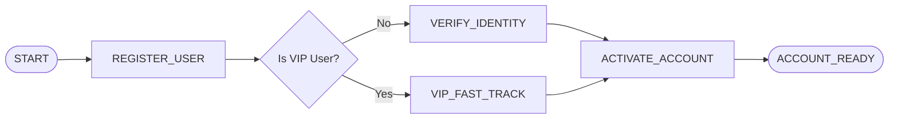
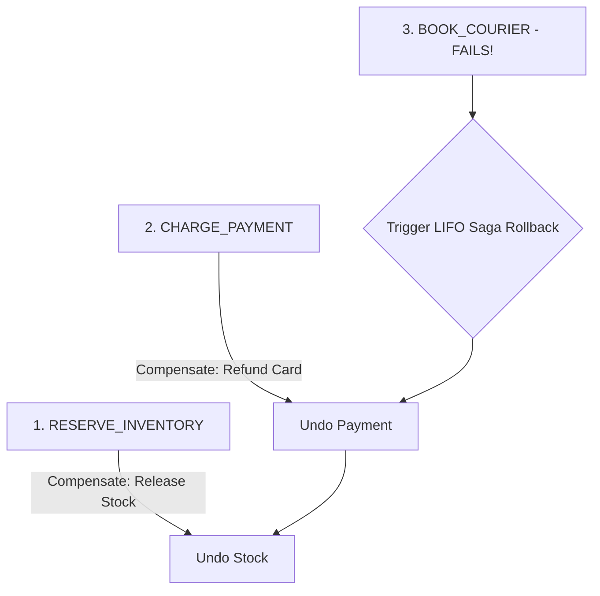

# Dispersion 🌀

[](https://openjdk.org/projects/jdk/25/)
[](https://openjdk.org/jeps/444)
[](https://opensource.org/licenses/Apache-2.0)
[](https://github.com/f442y/dispersion/actions)
[](https://jspecify.dev/)

> **High-Throughput Finite State Machine and Distributed Saga Orchestration Engine natively engineered for Java 25+ Virtual Threads.**

---

## 📖 Table of Contents

- [Overview](#-overview)
- [Two-Tiered Architecture (Micro vs Macro)](#-two-tiered-architecture-micro-vs-macro)
- [Fundamental Building Blocks & Definitions](#-fundamental-building-blocks--definitions)
- [Installation & Dependency Management](#-installation--dependency-management)
- [Java Platform Module System (JPMS) Support](#-java-platform-module-system-jpms-support)
- [Step-by-Step Examples & Design Patterns](#-step-by-step-examples--design-patterns)
  - [1. The Simplest State Machine: Coffee Machine FSM](#1-the-simplest-state-machine-coffee-machine-fsm)
  - [2. Dynamic Decision Branching: User Onboarding](#2-dynamic-decision-branching-user-onboarding)
  - [3. Turn-Based Macro Orchestration: Human Approval & Webhook Signals](#3-turn-based-macro-orchestration-human-approval--webhook-signals)
  - [4. Distributed Saga with Automated LIFO Rollback: E-Commerce Checkout](#4-distributed-saga-with-automated-lifo-rollback-e-commerce-checkout)
  - [5. Concurrent Parallel Fork-Join with Fast-Fail Sibling Compensation](#5-concurrent-parallel-fork-join-with-fast-fail-sibling-compensation)
  - [6. Resilient Child Machines: Exponential Retries & Context Recovery](#6-resilient-child-machines-exponential-retries--context-recovery)
  - [7. Idempotent Command Processing & Network Deduplication](#7-idempotent-command-processing--network-deduplication)
  - [8. Broker-Agnostic Messaging: Outbound Publishing & Inbound Subscriptions](#8-broker-agnostic-messaging-outbound-publishing--inbound-subscriptions)
  - [9. Batch Orchestration & Dynamic Synchronization Barriers](#9-batch-orchestration--dynamic-synchronization-barriers)
- [Java 25+ Language Features in Action](#-java-25-language-features-in-action)
  - [Exhaustive Pattern Matching on Sealed Exceptions](#exhaustive-pattern-matching-on-sealed-exceptions)
  - [Record Pattern Deconstruction](#record-pattern-deconstruction)
- [Resilience, Loop Prevention & Admission Control](#-resilience-loop-prevention--admission-control)
  - [State Visit Limits & Fallback Recovery](#state-visit-limits--fallback-recovery)
  - [Global Circuit Breakers](#global-circuit-breakers)
  - [Virtual Thread Admission Control & Backpressure](#virtual-thread-admission-control--backpressure)
  - [Mermaid Diagram Export](#mermaid-diagram-export)
- [Module Structure](#-module-structure)
- [Building & Testing](#-building--testing)
- [License](#-license)

---

## 🌟 Overview

**Dispersion** is an ultra-lightweight, zero-synchronization workflow and state machine engine engineered from the ground up for modern Java. By combining **Java 25 Virtual Threads** (`Thread.ofVirtual()`), sealed type hierarchies, records, and pattern matching, Dispersion enables hundreds of thousands of concurrent state machine workflows with sub-millisecond dispatch times, minimal memory footprint, and zero thread-pool exhaustion.

Unlike heavyweight workflow orchestrators that require external database daemons or complex proxy runtimes, Dispersion gives you two purpose-built tiers:
1. **Atomic (Micro) FSMs**: Thread-confined, zero-sync state pipelines executing on single virtual threads.
2. **Orchestration (Macro) FSMs**: Turn-based, durable, suspendable workflows with pluggable checkpoint persistence, automated LIFO Saga rollbacks, concurrent parallel branches, and broker-agnostic messaging.



---

## 🏛️ Two-Tiered Architecture (Micro vs Macro)

| Dimension | Tier 1: Atomic (Micro) State Machine | Tier 2: Orchestration (Macro) State Machine |
| :--- | :--- | :--- |
| **Execution Scope** | Single virtual thread, thread-confined | Turn-based, asynchronous, durable coordinator |
| **State Mutations** | Direct, zero-synchronization context | Checkpointed snapshots & persistent rehydration |
| **Concurrency & Lifecycle** | High-throughput sequential graph steps | Long-lived, suspendable via external signals (`waitForSignal`), parallel fork-join, **batch streaming & barriers** |
| **Messaging & Transport** | In-memory only | **Broker-Agnostic SPI** (Kafka, RabbitMQ, SQS, Redis, In-Memory) |
| **Failure Recovery** | Fast-fail, cycle loop-breakers, fallback states | Virtual-thread retries + **Automated LIFO Saga Rollbacks** across turns |
| **Primary Use Cases** | Low-latency state parsing, protocol decoding, single-unit business rules | Distributed transactions, multi-service Sagas, async approval workflows, batch item pipelines |

---

## 📚 Fundamental Building Blocks & Definitions

Before writing state machines, here is a breakdown of Dispersion's core concepts:

| Concept | What It Is | Why It Exists & What It Does |
| :--- | :--- | :--- |
| **`StateKey`** | An interface implemented by an `enum` representing state nodes in your graph. | Prevents error-prone "magic strings". Enforces compile-time type safety so state machines can only transition to declared enum constants. |
| **`StateMachineContext`** | A mutable POJO/DTO holding the domain data accumulated during execution. | Is thread-confined to a single virtual thread during any given turn, allowing fast lock-free field mutations without synchronization overhead. |
| **`Action<CONTEXT>`** | A functional interface `(context) -> context` executed when entering a state. | Encapsulates single-responsibility business logic (e.g. validating input, calculating fees, updating database rows). |
| **`Transition<CONTEXT, STATE_KEY>`** | A routing function `(context) -> nextStateKey`. | Evaluates context data at runtime to decide which state to execute next (supports static routing or dynamic conditional branches). |
| **`InputFunction<C, I>`** | `(context, input) -> context` applied before the initial state executes. | Maps external inputs (e.g. HTTP request payloads, IDs) into the internal state machine context. |
| **`OutputFunction<C, O>`** | `(context) -> output` executed after reaching a terminal end state. | Extracts or constructs a clean domain response returned to the caller, isolating internal context state. |
| **`CompensationAction<C>`** | `(context) -> context` executed during Saga rollback via `.compensate(...)`. | The compensating counter-action for a state (e.g. refunding a payment or releasing reserved stock) invoked automatically in LIFO order if a downstream step fails. |
| **`SagaCommand<C>`** | A combined interface uniting `execute(context)` and `compensate(context)`. | Lets you write clean, self-contained reversible domain operations in a single class. |
| **`SignalCommand`** | An interface for external command payloads with `correlationKey()`. | Enables direct routing of incoming webhooks/events to suspended state machines matching the key. |
| **`CommandEnvelope<T>`** | A record wrapper containing `(commandId, timestamp, command)`. | Provides transparent deduplication. If a remote system re-sends a command due to network retries, Dispersion processes it **exactly once**. |
| **`CheckpointStore`** | SPI for persisting state snapshots (`OrchestrationCheckpoint`). | Allows long-running workflows to pause, release virtual threads and memory, and resume hours or days later. |
| **`SignalPublisher` / `SignalConsumer`** | Broker-agnostic messaging contracts. | Decouples workflows from messaging infrastructure (Kafka, AWS SQS, RabbitMQ, or In-Memory). |
| **`BarrierPolicy`** | `ALL_ITEMS_ARRIVED` or `SIGNAL_TRIGGERED`. | Synchronizes batches of streaming items before allowing them to cross into downstream states together. |

---

## 📦 Installation & Dependency Management

Dispersion publishes a centralized Bill of Materials (**BOM**) for streamlined dependency management.

### Maven BOM Setup

Add the BOM to your root `pom.xml`:

```xml
<dependencyManagement>
    <dependencies>
        <dependency>
            <groupId>com.github.f442y.dispersion</groupId>
            <artifactId>dispersion-bom</artifactId>
            <version>DEVELOP-SNAPSHOT</version>
            <type>pom</type>
            <scope>import</scope>
        </dependency>
    </dependencies>
</dependencyManagement>
```

### Module Dependencies

Add the required modules to your application:

```xml
<dependencies>
    <!-- Core runtime engine (Virtual Threads, Executors, Builders, Sagas) -->
    <dependency>
        <groupId>com.github.f442y.dispersion</groupId>
        <artifactId>dispersion-core</artifactId>
    </dependency>

    <!-- (Optional) API interfaces only (for clean domain / contract modules) -->
    <dependency>
        <groupId>com.github.f442y.dispersion</groupId>
        <artifactId>dispersion-api</artifactId>
    </dependency>
</dependencies>
```

### Gradle Setup

```groovy
// build.gradle
dependencies {
    implementation platform('com.github.f442y.dispersion:dispersion-bom:DEVELOP-SNAPSHOT')
    implementation 'com.github.f442y.dispersion:dispersion-core'
}
```

---

## ☕ Java Platform Module System (JPMS) Support

All Dispersion JARs declare automatic module names in their manifests for first-class JPMS integration:

| Maven Module | JAR Artifact | JPMS Automatic Module Name | Primary Role |
| :--- | :--- | :--- | :--- |
| `dispersion-api` | `dispersion-api.jar` | `com.github.f442y.dispersion.api` | Contracts, exceptions, records, SPIs (Zero runtime dependencies) |
| `dispersion-core` | `dispersion-core.jar` | `com.github.f442y.dispersion.core` | Virtual-thread execution runtime, builders, sagas, messaging |
| `dispersion-examples` | `dispersion-examples.jar` | `com.github.f442y.dispersion.examples` | Reference architectures, end-to-end showcases, and pipelines |

In your `module-info.java`:

```java
module com.example.myapp {
    requires com.github.f442y.dispersion.core;
}
```

---

## 🚀 Step-by-Step Examples & Design Patterns

---

### 1. The Simplest State Machine: Coffee Machine FSM

Let's build a simple, complete state machine that grinds beans, heats water, brews coffee, and returns a cup of coffee.

```java
import com.github.f442y.dispersion.atomic.AtomicStateMachineBuilder;
import com.github.f442y.dispersion.atomic.AtomicStateMachineExecutor;
import com.github.f442y.dispersion.config.StateMachineConfiguration;
import com.github.f442y.dispersion.context.StateMachineContext;
import com.github.f442y.dispersion.state.StateKey;

// Step 1: Define the states of our machine as an Enum implementing StateKey
public enum CoffeeState implements StateKey {
    GRIND_BEANS,
    HEAT_WATER,
    BREW,
    SERVED
}

// Step 2: Define the Context object that holds data as we move through states
public class CoffeeContext implements StateMachineContext {
    public String roastType;     // e.g. "Dark Roast"
    public int waterTempCelsius; // e.g. 95
    public String coffeeOutput;  // Final brewed cup description
}

// Step 3: Build the state machine topology with the fluent builder
StateMachineConfiguration<CoffeeContext, CoffeeState, String, String> coffeeMachineConfig = AtomicStateMachineBuilder
    // <ContextType, StateEnumType, InputPayloadType, OutputReturnType>
    .<CoffeeContext, CoffeeState, String, String>create(CoffeeState.class)
    // Factory that provides a clean context instance for each new execution
    .context(CoffeeContext::new)
    // The entry point state where execution begins
    .initialState(CoffeeState.GRIND_BEANS)
    // Input mapping: takes external input (roast type) and initializes context
    .input((ctx, roast) -> {
        ctx.roastType = (roast != null) ? roast : "Medium Roast";
        return ctx;
    })
    // State 1: Grind Beans
    .state(CoffeeState.GRIND_BEANS)
        .action(ctx -> {
            System.out.println("Grinding " + ctx.roastType + " beans...");
            return ctx;
        })
        .transition(CoffeeState.HEAT_WATER) // Move to HEAT_WATER next
    // State 2: Heat Water
    .state(CoffeeState.HEAT_WATER)
        .action(ctx -> {
            ctx.waterTempCelsius = 93;
            System.out.println("Water heated to " + ctx.waterTempCelsius + "°C");
            return ctx;
        })
        .transition(CoffeeState.BREW) // Move to BREW next
    // State 3: Brew Coffee
    .state(CoffeeState.BREW)
        .action(ctx -> {
            ctx.coffeeOutput = "Freshly brewed hot cup of " + ctx.roastType + "!";
            System.out.println("Brewing finished.");
            return ctx;
        })
        .transition(CoffeeState.SERVED) // Move to SERVED next
    // Mark SERVED as the terminal (end) state
    .endStates(CoffeeState.SERVED)
    // Output mapping: extracts the final result returned to caller
    .output(ctx -> ctx.coffeeOutput)
    .build();

// Step 4: Execute synchronously on a dedicated Virtual Thread
try (AtomicStateMachineExecutor<CoffeeContext, CoffeeState, String, String> executor = new AtomicStateMachineExecutor<>("coffee-machine", coffeeMachineConfig)) {
    String cupOfCoffee = executor.dispatchSync("French Dark Roast");
    System.out.println("Result: " + cupOfCoffee);
    // Output: Freshly brewed hot cup of French Dark Roast!
}
```

---

### 2. Dynamic Decision Branching: User Onboarding

In real applications, workflows need to branch dynamically based on conditions (e.g. VIP users skip KYC verification, or high-risk signups require identity approval).

Dispersion uses `.transitionsTo(Set.of(...), ctx -> condition ? StateA : StateB)` to enforce both **runtime edge validation** and **graph topology integrity**.



```java
import com.github.f442y.dispersion.atomic.AtomicStateMachineBuilder;
import com.github.f442y.dispersion.atomic.AtomicStateMachineExecutor;
import com.github.f442y.dispersion.context.StateMachineContext;
import com.github.f442y.dispersion.state.StateKey;
import java.util.Set;

public enum OnboardingState implements StateKey {
    REGISTER_USER,
    VERIFY_IDENTITY,
    VIP_FAST_TRACK,
    ACTIVATE_ACCOUNT,
    ACCOUNT_READY
}

public class OnboardingContext implements StateMachineContext {
    public String userId;
    public boolean isVip;
    public boolean identityVerified;
    public String status;
}

public record OnboardingRequest(String userId, boolean isVip) {}

try (AtomicStateMachineExecutor<OnboardingContext, OnboardingState, OnboardingRequest, String> onboardingExecutor = AtomicStateMachineBuilder
        .<OnboardingContext, OnboardingState, OnboardingRequest, String>create(OnboardingState.class)
        .context(OnboardingContext::new)
        .initialState(OnboardingState.REGISTER_USER)
        .input((ctx, req) -> {
            ctx.userId = req.userId();
            ctx.isVip = req.isVip();
            return ctx;
        })
        .state(OnboardingState.REGISTER_USER)
            .action(ctx -> {
                System.out.println("Registering user: " + ctx.userId);
                return ctx;
            })
            // Dynamic Branching: VIPs skip manual identity verification!
            .transitionsTo(
                Set.of(OnboardingState.VIP_FAST_TRACK, OnboardingState.VERIFY_IDENTITY),
                ctx -> ctx.isVip ? OnboardingState.VIP_FAST_TRACK : OnboardingState.VERIFY_IDENTITY
            )
        .state(OnboardingState.VERIFY_IDENTITY)
            .action(ctx -> {
                ctx.identityVerified = true;
                System.out.println("Performing standard KYC verification...");
                return ctx;
            })
            .transition(OnboardingState.ACTIVATE_ACCOUNT)
        .state(OnboardingState.VIP_FAST_TRACK)
            .action(ctx -> {
                ctx.identityVerified = true; // Auto-verified for VIPs
                System.out.println("Applying VIP instant verification bypass.");
                return ctx;
            })
            .transition(OnboardingState.ACTIVATE_ACCOUNT)
        .state(OnboardingState.ACTIVATE_ACCOUNT)
            .action(ctx -> {
                ctx.status = "ACTIVE";
                return ctx;
            })
            .transition(OnboardingState.ACCOUNT_READY)
        .endStates(OnboardingState.ACCOUNT_READY)
        .output(ctx -> "User " + ctx.userId + " is now " + ctx.status)
        .buildExecutor("user-onboarding")) {

    String result = onboardingExecutor.dispatchSync(new OnboardingRequest("USER-42", true));
    System.out.println(result); // User USER-42 is now ACTIVE
}
```

---

### 3. Turn-Based Macro Orchestration: Human Approval & Webhook Signals

Real-world business processes often span minutes, hours, or days (e.g. waiting for a payment webhook or manager approval).

With **Orchestration State Machines**, the workflow executes until hitting a `.waitForSignal(...)` state, snapshots its state to a `CheckpointStore`, and **releases its virtual thread**. When the external signal arrives, Dispersion rehydrates the exact state machine by its **correlation key** and resumes execution.

```java
import com.github.f442y.dispersion.context.StateMachineContext;
import com.github.f442y.dispersion.orchestration.CheckpointStore;
import com.github.f442y.dispersion.orchestration.InMemoryCheckpointStore;
import com.github.f442y.dispersion.orchestration.OrchestrationStateMachineBuilder;
import com.github.f442y.dispersion.orchestration.OrchestrationStateMachineExecutor;
import com.github.f442y.dispersion.orchestration.OrchestrationTurnResult;
import com.github.f442y.dispersion.state.StateKey;

public enum LoanState implements StateKey {
    SUBMIT_APPLICATION,
    AWAIT_MANAGER_APPROVAL,
    DISBURSE_FUNDS,
    LOAN_COMPLETED
}

public class LoanContext implements StateMachineContext {
    public String loanId;
    public int amount;
    public String approvedBy;
    public boolean disbursed;
}

// Inbound signal payload received from manager approval webhook/UI
public record LoanApprovalSignal(String loanId, String managerName, boolean approved) {}

// Checkpoint store persists the state snapshot while the workflow is suspended
CheckpointStore<LoanContext, LoanState> checkpointStore = new InMemoryCheckpointStore<>();

try (OrchestrationStateMachineExecutor<LoanContext, LoanState, LoanContext, String> loanExecutor = OrchestrationStateMachineBuilder
        .<LoanContext, LoanState, LoanContext, String>create("LoanWorkflow", LoanState.class)
        .context(LoanContext::new)
        .initialState(LoanState.SUBMIT_APPLICATION)
        .checkpointStore(checkpointStore)
        // The correlation key allows incoming signals to locate this suspended instance
        .correlationKey(ctx -> ctx.loanId)
        .input((ctx, input) -> {
            ctx.loanId = input.loanId;
            ctx.amount = input.amount;
            return ctx;
        })
        .state(LoanState.SUBMIT_APPLICATION)
            .action(ctx -> {
                System.out.println("Loan application submitted: " + ctx.loanId + " for $" + ctx.amount);
                return ctx;
            })
            .transition(LoanState.AWAIT_MANAGER_APPROVAL)
        // 🛑 SUSPENSION POINT: Workflow pauses here, saves checkpoint, and yields thread
        .state(LoanState.AWAIT_MANAGER_APPROVAL)
            .waitForSignal("LoanApproval", LoanApprovalSignal.class, (ctx, signal) -> {
                System.out.println("Received approval signal from: " + signal.managerName());
                ctx.approvedBy = signal.managerName();
                return ctx;
            })
            .transition(LoanState.DISBURSE_FUNDS)
        .state(LoanState.DISBURSE_FUNDS)
            .action(ctx -> {
                ctx.disbursed = true;
                System.out.println("Disbursing $" + ctx.amount + " approved by " + ctx.approvedBy);
                return ctx;
            })
            .transition(LoanState.LOAN_COMPLETED)
        .endStates(LoanState.LOAN_COMPLETED)
        .output(ctx -> "Loan " + ctx.loanId + " disbursed ($" + ctx.amount + ")")
        .buildExecutor()) {

    // --- TURN 1: Initial submission ---
    LoanContext loan = new LoanContext();
    loan.loanId = "LOAN-1002";
    loan.amount = 50000;

    OrchestrationTurnResult<LoanContext, LoanState, String> turn1 = loanExecutor.dispatchTurnSync(null, loan);
    System.out.println("Is Suspended? " + turn1.isSuspended()); // true
    System.out.println("Current State: " + turn1.currentStateKey()); // AWAIT_MANAGER_APPROVAL

    // --- TURN 2: External Manager Approves via Webhook hours later ---
    OrchestrationTurnResult<LoanContext, LoanState, String> turn2 = loanExecutor.sendSignalByCorrelationKey(
        "LOAN-1002",
        "LoanApproval",
        new LoanApprovalSignal("LOAN-1002", "Sarah Connor", true)
    ).get();

    System.out.println("Is Completed? " + turn2.isCompleted()); // true
    System.out.println("Result: " + turn2.output()); // Loan LOAN-1002 disbursed ($50000)
}
```

---

### 4. Distributed Saga with Automated LIFO Rollback: E-Commerce Checkout

In distributed architectures, multiple remote services are modified (e.g. inventory reserved, payment charged, shipping scheduled). If a step fails, previous steps must be undone in **reverse chronological (LIFO) order**.

Dispersion automates this completely with `.compensate(...)`:



```java
import com.github.f442y.dispersion.context.StateMachineContext;
import com.github.f442y.dispersion.orchestration.OrchestrationStateMachineBuilder;
import com.github.f442y.dispersion.orchestration.OrchestrationStateMachineExecutor;
import com.github.f442y.dispersion.state.StateKey;

public enum CheckoutState implements StateKey {
    RESERVE_INVENTORY,
    CHARGE_PAYMENT,
    SCHEDULE_DELIVERY,
    COMPLETED
}

public class CheckoutContext implements StateMachineContext {
    public String orderId;
    public boolean stockReserved;
    public boolean paymentCharged;
    public boolean deliveryBooked;
}

try (OrchestrationStateMachineExecutor<CheckoutContext, CheckoutState, String, String> checkoutExecutor = OrchestrationStateMachineBuilder
        .<CheckoutContext, CheckoutState, String, String>create("CheckoutSaga", CheckoutState.class)
        .context(CheckoutContext::new)
        .initialState(CheckoutState.RESERVE_INVENTORY)
        .input((ctx, id) -> { ctx.orderId = id; return ctx; })

        // Step 1: Reserve Inventory
        .state(CheckoutState.RESERVE_INVENTORY)
            .action(ctx -> {
                ctx.stockReserved = true;
                System.out.println("Step 1: Inventory reserved.");
                return ctx;
            })
            .compensate(ctx -> {
                ctx.stockReserved = false;
                System.out.println("ROLLBACK: Releasing reserved inventory.");
                return ctx;
            })
            .transition(CheckoutState.CHARGE_PAYMENT)

        // Step 2: Charge Payment
        .state(CheckoutState.CHARGE_PAYMENT)
            .action(ctx -> {
                ctx.paymentCharged = true;
                System.out.println("Step 2: Credit card charged.");
                return ctx;
            })
            .compensate(ctx -> {
                ctx.paymentCharged = false;
                System.out.println("COMPENSATION: Refunding credit card charge.");
                return ctx;
            })
            .transition(CheckoutState.SCHEDULE_DELIVERY)

        // Step 3: Schedule Delivery (Simulate unexpected failure)
        .state(CheckoutState.SCHEDULE_DELIVERY)
            .action(ctx -> {
                System.out.println("Step 3: Attempting to book delivery courier...");
                throw new IllegalStateException("Courier service unavailable in delivery zone!");
            })
            .transition(CheckoutState.COMPLETED)

        .endStates(CheckoutState.COMPLETED)
        .buildExecutor()) {

    try {
        checkoutExecutor.dispatchSync("ORD-8822");
    } catch (Exception e) {
        System.out.println("Checkout failed: " + e.getMessage());
        // Console output automatically shows:
        // Step 1: Inventory reserved.
        // Step 2: Credit card charged.
        // Step 3: Attempting to book delivery courier...
        // COMPENSATION: Refunding credit card charge. (LIFO Step 2 Compensation)
        // COMPENSATION: Releasing reserved inventory.   (LIFO Step 1 Compensation)
    }
}
```

---

### 5. Concurrent Parallel Fork-Join with Fast-Fail Sibling Compensation

Run multiple independent tasks concurrently on Virtual Threads. If any branch fails, sibling branches are automatically cancelled and completed branches are rolled back:

```java
.state(OrderState.PARALLEL_ENRICHMENT)
    .parallel()
        // Branch A: Reserve stock concurrently
        .branch("reserve-stock",
            ctx -> {
                ctx.stockReserved = true;
                return ctx;
            },
            ctx -> {
                ctx.stockReserved = false; // Compensation if sibling fails
                return ctx;
            }
        )
        // Branch B: Run fraud check concurrently
        .branch("fraud-check",
            ctx -> {
                ctx.fraudScore = 12; // Low risk
                return ctx;
            },
            ctx -> {
                // Fraud check rollback if needed
                return ctx;
            }
        )
        // Branch C: Calculate geo-taxes concurrently
        .branch("tax-calculation",
            ctx -> {
                ctx.taxRate = 0.0825;
                return ctx;
            }
        )
    .transition(OrderState.FINALIZE_ORDER)
```

---

### 6. Resilient Child Machines: Exponential Retries & Context Recovery

When calling unstable external APIs or atomic child machines, configure exponential backoff retries. Use `ContextRecoverer` to sanitize or regenerate fresh idempotency tokens on retry attempts:

```java
import com.github.f442y.dispersion.orchestration.RetryPolicy;
import java.time.Duration;

.state(OrderState.CHARGE_PAYMENT)
    // Embed child micro-state machine
    .atomicMachine(paymentMicroStateMachine)
    .input(ctx -> ctx.paymentRequest)
    .output((ctx, authCode) -> {
        ctx.authorizationCode = authCode;
        return ctx;
    })
    // Exponential retry: 3 attempts, initial delay 100ms, multiplier 2.0x
    .retry(RetryPolicy.exponentialBackoff(3, Duration.ofMillis(100), 2.0))
    // Context Recoverer: sanitizes payload and generates new idempotency key on each retry
    .recoverer((ctx, lastError, attempt) -> {
        System.out.println("Retrying payment, attempt: " + attempt + " due to: " + lastError.getMessage());
        return new PaymentRequest(ctx.orderId, ctx.amount, "IDEMP-" + ctx.orderId + "-ATTEMPT-" + attempt);
    })
    .transition(OrderState.FULFILLMENT)
```

---

### 7. Idempotent Command Processing & Network Deduplication

Under unstable network conditions, message queues and webhooks frequently deliver the same message multiple times.

Dispersion's `CommandEnvelope<T>` guarantees **exactly-once execution**:

```java
import com.github.f442y.dispersion.orchestration.command.CommandEnvelope;
import com.github.f442y.dispersion.orchestration.command.SignalCommand;
import java.time.Instant;
import java.util.UUID;

// 1. Define domain command implementing SignalCommand
public record ApproveOrderCommand(String orderId, String managerId) implements SignalCommand {
    @Override
    public String correlationKey() {
        return orderId;
    }
}

// 2. Wrap in an idempotent CommandEnvelope with a unique command UUID
UUID uniqueCommandId = UUID.randomUUID();
CommandEnvelope<ApproveOrderCommand> envelope = new CommandEnvelope<>(
    uniqueCommandId,
    Instant.now(),
    new ApproveOrderCommand("ORD-9090", "manager-bob")
);

// 3. Even if this envelope is delivered 10 times concurrently over the network,
// Dispersion executes the turn on the 1st delivery and deduplicates the remaining 9!
executor.handleCommand(envelope).get();
```

---

### 8. Broker-Agnostic Messaging: Outbound Publishing & Inbound Subscriptions

Connect state machines directly to message brokers (Apache Kafka, AWS SQS, RabbitMQ, or in-memory virtual thread channels):

```java
import com.github.f442y.dispersion.orchestration.OrchestrationStateMachineBuilder;
import com.github.f442y.dispersion.orchestration.OrchestrationStateMachineExecutor;
import com.github.f442y.dispersion.orchestration.messaging.InMemorySignalBroker;
import com.github.f442y.dispersion.orchestration.messaging.SignalReceiver;

// 1. In-Memory broker on Virtual Threads (or swap with Kafka / SQS adapter)
try (InMemorySignalBroker broker = new InMemorySignalBroker()) {

    // 2. Build state machine with outbound publication and inbound command wait
    try (OrchestrationStateMachineExecutor<ShippingContext, ShippingState, Void, String> executor = OrchestrationStateMachineBuilder
            .<ShippingContext, ShippingState, Void, String>create("ShippingWorkflow", ShippingState.class)
            .context(ShippingContext::new)
            .initialState(ShippingState.INIT)
            .checkpointStore(store)
            .correlationKey(ctx -> ctx.shipmentId)
            .state(ShippingState.INIT)
                // Publishes outbound message to broker destination "warehouse-dispatch-requests"
                .publish(broker, "warehouse-dispatch-requests", ctx -> new DispatchRequest(ctx.shipmentId))
                .transition(ShippingState.AWAIT_PICKED)
            .state(ShippingState.AWAIT_PICKED)
                // Waits for inbound command from warehouse
                .waitForCommand(PackagePickedCommand.class, (ctx, cmd) -> {
                    ctx.picked = true;
                    return ctx;
                })
                .transition(ShippingState.COMPLETED)
            .endStates(ShippingState.COMPLETED)
            .buildExecutor()) {

        // 3. Connect broker subscription to the state machine via SignalReceiver
        SignalReceiver receiver = SignalReceiver.forExecutor(executor);
        broker.subscribe("warehouse-events", receiver);
    }
}
```

---

### 9. Batch Orchestration & Dynamic Synchronization Barriers

Process collections of items where individual items stream independently on Virtual Threads and synchronize at dynamic barriers:

```java
import com.github.f442y.dispersion.orchestration.batch.BarrierPolicy;
import com.github.f442y.dispersion.orchestration.batch.BatchOrchestrationExecutor;
import com.github.f442y.dispersion.orchestration.batch.BatchOrchestrationStateMachineBuilder;
import com.github.f442y.dispersion.state.StateKey;
import java.util.List;

public enum BatchState implements StateKey {
    INSPECT_ITEM,
    HOLD_AT_BATCH_BARRIER,
    DISPATCH_PALLET,
    COMPLETED
}

try (BatchOrchestrationExecutor<BatchContext, ItemContext, BatchState, String> batchExecutor = BatchOrchestrationStateMachineBuilder
        .<BatchContext, ItemContext, BatchState, String>create("PalletBatch", BatchState.class)
        .batchContext(BatchContext::new)
        .batchKey(ctx -> ctx.batchId)
        .itemKey(item -> item.itemId)
        .initialState(BatchState.INSPECT_ITEM)
        // Step 1: Items stream and inspect independently
        .itemState(BatchState.INSPECT_ITEM)
            .action(item -> {
                item.inspected = true;
                return item;
            })
            .transition(BatchState.HOLD_AT_BATCH_BARRIER)
        // Step 2: BARRIER - Items wait until ALL items in the batch arrive here
        .itemState(BatchState.HOLD_AT_BATCH_BARRIER)
            .barrier(BarrierPolicy.ALL_ITEMS_ARRIVED)
            .transition(BatchState.DISPATCH_PALLET)
        // Step 3: All items unlock simultaneously and dispatch together
        .itemState(BatchState.DISPATCH_PALLET)
            .action(item -> {
                item.dispatched = true;
                return item;
            })
            .transition(BatchState.COMPLETED)
        .endStates(BatchState.COMPLETED)
        .buildExecutor()) {

    BatchContext batch = new BatchContext();
    batch.batchId = "PALLET-404";
    List<ItemContext> itemsList = List.of(new ItemContext("ITEM-1"), new ItemContext("ITEM-2"));

    // Dispatch items concurrently on Virtual Threads
    batchExecutor.dispatchBatchSync(batch, itemsList);
}
```

---

## ☕ Java 25+ Language Features in Action

### Exhaustive Pattern Matching on Sealed Exceptions

`StateMachineException` is a sealed class permitting specific error subtypes, enabling compile-time exhaustive switch pattern matching without `default:` branches:

```java
try {
    executor.dispatchSync(input);
} catch (StateMachineException ex) {
    String diagnostic = switch (ex) {
        case ActionException ae -> "Action failed in state [" + ae.getStateName() + "]: " + ae.getCause().getMessage();
        case TransitionException te -> "Invalid transition from [" + te.getSourceStateName() + "] to [" + te.getTargetStateName() + "]";
        case BackpressureException be -> "Admission backpressure: " + be.getMessage();
        case MaxTransitionsExceededException mte -> "Global transition limit reached: " + mte.getMaxTransitions();
        case MaxStateVisitsExceededException msve -> "Max visits exceeded for state [" + msve.getStateName() + "]";
        case CompensationException ce -> "Saga rollback error in state [" + ce.getStateName() + "]";
    };
    log.error(diagnostic, ex);
}
```

### Record Pattern Deconstruction

```java
if (envelope instanceof CommandEnvelope(UUID id, Instant timestamp, PaymentApprovedCommand(String paymentId, int amount, String authCode))) {
    System.out.printf("Command [%s] processed payment %s for $%d with auth %s%n", id, paymentId, amount / 100, authCode);
}
```

---

## 🛡️ Resilience, Loop Prevention & Admission Control

### State Visit Limits & Fallback Recovery

Prevent infinite loops caused by cyclic transitions or transient retries:

```java
.state(PaymentState.CONTACT_GATEWAY)
    .action(ctx -> callGateway(ctx))
    // If this state is visited more than 3 times, divert execution to fallback state!
    .maxVisits(3, PaymentState.FALLBACK_OFFLINE_QUEUE)
    .transition(PaymentState.SETTLED)
```

### Global Circuit Breakers

```java
// Trips circuit breaker and aborts if any execution performs more than 50 total transitions
.maxTransitions(50)
```

### Virtual Thread Admission Control & Backpressure

Prevent memory saturation during massive traffic spikes:

```java
// Buffer up to 10,000 concurrent virtual threads; reject immediately if capacity is exceeded
AdmissionController admission = AdmissionController.rejectImmediately(10_000);

BufferedStateMachineExecutor<MyContext, String, String> executor = new BufferedStateMachineExecutor<>(
    "buffered-executor",
    machineConfig,
    admission
);
```

### Mermaid Diagram Export

Export state maps to Mermaid syntax for documentation:

```java
String mermaid = machineConfig.getStateMap().toMermaid();
System.out.println(mermaid);
```

---

## 📁 Module Structure

```
dispersion/
├── dispersion-bom/          # Centralized Bill of Materials POM
├── dispersion-api/          # Interfaces, Sealed Exceptions, Records, SPIs (com.github.f442y.dispersion.api)
├── dispersion-core/         # Execution Engines, Virtual Thread Executors, Sagas (com.github.f442y.dispersion.core)
└── dispersion-examples/     # Real-world Distributed Saga Reference Implementations (com.github.f442y.dispersion.examples)
```

---

## 🛠️ Building & Testing

### Prerequisites
- **JDK 25+** (e.g. OpenJDK 25 / Azul Zulu 25 / Liberica JDK 25)
- **Maven 3.9+** (or use the included `./mvnw`)

### Build & Run Complete Test Matrix

```bash
# Build all modules and verify packages
./mvnw clean verify

# Run complete multi-module test suite
./mvnw clean test
```

---

## 📄 License

Dispersion is open-source software licensed under the [Apache License, Version 2.0](https://opensource.org/licenses/Apache-2.0).
