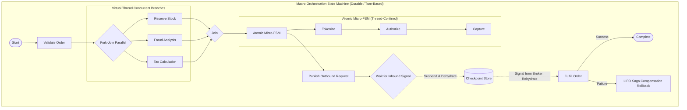

# Dispersion 🌀

[](https://openjdk.org/projects/jdk/25/)
[](https://openjdk.org/jeps/444)
[](https://opensource.org/licenses/Apache-2.0)
[](https://github.com/f442y/dispersion/actions)

> **High-Throughput Finite State Machine and Saga Orchestration Engine designed natively for Java 25 Virtual Threads.**

---

## 📖 Table of Contents

- [Overview](#-overview)
- [Two-Tiered State Machine Architecture](#-two-tiered-state-machine-architecture)
- [Key Features](#-key-features)
- [Installation & Dependency Management](#-installation--dependency-management)
- [Quickstart & Design Patterns](#-quickstart--design-patterns)
  - [1. Atomic (Micro) State Machine](#1-atomic-micro-state-machine)
  - [2. Macro Orchestration with Automated Saga Rollbacks](#2-macro-orchestration-with-automated-saga-rollbacks)
  - [3. Turn-Based Durable Execution & Checkpoint Persistence](#3-turn-based-durable-execution--checkpoint-persistence)
  - [4. Command Pattern: Sealed Signals, Reversible Sagas & Deduplication](#4-command-pattern-sealed-signals-reversible-sagas--deduplication)
  - [5. Broker-Agnostic Messaging (Kafka, RabbitMQ, SQS, In-Memory)](#5-broker-agnostic-messaging-kafka-rabbitmq-sqs-in-memory)
  - [6. Set / Batch Orchestration & Dynamic Barrier Synchronization](#6-set--batch-orchestration--dynamic-barrier-synchronization)
  - [7. Concurrent Parallel Fork-Join Branches](#7-concurrent-parallel-fork-join-branches)
- [Resilience, Loop Prevention & Circuit Breakers](#-resilience-loop-prevention--circuit-breakers)
- [Concurrency & Admission Control](#-concurrency--admission-control)
- [Module Structure](#-module-structure)
- [Building & Testing](#-building--testing)
- [License](#-license)

---

## 🌟 Overview

**Dispersion** is an ultra-lightweight, high-performance workflow execution engine crafted from the ground up for modern Java. By leveraging **Java 25 Virtual Threads** (`Thread.ofVirtual()`), Dispersion enables hundreds of thousands of concurrent state machine workflows with near-zero memory footprint and no thread-pool exhaustion.



---

## 🏛️ Two-Tiered State Machine Architecture

Dispersion separates workflow execution into two purpose-built tiers:

| Dimension | Atomic (Micro) State Machine | Orchestration (Macro) State Machine |
| :--- | :--- | :--- |
| **Execution Scope** | Single virtual thread, thread-confined | Turn-based, asynchronous, durable coordinator |
| **State Mutations** | Direct, zero-synchronization context | Checkpointed snapshots & persistent rehydration |
| **Concurrency & Lifecycle** | High-throughput sequential graph steps | Long-lived, suspendable via external signals (`waitForSignal`), parallel fork-join, **batch streaming & barriers** |
| **Messaging & Transport** | In-memory only | **Broker-Agnostic** (Kafka, RabbitMQ, SQS, Redis, In-Memory) |
| **Failure Recovery** | Fast fail, cycle loop-breakers, fallback states | Virtual thread retry policies + **Automated LIFO Saga Rollbacks** across turns |
| **Primary Use Cases** | State transitions, validation pipelines, low-latency parsing | Distributed transactions, multi-service workflows, durable microservice Sagas, batch pipelines |

---

## ⚡ Key Features

- **🚀 Java 25 Virtual Thread Native**: Dispatches individual executions on lightweight virtual threads using `Executors.newThreadPerTaskExecutor()`.
- **🔒 Zero-Contention Context**: Business actions within micro-machines mutate state without synchronization locks.
- **🛡️ Automated LIFO Saga Rollbacks**: If a macro workflow fails at any step, all previously completed steps automatically roll back in reverse order, even across multi-turn rehydrations.
- **⏳ Turn-Based Durable Execution**: Workflows suspend at external signal boundaries, persist snapshots to a pluggable `CheckpointStore`, release virtual threads and memory, and rehydrate on demand.
- **📦 Set & Batch Orchestration with Dynamic Barriers**: Manage collections of item contexts on Virtual Threads where individual units stream independently based on item-level signals, and synchronize at dynamic barriers (`ALL_ITEMS_ARRIVED`, `SIGNAL_TRIGGERED`).
- **🎯 First-Class Command Pattern**:
  - `SignalCommand`: Strongly typed external events (supports sealed interfaces and pattern matching).
  - `SagaCommand`: Self-contained reversible steps combining `execute(ctx)` and `undo(ctx)`.
  - `CommandEnvelope`: Transparent deduplication and idempotency tracking.
- **🔌 Broker-Agnostic Messaging SPI**: Ingest and publish signals across any transport (Apache Kafka, RabbitMQ, AWS SQS, Google Pub/Sub, Redis Streams, or In-Memory) via `SignalPublisher`, `SignalConsumer`, and `SignalReceiver`.
- **🔀 Concurrent Parallel Fork-Join**: Run independent sub-tasks concurrently on virtual threads; if any branch fails, sibling branches are compensated automatically.
- **🔄 Safe Retry with Clean Context Recovery**: Reconstruct fresh, unpolluted input payloads when retrying failed steps on fresh virtual threads via `ContextRecoverer`.
- **🛑 Loop Protection & Circuit Breakers**:
  - `maxVisits(count, fallback)`: Prevents infinite retry loops per state.
  - `maxTransitions(count)`: Global circuit breaker protecting against graph cycles.
  - Runtime edge validation: Guarantees state transitions strictly follow declared directed graph edges.
- **🚥 Admission Control & Backpressure**: Configurable strategies (`BLOCK`, `REJECT_IMMEDIATELY`, `WAIT_WITH_TIMEOUT`) to prevent resource exhaustion under burst traffic.
- **📊 Mermaid Diagram Export**: Output state graphs directly to Mermaid format using `stateMap.toMermaid()`.

---

## 📦 Installation & Dependency Management

Dispersion publishes a centralized Bill of Materials (**BOM**) for streamlined dependency management.

### Maven BOM Setup

Add the BOM to your root `pom.xml`:

```xml
<dependencyManagement>
    <dependencies>
        <dependency>
            <groupId>com.github.f442y.dispersion</groupId>
            <artifactId>dispersion-bom</artifactId>
            <version>DEVELOP-SNAPSHOT</version>
            <type>pom</type>
            <scope>import</scope>
        </dependency>
    </dependencies>
</dependencyManagement>
```

### Module Dependencies

Add the required modules to your application:

```xml
<dependencies>
    <!-- Core runtime engine -->
    <dependency>
        <groupId>com.github.f442y.dispersion</groupId>
        <artifactId>dispersion-core</artifactId>
    </dependency>

    <!-- (Optional) API interfaces only (for contract-only libraries) -->
    <dependency>
        <groupId>com.github.f442y.dispersion</groupId>
        <artifactId>dispersion-api</artifactId>
    </dependency>
</dependencies>
```

---

## 🚀 Quickstart & Design Patterns

### 1. Atomic (Micro) State Machine

Define state keys by implementing `StateKey`, create a context class implementing `StateMachineContext`, and assemble the graph using the fluent builder:

```java
import com.github.f442y.dispersion.atomic.AtomicStateMachineBuilder;
import com.github.f442y.dispersion.atomic.AtomicStateMachineExecutor;
import com.github.f442y.dispersion.context.StateMachineContext;
import com.github.f442y.dispersion.state.StateKey;

// 1. Define State Enum
public enum PaymentState implements StateKey {
    INITIALIZE, AUTHORIZE, CAPTURE, SETTLED
}

// 2. Define Context
public class PaymentContext implements StateMachineContext {
    public String paymentId;
    public int amount;
    public boolean authorized;
}

// 3. Build State Machine
var stateMachine = AtomicStateMachineBuilder.<PaymentContext, PaymentState, Integer, String>create(PaymentState.class)
    .context(PaymentContext::new)
    .initialState(PaymentState.INITIALIZE)
    .input((ctx, amount) -> {
        ctx.amount = amount;
        return ctx;
    })
    .state(PaymentState.INITIALIZE)
        .action(ctx -> {
            ctx.paymentId = "PAY-" + System.currentTimeMillis();
            return ctx;
        })
        .transition(PaymentState.AUTHORIZE)
    .state(PaymentState.AUTHORIZE)
        .action(ctx -> {
            ctx.authorized = true;
            return ctx;
        })
        .transition(PaymentState.CAPTURE)
    .state(PaymentState.CAPTURE)
        .action(ctx -> ctx)
        .transition(PaymentState.SETTLED)
    .endStates(PaymentState.SETTLED)
    .output(ctx -> "Payment " + ctx.paymentId + " settled: $" + (ctx.amount / 100.0))
    .build();

// 4. Execute on Virtual Threads
try (var executor = new AtomicStateMachineExecutor<>("payment-engine", stateMachine)) {
    // Synchronous execution
    String result = executor.dispatchSync(5000);
    System.out.println(result); // Payment PAY-... settled: $50.0

    // Asynchronous Virtual Thread execution
    var future = executor.dispatchAsync(7500);
    System.out.println(future.get());
}
```

---

### 2. Macro Orchestration with Automated Saga Rollbacks

Coordinate multi-service workflows with automatic reverse-order compensation upon failure:

```java
import com.github.f442y.dispersion.orchestration.OrchestrationStateMachineBuilder;
import com.github.f442y.dispersion.orchestration.RetryPolicy;
import com.github.f442y.dispersion.state.StateKey;
import java.time.Duration;

public enum OrderState implements StateKey {
    VALIDATE, RESERVE_STOCK, CHARGE_CARD, FULFILL, COMPLETED, FAILED
}

var orderOrchestrator = OrchestrationStateMachineBuilder.<OrderContext, OrderState, OrderRequest, String>create("OrderSaga", OrderState.class)
    .context(OrderContext::new)
    .initialState(OrderState.VALIDATE)
    // Step 1: Validation
    .state(OrderState.VALIDATE)
        .action(ctx -> ctx.validate())
        .transition(OrderState.RESERVE_STOCK)
    // Step 2: Inventory Reservation with Saga Compensation
    .state(OrderState.RESERVE_STOCK)
        .action(ctx -> ctx.reserveInventory())
        .compensate(ctx -> ctx.releaseInventory()) // Automatically executed if downstream steps fail
        .transition(OrderState.CHARGE_CARD)
    // Step 3: Payment with Virtual Thread Retry & Refund Compensation
    .state(OrderState.CHARGE_CARD)
        .action(ctx -> ctx.chargeCustomer())
        .retry(RetryPolicy.exponential(3, Duration.ofMillis(100), 2.0, Duration.ofSeconds(1)))
        .compensate(ctx -> ctx.refundCustomer())
        .transition(OrderState.FULFILL)
    // Step 4: Fulfillment
    .state(OrderState.FULFILL)
        .action(ctx -> ctx.shipOrder())
        .transition(OrderState.COMPLETED)
    .endStates(OrderState.COMPLETED, OrderState.FAILED)
    .output(ctx -> "Order completed: " + ctx.orderId)
    .buildExecutor();

// Run the Saga
String outcome = orderOrchestrator.dispatchSync(new OrderRequest("ORD-101", 12900));
```

---

### 3. Turn-Based Durable Execution & Checkpoint Persistence

Long-running workflows can suspend execution waiting for external events (e.g. payment webhooks, async signals, human approvals). The workflow state is saved to a `CheckpointStore` and the virtual thread terminates. When the signal arrives, the workflow is rehydrated on a fresh virtual thread and proceeds:

```java
import com.github.f442y.dispersion.orchestration.InMemoryCheckpointStore;
import com.github.f442y.dispersion.orchestration.OrchestrationStateMachineBuilder;
import com.github.f442y.dispersion.orchestration.OrchestrationTurnResult;

public record PaymentWebhookPayload(String transactionId, int amount) {}

var longLivedOrchestrator = OrchestrationStateMachineBuilder.<OrderContext, OrderState, OrderRequest, String>create("DurableOrderSaga", OrderState.class)
    .context(OrderContext::new)
    .initialState(OrderState.VALIDATE)
    .correlationKey(ctx -> ctx.orderId) // Extract domain lookup key
    .checkpointStore(new InMemoryCheckpointStore<>()) // Or pluggable JDBC / Redis store
    // Step 1: Synchronous preparation
    .state(OrderState.VALIDATE)
        .action(ctx -> ctx.validate())
        .transition(OrderState.RESERVE_STOCK)
    // Step 2: Compensable reservation
    .state(OrderState.RESERVE_STOCK)
        .action(ctx -> ctx.reserveInventory())
        .compensate(ctx -> ctx.releaseInventory())
        .transition(OrderState.AWAIT_PAYMENT)
    // Step 3: Suspend & Wait for external signal (Virtual thread terminates; memory is freed!)
    .state(OrderState.AWAIT_PAYMENT)
        .waitForSignal("PAYMENT_CONFIRMED", PaymentWebhookPayload.class, (ctx, signal) -> {
            ctx.transactionId = signal.transactionId();
            ctx.paidAmount = signal.amount();
            return ctx;
        })
        .transition(OrderState.FULFILL)
    // Step 4: Resumes on a fresh virtual thread once signal is delivered
    .state(OrderState.FULFILL)
        .action(ctx -> ctx.shipOrder())
        .transition(OrderState.COMPLETED)
    .endStates(OrderState.COMPLETED, OrderState.FAILED)
    .output(ctx -> "Order " + ctx.orderId + " completed via TX " + ctx.transactionId)
    .buildExecutor();

// 1. Initial Dispatch: Runs Steps 1-2, then suspends at Step 3
OrchestrationTurnResult<OrderContext, OrderState, String> turn1 = 
    longLivedOrchestrator.dispatchTurnSync(null, new OrderRequest("ORD-9001", 12900));

System.out.println(turn1.status()); // SUSPENDED
System.out.println(turn1.expectedSignal()); // PAYMENT_CONFIRMED

// 2. Later (hours or days later): Webhook hits your system
var resumeFuture = longLivedOrchestrator.sendSignalByCorrelationKey(
    "ORD-9001", 
    "PAYMENT_CONFIRMED", 
    new PaymentWebhookPayload("TX-99881", 12900)
);

// Workflow rehydrates, runs Step 4, and completes!
OrchestrationTurnResult<OrderContext, OrderState, String> finalTurn = resumeFuture.get();
System.out.println(finalTurn.output()); // Order ORD-9001 completed via TX TX-99881
```

---

### 4. Command Pattern: Sealed Signals, Reversible Sagas & Deduplication

Dispersion provides first-class support for the **Command Pattern**:

1. **Reversible Saga Commands (`SagaCommand<C>`)**: Encapsulates `execute(ctx)` and `undo(ctx)` into a single cohesive, reusable unit.
2. **Type-Safe Signal Commands (`SignalCommand`)**: Replaces magic strings with concrete records / sealed hierarchies.
3. **Idempotency Wrappers (`CommandEnvelope<C>`)**: Prevents duplicate webhook / message queue deliveries from re-executing steps.

```java
import com.github.f442y.dispersion.orchestration.command.CommandEnvelope;
import com.github.f442y.dispersion.orchestration.command.SagaCommand;
import com.github.f442y.dispersion.orchestration.command.SignalCommand;

// 1. Define Reversible Saga Step
public record ReserveInventoryCommand(String sku, int quantity) implements SagaCommand<OrderContext> {
    @Override
    public OrderContext execute(OrderContext ctx) {
        ctx.reserveInventory(sku, quantity);
        return ctx;
    }

    @Override
    public OrderContext undo(OrderContext ctx) {
        ctx.releaseInventory(sku, quantity); // Automatic Saga Rollback
        return ctx;
    }
}

// 2. Define Strongly Typed Signal Commands
public sealed interface OrderSignalCommand extends SignalCommand permits ConfirmPayment, CancelOrder {
    @Override String correlationKey();
}

public record ConfirmPayment(String orderId, String transactionId, int amount) implements OrderSignalCommand {
    @Override public String correlationKey() { return orderId; }
}

public record CancelOrder(String orderId, String reason) implements OrderSignalCommand {
    @Override public String correlationKey() { return orderId; }
}

// 3. Assemble State Machine with Commands
var executor = OrchestrationStateMachineBuilder.<OrderContext, OrderState, OrderRequest, String>create("CommandSaga", OrderState.class)
    .context(OrderContext::new)
    .initialState(OrderState.VALIDATE)
    .correlationKey(ctx -> ctx.orderId)
    .checkpointStore(new InMemoryCheckpointStore<>())
    .state(OrderState.VALIDATE)
        .action(ctx -> ctx.validate())
        .transition(OrderState.RESERVE_STOCK)
    // Register SagaCommand (forward action + compensation in one)
    .state(OrderState.RESERVE_STOCK)
        .command(new ReserveInventoryCommand("SKU-99", 2))
        .transition(OrderState.AWAIT_PAYMENT)
    // Wait for strongly typed Command
    .state(OrderState.AWAIT_PAYMENT)
        .waitForCommand(ConfirmPayment.class, (ctx, cmd) -> {
            ctx.transactionId = cmd.transactionId();
            return ctx;
        })
        .transition(OrderState.FULFILL)
    .state(OrderState.FULFILL)
        .action(ctx -> ctx.ship())
        .transition(OrderState.COMPLETED)
    .endStates(OrderState.COMPLETED, OrderState.FAILED)
    .buildExecutor();

// 4. Dispatch initial turn
executor.dispatchTurnSync(null, new OrderRequest("ORD-101", 5000));

// 5. Deliver typed command (or wrap in CommandEnvelope for deduplication)
var envelope = CommandEnvelope.of(new ConfirmPayment("ORD-101", "TX-9988", 5000));
var resultFuture = executor.handleCommand(envelope);

// Duplicate envelope delivery with the same commandId is safely ignored!
executor.handleCommand(envelope);
```

---

### 5. Broker-Agnostic Messaging (Kafka, RabbitMQ, SQS, In-Memory)

Dispersion completely decouples state machines from message transport protocols via the **Broker-Agnostic Messaging SPI**:

* **`SignalPublisher`**: Publish outbound signals or commands to any broker (Kafka topic, RabbitMQ exchange, SQS queue, In-Memory).
* **`SignalReceiver`**: Adapt incoming broker messages (`SignalMessage`) into orchestration turns on Virtual Threads.
* **`InMemorySignalBroker`**: Built-in Virtual-Thread-native broker for testing and single-node deployments.

```java
import com.github.f442y.dispersion.orchestration.messaging.InMemorySignalBroker;
import com.github.f442y.dispersion.orchestration.messaging.SignalMessage;
import com.github.f442y.dispersion.orchestration.messaging.SignalPublisher;
import com.github.f442y.dispersion.orchestration.messaging.SignalReceiver;

// 1. Initialize any message broker adapter (or InMemorySignalBroker)
SignalPublisher broker = new InMemorySignalBroker(); // Or your Kafka / SQS producer adapter

// 2. Build workflow with outbound publish steps & inbound wait steps
var executor = OrchestrationStateMachineBuilder.<OrderContext, OrderState, OrderRequest, String>create("BrokerSaga", OrderState.class)
    .context(OrderContext::new)
    .initialState(OrderState.VALIDATE)
    .correlationKey(ctx -> ctx.orderId)
    // Step 1: Outbound publish to message broker destination "warehouse-commands"
    .state(OrderState.VALIDATE)
        .publish(broker, "warehouse-commands", ctx -> new RequestInventoryCommand(ctx.orderId, "SKU-99"))
        .transition(OrderState.AWAIT_PICKED_EVENT)
    // Step 2: Suspend waiting for inbound broker event
    .state(OrderState.AWAIT_PICKED_EVENT)
        .waitForCommand(InventoryPickedCommand.class, (ctx, cmd) -> {
            ctx.warehouseId = cmd.warehouseId();
            return ctx;
        })
        .transition(OrderState.COMPLETED)
    .endStates(OrderState.COMPLETED, OrderState.FAILED)
    .buildExecutor();

// 3. Bind broker consumer (Kafka listener / SQS poller) to Dispersion
SignalReceiver receiver = SignalReceiver.forExecutor(executor);

// 4. Inbound broker listener feeds raw messages or commands into receiver:
// (Works with Kafka consumer records, RabbitMQ payloads, SQS messages, or In-Memory)
receiver.onMessage(new SignalMessage(
    "warehouse-events", 
    "InventoryPickedCommand", 
    "ORD-101", 
    UUID.randomUUID(), 
    Instant.now(), 
    Map.of("traceparent", "00-4bf92f3577b34da6a3ce929d0e0e4736-00f067aa0ba902b7-01"), 
    new InventoryPickedCommand("ORD-101", "WH-NORTH-01")
));
```

---

### 6. Set / Batch Orchestration & Dynamic Barrier Synchronization

Orchestrations can seamlessly execute both **singular items** and **batches of items** on Virtual Threads where:
1. **Singular & Batch Flexibility**: Execute a single unit (`dispatchSync(singleItem)`) or a collection (`dispatchBatchSync(items)`).
2. **Itemized Streaming**: Units flow independently. An external signal (`ItemSignalCommand`) targeted at a single item (`itemKey`) wakes up and advances that specific item immediately.
3. **Barrier Convergence**: Items arriving at a barrier pause until **all** items in the set arrive (`BarrierPolicy.ALL_ITEMS_ARRIVED`) or an explicit batch release signal arrives (`BarrierPolicy.SIGNAL_TRIGGERED`).

```java
import com.github.f442y.dispersion.orchestration.batch.BatchOrchestrationStateMachineBuilder;
import com.github.f442y.dispersion.orchestration.batch.BarrierPolicy;
import com.github.f442y.dispersion.orchestration.command.ItemSignalCommand;

// 1. Define Item-Level Signal Command
public record ApproveDocumentCommand(String batchId, String documentId, String note) implements ItemSignalCommand {
    @Override public String batchKey() { return batchId; }
    @Override public String itemKey() { return documentId; }
}

// 2. Build Unified Batch / Singular Orchestrator
var batchExecutor = BatchOrchestrationStateMachineBuilder.<BatchContext, DocumentContext, DocState, String>create("DocPipeline", DocState.class)
    .batchContext(BatchContext::new)
    .batchKey(ctx -> ctx.batchId)
    .itemKey(ctx -> ctx.documentId)
    .initialState(DocState.UPLOAD)
    // Step 1: Independent OCR on Virtual Thread per item
    .itemState(DocState.UPLOAD)
        .action(ctx -> ctx.extractOcr())
        .transition(DocState.AWAIT_HUMAN_REVIEW)
    // Step 2: Itemized Signal Wait (each document waits independently)
    .itemState(DocState.AWAIT_HUMAN_REVIEW)
        .waitForCommand(ApproveDocumentCommand.class, (ctx, cmd) -> {
            ctx.approved = true;
            ctx.reviewerNote = cmd.note();
            return ctx;
        })
        .transition(DocState.AGGREGATION_BARRIER)
    // Step 3: Dynamic Barrier (holds items until 100% of batch documents arrive)
    .itemState(DocState.AGGREGATION_BARRIER)
        .barrier(BarrierPolicy.ALL_ITEMS_ARRIVED)
        .transition(DocState.ARCHIVE)
    .itemState(DocState.ARCHIVE)
        .action(ctx -> ctx.archive())
        .transition(DocState.COMPLETED)
    .endStates(DocState.COMPLETED)
    .output(ctx -> "Batch " + ctx.batchId + " completed")
    .buildExecutor();

// --- BATCH DISPATCH ---
batchExecutor.dispatchBatchSync(batchCtx, List.of(docA, docB, docC));
// Delivering signal for Doc A advances Doc A immediately to the barrier, while Doc B & C stay in review!
batchExecutor.handleCommand(new ApproveDocumentCommand("BATCH-100", "DOC-A", "LGTM"));

// --- SINGULAR ITEM DISPATCH ---
batchExecutor.dispatchSync(soloDoc);
batchExecutor.handleCommand(new ApproveDocumentCommand("SOLO-1", "DOC-SOLO", "Approved instantly"));
```

---

### 7. Concurrent Parallel Fork-Join Branches

Run multiple independent tasks simultaneously on virtual threads; if any branch fails, completed branches are rolled back:

```java
.state(OrderState.PARALLEL_CHECKS)
    .parallel()
        .branch("stockCheck", 
            ctx -> ctx.checkStock(), 
            ctx -> ctx.releaseStockReservation())
        .branch("fraudCheck", 
            ctx -> ctx.runFraudScore(), 
            null)
        .branch("taxCalculation", 
            ctx -> ctx.calculateTaxes(), 
            null)
        .compensate(ctx -> ctx.rollbackParallelStage())
    .transition(OrderState.PAYMENT)
```

---

## 🛡️ Resilience, Loop Prevention & Circuit Breakers

Dispersion enforces strict runtime guarantees to eliminate runaway execution:

1. **Per-State Visit Limits & Fallbacks**:
   ```java
   .state(PaymentState.VERIFY_OTP)
       .maxVisits(3, PaymentState.OTP_LIMIT_EXCEEDED) // Divert to fallback after 3 visits
       .transition(ctx -> ctx.isOtpValid() ? PaymentState.SUCCESS : PaymentState.VERIFY_OTP)
   ```

2. **Global Transition Circuit Breaker**:
   ```java
   .maxTransitions(500) // Halts execution if more than 500 transitions occur in a single run
   ```

3. **Runtime Adjacency Enforcement**:
   ```java
   .state(OrderState.SUBMITTED)
       .transitionsTo(Set.of(OrderState.PAID, OrderState.CANCELLED), ctx -> ctx.resolveNext())
       // Throws TransitionException if resolveNext() attempts an undeclared edge
   ```

---

## 🚥 Concurrency & Admission Control

Dispersion protects systems under high load using admission controllers:

```java
import com.github.f442y.dispersion.executor.AdmissionController;
import com.github.f442y.dispersion.executor.BackpressureStrategy;
import java.time.Duration;

// Allow up to 5,000 concurrent workflows; reject bursts with REJECT_IMMEDIATELY
AdmissionController admission = new AdmissionController(5_000, BackpressureStrategy.REJECT_IMMEDIATELY);

// Or wait with timeout:
AdmissionController timeoutAdmission = new AdmissionController(
    2_500, 
    BackpressureStrategy.WAIT_WITH_TIMEOUT, 
    Duration.ofMillis(250)
);

var executor = new AtomicStateMachineExecutor<>("high-throughput-fsm", stateMachine, admission);
```

---

## 📁 Module Structure

```
dispersion/
├── dispersion-bom/          # Bill of Materials POM for dependency management
├── dispersion-api/          # Core interfaces, state definitions, exceptions, and models
├── dispersion-core/         # Virtual Thread execution engine, builders, and Saga coordination
└── dispersion-examples/     # Runnable showcase tests and production design patterns
```

---

## 🛠️ Building & Testing

### Prerequisites
- **JDK 25** (e.g. Azul Zulu JDK 25 or OpenJDK 25)
- Apache Maven 3.9+ (or use the included `./mvnw`)

### Commands

```bash
# Build and run all unit & integration tests
./mvnw clean verify

# On Windows PowerShell
.\mvnw.cmd clean verify
```

---

## 📄 License

Dispersion is open-source software licensed under the [Apache License, Version 2.0](LICENSE).