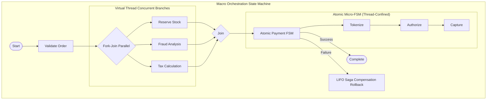

# Dispersion 🌀

[](https://openjdk.org/projects/jdk/25/)
[](https://openjdk.org/jeps/444)
[](https://opensource.org/licenses/Apache-2.0)
[](https://github.com/f442y/dispersion/actions)

> **High-Throughput Finite State Machine and Saga Orchestration Engine designed natively for Java 25 Virtual Threads.**

---

## 📖 Table of Contents

- [Overview](#-overview)
- [Two-Tiered State Machine Architecture](#-two-tiered-state-machine-architecture)
- [Key Features](#-key-features)
- [Installation & Dependency Management](#-installation--dependency-management)
- [Quickstart Guide](#-quickstart-guide)
  - [1. Atomic (Micro) State Machine](#1-atomic-micro-state-machine)
  - [2. Macro Orchestration with Saga Rollbacks](#2-macro-orchestration-with-saga-rollbacks)
  - [3. Concurrent Parallel Fork-Join Branches](#3-concurrent-parallel-fork-join-branches)
- [Resilience, Loop Prevention & Circuit Breakers](#-resilience-loop-prevention--circuit-breakers)
- [Concurrency & Admission Control](#-concurrency--admission-control)
- [Module Structure](#-module-structure)
- [Building & Testing](#-building--testing)
- [License](#-license)

---

## 🌟 Overview

**Dispersion** is an ultra-lightweight, high-performance workflow execution engine crafted from the ground up for modern Java. By leveraging **Java 25 Virtual Threads** (`Thread.ofVirtual()`), Dispersion enables hundreds of thousands of concurrent state machine workflows with near-zero memory footprint and no thread-pool exhaustion.



---

## 🏛️ Two-Tiered State Machine Architecture

Dispersion separates state machine execution into two purpose-built tiers:

| Feature | Atomic (Micro) State Machine | Orchestration (Macro) State Machine |
| :--- | :--- | :--- |
| **Execution Scope** | Single virtual thread, thread-bound | Multi-virtual-thread coordinator |
| **State Mutations** | Direct, zero-synchronization context | Checkpointed snapshots across boundaries |
| **Concurrency Model** | High-throughput sequential graph steps | Parallel fork-join branches & async child machines |
| **Failure Recovery** | Fast fail, cycle loop-breakers, fallback states | Virtual thread retry policies + **Automated LIFO Saga Rollbacks** |
| **Use Cases** | Order transitions, validation pipelines, packet parsing | Distributed transactions, multi-service workflows, microservice Sagas |

---

## ⚡ Key Features

- **🚀 Java 25 Virtual Thread Native**: Dispatches individual executions on lightweight virtual threads using `Executors.newThreadPerTaskExecutor()`.
- **🔒 Thread-Bound Zero-Contention Context**: Business actions within micro-machines mutate state without synchronization locks.
- **🛡️ Automated Saga Compensations (LIFO)**: If a macro workflow fails at any step, all previously completed steps automatically roll back in reverse order.
- **🔀 Concurrent Parallel Fork-Join**: Run independent sub-tasks concurrently on virtual threads; if any branch fails, sibling branches are compensated automatically.
- **🔄 Safe Retry with Clean Context Recovery**: Reconstruct fresh, unpolluted input payloads when retrying failed steps on fresh virtual threads via `ContextRecoverer`.
- **🛑 Loop Protection & Circuit Breakers**:
  - `maxVisits(count, fallback)`: Prevents infinite retry loops per state.
  - `maxTransitions(count)`: Global circuit breaker protecting against graph cycles.
  - Runtime edge validation: Guarantees state transitions strictly follow declared directed graph edges.
- **🚥 Admission Control & Backpressure**: Configurable strategies (`BLOCK`, `REJECT_IMMEDIATELY`, `WAIT_WITH_TIMEOUT`) to prevent resource exhaustion under burst traffic.
- **📊 Mermaid Diagram Export**: Output state graphs directly to Mermaid format using `stateMap.toMermaid()`.

---

## 📦 Installation & Dependency Management

Dispersion publishes a centralized Bill of Materials (**BOM**) for streamlined dependency management.

### Maven BOM Setup

Add the BOM to your root `pom.xml`:

```xml
<dependencyManagement>
    <dependencies>
        <dependency>
            <groupId>com.github.f442y.dispersion</groupId>
            <artifactId>dispersion-bom</artifactId>
            <version>DEVELOP-SNAPSHOT</version>
            <type>pom</type>
            <scope>import</scope>
        </dependency>
    </dependencies>
</dependencyManagement>
```

### Module Dependencies

Add the required modules to your application:

```xml
<dependencies>
    <!-- Core runtime engine -->
    <dependency>
        <groupId>com.github.f442y.dispersion</groupId>
        <artifactId>dispersion-core</artifactId>
    </dependency>

    <!-- (Optional) API interfaces only (for contract-only libraries) -->
    <dependency>
        <groupId>com.github.f442y.dispersion</groupId>
        <artifactId>dispersion-api</artifactId>
    </dependency>
</dependencies>
```

---

## 🚀 Quickstart Guide

### 1. Atomic (Micro) State Machine

Define state keys by implementing `StateKey`, create a context class implementing `StateMachineContext`, and assemble the graph using the fluent builder:

```java
import com.github.f442y.dispersion.atomic.AtomicStateMachineBuilder;
import com.github.f442y.dispersion.atomic.AtomicStateMachineExecutor;
import com.github.f442y.dispersion.context.StateMachineContext;
import com.github.f442y.dispersion.state.StateKey;

// 1. Define State Enum
public enum PaymentState implements StateKey {
    INITIALIZE, AUTHORIZE, CAPTURE, SETTLED
}

// 2. Define Context
public class PaymentContext implements StateMachineContext {
    public String paymentId;
    public int amount;
    public boolean authorized;
}

// 3. Build State Machine
var stateMachine = AtomicStateMachineBuilder.<PaymentContext, PaymentState, Integer, String>create(PaymentState.class)
    .context(PaymentContext::new)
    .initialState(PaymentState.INITIALIZE)
    .input((ctx, amount) -> {
        ctx.amount = amount;
        return ctx;
    })
    .state(PaymentState.INITIALIZE)
        .action(ctx -> {
            ctx.paymentId = "PAY-" + System.currentTimeMillis();
            return ctx;
        })
        .transition(PaymentState.AUTHORIZE)
    .state(PaymentState.AUTHORIZE)
        .action(ctx -> {
            ctx.authorized = true;
            return ctx;
        })
        .transition(PaymentState.CAPTURE)
    .state(PaymentState.CAPTURE)
        .action(ctx -> ctx)
        .transition(PaymentState.SETTLED)
    .endStates(PaymentState.SETTLED)
    .output(ctx -> "Payment " + ctx.paymentId + " settled: $" + (ctx.amount / 100.0))
    .build();

// 4. Execute on Virtual Threads
try (var executor = new AtomicStateMachineExecutor<>("payment-engine", stateMachine)) {
    // Synchronous execution
    String result = executor.dispatchSync(5000);
    System.out.println(result); // Payment PAY-... settled: $50.0

    // Asynchronous Virtual Thread execution
    var future = executor.dispatchAsync(7500);
    System.out.println(future.get());
}
```

---

### 2. Macro Orchestration with Saga Rollbacks

Coordinate multiple micro-services with automatic reverse-order compensation upon failure:

```java
import com.github.f442y.dispersion.orchestration.OrchestrationStateMachineBuilder;
import com.github.f442y.dispersion.orchestration.RetryPolicy;
import com.github.f442y.dispersion.state.StateKey;
import java.time.Duration;

public enum OrderState implements StateKey {
    VALIDATE, RESERVE_STOCK, CHARGE_CARD, FULFILL, COMPLETED, FAILED
}

var orderOrchestrator = OrchestrationStateMachineBuilder.<OrderContext, OrderState, OrderRequest, String>create("OrderSaga", OrderState.class)
    .context(OrderContext::new)
    .initialState(OrderState.VALIDATE)
    // Step 1: Validation
    .state(OrderState.VALIDATE)
        .action(ctx -> ctx.validate())
        .transition(OrderState.RESERVE_STOCK)
    // Step 2: Inventory Reservation with Saga Compensation
    .state(OrderState.RESERVE_STOCK)
        .action(ctx -> ctx.reserveInventory())
        .compensate(ctx -> ctx.releaseInventory()) // Executed if downstream steps fail
        .transition(OrderState.CHARGE_CARD)
    // Step 3: Payment with Virtual Thread Retry
    .state(OrderState.CHARGE_CARD)
        .action(ctx -> ctx.chargeCustomer())
        .retry(RetryPolicy.exponential(3, Duration.ofMillis(100), 2.0, Duration.ofSeconds(1)))
        .compensate(ctx -> ctx.refundCustomer())
        .transition(OrderState.FULFILL)
    // Step 4: Fulfillment
    .state(OrderState.FULFILL)
        .action(ctx -> ctx.shipOrder())
        .transition(OrderState.COMPLETED)
    .endStates(OrderState.COMPLETED, OrderState.FAILED)
    .output(ctx -> "Order completed: " + ctx.orderId)
    .buildExecutor();

// Run the Saga
String outcome = orderOrchestrator.dispatchSync(new OrderRequest("ORD-101", 12900));
```

---

### 3. Concurrent Parallel Fork-Join Branches

Run multiple independent tasks simultaneously on virtual threads; if any branch fails, completed branches are rolled back:

```java
.state(OrderState.PARALLEL_CHECKS)
    .parallel()
        .branch("stockCheck", 
            ctx -> ctx.checkStock(), 
            ctx -> ctx.releaseStockReservation())
        .branch("fraudCheck", 
            ctx -> ctx.runFraudScore(), 
            null)
        .branch("taxCalculation", 
            ctx -> ctx.calculateTaxes(), 
            null)
        .compensate(ctx -> ctx.rollbackParallelStage())
    .transition(OrderState.PAYMENT)
```

---

## 🛡️ Resilience, Loop Prevention & Circuit Breakers

Dispersion enforces strict runtime guarantees to eliminate runaway execution:

1. **Per-State Visit Limits & Fallbacks**:
   ```java
   .state(PaymentState.VERIFY_OTP)
       .maxVisits(3, PaymentState.OTP_LIMIT_EXCEEDED) // Divert to fallback after 3 visits
       .transition(ctx -> ctx.isOtpValid() ? PaymentState.SUCCESS : PaymentState.VERIFY_OTP)
   ```

2. **Global Transition Circuit Breaker**:
   ```java
   .maxTransitions(500) // Halts execution if more than 500 transitions occur in a single run
   ```

3. **Runtime Adjacency Enforcement**:
   ```java
   .state(OrderState.SUBMITTED)
       .transitionsTo(Set.of(OrderState.PAID, OrderState.CANCELLED), ctx -> ctx.resolveNext())
       // Throws TransitionException if resolveNext() attempts an undeclared edge
   ```

---

## 🚥 Concurrency & Admission Control

Dispersion protects systems under high load using admission controllers:

```java
import com.github.f442y.dispersion.executor.AdmissionController;
import com.github.f442y.dispersion.executor.BackpressureStrategy;
import java.time.Duration;

// Allow up to 5,000 concurrent workflows; reject bursts with REJECT_IMMEDIATELY
AdmissionController admission = new AdmissionController(5_000, BackpressureStrategy.REJECT_IMMEDIATELY);

// Or wait with timeout:
AdmissionController timeoutAdmission = new AdmissionController(
    2_500, 
    BackpressureStrategy.WAIT_WITH_TIMEOUT, 
    Duration.ofMillis(250)
);

var executor = new AtomicStateMachineExecutor<>("high-throughput-fsm", stateMachine, admission);
```

---

## 📁 Module Structure

```
dispersion/
├── dispersion-bom/          # Bill of Materials POM for dependency management
├── dispersion-api/          # Core interfaces, state definitions, exceptions, and models
├── dispersion-core/         # Virtual Thread execution engine, builders, and Saga coordination
└── dispersion-examples/     # Runnable showcase tests and production design patterns
```

---

## 🛠️ Building & Testing

### Prerequisites
- **JDK 25** (e.g. Azul Zulu JDK 25 or OpenJDK 25)
- Apache Maven 3.9+ (or use the included `./mvnw`)

### Commands

```bash
# Build and run all unit & integration tests
./mvnw clean verify

# On Windows PowerShell
.\mvnw.cmd clean verify
```

---

## 📄 License

Dispersion is open-source software licensed under the [Apache License, Version 2.0](LICENSE).