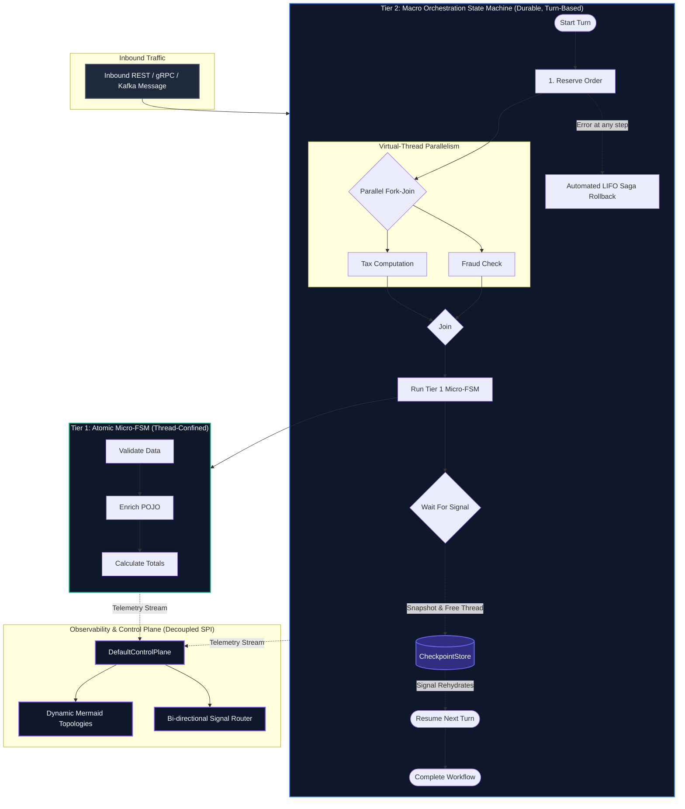
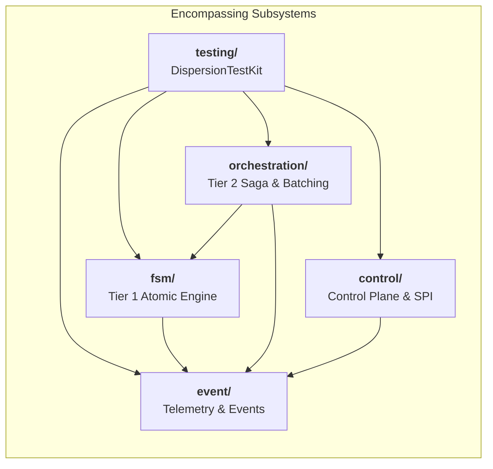

<div align="center">

```
  ██████╗ ██╗███████╗██████╗ ███████╗██████╗ ███████╗██╗ ██████╗ ███╗   ██╗
  ██╔══██╗██║██╔════╝██╔══██╗██╔════╝██╔══██╗██╔════╝██║██╔═══██╗████╗  ██║
  ██║  ██║██║███████╗██████╔╝█████╗  ██████╔╝███████╗██║██║   ██║██╔██╗ ██║
  ██║  ██║██║╚════██║██╔═══╝ ██╔══╝  ██╔══██╗╚════██║██║██║   ██║██║╚██╗██║
  ██████╔╝██║███████║██║     ███████╗██║  ██║███████║██║╚██████╔╝██║ ╚████║
  ╚═════╝ ╚═╝╚══════╝╚═╝     ╚══════╝╚═╝  ╚═╝╚══════╝╚═╝ ╚═════╝ ╚═╝  ╚═══╝
```

### Ultra-High-Throughput Finite State Machines & Distributed Sagas<br/>Engineered for Java 25+ Virtual Threads

[](https://openjdk.org/)
[](LICENSE)
[](https://github.com/f442y/dispersion/actions/workflows/ci.yml)
[](docs/architecture-and-design.md)
[-06b6d4?style=for-the-badge)](docs/virtual-threads-and-performance.md)

<p align="center">
  <a href="#-why-dispersion"><b>Why Dispersion?</b></a> •
  <a href="#-the-dual-tier-architecture"><b>Architecture</b></a> •
  <a href="#-60-second-quickstarts"><b>Quickstarts</b></a> •
  <a href="#-encompassing-modules"><b>Subsystems</b></a> •
  <a href="#-performance-benchmark-comparison"><b>Benchmarks</b></a> •
  <a href="#-architectural-guides"><b>Deep Dives</b></a>
</p>

</div>

---

## ⚡ Core Capabilities

<table>
  <tr>
    <td width="50%" valign="top">
      <h3>🚀 Sub-Microsecond Hot Paths</h3>
      <p>State transitions pre-compile into dense ordinal array lookup tables (<code>StateMap</code>). Checks compile to primitive bitmasks with <b>0 heap allocations</b> on hot paths.</p>
      <p>👉 <i>Explore the <a href="fsm/README.md"><b>FSM Subsystem (Tier 1)</b></a> & <a href="docs/virtual-threads-and-performance.md"><b>Performance Guide</b></a></i></p>
    </td>
    <td width="50%" valign="top">
      <h3>🧵 Java 25 Virtual Threads</h3>
      <p>Engineered natively for Project Loom. Lightweight virtual threads run confined to work units with <b>zero carrier-thread pinning</b> and zero thread-pool exhaustion.</p>
      <p>👉 <i>Read the <a href="docs/virtual-threads-and-performance.md"><b>Virtual Threads & Concurrency Guide</b></a></i></p>
    </td>
  </tr>
  <tr>
    <td width="50%" valign="top">
      <h3>🔄 Automated LIFO Saga Rollbacks</h3>
      <p>Forward actions dynamically register compensations. Downstream failures automatically unwind the compensation stack in <b>reverse chronological (LIFO)</b> order.</p>
      <p>👉 <i>Explore the <a href="orchestration/README.md"><b>Orchestration Subsystem (Tier 2)</b></a></i></p>
    </td>
    <td width="50%" valign="top">
      <h3>⏸️ Turn-Based Signal Suspension</h3>
      <p>Workflows pause at <code>waitForCommand</code>, snapshot state to a pluggable <code>CheckpointStore</code>, and <b>free the virtual thread</b> until external webhooks arrive.</p>
      <p>👉 <i>Read about <a href="docs/saga-orchestration-and-batching.md"><b>Distributed Sagas & Batch Barriers</b></a></i></p>
    </td>
  </tr>
  <tr>
    <td width="50%" valign="top">
      <h3>🛡️ Network Deduplication</h3>
      <p>Guaranteed at-most-once idempotency across distributed message brokers (Kafka, RabbitMQ, SQS) via immutable <code>CommandEnvelope</code> tracking.</p>
      <p>👉 <i>See <a href="orchestration/README.md#5-network-idempotency--deduplication"><b>Messaging & Deduplication</b></a></i></p>
    </td>
    <td width="50%" valign="top">
      <h3>🔭 Hexagonal Control Plane</h3>
      <p>Centralized <code>InspectableMachine</code> SPI featuring an <b>$O(1)$ dual-pool memory topology</b>, live telemetry streaming, and dynamic Mermaid diagram generation.</p>
      <p>👉 <i>Explore the <a href="control/README.md"><b>Control Subsystem</b></a> & <a href="event/README.md"><b>Telemetry Pipeline</b></a></i></p>
    </td>
  </tr>
</table>

---

## 🏛️ The Dual-Tier Architecture

Dispersion separates state execution into complementary, composable tiers:



### Architectural Dimension Matrix

| Feature | Tier 1: Atomic State Machine | Tier 2: Saga Orchestrator | Tier 3: Turn-Based Batching |
| :--- | :--- | :--- | :--- |
| **Target Subsystem** | [**`fsm/`** (`dispersion-fsm-core`)](fsm/README.md) | [**`orchestration/`** (`dispersion-orchestration-core`)](orchestration/README.md) | [**`orchestration/`** (`dispersion-orchestration-core`)](orchestration/README.md) |
| **Execution Latency** | **Sub-microsecond (< 1 μs)** | Turn-based (~ 10–50 μs) | Parallel items with barrier sync |
| **Threading Model** | Single Virtual Thread (confined) | Virtual Thread per turn | Virtual Thread per batch item |
| **State Mutability** | Lock-free POJO direct mutation | Checkpoint snapshots on suspension | Isolated item contexts |
| **Lifecycle** | Ephemeral, in-memory | Long-lived, suspendable (`waitForCommand`) | Batch-synchronized turns |
| **Failure Recovery** | Fast-fail terminal diverting | [**Automated LIFO Saga rollbacks**](orchestration/README.md#2-automated-lifo-saga-rollbacks) | Item-level error isolation |
| **Concurrency** | Sequential graph traversal | [**Parallel fork-join (`.parallel()`)**](orchestration/README.md#3-parallel-fork-join-concurrency) | Concurrent item processing |
| **Telemetry & Events** | [13 Sealed `ExecutionEvent`s](event/README.md#2-sealed-telemetry-events-executionevent) | [13 Sealed `ExecutionEvent`s](event/README.md#2-sealed-telemetry-events-executionevent) | [Batch Barrier Events](event/README.md#2-sealed-telemetry-events-executionevent) |
| **Persistence** | None (zero overhead) | Pluggable [`CheckpointStore`](orchestration/README.md#2-core-architectural-capabilities) | [`BatchOrchestrationCheckpoint`](orchestration/README.md#4-turn-based-batch-processing-batchorchestrationexecutor) |
| **Testing Doubles** | [`TestStateContext`, `TestStateKey`](fsm/README.md#4-testing-atomic-state-machines-dispersion-fsm-test) | [`FakeSignalBroker`, `RecordingCheckpointStore`](orchestration/README.md#5-testing-orchestrations-dispersion-orchestration-test) | [`DispersionTestKit`](testing/README.md) |
| **Best Used For** | Rules, protocol parsing, trading engines | Multi-service sagas, checkout, approvals | Bulk ingest, payroll, daily reconciliations |

---

## 📊 Performance & Benchmark Comparison

How Dispersion compares to legacy orchestration and state machine engines:

| Dimension | Legacy BPMN Engines | Traditional Actor / FSM Libs | Dispersion |
| :--- | :--- | :--- | :--- |
| **Runtime Threading** | Heavy OS Thread Pools (Starvation risk) | Reactive Event Loops (Callback hell) | [**Java 25 Virtual Threads (Millions concurrent)**](docs/virtual-threads-and-performance.md#1-project-loom--virtual-thread-mechanics) |
| **Transition Latency** | 15–50 ms (Mandatory DB roundtrip) | 50–200 μs (Object hashing & reflection) | [**< 1 μs (Pre-compiled ordinal arrays)**](fsm/README.md#1-pre-compiled-graph-topology-statemap) |
| **Hot-Path Allocations** | Hundreds of objects per transition | Medium (Map entries, wrappers) | [**0 heap allocations on transition hot paths**](docs/virtual-threads-and-performance.md#3-zero-allocation-hot-paths--jvm-c2-optimization) |
| **Thread Synchronization** | Synchronized locks & DB mutexes | Concurrent maps & atomic references | [**100% Lock-Free Thread Confinement**](docs/architecture-and-design.md#3-concurrency-guarantees--thread-confinement) |
| **Saga Compensation** | Manual compensation choreography | Ad-hoc error handlers | [**Automated LIFO Saga Rollback Unwind**](orchestration/README.md#2-automated-lifo-saga-rollbacks) |
| **Control Plane Coupling** | Heavy monolithic web application | Missing or ad-hoc | [**Decoupled `InspectableMachine` SPI**](control/README.md#1-decoupled-inspectablemachine-spi) |

---

## ⏱️ 60-Second Quickstarts

### 1. Tier 1: Atomic State Machine (Micro-Workflow)
High-frequency in-memory execution with compile-time type safety and zero synchronization:

```java
import com.github.f442y.dispersion.fsm.config.StateMachineConfiguration;
import com.github.f442y.dispersion.fsm.context.StateMachineContext;
import com.github.f442y.dispersion.fsm.core.atomic.AtomicStateMachineBuilder;
import com.github.f442y.dispersion.fsm.core.atomic.AtomicStateMachineExecutor;
import com.github.f442y.dispersion.fsm.state.StateKey;

// 1. Declare state nodes as a type-safe enum
public enum PricingState implements StateKey { VALIDATE, APPLY_PROMO, FINALIZE }

// 2. Declare domain context (Thread-confined POJO; zero locks needed!)
public static final class PricingContext implements StateMachineContext {
    public String orderId;
    public double total;
    public boolean promoEligible;
}

public record PricingRequest(String orderId, double total, boolean promoEligible) {}
public record PricingResult(String orderId, double finalTotal) {}

// 3. Assemble pre-compiled graph topology
StateMachineConfiguration<PricingContext, PricingState, PricingRequest, PricingResult> config =
    AtomicStateMachineBuilder.<PricingContext, PricingState, PricingRequest, PricingResult>create("PricingEngine", PricingState.class)
        .context(PricingContext::new)
        .initialState(PricingState.VALIDATE)
        .endStates(PricingState.FINALIZE)
        .input((PricingContext ctx, PricingRequest req) -> {
            ctx.orderId = req.orderId();
            ctx.total = req.total();
            ctx.promoEligible = req.promoEligible();
            return ctx;
        })
        .state(PricingState.VALIDATE)
            .action((PricingContext ctx) -> ctx)
            .transition(PricingState.APPLY_PROMO)
        .state(PricingState.APPLY_PROMO)
            .action((PricingContext ctx) -> {
                if (ctx.promoEligible) ctx.total *= 0.85; // 15% discount
                return ctx;
            })
            .transition(PricingState.FINALIZE)
        .output((PricingContext ctx) -> new PricingResult(ctx.orderId, ctx.total))
        .build();

// 4. Dispatch with sub-microsecond latency on Virtual Threads
try (AtomicStateMachineExecutor<PricingContext, PricingState, PricingRequest, PricingResult> executor =
         new AtomicStateMachineExecutor<>("pricing-exec", config, 500)) {
    PricingResult result = executor.dispatchSync(new PricingRequest("ORD-1001", 100.0, true));
    // result.finalTotal() == 85.0
}
```

> [!TIP]
> 📖 **Related Documentation:**
> * Full Subsystem Guide: [**`fsm/README.md`**](fsm/README.md)
> * Performance & Zero-Pinning: [**`docs/virtual-threads-and-performance.md`**](docs/virtual-threads-and-performance.md)
> * Zero-Mock Unit Testing: [**`testing/README.md#recipe-1-verifying-telemetry-events-in-an-atomic-machine`**](testing/README.md#recipe-1-verifying-telemetry-events-in-an-atomic-machine)

---

### 2. Tier 2: Distributed Saga with Automated LIFO Rollback
Coordinate multi-service sagas with automatic rollback unwinding if any step fails:

```java
import com.github.f442y.dispersion.fsm.state.StateKey;
import com.github.f442y.dispersion.orchestration.core.OrchestrationStateMachineBuilder;
import com.github.f442y.dispersion.orchestration.core.OrchestrationStateMachineExecutor;

try (OrchestrationStateMachineExecutor<OrderContext, OrderState, OrderRequest, String> executor =
         OrchestrationStateMachineBuilder.<OrderContext, OrderState, OrderRequest, String>create("OrderSaga", OrderState.class)
             .context(OrderContext::new)
             .initialState(OrderState.RESERVE_INVENTORY)
             .endStates(OrderState.CONFIRMED, OrderState.FAILED)
             .input((OrderContext ctx, OrderRequest req) -> { ctx.orderId = req.orderId(); return ctx; })

             // Step 1: Inventory with compensation
             .state(OrderState.RESERVE_INVENTORY)
                 .action((OrderContext ctx) -> inventoryClient.reserve(ctx.orderId))
                 .compensate((OrderContext ctx) -> inventoryClient.release(ctx.orderId))
                 .transition(OrderState.PROCESS_PAYMENT)

             // Step 2: Payment declines downstream!
             .state(OrderState.PROCESS_PAYMENT)
                 .action((OrderContext ctx) -> paymentGateway.charge(ctx.orderId)) // Throws Exception!
                 .compensate((OrderContext ctx) -> paymentGateway.refund(ctx.orderId))
                 .transition(OrderState.CONFIRMED)

             .buildExecutor()) {

    // Downstream failure automatically triggers LIFO unwinding: inventory is released!
    executor.dispatchSync(new OrderRequest("ORD-9999"));
}
```

> [!TIP]
> 📖 **Related Documentation:**
> * Full Subsystem Guide: [**`orchestration/README.md`**](orchestration/README.md)
> * Distributed Saga Theory: [**`docs/saga-orchestration-and-batching.md`**](docs/saga-orchestration-and-batching.md)
> * Embedding Atomic Child Machines: [**`orchestration/README.md#3-end-to-end-saga-orchestration-example`**](orchestration/README.md#3-end-to-end-saga-orchestration-example)

---

### 3. Suspensions & Asynchronous Signal Delivery
Pause workflow execution waiting for external webhooks or user approvals, freeing the virtual thread:

```java
import com.github.f442y.dispersion.orchestration.OrchestrationTurnResult;
import com.github.f442y.dispersion.orchestration.core.InMemoryCheckpointStore;

// State declaration waiting for ApprovalSignal
.state(OrderState.AWAIT_APPROVAL)
    .waitForCommand(ApprovalSignal.class, (OrderContext ctx, ApprovalSignal sig) -> {
        ctx.approvedBy = sig.approver();
        return ctx;
    })
    .transition(OrderState.CONFIRMED)

// Turn 1: Starts, snapshots checkpoint to CheckpointStore, and unmounts virtual thread
OrchestrationTurnResult<OrderContext, OrderState, String> turn1 = executor.dispatchTurnSync("ORD-501", request);

// Turn 2: Webhook arrives hours or days later; rehydrates from store and finishes!
OrchestrationTurnResult<OrderContext, OrderState, String> turn2 =
    executor.dispatchSignalSync("ORD-501", new ApprovalSignal("ORD-501", "Security Lead"));
```

> [!TIP]
> 📖 **Related Documentation:**
> * Suspension & Checkpoint Stores: [**`orchestration/README.md#4-signal-suspensions--rehydration`**](orchestration/README.md#4-signal-suspensions--rehydration)
> * Routing Signals through Control Plane: [**`control/README.md#3-end-to-end-control-plane-example`**](control/README.md#3-end-to-end-control-plane-example)
> * Testing Checkpoints: [**`testing/README.md#recipe-2-verifying-checkpoint-persistence-in-a-suspended-saga`**](testing/README.md#recipe-2-verifying-checkpoint-persistence-in-a-suspended-saga)

---

### 4. Hexagonal Observability & Dynamic Mermaid Topology
Inspect live execution status, query descriptors, and generate dynamic Mermaid diagrams right from Java:

```java
import com.github.f442y.dispersion.control.ExecutionStatus;
import com.github.f442y.dispersion.control.ExecutionSummary;
import com.github.f442y.dispersion.control.MachineDescriptor;
import com.github.f442y.dispersion.control.core.DefaultControlPlane;
import java.util.List;
import java.util.Optional;

try (DefaultControlPlane controlPlane = new DefaultControlPlane()) {
    // 1. Register any engine via decoupled InspectableMachine adapter
    controlPlane.register(executor.asInspectableMachine());

    // 2. Query dynamic Mermaid diagram string for instant UI rendering
    Optional<MachineDescriptor> desc = controlPlane.getMachine("OrderSaga");
    desc.ifPresent(d -> System.out.println(d.mermaidDiagram()));

    // 3. Inspect active or suspended workflows
    List<ExecutionSummary> suspended = controlPlane.listExecutions("OrderSaga", ExecutionStatus.SUSPENDED, 10);
}
```

> [!TIP]
> 📖 **Related Documentation:**
> * Full Control Plane Guide: [**`control/README.md`**](control/README.md)
> * Telemetry & 13 Sealed Events: [**`event/README.md`**](event/README.md)
> * UI Integration Patterns (React + TanStack Router): [**`docs/observability-and-control-plane.md#5-modern-web-ui-integration-react--tanstack-router`**](docs/observability-and-control-plane.md#5-modern-web-ui-integration-react--tanstack-router)

---

## 📦 Encompassing Modules

Dispersion is engineered as 16 modular components partitioned into 5 functional subsystems. Click each subsystem below for its dedicated guide:



| Subsystem | Included Modules | Focus & Capabilities | Documentation |
| :--- | :--- | :--- | :--- |
| **`event/`** | `dispersion-event-api`<br/>`dispersion-event-core`<br/>`dispersion-event-test` | 13 sealed `ExecutionEvent` records, lock-free ring-buffer bus, push/pull streams, and historical replay. | [**`event/README.md`**](event/README.md) |
| **`fsm/`** | `dispersion-fsm-api`<br/>`dispersion-fsm-core`<br/>`dispersion-fsm-test` | Sub-microsecond atomic FSM engine, pre-compiled `StateMap` ordinal arrays, and adaptive admission control. | [**`fsm/README.md`**](fsm/README.md) |
| **`orchestration/`** | `dispersion-orchestration-api`<br/>`dispersion-orchestration-core`<br/>`dispersion-orchestration-test` | Turn-based distributed sagas, automated LIFO rollbacks, signal rehydration, parallel branches, and batch barriers. | [**`orchestration/README.md`**](orchestration/README.md) |
| **`control/`** | `dispersion-control-api`<br/>`dispersion-control-core`<br/>`dispersion-control-test` | Decoupled `InspectableMachine` SPI, $O(1)$ dual-pool memory model, dynamic Mermaid generator, and signal routing. | [**`control/README.md`**](control/README.md) |
| **`testing/`** | `dispersion-testing` | Unified `DispersionTestKit` static facade with thread-safe fakes, capturing listeners, and recording stores. | [**`testing/README.md`**](testing/README.md) |

---

## 📚 Architectural Guides

For comprehensive technical deep dives into engine internals:

* 📐 [**Architecture & Hexagonal Design**](docs/architecture-and-design.md) — Hexagonal ports and adapters, symmetrical triplet patterns, and thread confinement guarantees.
* ⚡ [**Virtual Threads & Performance Guide**](docs/virtual-threads-and-performance.md) — Loom mechanics, carrier thread unmounting, zero-pinning guarantees, and JVM escape analysis.
* 🔄 [**Saga Orchestration & Batch Processing**](docs/saga-orchestration-and-batching.md) — Distributed saga theory, checkpoint storage, durable signal rehydration, and batch barrier policies.
* 🔭 [**Observability & Control Plane**](docs/observability-and-control-plane.md) — 13 sealed telemetry records, $O(1)$ dual-pool memory topology, and React UI integration patterns.

---

## 🛠️ Maven Dependency Setup

Import the Bill of Materials (BOM) to manage dependency versions uniformly:

```xml
<dependencyManagement>
    <dependencies>
        <dependency>
            <groupId>com.github.f442y.dispersion</groupId>
            <artifactId>dispersion-bom</artifactId>
            <version>1.0.0-SNAPSHOT</version>
            <type>pom</type>
            <scope>import</scope>
        </dependency>
    </dependencies>
</dependencyManagement>
```

Add the modules required by your application:

```xml
<dependencies>
    <!-- Tier 1: Atomic Finite State Machine -->
    <dependency>
        <groupId>com.github.f442y.dispersion</groupId>
        <artifactId>dispersion-fsm-core</artifactId>
    </dependency>

    <!-- Tier 2: Distributed Saga Orchestration (Optional) -->
    <dependency>
        <groupId>com.github.f442y.dispersion</groupId>
        <artifactId>dispersion-orchestration-core</artifactId>
    </dependency>

    <!-- Observability & Control Plane (Optional) -->
    <dependency>
        <groupId>com.github.f442y.dispersion</groupId>
        <artifactId>dispersion-control-core</artifactId>
    </dependency>

    <!-- Testing Facade (Test Scope) -->
    <dependency>
        <groupId>com.github.f442y.dispersion</groupId>
        <artifactId>dispersion-testing</artifactId>
        <scope>test</scope>
    </dependency>
</dependencies>
```

---

## 🚀 Building & Testing

### Prerequisites
* **JDK 25+** (Early Access or GA with Virtual Threads enabled)
* Apache Maven 3.9+ (or use the included wrapper `./mvnw`)

```bash
# Fast parallel compilation and unit test execution across all 16 modules
./mvnw test -B -ntp -T 1C

# Execute end-to-end integration tests (500-thread pipeline bursts, distributed sagas)
./mvnw verify -B -ntp -T 1C
```

---

<div align="center">

Distributed under the **Apache 2.0 License**. See [LICENSE](LICENSE) for details.

⭐ If you find Dispersion useful, please consider giving it a star on GitHub!

</div>
