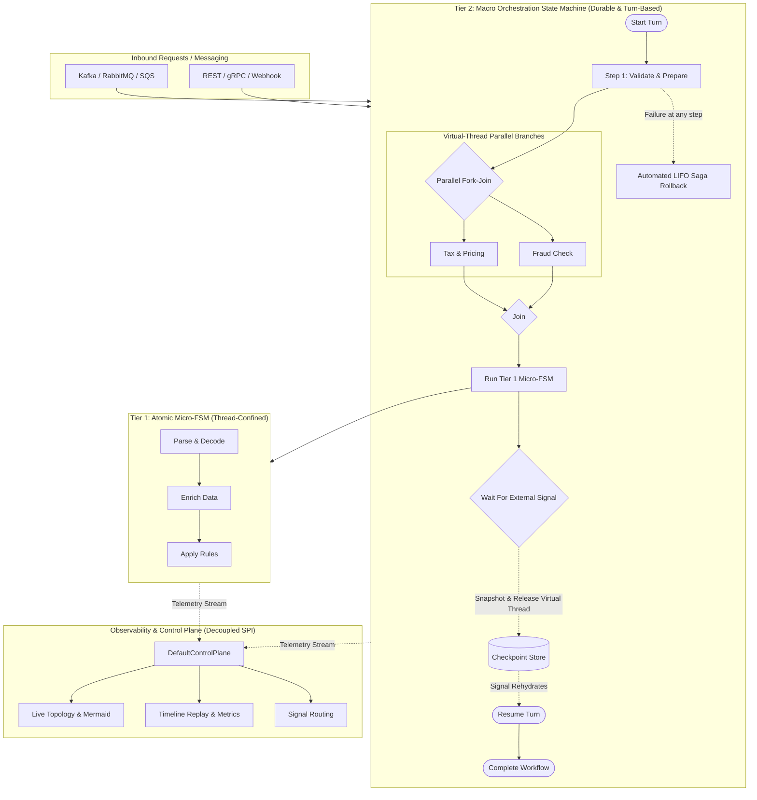
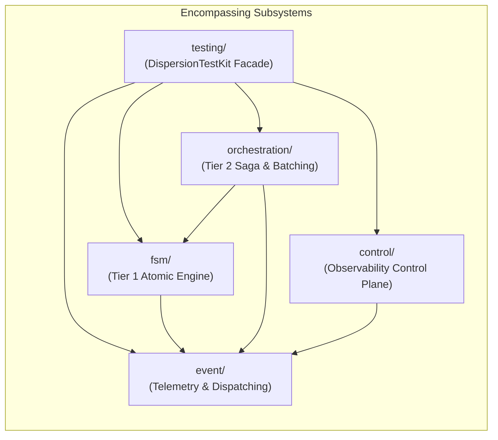

# Dispersion

[-ED8B00?logo=openjdk&logoColor=white)](https://openjdk.org/)
[](LICENSE)
[](https://github.com/f442y/dispersion/actions/workflows/ci.yml)
[](docs/architecture-and-design.md)

**Dispersion** is a high-performance, zero-synchronization Finite State Machine and Distributed Saga Orchestration engine engineered natively for **Java 25+ Virtual Threads** (Project Loom).

Traditional workflow orchestrators suffer from thread-pool starvation, heavy database roundtrips per state transition, distributed lock contention, and reflection overhead. Dispersion redefines workflow processing by combining **thread confinement**, **pre-compiled ordinal array lookup tables**, **automated LIFO Saga compensation rollbacks**, and a **hexagonal decoupled control plane**.

---

## Architecture Overview

Dispersion is built around a cohesive multi-tiered execution model tailored for different latency and lifecycle requirements:



### The Dual-Tier Synergy

| Feature | Tier 1: Atomic (Micro) State Machine | Tier 2: Orchestration (Macro) State Machine |
| :--- | :--- | :--- |
| **Primary Module** | [`dispersion-fsm-core`](fsm/README.md) | [`dispersion-orchestration-core`](orchestration/README.md) |
| **Execution Scope** | Sub-microsecond synchronous pipeline on 1 Virtual Thread | Long-lived, turn-based distributed coordinator |
| **State Mutations** | Direct, thread-confined, lock-free POJO | Checkpointed snapshots & persistent rehydration |
| **Lifecycle** | In-memory only (ephemeral) | Suspendable via external signals (`waitForCommand`) |
| **Persistence** | None (zero overhead) | Pluggable `CheckpointStore` (SQL, Key-Value, In-Memory) |
| **Failure Recovery** | Fast-fail terminal diverting | **Automated LIFO Saga compensation rollbacks** |
| **Concurrency** | Single-threaded state traversal | **Concurrent parallel fork-join**, batch barriers |
| **Primary Use Cases** | Protocol parsing, business rules, trading algorithms | Distributed transactions, multi-service sagas, approvals |

---

## 60-Second Quickstarts

### 1. Tier 1: Atomic State Machine (Micro-Workflow)
Define a deterministic, zero-heap-allocation pipeline with compile-time type safety:

```java
import com.github.f442y.dispersion.fsm.config.StateMachineConfiguration;
import com.github.f442y.dispersion.fsm.context.StateMachineContext;
import com.github.f442y.dispersion.fsm.core.atomic.AtomicStateMachineBuilder;
import com.github.f442y.dispersion.fsm.core.atomic.AtomicStateMachineExecutor;
import com.github.f442y.dispersion.fsm.state.StateKey;

public enum OrderState implements StateKey { VALIDATE, PROCESS, COMPLETED }

public static final class OrderContext implements StateMachineContext {
    public String orderId;
    public int total;
}

StateMachineConfiguration<OrderContext, OrderState, String, Integer> config =
    AtomicStateMachineBuilder.<OrderContext, OrderState, String, Integer>create("OrderPipeline", OrderState.class)
        .context(OrderContext::new)
        .initialState(OrderState.VALIDATE)
        .endStates(OrderState.COMPLETED)
        .input((OrderContext ctx, String id) -> { ctx.orderId = id; ctx.total = 100; return ctx; })
        .state(OrderState.VALIDATE)
            .action((OrderContext ctx) -> ctx)
            .transition(OrderState.PROCESS)
        .state(OrderState.PROCESS)
            .action((OrderContext ctx) -> { ctx.total *= 2; return ctx; })
            .transition(OrderState.COMPLETED)
        .output((OrderContext ctx) -> ctx.total)
        .build();

try (AtomicStateMachineExecutor<OrderContext, OrderState, String, Integer> executor =
         new AtomicStateMachineExecutor<>("order-exec", config, 500)) {
    int finalTotal = executor.dispatchSync("ORD-101");
    // finalTotal == 200
}
```

### 2. Tier 2: Distributed Saga with Automated LIFO Rollback
Coordinate multi-service sagas with automatic rollback unwinding if any step fails:

```java
try (OrchestrationStateMachineExecutor<OrderContext, OrderState, OrderRequest, String> executor =
         OrchestrationStateMachineBuilder.<OrderContext, OrderState, OrderRequest, String>create("CheckoutSaga", OrderState.class)
             .context(OrderContext::new)
             .initialState(OrderState.RESERVE_INVENTORY)
             .endStates(OrderState.COMPLETED, OrderState.FAILED)
             .input((OrderContext ctx, OrderRequest req) -> { ctx.orderId = req.orderId(); return ctx; })

             .state(OrderState.RESERVE_INVENTORY)
                 .action((OrderContext ctx) -> inventoryService.reserve(ctx.orderId))
                 .compensate((OrderContext ctx) -> inventoryService.release(ctx.orderId))
                 .transition(OrderState.CHARGE_PAYMENT)

             .state(OrderState.CHARGE_PAYMENT)
                 .action((OrderContext ctx) -> paymentGateway.charge(ctx.orderId)) // Declines!
                 .compensate((OrderContext ctx) -> paymentGateway.refund(ctx.orderId))
                 .transition(OrderState.COMPLETED)

             .buildExecutor()) {

    // Payment declination triggers exact LIFO compensation: inventory is released!
    executor.dispatchSync(new OrderRequest("ORD-404"));
}
```

### 3. Suspensions & Asynchronous Signal Delivery
Pause execution waiting for external webhooks or user approvals, freeing virtual threads:

```java
// State declaration waiting for ApprovalSignal
.state(OrderState.AWAITING_APPROVAL)
    .waitForCommand(ApprovalSignal.class, (OrderContext ctx, ApprovalSignal sig) -> {
        ctx.approvedBy = sig.reviewer();
        return ctx;
    })
    .transition(OrderState.COMPLETED)

// Turn 1 suspends and checkpoints state
OrchestrationTurnResult<OrderContext, OrderState, String> turn1 = executor.dispatchTurnSync("ORD-101", request);

// Turn 2 rehydrates and completes when webhook arrives
OrchestrationTurnResult<OrderContext, OrderState, String> turn2 =
    executor.dispatchSignalSync("ORD-101", new ApprovalSignal("ORD-101", "Lead Engineer"));
```

---

## Subsystems & Encompassing Modules

Dispersion is engineered as 16 modular components structured across 5 functional subsystems. Each subsystem provides independent `api`, `core`, and `test` triplets:



| Encompassing Subsystem | Modules Included | Documentation |
| :--- | :--- | :--- |
| **Event Subsystem** | `dispersion-event-api`, `dispersion-event-core`, `dispersion-event-test` | [**`event/README.md`**](event/README.md) |
| **FSM Subsystem** | `dispersion-fsm-api`, `dispersion-fsm-core`, `dispersion-fsm-test` | [**`fsm/README.md`**](fsm/README.md) |
| **Orchestration Subsystem** | `dispersion-orchestration-api`, `dispersion-orchestration-core`, `dispersion-orchestration-test` | [**`orchestration/README.md`**](orchestration/README.md) |
| **Control Subsystem** | `dispersion-control-api`, `dispersion-control-core`, `dispersion-control-test` | [**`control/README.md`**](control/README.md) |
| **Testing Subsystem** | `dispersion-testing` (`DispersionTestKit`) | [**`testing/README.md`**](testing/README.md) |

---

## Detailed Architectural Guides

For deep dives into internal engine design, concurrency models, distributed guarantees, and observability:

* 📐 [**Architecture & Hexagonal Design**](docs/architecture-and-design.md): In-depth review of hexagonal decoupling, dual-tier synergies, and invariants.
* ⚡ [**Virtual Threads & Performance Guide**](docs/virtual-threads-and-performance.md): Project Loom mechanics, carrier thread unmounting, lock-free confinement, and JVM escape analysis.
* 🔄 [**Saga Orchestration & Batch Processing**](docs/saga-orchestration-and-batching.md): LIFO compensation semantics, network deduplication envelopes, and batch barrier policies.
* 🔭 [**Observability & Control Plane**](docs/observability-and-control-plane.md): 13 sealed telemetry events, $O(1)$ dual-pool memory topology, dynamic Mermaid generation, and React UI integration.

---

## Maven Dependency Setup

Import the centralized Bill of Materials (BOM) to align all versions:

```xml
<dependencyManagement>
    <dependencies>
        <dependency>
            <groupId>com.github.f442y.dispersion</groupId>
            <artifactId>dispersion-bom</artifactId>
            <version>1.0.0-SNAPSHOT</version>
            <type>pom</type>
            <scope>import</scope>
        </dependency>
    </dependencies>
</dependencyManagement>
```

Add the modules your application requires:

```xml
<dependencies>
    <!-- Tier 1 Atomic State Machine -->
    <dependency>
        <groupId>com.github.f442y.dispersion</groupId>
        <artifactId>dispersion-fsm-core</artifactId>
    </dependency>

    <!-- Tier 2 Saga Orchestration (Optional) -->
    <dependency>
        <groupId>com.github.f442y.dispersion</groupId>
        <artifactId>dispersion-orchestration-core</artifactId>
    </dependency>

    <!-- Observability & Control Plane (Optional) -->
    <dependency>
        <groupId>com.github.f442y.dispersion</groupId>
        <artifactId>dispersion-control-core</artifactId>
    </dependency>

    <!-- Testing Suite (Test Scope) -->
    <dependency>
        <groupId>com.github.f442y.dispersion</groupId>
        <artifactId>dispersion-testing</artifactId>
        <scope>test</scope>
    </dependency>
</dependencies>
```

---

## Building & Testing

### Prerequisites
* **JDK 25+** (Early Access or GA with Virtual Threads enabled)
* Apache Maven 3.9+ (or use the included `./mvnw`)

### Commands
```bash
# Compile and run unit tests across all modules
./mvnw test -B -ntp -T 1C

# Run integration tests (including 500-thread concurrent bursts and full sagas)
./mvnw verify -B -ntp -T 1C
```

---

## License

Licensed under the **Apache License, Version 2.0**. See the [LICENSE](LICENSE) file for details.
