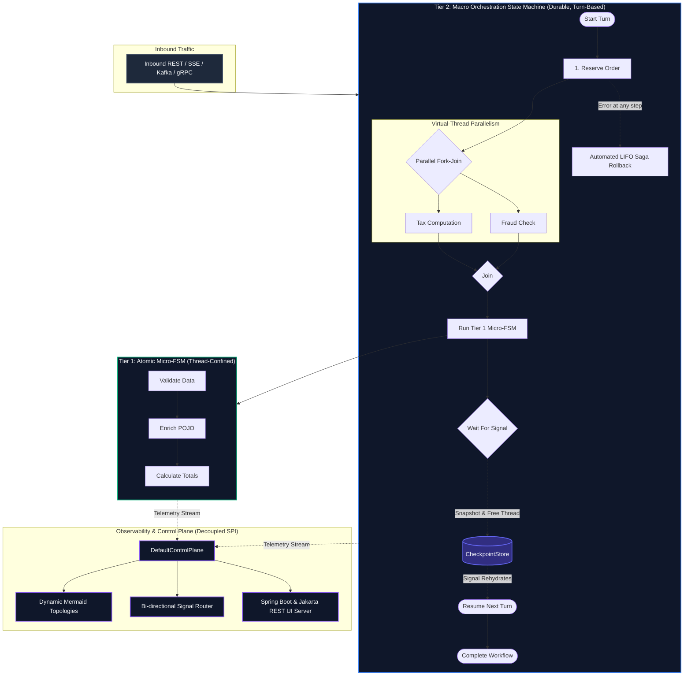
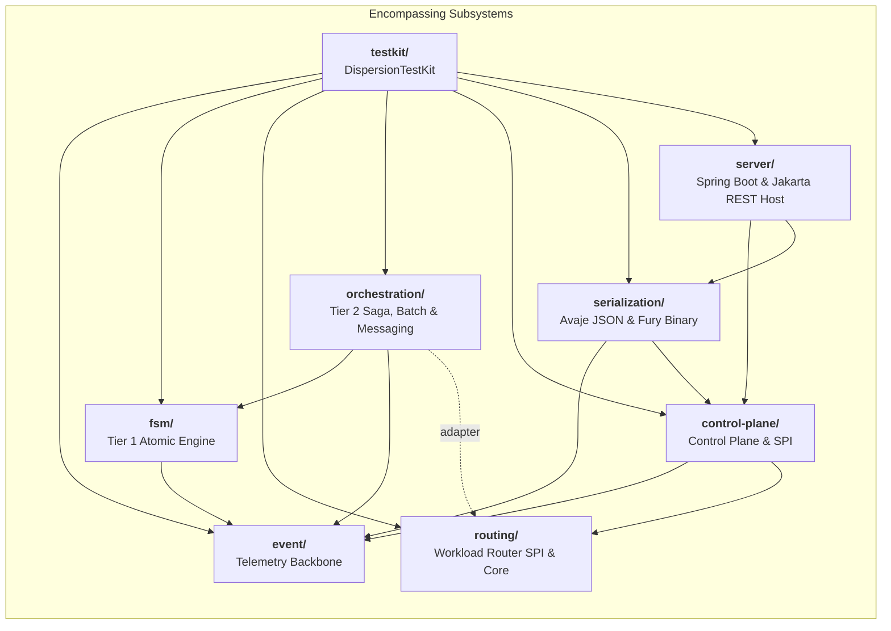

<div align="center">

```
  ██████╗ ██╗███████╗██████╗ ███████╗██████╗ ███████╗██╗ ██████╗ ███╗   ███╗
  ██╔══██╗██║██╔════╝██╔══██╗██╔════╝██╔══██╗██╔════╝██║██╔═══██╗████╗  ██║
  ██║  ██║██║███████╗██████╔╝█████╗  ██████╔╝███████╗██║██║   ██║██╔██╗ ██║
  ██║  ██║██║╚════██║██╔═══╝ ██╔══╝  ██╔══██╗╚════██║██║██║   ██║██║╚██╗██║
  ██████╔╝██║███████║██║     ███████╗██║  ██║███████║██║╚██████╔╝██║ ╚████║
  ╚═════╝ ╚═╝╚══════╝╚═╝     ╚══════╝╚═╝  ╚═╝╚══════╝╚═╝ ╚═════╝ ╚═╝  ╚═══╝
```

### Ultra-High-Throughput Finite State Machines & Distributed Sagas<br/>Engineered for Java 25+ Virtual Threads

[](https://openjdk.org/)
[](LICENSE)
[](https://github.com/f442y/dispersion/actions/workflows/ci.yml)
[](docs/architecture-and-design.md)
[-06b6d4?style=for-the-badge)](docs/virtual-threads-and-performance.md)
[](https://deepmind.google/technologies/gemini/)

<p align="center">
  <a href="#-why-dispersion"><b>Why Dispersion?</b></a> •
  <a href="#-the-multi-tier-architecture"><b>Architecture</b></a> •
  <a href="#-60-second-quickstarts"><b>Quickstarts</b></a> •
  <a href="#-encompassing-modules"><b>Subsystems</b></a> •
  <a href="#-performance-benchmark-comparison"><b>Benchmarks</b></a> •
  <a href="#-architectural-guides"><b>Deep Dives</b></a> •
  <a href="ROADMAP.md"><b>Roadmap</b></a> •
  <a href="#-co-engineered-with-gemini"><b>AI Co-Engineering</b></a>
</p>

</div>

---

## ⚡ Core Capabilities

<table>
  <tr>
    <td width="50%" valign="top">
      <h3>🚀 Sub-Microsecond Hot Paths</h3>
      <p>State transitions pre-compile into dense ordinal array lookup tables (<code>StateMap</code>). Checks compile to primitive bitmasks with <b>0 heap allocations</b> on hot paths.</p>
      <p>👉 <i>Explore the <a href="fsm/README.md"><b>FSM Subsystem (Tier 1)</b></a> & <a href="docs/virtual-threads-and-performance.md"><b>Performance Guide</b></a></i></p>
    </td>
    <td width="50%" valign="top">
      <h3>🧵 Java 25 Virtual Threads</h3>
      <p>Engineered natively for Project Loom. Lightweight virtual threads run confined to work units with <b>zero carrier-thread pinning</b> and zero thread-pool exhaustion.</p>
      <p>👉 <i>Read the <a href="docs/virtual-threads-and-performance.md"><b>Virtual Threads & Concurrency Guide</b></a></i></p>
    </td>
  </tr>
  <tr>
    <td width="50%" valign="top">
      <h3>🔄 Automated LIFO Saga Rollbacks</h3>
      <p>Forward actions dynamically register compensations. Downstream failures automatically unwind the compensation stack in <b>reverse chronological (LIFO)</b> order.</p>
      <p>👉 <i>Explore the <a href="orchestration/README.md"><b>Orchestration Subsystem (Tier 2)</b></a></i></p>
    </td>
    <td width="50%" valign="top">
      <h3>⏸️ Turn-Based Signal Suspension</h3>
      <p>Workflows pause at <code>waitForCommand</code>, snapshot state to a pluggable <code>CheckpointStore</code>, and <b>free the virtual thread</b> until external webhooks arrive.</p>
      <p>👉 <i>Read about <a href="docs/saga-orchestration-and-batching.md"><b>Distributed Sagas & Batch Barriers</b></a></i></p>
    </td>
  </tr>
  <tr>
    <td width="50%" valign="top">
      <h3>🛡️ Network Deduplication</h3>
      <p>Guaranteed at-most-once idempotency across distributed message brokers (Kafka, RabbitMQ, SQS) via immutable <code>CommandEnvelope</code> tracking.</p>
      <p>👉 <i>See <a href="orchestration/README.md#2-core-architectural-capabilities"><b>Messaging & Deduplication</b></a></i></p>
    </td>
    <td width="50%" valign="top">
      <h3>🔭 Hexagonal Control Plane</h3>
      <p>Centralized <code>InspectableMachine</code> and <code>TraceTimelineProvider</code> SPIs featuring an <b>$O(1)$ dual-pool memory topology</b>, two-tier telemetry streaming, and dynamic Mermaid diagrams.</p>
      <p>👉 <i>Explore the <a href="control-plane/README.md"><b>Control Subsystem</b></a> & <a href="event/README.md"><b>Telemetry Pipeline</b></a></i></p>
    </td>
  </tr>
  <tr>
    <td width="50%" valign="top">
      <h3>🚦 Location-Agnostic Routing</h3>
      <p>Run identically as <b>sub-microsecond in-process monoliths</b> or <b>distributed worker nodes</b>, with dynamic Canary updates and Developer Sandboxes.</p>
      <p>👉 <i>Explore the <a href="routing/README.md"><b>Routing Subsystem</b></a></i></p>
    </td>
    <td width="50%" valign="top">
      <h3>🌐 Universal Spring Boot, Jakarta REST & UI Host</h3>
      <p>Built-in framework-agnostic presentation core with native adapters for Spring Boot / Spring MVC and Jakarta REST 3.1 HTTP, SSE, and React 19 Web UI dashboard host with reflection-free compile-time JSON (<a href="serialization/README.md">Avaje</a>) and binary (<a href="serialization/README.md">Fury</a>) serialization.</p>
      <p>👉 <i>Explore the <a href="server/README.md"><b>Server Subsystem</b></a> & <a href="serialization/README.md"><b>Serialization Subsystem</b></a></i></p>
    </td>
  </tr>
</table>

---

## 🏛️ The Multi-Tier Architecture

Dispersion separates state execution into complementary, composable tiers:


```mermaid
graph TD
    classDef client fill:#1e293b,stroke:#475569,stroke-width:2px,color:#f8fafc;
    classDef tier2 fill:#0f172a,stroke:#3b82f6,stroke-width:2px,color:#f8fafc;
    classDef tier1 fill:#0f172a,stroke:#10b981,stroke-width:2px,color:#f8fafc;
    classDef control fill:#0f172a,stroke:#8b5cf6,stroke-width:2px,color:#f8fafc;
    classDef store fill:#312e81,stroke:#6366f1,stroke-width:2px,color:#f8fafc;

    subgraph Client["Inbound Traffic"]
        REQ["Inbound REST / SSE / Kafka / gRPC"]:::client
    end

    subgraph Tier2["Tier 2: Macro Orchestration State Machine (Durable, Turn-Based)"]
        direction TB
        START_TURN(["Start Turn"]) --> S1["1. Reserve Order"]
        S1 --> FORK{"Parallel Fork-Join"}

        subgraph Concurrency["Virtual-Thread Parallelism"]
            FORK --> B1["Fraud Check"]
            FORK --> B2["Tax Computation"]
        end

        B1 & B2 --> JOIN{"Join"}
        JOIN --> EMBED["Run Tier 1 Micro-FSM"]

        EMBED --> SUSPEND{"Wait For Signal"}
        SUSPEND -.->|"Snapshot & Free Thread"| CP[("CheckpointStore")]:::store
        CP -.->|"Signal Rehydrates"| RESUME(["Resume Next Turn"])
        RESUME --> FINISH(["Complete Workflow"])

        S1 -.->|"Error at any step"| SAGA["Automated LIFO Saga Rollback"]
    end

    subgraph Tier1["Tier 1: Atomic Micro-FSM (Thread-Confined)"]
        direction TB
        A1["Validate Data"] --> A2["Enrich POJO"] --> A3["Calculate Totals"]
    end

    subgraph Ctrl["Observability & Control Plane (Decoupled SPI)"]
        DCP["DefaultControlPlane"]:::control
        TOP["Dynamic Mermaid Topologies"]:::control
        ROUT["Bi-directional Signal Router"]:::control
        SRV["Spring Boot & Jakarta REST UI Server"]:::control
        DCP --> TOP & ROUT
        DCP --> SRV
    end

    REQ --> Tier2
    EMBED --> Tier1
    Tier1 -.->|"Telemetry Stream"| DCP
    Tier2 -.->|"Telemetry Stream"| DCP

    class Tier2 tier2;
    class Tier1 tier1;
```

### Architectural Dimension Matrix

| Feature | Tier 1: Atomic State Machine | Tier 2: Saga Orchestrator | Tier 3: Turn-Based Batching |
| :--- | :--- | :--- | :--- |
| **Target Subsystem** | [**`fsm/`** (`dispersion-fsm-core`)](fsm/README.md) | [**`orchestration/`** (`dispersion-orchestration-core`)](orchestration/README.md) | [**`orchestration/batch/`** (`dispersion-orchestration-batch`)](orchestration/batch/README.md) |
| **Execution Latency** | **Sub-microsecond (< 1 µs)** | Turn-based (~ 10–50 µs) | Parallel items with barrier synchronization |
| **Threading Model** | Single Virtual Thread (confined) | Virtual Thread per turn | Virtual Thread per batch item |
| **State Mutability** | Lock-free POJO direct mutation | Checkpoint snapshots on suspension | Isolated item contexts |
| **Lifecycle** | Ephemeral, in-memory | Long-lived, suspendable (`waitForCommand`) | Batch-synchronized turns |
| **Failure Recovery** | Fast-fail terminal diverting | [**Automated LIFO Saga rollbacks**](orchestration/README.md#2-core-architectural-capabilities) | Item-level error isolation |
| **Concurrency** | Sequential graph traversal | [**Parallel fork-join (`.parallel()`)**](orchestration/README.md#2-core-architectural-capabilities) | Concurrent item processing |
| **Telemetry & Events** | Core `ExecutionEvent` records | Core `ExecutionEvent` records | `BatchBarrierReachedEvent`, `BatchBarrierUnlockedEvent` |
| **Persistence** | None (zero overhead) | Pluggable [`CheckpointStore`](orchestration/README.md#2-core-architectural-capabilities) | [`BatchCheckpoint`](orchestration/batch/README.md) |
| **Testing Doubles** | [`TestStateContext`, `TestStateKey`](fsm/README.md#4-testing-atomic-state-machines-dispersion-fsm-test) | [`FakeSignalBroker`, `RecordingCheckpointStore`](orchestration/README.md#5-testing-orchestrations-dispersion-orchestration-test) | [`DispersionTestKit`](testkit/README.md) |
| **Best Used For** | Rules, protocol parsing, trading engines | Multi-service sagas, checkout, approvals | Bulk ingest, payroll, daily reconciliations |

---

## 📊 Performance & Benchmark Comparison

How Dispersion compares to legacy orchestration and state machine engines:

| Dimension | Legacy BPMN Engines | Traditional Actor / FSM Libs | Dispersion |
| :--- | :--- | :--- | :--- |
| **Runtime Threading** | Heavy OS Thread Pools (Starvation risk) | Reactive Event Loops (Callback hell) | [**Java 25 Virtual Threads (Millions concurrent)**](docs/virtual-threads-and-performance.md#1-project-loom--virtual-thread-mechanics) |
| **Transition Latency** | 15–50 ms (Mandatory DB roundtrip) | 50–200 µs (Object hashing & reflection) | [**< 1 µs (Pre-compiled ordinal arrays)**](fsm/README.md#2-architectural-design--zero-allocation-hot-paths) |
| **Hot-Path Allocations** | Hundreds of objects per transition | Medium (Map entries, wrappers) | [**0 heap allocations on transition hot paths**](docs/virtual-threads-and-performance.md#3-zero-allocation-hot-paths--jvm-c2-optimization) |
| **Thread Synchronization** | Synchronized locks & DB mutexes | Concurrent maps & atomic references | [**100% Lock-Free Thread Confinement**](docs/architecture-and-design.md#3-concurrency-guarantees--thread-confinement) |
| **Saga Compensation** | Manual compensation choreography | Ad-hoc error handlers | [**Automated LIFO Saga Rollback Unwind**](orchestration/README.md#2-core-architectural-capabilities) |
| **Control Plane Coupling** | Heavy monolithic web application | Missing or ad-hoc | [**Decoupled `InspectableMachine` SPI**](control-plane/README.md#1-module-structure--hexagonal-spi-inversion) |

---

## ⏱️ 60-Second Quickstarts

### 1. Tier 1: Atomic State Machine (Micro-Workflow)
High-frequency in-memory execution with compile-time type safety and zero synchronization:

```java
import com.github.f442y.dispersion.fsm.config.StateMachineConfiguration;
import com.github.f442y.dispersion.fsm.context.StateMachineContext;
import com.github.f442y.dispersion.fsm.core.atomic.AtomicStateMachineBuilder;
import com.github.f442y.dispersion.fsm.core.atomic.AtomicStateMachineExecutor;
import com.github.f442y.dispersion.fsm.state.StateKey;

// 1. Declare state nodes as a type-safe enum
public enum PricingState implements StateKey { VALIDATE, APPLY_PROMO, FINALIZE }

// 2. Declare domain context (Thread-confined POJO; zero locks needed!)
public static final class PricingContext implements StateMachineContext {
    public String orderId;
    public double total;
    public boolean promoEligible;
}

public record PricingRequest(String orderId, double total, boolean promoEligible) {}
public record PricingResult(String orderId, double finalTotal) {}

// 3. Assemble pre-compiled graph topology
StateMachineConfiguration<PricingContext, PricingState, PricingRequest, PricingResult> config =
    AtomicStateMachineBuilder.<PricingContext, PricingState, PricingRequest, PricingResult>create("PricingEngine", PricingState.class)
        .context(PricingContext::new)
        .initialState(PricingState.VALIDATE)
        .endStates(PricingState.FINALIZE)
        .input((PricingContext ctx, PricingRequest req) -> {
            ctx.orderId = req.orderId();
            ctx.total = req.total();
            ctx.promoEligible = req.promoEligible();
            return ctx;
        })
        .state(PricingState.VALIDATE)
            .action((PricingContext ctx) -> ctx)
            .transition(PricingState.APPLY_PROMO)
        .state(PricingState.APPLY_PROMO)
            .action((PricingContext ctx) -> {
                if (ctx.promoEligible) ctx.total *= 0.85; // 15% discount
                return ctx;
            })
            .transition(PricingState.FINALIZE)
        .output((PricingContext ctx) -> new PricingResult(ctx.orderId, ctx.total))
        .build();

// 4. Dispatch with sub-microsecond latency on Virtual Threads
try (AtomicStateMachineExecutor<PricingContext, PricingState, PricingRequest, PricingResult> executor =
         new AtomicStateMachineExecutor<>("pricing-exec", config, 500)) {
    PricingResult result = executor.dispatchSync(new PricingRequest("ORD-1001", 100.0, true));
    // result.finalTotal() == 85.0
}
```

> [!TIP]
> 📖 **Related Documentation:**
> * Full Subsystem Guide: [**`fsm/README.md`**](fsm/README.md)
> * Performance & Zero-Pinning: [**`docs/virtual-threads-and-performance.md`**](docs/virtual-threads-and-performance.md)
> * Zero-Mock Unit Testing: [**`testkit/README.md#recipe-1-verifying-telemetry-events-in-an-atomic-machine`**](testkit/README.md#recipe-1-verifying-telemetry-events-in-an-atomic-machine)

---

### 2. Tier 2: Distributed Saga with Automated LIFO Rollback
Coordinate multi-service sagas with automatic rollback unwinding if any step fails:

```java
import com.github.f442y.dispersion.fsm.state.StateKey;
import com.github.f442y.dispersion.orchestration.core.OrchestrationBuilder;
import com.github.f442y.dispersion.orchestration.core.OrchestrationExecutor;

try (OrchestrationExecutor<OrderContext, OrderState, OrderRequest, String> executor =
         OrchestrationBuilder.<OrderContext, OrderState, OrderRequest, String>create("OrderSaga", OrderState.class)
             .context(OrderContext::new)
             .initialState(OrderState.RESERVE_INVENTORY)
             .endStates(OrderState.CONFIRMED, OrderState.FAILED)
             .input((OrderContext ctx, OrderRequest req) -> { ctx.orderId = req.orderId(); return ctx; })

             // Step 1: Inventory with compensation
             .state(OrderState.RESERVE_INVENTORY)
                 .action((OrderContext ctx) -> inventoryClient.reserve(ctx.orderId))
                 .compensate((OrderContext ctx) -> inventoryClient.release(ctx.orderId))
                 .transition(OrderState.PROCESS_PAYMENT)

             // Step 2: Payment declines downstream!
             .state(OrderState.PROCESS_PAYMENT)
                 .action((OrderContext ctx) -> paymentGateway.charge(ctx.orderId)) // Throws Exception!
                 .compensate((OrderContext ctx) -> paymentGateway.refund(ctx.orderId))
                 .transition(OrderState.CONFIRMED)

             .buildExecutor()) {

    // Downstream failure automatically triggers LIFO unwinding: inventory is released!
    executor.dispatchSync(new OrderRequest("ORD-9999"));
}
```

> [!TIP]
> 📖 **Related Documentation:**
> * Full Subsystem Guide: [**`orchestration/README.md`**](orchestration/README.md)
> * Distributed Saga Theory: [**`docs/saga-orchestration-and-batching.md`**](docs/saga-orchestration-and-batching.md)
> * Embedding Atomic Child Machines: [**`orchestration/README.md#3-end-to-end-saga-orchestration-example`**](orchestration/README.md#3-end-to-end-saga-orchestration-example)
> * Runnable Test Specification: [OrderProcessingSagaExampleTests.java](examples/src/test/java/com/github/f442y/dispersion/examples/OrderProcessingSagaExampleTests.java)

---

### 3. Suspensions & Asynchronous Signal Delivery
Pause workflow execution waiting for external webhooks or user approvals, freeing the virtual thread:

```java
import com.github.f442y.dispersion.orchestration.OrchestrationTurnResult;
import com.github.f442y.dispersion.orchestration.core.InMemoryCheckpointStore;

// State declaration waiting for ApprovalSignal
.state(OrderState.AWAIT_APPROVAL)
    .waitForCommand(ApprovalSignal.class, (OrderContext ctx, ApprovalSignal sig) -> {
        ctx.approvedBy = sig.approver();
        return ctx;
    })
    .transition(OrderState.CONFIRMED)

// Turn 1: Starts, snapshots checkpoint to CheckpointStore, and unmounts virtual thread
OrchestrationTurnResult<OrderContext, OrderState, String> turn1 = executor.dispatchTurnSync("ORD-501", request);

// Turn 2: Webhook arrives hours or days later; rehydrates from store and finishes!
OrchestrationTurnResult<OrderContext, OrderState, String> turn2 =
    executor.dispatchSignalSync("ORD-501", new ApprovalSignal("ORD-501", "Security Lead"));
```

> [!TIP]
> 📖 **Related Documentation:**
> * Suspension & Checkpoint Stores: [**`orchestration/README.md#2-core-architectural-capabilities`**](orchestration/README.md#2-core-architectural-capabilities)
> * Routing Signals through Control Plane: [**`control-plane/README.md#3-end-to-end-control-plane-example`**](control-plane/README.md#3-end-to-end-control-plane-example)
> * Testing Checkpoints: [**`testkit/README.md#recipe-2-verifying-checkpoint-persistence-in-a-suspended-saga`**](testkit/README.md#recipe-2-verifying-checkpoint-persistence-in-a-suspended-saga)
> * Runnable Demo Integration: [DispersionDemoAppIntegrationTests.java](examples/src/test/java/com/github/f442y/dispersion/examples/DispersionDemoAppIntegrationTests.java)

---

### 4. Hexagonal Observability & Dynamic Mermaid Topology
Inspect live execution status, query descriptors, and generate dynamic Mermaid diagrams right from Java:

```java
import com.github.f442y.dispersion.control.ExecutionStatus;
import com.github.f442y.dispersion.control.ExecutionSummary;
import com.github.f442y.dispersion.control.MachineDescriptor;
import com.github.f442y.dispersion.control.core.DefaultControlPlane;
import java.util.List;
import java.util.Optional;

try (DefaultControlPlane controlPlane = new DefaultControlPlane()) {
    // 1. Register any engine via decoupled InspectableMachine adapter
    controlPlane.register(executor.asInspectableMachine());

    // 2. Query dynamic Mermaid diagram string for instant UI rendering
    Optional<MachineDescriptor> desc = controlPlane.getMachine("OrderSaga");
    desc.ifPresent(d -> System.out.println(d.mermaidDiagram()));

    // 3. Inspect active or suspended workflows
    List<ExecutionSummary> suspended = controlPlane.listExecutions("OrderSaga", ExecutionStatus.SUSPENDED, 10);
}
```

---

### 5. Control Plane Server & Spring Boot 4.1 Demo App
Dispersion includes a ready-to-run interactive demo application and embedded control plane server powered natively by **Spring Boot 4.1** (or portable **Jakarta REST 3.1** via `dispersion-server-jakarta`):

```bash
# Run the interactive Spring Boot demo application with embedded UI dashboard
./mvnw spring-boot:run -pl examples
```

Once running on port `8080` (base path `/api/v1`), interact with the control plane from any browser (UI dashboard at `http://localhost:8080`) or terminal:

```bash
# 1. Discover all registered state machines
curl -s http://localhost:8080/api/v1/machines

# 2. Query dynamic Mermaid topology for a workflow
curl -s http://localhost:8080/api/v1/machines/OrderWorkflow

# 3. Inspect suspended executions awaiting external signals
curl -s "http://localhost:8080/api/v1/executions?status=SUSPENDED"

# 4. Inspect durable checkpoint snapshot for a suspended execution
curl -s http://localhost:8080/api/v1/executions/OrderWorkflow/ORDER-DEMO-99/checkpoint

# 5. Stream real-time telemetry events over Server-Sent Events (SSE)
curl -N http://localhost:8080/api/v1/events/stream

# 6. Deliver external signal to resume suspended execution
curl -X POST http://localhost:8080/api/v1/executions/signal \
  -H "Content-Type: application/json" \
  -d '{"machineName":"OrderWorkflow","correlationKey":"ORDER-DEMO-99","signalName":"PaymentSignal","payload":{"correlationKey":"ORDER-DEMO-99","paymentMethod":"APPLE_PAY","amountCents":9995}}'
```

> [!NOTE]
> The React 19 UI dashboard (Vite, TypeScript, TanStack Query, Tailwind CSS) is automatically bundled and served directly at root (`/`) by the Spring Boot demo application.

---

## 📦 Encompassing Modules

Dispersion is engineered as **29 modular projects** (Parent BOM/POM + 27 reactor submodules) partitioned into **8 functional subsystems**. Click each subsystem below for its dedicated guide:


```mermaid
graph LR
    subgraph Subsystems["Encompassing Subsystems"]
        E["<b>event/</b><br/>Telemetry Backbone"]
        F["<b>fsm/</b><br/>Tier 1 Atomic Engine"]
        R["<b>routing/</b><br/>Workload Router SPI & Core"]
        O["<b>orchestration/</b><br/>Tier 2 Saga, Batch & Messaging"]
        C["<b>control-plane/</b><br/>Control Plane & SPI"]
        S["<b>serialization/</b><br/>Avaje JSON & Fury Binary"]
        SRV["<b>server/</b><br/>Spring Boot & Jakarta REST Host"]
        T["<b>testkit/</b><br/>DispersionTestKit"]
    end

    F --> E
    O --> F & E
    O -.->|adapter| R
    C --> E & R
    S --> E & C
    SRV --> C & S
    T --> E & F & R & O & C & S & SRV
```

| Subsystem | Included Modules | Focus & Capabilities | Documentation |
| :--- | :--- | :--- | :--- |
| **`event/`** | `dispersion-event-api`<br/>`dispersion-event-core`<br/>`dispersion-event-test` | Core `ExecutionEvent` hierarchy, two-tier telemetry (`LIFECYCLE` vs `GRANULAR`), local flight recorder (`LocalExecutionTraceBuffer`), dynamic tap lease manager (`DynamicTapManager`), lock-free ring-buffer bus, and push/pull streams. | [**`event/README.md`**](event/README.md) |
| **`fsm/`** | `dispersion-fsm-api`<br/>`dispersion-fsm-core`<br/>`dispersion-fsm-test` | Sub-microsecond atomic FSM engine, pre-compiled `StateMap` ordinal arrays, and adaptive admission control. | [**`fsm/README.md`**](fsm/README.md) |
| **`routing/`** | `dispersion-routing-api`<br/>`dispersion-routing-core`<br/>`dispersion-routing-test` | Location-agnostic workload router, Canary traffic splits, Developer Sandboxes, backpressure admission, and worker hosting. | [**`routing/README.md`**](routing/README.md) |
| **`orchestration/`** | `dispersion-orchestration-api`<br/>`dispersion-orchestration-core`<br/>`dispersion-orchestration-batch`<br/>`dispersion-orchestration-messaging`<br/>`dispersion-orchestration-test` | Turn-based distributed sagas, automated LIFO rollbacks, routed compensations, signal rehydration, parallel branches, batch barriers, and broker-agnostic messaging. | [**`orchestration/README.md`**](orchestration/README.md) |
| **`control-plane/`** | `dispersion-control-plane-api`<br/>`dispersion-control-plane-core`<br/>`dispersion-control-plane-test` | Decoupled `InspectableMachine`, `TraceTimelineProvider`, and `InspectableRouter` SPIs, $O(1)$ dual-pool memory model, dynamic Mermaid generator, execution cancellation, and signal routing. | [**`control-plane/README.md`**](control-plane/README.md) |
| **`serialization/`** | `dispersion-serialization-binary-api`<br/>`dispersion-serialization-fory`<br/>`dispersion-serialization-json-api`<br/>`dispersion-serialization-avaje` | Fast, reflection-free JSON (Avaje-Jsonb compile-time code generation) and binary (Apache Fury) serialization for control plane and telemetry events. | [**`serialization/README.md`**](serialization/README.md) |
| **`server/`** | `dispersion-server-api`<br/>`dispersion-server-core`<br/>`dispersion-server-jakarta`<br/>`dispersion-server-spring` | Lightweight, framework-agnostic control plane HTTP, SSE, and Web UI presentation core with pluggable adapters for native Spring Boot / Spring MVC and Jakarta REST 3.1 with path-traversal defense. | [**`server/README.md`**](server/README.md) |
| **`testkit/`** | `dispersion-testkit` | Unified `DispersionTestKit` static facade with thread-safe fakes, capturing listeners, and recording stores. | [**`testkit/README.md`**](testkit/README.md) |
| **`examples/`** | `dispersion-examples` | Interactive Spring Boot 4.1 demo application (`DispersionDemoApp`), end-to-end integration workflows, and traffic simulation. | [**`examples/README.md`**](examples/README.md) |

---

## 📚 Architectural Guides

For comprehensive technical deep dives into engine internals, visit the [**Documentation Hub (`docs/README.md`)**](docs/README.md) or explore individual guides:

* 🧭 [**Documentation Hub**](docs/README.md) — Master navigation index, curated role-based reading paths, and subsystem matrix.
* 📐 [**Architecture & Hexagonal Design**](docs/architecture-and-design.md) — Hexagonal ports and adapters, symmetrical triplet patterns, and thread confinement guarantees.
* ⚡ [**Virtual Threads & Performance Guide**](docs/virtual-threads-and-performance.md) — Loom mechanics, carrier thread unmounting, zero-pinning guarantees, and JVM escape analysis.
* 🔄 [**Saga Orchestration & Batch Processing**](docs/saga-orchestration-and-batching.md) — Distributed saga theory, checkpoint storage, durable signal rehydration, and batch barrier policies.
* 🌐 [**Workload Routing & Traffic Splitting**](docs/workload-routing-and-traffic-splitting.md) — Location-agnostic execution, Canary traffic steering, developer sandboxes, and backpressure admission.
* 💾 [**Serialization & Wire Formats Guide**](docs/serialization-and-wire-formats.md) — Compile-time reflection-free JSON (Avaje), Apache Fury binary snapshots, and event wire schema.
* 🔭 [**Observability & Control Plane**](docs/observability-and-control-plane.md) — Telemetry events, $O(1)$ dual-pool memory topology, Jakarta REST server, and event streaming.
* 🗺️ [**Master Engineering Roadmap & Execution Plan**](ROADMAP.md) — Phased milestones, system capabilities, and active focus areas.

---

## 🛠️ Maven Dependency Setup

Import the Bill of Materials (BOM) to manage dependency versions uniformly:

```xml
<dependencyManagement>
    <dependencies>
        <dependency>
            <groupId>com.github.f442y.dispersion</groupId>
            <artifactId>dispersion-bom</artifactId>
            <version>0.1.0-SNAPSHOT</version>
            <type>pom</type>
            <scope>import</scope>
        </dependency>
    </dependencies>
</dependencyManagement>
```

Add the modules required by your application:

```xml
<dependencies>
    <!-- Tier 1: Atomic Finite State Machine -->
    <dependency>
        <groupId>com.github.f442y.dispersion</groupId>
        <artifactId>dispersion-fsm-core</artifactId>
    </dependency>

    <!-- Workload Routing & Traffic Control (Optional) -->
    <dependency>
        <groupId>com.github.f442y.dispersion</groupId>
        <artifactId>dispersion-routing-core</artifactId>
    </dependency>

    <!-- Tier 2: Distributed Saga Orchestration (Optional) -->
    <dependency>
        <groupId>com.github.f442y.dispersion</groupId>
        <artifactId>dispersion-orchestration-core</artifactId>
    </dependency>

    <!-- Tier 3: Turn-Based Batch Processing (Optional) -->
    <dependency>
        <groupId>com.github.f442y.dispersion</groupId>
        <artifactId>dispersion-orchestration-batch</artifactId>
    </dependency>

    <!-- Broker-Agnostic Messaging & Deduplication (Optional) -->
    <dependency>
        <groupId>com.github.f442y.dispersion</groupId>
        <artifactId>dispersion-orchestration-messaging</artifactId>
    </dependency>

    <!-- Observability & Control Plane Core (Optional) -->
    <dependency>
        <groupId>com.github.f442y.dispersion</groupId>
        <artifactId>dispersion-control-plane-core</artifactId>
    </dependency>

    <!-- Fast Reflection-Free JSON Serialization (Optional) -->
    <dependency>
        <groupId>com.github.f442y.dispersion</groupId>
        <artifactId>dispersion-serialization-avaje</artifactId>
    </dependency>

    <!-- Control Plane Server: Spring Boot Native Adapter & UI Host -->
    <dependency>
        <groupId>com.github.f442y.dispersion</groupId>
        <artifactId>dispersion-server-spring</artifactId>
    </dependency>

    <!-- Or Jakarta REST Server Adapter & UI Host (Quarkus / WildFly / Helidon / Jersey) -->
    <!--
    <dependency>
        <groupId>com.github.f442y.dispersion</groupId>
        <artifactId>dispersion-server-jakarta</artifactId>
    </dependency>
    -->

    <!-- Testing Facade (Test Scope) -->
    <dependency>
        <groupId>com.github.f442y.dispersion</groupId>
        <artifactId>dispersion-testkit</artifactId>
        <scope>test</scope>
    </dependency>
</dependencies>
```

---

## 🚀 Building & Testing

### Prerequisites
* **JDK 25+** (Early Access or GA with Virtual Threads enabled)
* Apache Maven 3.9+ (or use the included wrapper `./mvnw`)

```bash
# Fast parallel compilation and unit test execution across all 29 reactor projects
./mvnw test -B -ntp -T 1C

# Execute end-to-end integration tests (500-thread pipeline bursts, distributed sagas, demo app)
./mvnw verify -B -ntp -T 1C
```

---

## 🤖 Co-Engineered with Gemini

Dispersion was designed and engineered in collaboration with **Google Gemini**.

From architectural formulation to the sub-microsecond virtual-thread engine and web control plane, Gemini assisted across:
* **Hexagonal Systems Architecture:** Enforcing compile-time modular boundaries, symmetrical triplet patterns (`api`/`core`/`test`), and zero-coupling between execution tiers.
* **Low-Latency & Virtual Thread Concurrency:** Designing lock-free thread confinement, non-pinning virtual thread coordination, pre-compiled ordinal array state lookup (`StateMap`), and primitive bitmask guards with zero hot-path heap allocations.
* **Distributed Sagas & Resilient Routing:** Architecting automated reverse-chronological (LIFO) compensation unwinding, durable signal rehydration with pluggable checkpoints, and location-agnostic routing topologies.
* **Control Plane & Reactive Server Host:** Building the Jakarta REST HTTP/SSE backend, polymorphic telemetry event streams, embedded React 19 UI dashboard, and reflection-free compile-time serialization.

---

<div align="center">

Distributed under the **Apache 2.0 License**. See [LICENSE](LICENSE) for details.

⭐ If you find Dispersion useful, please consider giving it a star on GitHub!

</div>
