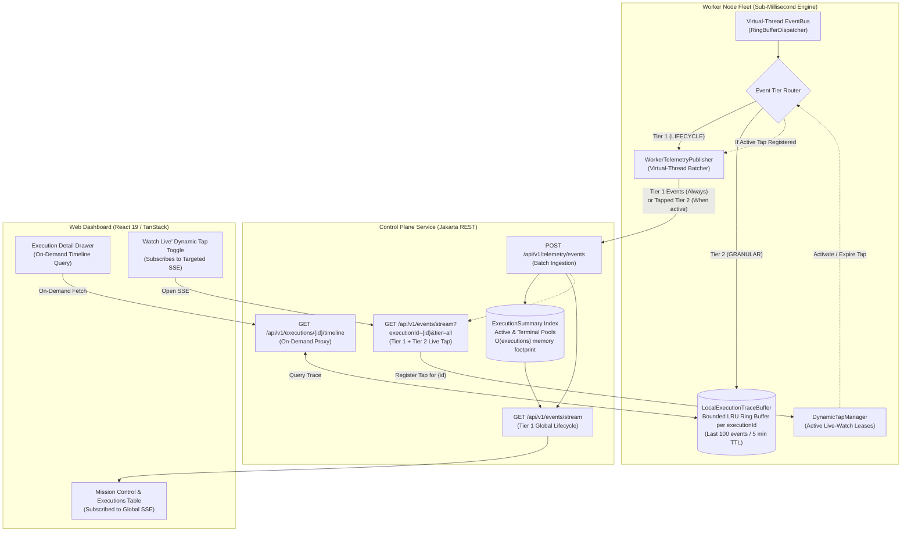

# Dispersion — Master Architecture & Engineering Roadmap

> **Document Status:** Authoritative Master Plan & Living Engineering Roadmap
> **Last Updated:** October 3, 2026
> **Repository Baseline:** `main` branch, 27 Maven reactor modules, 100% test pass rate, Java 25 virtual-thread native, Jakarta REST 3.1 HTTP/SSE server adapter (`dispersion-server-jakarta`), Avaje compile-time JSON serialization, interactive Spring Boot 4.1 local demo app ([`DispersionDemoApp`](file:///C:/Users/faiza/development/dispersion/examples/src/main/java/com/github/f442y/dispersion/examples/DispersionDemoApp.java)), and Web UI ([`ui/`](file:///C:/Users/faiza/development/dispersion/ui)).
> **Active Focus:** Phase 5 — Clustered Stores, Distributed Messaging & Production Hardening.

---

## 🧭 Executive Summary & Core Mission

Dispersion is a high-throughput, virtual-thread-native state engine and distributed saga orchestrator engineered on Java 25. It decomposes complex distributed coordination into three discrete tiers:

1. **Tier 1 (Atomic FSMs):** Ultra-low latency, thread-confined, lock-free finite state machines with sub-microsecond state transitions.
2. **Tier 2 (Discrete Sagas):** Turn-based macro workflows supporting safe suspension, signal injection, child machine composition, and automated LIFO compensation rollbacks.
3. **Tier 3 (Batch Processing):** Item-level virtual-thread concurrency with barrier-synchronized progression (`ALL_ITEMS_ARRIVED`, `SIGNAL_TRIGGERED`) and granular item-level checkpoints.

---

## 🗺️ High-Level Engineering Roadmap

```mermaid
flowchart TD
    subgraph P1["✅ Phase 1: Core Subsystems & Multi-Module Architecture (Complete)"]
        DEC["27 Hexagonal Modules<br/>• Zero split-package collisions<br/>• Symmetrical API/Core/Test triplets"]
        FSM["Tier 1: Atomic FSM<br/>• Pre-compiled StateMap ordinal arrays<br/>• Circuit breakers & visit limits<br/>• Lock-free virtual thread runner"]
        SAGA["Tier 2: Discrete Sagas<br/>• Turn-based suspension<br/>• Automated LIFO compensation<br/>• Child composition & fork-join"]
        BATCH["Tier 3: Batch Engine<br/>• Item-level virtual thread concurrency<br/>• ALL_ITEMS_ARRIVED & SIGNAL_TRIGGERED barriers"]
        ROUTE["Routing Engine<br/>• Canary traffic control<br/>• Location-agnostic dispatch"]
        EVENT["Telemetry Subsystem<br/>• 64k ring buffer event bus<br/>• Polymorphic ExecutionEvent records"]
    end

    subgraph P2["✅ Phase 2: Control Plane & Serialization (Complete)"]
        SER["Avaje JSON Serialization<br/>• Compile-time reflection-free<br/>• 28 polymorphic event records"]
        SERV["Jakarta REST 3.1 HTTP/SSE<br/>• Java 25 virtual-thread endpoints<br/>• REST query endpoints<br/>• Real-time SSE event streaming"]
        DEMO["Interactive Spring Boot 4 Demo<br/>• Runnable local demo<br/>• Multi-step saga & burst pipelines"]
    end

    subgraph P3["✅ Phase 3: Control Panel Web UI (Complete)"]
        UI_SCAF["Modern Web Stack<br/>• React 19 + TypeScript + Vite<br/>• TanStack Router + TanStack Query v5<br/>• Tailwind CSS minimalist monochrome theme"]
        UI_MODELS["Decomposed Domain Layers<br/>• Typed API modules & domain models<br/>• SSE stream subscriber with query invalidation"]
        UI_VIEWS["Mission Control Dashboard<br/>• Interactive State Pipeline & Mermaid DAG<br/>• Execution Detail Drawer & Signal Console<br/>• Real-time polymorphic telemetry stream"]
    end

    subgraph P4["✅ Phase 4: Tiered Telemetry, Drill-Down & Jakarta Server Adapter (Delivered)"]
        TIERED_TEL["Tiered Telemetry & On-Demand Drill-Down<br/>• High-level lifecycle ingress<br/>• Granular spill buffers & dynamic tap<br/>• Targeted SSE stream subscription"]
        JAKARTA["Jakarta EE / Spring Boot 4 Adapters<br/>• Jakarta REST / Servlet resource bindings<br/>• Embedded UI dashboard hosting (web/ & static/)"]
        WATCH_LIVE["UI Live Drill-Down<br/>• Dynamic Tap toggle for active instances<br/>• Real-time granular event visualization"]
    end

    subgraph P5["🚀 Phase 5: Clustered Stores, Distributed Messaging & Production Hardening (Active Focus)"]
        STORES["Durable Stores<br/>• PostgreSQL snapshot persistence<br/>• Redis checkpoint cache"]
        MESSAGING["Distributed Messaging<br/>• Kafka partitioned topics<br/>• RabbitMQ exchange adapters"]
        CLUSTER["Cluster Leases<br/>• Partition leadership assignment<br/>• Failover heartbeat coordination"]
        SEC["Security & RBAC<br/>• mTLS & JWT token auth<br/>• Read-only vs Operator privileges"]
        OTEL["OpenTelemetry<br/>• W3C traceparent propagation<br/>• Distributed tracing across sagas"]
    end

    P1 --> P2
    P2 --> P3
    P3 --> P4
    P4 --> P5
```

---

## 🏛️ System State & Verified Achievements (Phases 1, 2, 3 & 4)

### 1. Hexagonal Multi-Module Decomposition (27 Modules)
All modules are decomposed into topic-nested directories with strict hexagonal boundaries, independent lifecycles, and zero split-package collisions:

| Subsystem | Modules (`groupId: com.github.f442y.dispersion`) | Key Responsibilities & Invariants |
| :--- | :--- | :--- |
| **Eventing** | `dispersion-event-api` `dispersion-event-core` `dispersion-event-test` | Polymorphic [`ExecutionEvent`](file:///C:/Users/faiza/development/dispersion/event/api/src/main/java/com/github/f442y/dispersion/event/ExecutionEvent.java) record hierarchy partitioned into subpackages (`event.turn`, `event.state`, `event.signal`, `event.compensation`, `event.retry`, `event.child`, `event.parallel`, `event.guard`, `event.control`). Tiered telemetry classification ([`EventTier`](file:///C:/Users/faiza/development/dispersion/event/api/src/main/java/com/github/f442y/dispersion/event/EventTier.java)), local ring buffer flight recorder ([`LocalExecutionTraceBuffer`](file:///C:/Users/faiza/development/dispersion/event/api/src/main/java/com/github/f442y/dispersion/event/LocalExecutionTraceBuffer.java)), and lease-based dynamic live tap ([`DynamicTapManager`](file:///C:/Users/faiza/development/dispersion/event/api/src/main/java/com/github/f442y/dispersion/event/DynamicTapManager.java)). |
| **FSM (Tier 1)** | `dispersion-fsm-api` `dispersion-fsm-core` `dispersion-fsm-test` | Ultra-fast atomic state transitions (`transitionsTo`), state visit limits (`maxVisits`), circuit breaker trip detection, and direct virtual thread execution pathway (`executeDirect`) with zero heap thread allocations. |
| **Routing** | `dispersion-routing-api` `dispersion-routing-core` `dispersion-routing-test` | Location-agnostic workload routing, Canary traffic splitting, metadata-driven dispatch, and developer isolation sandboxes. |
| **Orchestration (Tiers 2 & 3)** | `dispersion-orchestration-api` `dispersion-orchestration-core` `dispersion-orchestration-batch` `dispersion-orchestration-messaging` `dispersion-orchestration-test` | Turn-based execution lifecycle, safe suspension (`waitForSignal`), automated LIFO compensation rollbacks on fault/cancellation, parallel fork-join concurrency, batch barriers (`ALL_ITEMS_ARRIVED`, `SIGNAL_TRIGGERED`), and idempotent message envelope deduplication. |
| **Control Plane** | `dispersion-control-plane-api` `dispersion-control-plane-core` `dispersion-control-plane-test` | Unified operator control SPI ([`ControlPlane`](file:///C:/Users/faiza/development/dispersion/control-plane/api/src/main/java/com/github/f442y/dispersion/control/ControlPlane.java)) with reference implementation ([`DefaultControlPlane`](file:///C:/Users/faiza/development/dispersion/control-plane/core/src/main/java/com/github/f442y/dispersion/control/core/DefaultControlPlane.java)), lean summary index, trace timeline provider SPI ([`TraceTimelineProvider`](file:///C:/Users/faiza/development/dispersion/control-plane/api/src/main/java/com/github/f442y/dispersion/control/TraceTimelineProvider.java)), machine topology registry, live query interfaces, and dynamic Mermaid graph generation. |
| **Serialization** | `dispersion-serialization-binary-api` `dispersion-serialization-fory` `dispersion-serialization-json-api` `dispersion-serialization-avaje` | Zero-copy binary serialization SPI (Fury) and compile-time reflection-free JSON serialization (Avaje-Jsonb) supporting polymorphic discrimination across all 28 execution events without runtime reflection. |
| **Server** | `dispersion-server-api` `dispersion-server-jakarta` | Lightweight server SPI decoupled from web frameworks. Standard Jakarta REST 3.1 (`@Path`, `@GET`, `@POST`) adapter (`ControlPlaneResource`) with SSE streaming, CORS filter, and static embedded UI hosting (`WebDashboardResource`). |
| **Testing & BOM** | `dispersion-testkit` `dispersion-bom` `dispersion-examples` | Static test facade [`DispersionTestKit`](file:///C:/Users/faiza/development/dispersion/testkit/src/main/java/com/github/f442y/dispersion/testkit/DispersionTestKit.java), centralized BOM, and runnable demo application [`DispersionDemoApp`](file:///C:/Users/faiza/development/dispersion/examples/src/main/java/com/github/f442y/dispersion/examples/DispersionDemoApp.java) built on Spring Boot 4.1. |

### 2. Control Plane REST & SSE Contract
The Jakarta REST server adapter (port `8080` by default) provides the communication layer for the Web UI and remote worker nodes:

| Method | Endpoint | Description |
| :--- | :--- | :--- |
| `GET` | `/` and `/{path:.*}` | Serves embedded React 19 SPA dashboard (`index.html`, JavaScript/CSS assets) with path-traversal protection. |
| `GET` | `/api/v1/node` | Returns node health, environment, clusterId, CPU count, uptime, JVM memory, and engine descriptor counts. |
| `GET` | `/api/v1/machines` | Returns all registered state machine topologies, types, and state counts. |
| `POST` | `/api/v1/machines` | Registers remote state machine topology descriptors from distributed microservices. |
| `GET` | `/api/v1/machines/{machineName}` | Returns full metadata, state transition matrix, and dynamic Mermaid topology. |
| `POST` | `/api/v1/machines/{machineName}/dispatch` | Triggers a fresh execution of the specified workflow with optional JSON payload. |
| `GET` | `/api/v1/executions` | Returns all active, suspended, completed, or compensated executions (supports `status` and `machineName` filtering). |
| `GET` | `/api/v1/executions/{executionId}` | Returns single execution summary, turn count, and state context. |
| `GET` | `/api/v1/executions/{executionId}/timeline` | Returns ordered chronological turn event history for the execution (tiered on-demand, supports `?limit=100`). |
| `GET` | `/api/v1/executions/{machine}/{key}/checkpoint` | Inspects durable checkpoint snapshot state for a suspended orchestration saga. |
| `POST` | `/api/v1/executions/signal` | Delivers an external signal to a suspended execution (`{ "machineName", "correlationKey", "signalName", "payload" }`). |
| `POST` | `/api/v1/telemetry/events` | Ingests batches of polymorphic execution telemetry events from remote worker microservices. |
| `GET` | `/api/v1/events/stream` | Continuous Server-Sent Events (SSE) feed streaming lifecycle events globally, or granular traces when filtered by `?executionId={id}&tier=all`. |

---

## 💻 Phase 3: Control Panel Web UI (`ui/`)

The web UI in `ui/` is built with React 19, TypeScript, Vite, TanStack Router, TanStack Query v5, and Tailwind CSS. It communicates with the control plane via REST and SSE.

---

## 🌐 Phase 4: Tiered Telemetry & Host Adapters (Delivered)

### 🎯 Dedicated Control Plane Service & Embedded UI Hosting

- [x] **Dedicated Control Plane Ingress via Jakarta REST (`dispersion-server-jakarta`)**:
  - Standard Jakarta REST 3.1 endpoints (`ControlPlaneResource`) running on Java 25 virtual threads.
  - Dual-mode operation: Direct in-memory control plane binding for single-process architectures, alongside HTTP REST/SSE ingress for distributed systems.
  - Remote machine registration via `POST /api/v1/machines`.
  - Global telemetry batch aggregator via `POST /api/v1/telemetry/events`.
  - External signal ingress via `POST /api/v1/executions/signal`.
  - Node health and diagnostic metrics via `GET /api/v1/node`.
  - Zero-dependency CORS filter (`ControlPlaneCorsFilter`) configurable via `ServerConfig`.

- [x] **Embedded UI Hosting in Jakarta REST (`WebDashboardResource`)**:
  - Classpath-based static asset delivery: Serves compiled UI bundle from `web/` (with fallback to `static/`).
  - SPA Fallback Routing: Catch-all routing directing client-side TanStack Router paths back to `index.html`.
  - Path traversal defense: Strictly prevents `..`, backslashes, null bytes, and absolute paths with 400 Bad Request.
  - Zero-CORS same-origin reliability when serving UI and API from a unified port.
  - Packaged directly into the demo application via Maven resource filtering.

- [x] **Spring Boot 4.1 Demo Application (`dispersion-examples`)**:
  - Migrated example application to Spring Boot 4.1 with dependencies strictly localized to `examples/pom.xml`.
  - Registered Jersey/Jakarta REST resources with zero framework leakage into core Dispersion libraries.
  - Interactive multi-saga background burst simulator and pre-seeded suspended workflow.
  - Verified 100% test pass rate with `DispersionDemoAppIntegrationTests`.

---

### 🚀 Tiered Telemetry & On-Demand Granular Drill-Down

> **Core Philosophy:** *"Demarcation to the Center, Granularity at the Edge, Streaming on Demand."*
> The Control Plane maintains a lean $O(\text{Executions})$ summary index and global lifecycle stream. High-frequency micro-events remain confined to worker edge ring buffers and are only retrieved or streamed when an operator explicitly drills down or toggles "Watch Live".

#### 1. Architectural Topology

#### 2. Event Tier Classification Matrix (`dispersion-event-api`)

| Event Category Interface | Concrete Event Records | Assigned Tier | Routing & Ingestion Behavior |
| :--- | :--- | :---: | :--- |
| **`TurnLifecycleEvent`** | `TurnStartedEvent` `TurnSuspendedEvent` `TurnCompletedEvent` `TurnCompensatedEvent` `TurnFailedEvent` | **`LIFECYCLE`** | **Always Ingested**: Shipped immediately from worker to Control Plane. Updates `ExecutionSummary` (status, state, turn count, duration) and broadcasts on global `/events/stream`. |
| **`ControlPlaneEvent`** | `ExecutionCancelledEvent` `ExecutionPausedEvent` `ExecutionResumedEvent` | **`LIFECYCLE`** | **Always Ingested**: Represents direct operator actions modifying execution lifecycle. |
| **`StateLifecycleEvent`** | `StateEnteredEvent` `StateExitedEvent` `TransitionEvaluatedEvent` `ActionExecutedEvent` | **`GRANULAR`** | **Edge-Buffered**: Stored in worker `LocalExecutionTraceBuffer`. Only streamed if an active live-watch tap is registered for that `executionId`. |
| **`SignalEvent`** | `SignalAwaitedEvent` `SignalReceivedEvent` `SignalDeliveredEvent` `SignalDiscardedEvent` | **`GRANULAR`** | **Edge-Buffered**: Low-level signal matching and queueing telemetry. |
| **`RetryLifecycleEvent`** | `RetryScheduledEvent` `RetryAttemptedEvent` `RetryExhaustedEvent` | **`GRANULAR`** | **Edge-Buffered**: Intermediate backoff ticks within a single turn. |
| **`ExecutionGuardEvent`** | `CircuitBreakerTrippedEvent` `MaxVisitsExceededEvent` | **`GRANULAR`** | **Edge-Buffered**: Granular diagnostics on trip limits and guard evaluations. |
| **`CompensationEvent`** | `CompensationStepStartedEvent` `CompensationStepCompletedEvent` | **`GRANULAR`** | **Edge-Buffered**: Step-by-step compensation audit trail within a compensated turn. |
| **`ParallelExecutionEvent`** | `ParallelForkedEvent` `BranchCompletedEvent` `ParallelJoinedEvent` | **`GRANULAR`** | **Edge-Buffered**: Barrier join/fork steps within a turn. |

---

#### 3. Milestone Completion Status

- [x] **Phase 4.1: Event Taxonomy & Tier SPI (`dispersion-event-api`)**:
  - Created [`EventTier`](file:///C:/Users/faiza/development/dispersion/event/api/src/main/java/com/github/f442y/dispersion/event/EventTier.java) enum (`LIFECYCLE`, `GRANULAR`).
  - Added `default EventTier tier()` to [`ExecutionEvent`](file:///C:/Users/faiza/development/dispersion/event/api/src/main/java/com/github/f442y/dispersion/event/ExecutionEvent.java).
  - Sub-interfaces (`TurnLifecycleEvent`, `ControlPlaneEvent`) declare `EventTier.LIFECYCLE`.
  - Granular sub-interfaces declare `EventTier.GRANULAR`.
  - Added `boolean isLifecycle()` and `boolean isGranular()` convenience predicates.

- [x] **Phase 4.2: Worker Local Flight Recorder (`dispersion-event-core`)**:
  - Implemented `LocalExecutionTraceBuffer` SPI and thread-safe implementation `ConcurrentRingBufferTraceBuffer`.
  - Implemented `DynamicTapManager` and `DefaultDynamicTapManager` for lease-based tap registration.
  - Automatic 30-second TTL on taps with heartbeat renewal support.

- [x] **Phase 4.3: Control Plane Summary Index & Timeline Provider SPI (`dispersion-control-plane-api` & `core`)**:
  - Introduced `TraceTimelineProvider` SPI with in-memory implementation `InMemoryTraceTimelineProvider`.
  - Refactored `DefaultControlPlane` with lean `ExecutionSummary` indexes and delegated timeline retrieval.

- [x] **Phase 4.4: Dual-Feed SSE & On-Demand Timeline Endpoint (`dispersion-server-jakarta`)**:
  - `GET /api/v1/events/stream` streams lifecycle events by default, or activates a dynamic tap when `?executionId={id}&tier=all` is requested.
  - Automatically unregisters tap lease on client disconnect.
  - `GET /api/v1/executions/{id}/timeline` provides chronological event traces.

- [x] **Phase 4.5: Web UI Drill-Down & "Watch Live" Integration (`ui/`)**:
  - Updated `ui/src/api/client.ts` to support `EventStreamUrlOptions` (`executionId`, `tier`).
  - Updated `useEventStream` with targeted cache invalidation and event callback hooks.
  - Updated `ExecutionTimeline.tsx` with **"Watch Live"** toggle button, live pulse indicator, tier badges (`LIFECYCLE` vs `GRANULAR`), and real-time SSE streaming.

---

## 🛡️ Phase 5: Clustered Stores, Distributed Messaging & Production Hardening [Active Focus]

- [ ] **Kafka / RabbitMQ Broker Adapters (`dispersion-messaging-kafka`)**:
  - Connect `CommandEnvelope` transport to Kafka topics with partitioned correlation keys.
- [ ] **Durable Checkpoint Stores (`dispersion-store-postgres`, `dispersion-store-redis`)**:
  - Persistent storage for suspended orchestration checkpoints across node restarts.
- [ ] **Cluster Leadership & Lease Management**:
  - Partition assignment for distributed state machine workers with heartbeat-based failover.
- [ ] **Control Plane Security & RBAC**:
  - Token-based operator authentication (JWT / mTLS) on Jakarta REST endpoints.
  - Read-only observer vs. operator signal-injection privilege levels.
- [ ] **OpenTelemetry (OTel) Native Export**:
  - Standardized W3C `traceparent` propagation across distributed saga turns and child machine boundaries.
- [ ] **High-Throughput Benchmarking**:
  - JMH microbenchmarks for ring buffer dispatch and virtual thread context switching under 100,000+ concurrent machines.

---

## 📋 Quick Commands Reference

| Action | Command |
| :--- | :--- |
| **Run All Unit & Integration Tests** | `./mvnw clean test` |
| **Run Examples & Demo App Tests** | `./mvnw test -pl examples -am` |
| **Run Spring Boot Demo Server** | `.\mvnw compile exec:java -pl examples -Dexec.mainClass="com.github.f442y.dispersion.examples.DispersionDemoApp"` |
| **Run UI Development Server** | `cd ui && npm run dev` |
| **Build UI for Production** | `cd ui && npm run build` |
| **Fast Backend Compile (No Tests)** | `./mvnw test-compile -DskipTests` |
| **Check Git Status** | `git status` |
| **View Latest Commits** | `git log --oneline -n 5` |
