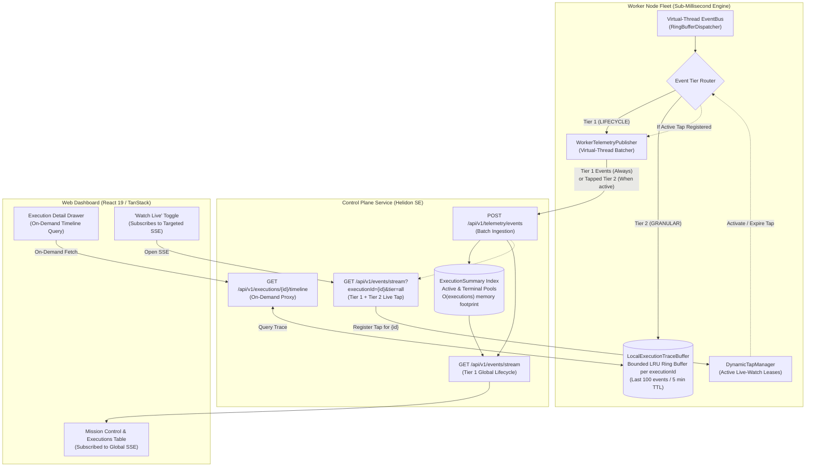

# Dispersion — Master Architecture & Engineering Roadmap

> **Document Status:** Authoritative Master Plan & Living Engineering Roadmap
> **Last Updated:** October 1, 2026
> **Repository Baseline:** `main` branch, 28 Maven reactor modules, 100% test pass rate, Java 25 virtual-thread native, Helidon SE Níma standalone HTTP/SSE server, Avaje compile-time JSON serialization, interactive runnable local demo app ([`DispersionDemoApp`](file:///C:/Users/faiza/development/dispersion/examples/src/main/java/com/github/f442y/dispersion/examples/DispersionDemoApp.java)), and Web UI ([`ui/`](file:///C:/Users/faiza/development/dispersion/ui)).
> **Active Focus:** Phase 4 — Tiered Telemetry & On-Demand Granular Drill-Down Architecture (Immediate Target), followed by Host Adapters, Clustered Stores & Messaging Integration.

---

## 🧭 Executive Summary & Core Mission

Dispersion is a high-throughput, virtual-thread-native state engine and distributed saga orchestrator engineered on Java 25. It decomposes complex distributed coordination into three discrete tiers:

1. **Tier 1 (Atomic FSMs):** Ultra-low latency, thread-confined, lock-free finite state machines with sub-microsecond state transitions.
2. **Tier 2 (Discrete Sagas):** Turn-based macro workflows supporting safe suspension, signal injection, child machine composition, and automated LIFO compensation rollbacks.
3. **Tier 3 (Batch Processing):** Item-level virtual-thread concurrency with barrier-synchronized progression (`ALL_ITEMS_ARRIVED`, `SIGNAL_TRIGGERED`) and granular item-level checkpoints.

---

## 🗺️ High-Level Engineering Roadmap

```mermaid
flowchart TD
    subgraph P1["✅ Phase 1: Core Subsystems & Multi-Module Architecture (Complete)"]
        DEC["28 Hexagonal Modules<br/>• Zero split-package collisions<br/>• Symmetrical API/Core/Test triplets"]
        FSM["Tier 1: Atomic FSM<br/>• Pre-compiled StateMap ordinal arrays<br/>• Circuit breakers & visit limits<br/>• Lock-free virtual thread runner"]
        SAGA["Tier 2: Discrete Sagas<br/>• Turn-based suspension<br/>• Automated LIFO compensation<br/>• Child composition & fork-join"]
        BATCH["Tier 3: Batch Engine<br/>• Item-level virtual thread concurrency<br/>• ALL_ITEMS_ARRIVED & SIGNAL_TRIGGERED barriers"]
        ROUTE["Routing Engine<br/>• Canary traffic control<br/>• Location-agnostic dispatch"]
        EVENT["Telemetry Subsystem<br/>• 64k ring buffer event bus<br/>• Polymorphic ExecutionEvent records"]
    end

    subgraph P2["✅ Phase 2: Standalone Control Plane & Serialization (Complete)"]
        SER["Avaje JSON Serialization<br/>• Compile-time reflection-free<br/>• 28 polymorphic event records"]
        SERV["Helidon SE Níma HTTP/SSE<br/>• Java 25 virtual-thread web server<br/>• REST query endpoints<br/>• Real-time SSE event streaming"]
        DEMO["Interactive Demo App<br/>• Runnable local demo<br/>• Multi-step saga & burst pipelines"]
    end

    subgraph P3["✅ Phase 3: Control Panel Web UI (Milestone Delivered)"]
        UI_SCAF["Modern Web Stack<br/>• React 19 + TypeScript + Vite<br/>• TanStack Router + TanStack Query v5<br/>• Tailwind CSS minimalist monochrome theme"]
        UI_MODELS["Decomposed Domain Layers<br/>• Typed API modules & domain models<br/>• SSE stream subscriber with query invalidation"]
        UI_VIEWS["Mission Control Dashboard<br/>• Interactive State Pipeline & Mermaid DAG<br/>• Execution Detail Drawer & Signal Console<br/>• Real-time polymorphic telemetry stream"]
    end

    subgraph P4["🌐 Phase 4: Control Plane Service & Clustered Integration (Active Focus)"]
        CP_SRV["Dedicated Control Plane Service<br/>• Standalone service per environment<br/>• Helidon SE embedded UI hosting<br/>• In-memory monolith + remote HTTP ingress"]
        TIERED_TEL["Tiered Telemetry & On-Demand Drill-Down<br/>• High-level lifecycle ingress<br/>• Granular spill buffers & dynamic tap<br/>• Targeted SSE stream subscription"]
        JAKARTA["Host Framework Adapters<br/>• Jakarta REST / Servlet resource bindings<br/>• Spring Boot / Quarkus runtime starters"]
        STORES["Durable Stores<br/>• PostgreSQL snapshot persistence<br/>• Redis checkpoint cache"]
        MESSAGING["Distributed Messaging<br/>• Kafka partitioned topics<br/>• RabbitMQ exchange adapters"]
        CLUSTER["Cluster Leases<br/>• Partition leadership assignment<br/>• Failover heartbeat coordination"]
    end

    subgraph P5["🛡️ Phase 5: Production Hardening & Enterprise Security"]
        SEC["Security & RBAC<br/>• mTLS & JWT token auth<br/>• Read-only vs Operator privileges"]
        OTEL["OpenTelemetry<br/>• W3C traceparent propagation<br/>• Distributed tracing across sagas"]
        BENCH["Load & JMH Benchmarks<br/>• 100k+ concurrent machine stress<br/>• Allocation profiling"]
    end

    P1 --> P2
    P2 --> P3
    P3 --> P4
    P4 --> P5
```

---

## 🏛️ System State & Verified Achievements (Phases 1, 2 & 3)

### 1. Hexagonal Multi-Module Decomposition (28 Modules)
All modules are decomposed into topic-nested directories with strict hexagonal boundaries, independent lifecycles, and zero split-package collisions:

| Subsystem | Modules (`groupId: com.github.f442y.dispersion`) | Key Responsibilities & Invariants |
| :--- | :--- | :--- |
| **Eventing** | `dispersion-event-api` `dispersion-event-core` `dispersion-event-test` | Polymorphic [`ExecutionEvent`](file:///C:/Users/faiza/development/dispersion/event/api/src/main/java/com/github/f442y/dispersion/event/ExecutionEvent.java) record hierarchy partitioned into subpackages (`event.turn`, `event.state`, `event.signal`, `event.compensation`, `event.retry`, `event.child`, `event.parallel`, `event.guard`, `event.control`). Bounded lock-free ring buffer dispatcher running on virtual threads with zero lock contention. |
| **FSM (Tier 1)** | `dispersion-fsm-api` `dispersion-fsm-core` `dispersion-fsm-test` | Ultra-fast atomic state transitions (`transitionsTo`), state visit limits (`maxVisits`), circuit breaker trip detection, and direct virtual thread execution pathway (`executeDirect`) with zero heap thread allocations. |
| **Routing** | `dispersion-routing-api` `dispersion-routing-core` `dispersion-routing-test` | Location-agnostic workload routing, Canary traffic splitting, metadata-driven dispatch, and developer isolation sandboxes. |
| **Orchestration (Tiers 2 & 3)** | `dispersion-orchestration-api` `dispersion-orchestration-core` `dispersion-orchestration-batch` `dispersion-orchestration-messaging` `dispersion-orchestration-test` | Turn-based execution lifecycle, safe suspension (`waitForSignal`), automated LIFO compensation rollbacks on fault/cancellation, parallel fork-join concurrency, batch barriers (`ALL_ITEMS_ARRIVED`, `SIGNAL_TRIGGERED`), and idempotent message envelope deduplication. |
| **Control Plane** | `dispersion-control-plane-api` `dispersion-control-plane-core` `dispersion-control-plane-test` | Unified operator control SPI ([`ControlPlane`](file:///C:/Users/faiza/development/dispersion/control/api/src/main/java/com/github/f442y/dispersion/control/ControlPlane.java)) with reference implementation ([`DefaultControlPlane`](file:///C:/Users/faiza/development/dispersion/control/core/src/main/java/com/github/f442y/dispersion/control/core/DefaultControlPlane.java)), machine topology registry, live query interfaces, dynamic Mermaid graph generation, and dynamic SPI provider discovery ([`ControlPlaneProvider`](file:///C:/Users/faiza/development/dispersion/control/api/src/main/java/com/github/f442y/dispersion/control/ControlPlaneProvider.java)). |
| **Serialization** | `dispersion-serialization-binary-api` `dispersion-serialization-fory` `dispersion-serialization-json-api` `dispersion-serialization-avaje` | Zero-copy binary serialization SPI (Fury) and compile-time reflection-free JSON serialization (Avaje-Jsonb) supporting polymorphic discrimination across all 28 execution events without runtime reflection. |
| **Server** | `dispersion-server-api` `dispersion-server-jakarta` `dispersion-server-standalone` | Lightweight server SPI decoupled from web frameworks. Standalone Helidon SE 4.x Níma HTTP server running natively on Java 25 virtual threads with SSE streaming, REST endpoints, and static embedded UI hosting. |
| **Testing & BOM** | `dispersion-testkit` `dispersion-bom` `dispersion-examples` | Static test facade [`DispersionTestKit`](file:///C:/Users/faiza/development/dispersion/testkit/src/main/java/com/github/f442y/dispersion/testkit/DispersionTestKit.java), centralized BOM, and runnable demo application [`DispersionDemoApp`](file:///C:/Users/faiza/development/dispersion/examples/src/main/java/com/github/f442y/dispersion/examples/DispersionDemoApp.java). |

### 2. Standalone Server REST & SSE Contract
The standalone server (port `8080`) provides the communication layer for the Web UI and remote worker nodes:

| Method | Endpoint | Description |
| :--- | :--- | :--- |
| `GET` | `/api/v1/node` | Returns node health, environment, clusterId, CPU count, uptime, JVM memory, and engine descriptor counts. |
| `GET` | `/api/v1/machines` | Returns all registered state machine topologies, types, and state counts. |
| `POST` | `/api/v1/machines/register` | Registers remote state machine topology descriptors from distributed microservices. |
| `GET` | `/api/v1/machines/{machineName}` | Returns full metadata, state transition matrix, and dynamic Mermaid topology. |
| `POST` | `/api/v1/machines/{machineName}/dispatch` | Triggers a fresh execution of the specified workflow with optional JSON payload. |
| `GET` | `/api/v1/executions` | Returns all active, suspended, completed, or compensated executions (supports `status` and `machineName` filtering). |
| `GET` | `/api/v1/executions/{executionId}` | Returns single execution summary, turn count, and state context. |
| `GET` | `/api/v1/executions/{executionId}/timeline` | Returns ordered chronological turn event history for the execution (tiered on-demand). |
| `POST` | `/api/v1/executions/signal` | Delivers an external signal to a suspended execution (`{ "executionId", "signalName", "payload" }`). |
| `POST` | `/api/v1/telemetry/events` | Ingests batches of polymorphic execution telemetry events from remote worker microservices. |
| `GET` | `/api/v1/events/stream` | Continuous Server-Sent Events (SSE) feed streaming lifecycle events globally, or granular traces when filtered by `?executionId=...`. |

---

## 💻 Phase 3: Control Panel Web UI (`ui/`)

The web UI in `ui/` is built with React 19, TypeScript, Vite, TanStack Router, TanStack Query v5, and Tailwind CSS. It communicates with the standalone server via REST and SSE.

> [!NOTE]
> The Web UI is designed as an uncoupled client against the server API and is subject to active iteration.

---

## 🌐 Phase 4: Control Plane Service & Clustered Enterprise Integrations [Active Focus]

### 🎯 Dedicated Control Plane Service & Embedded UI Hosting (Delivered)

- [x] **Dedicated Control Plane Service per Environment Topology**:
  - **Single Operational Ingress**: Deploy `dispersion-server-standalone` as a dedicated control plane microservice per environment (`control-plane-staging`, `control-plane-prod`), isolating operators from volatile worker pod IPs.
  - **Dual-Mode Operation**: Direct zero-overhead in-memory binding (`controlPlane.attachTo(eventBus)`, `controlPlane.register(machine)`) for monolith deployments, alongside HTTP REST ingress for distributed microservices.
  - **Remote Machine Registration**: `POST /api/v1/machines/register` allows remote worker pods to register their `MachineDescriptor` at startup so topologies appear in the UI.
  - **Global Telemetry Aggregator**: Worker nodes stream `ExecutionEvent` batches via `POST /api/v1/telemetry/events`, feeding the Control Plane timeline and fanning out unified Server-Sent Events (SSE) to browser clients.
  - **Decoupled External Signal Ingress**: `POST /api/v1/executions/signal` delivers signals directly in-process or routes them to the target machine.
  - **Environment & Cluster Metadata**: Standalone server configuration resolves `environment` and `clusterId` via CLI flags, system properties, or environment variables and exposes them in `GET /api/v1/node`.

- [x] **Embedded UI Hosting in Helidon SE Níma (`dispersion-server-standalone`)**:
  - **Virtual-Thread Static Asset Serving**: Mount compiled `ui/dist` bundle (`index.html`, `assets/*`) natively via Helidon SE `StaticContentSupport` on virtual threads without servlet overhead.
  - **SPA Fallback Routing**: Catch-all routing redirecting client-side TanStack Router paths (`/machines/*`, `/executions/*`) back to `index.html`.
  - **Zero-CORS & Same-Origin Reliability**: Serve the UI and backend `/api/v1/*` from the same origin, eliminating cross-origin preflight requests (`OPTIONS`), cookie barriers, and SSL domain mismatches.
  - **Local Development Fallback**: When UI dist assets are absent on classpath, points developers to `cd ui && npm run build`.
  - **External CDN Option Preservation**: Maintain total decoupling of backend REST/SSE schemas so enterprise platforms retain the option to host UI assets externally (e.g. Cloudflare Pages or AWS CloudFront/S3) if preferred.

- [x] **Embedded UI Static Asset Ingestion**:
  - **Direct Dist Mapping**: Embedded UI distribution bundle (`ui/dist`) mapped into `target/classes/web/` so all static assets (HTML, CSS, JS, SVG) are packaged directly into `dispersion-server-standalone.jar`.

---

### 🚀 Immediate Next Target: Tiered Telemetry & On-Demand Granular Drill-Down

> **Core Philosophy:** *"Demarcation to the Center, Granularity at the Edge, Streaming on Demand."*
> The Control Plane maintains a lean $O(\text{Executions})$ summary index and global lifecycle stream. High-frequency micro-events remain confined to worker edge ring buffers and are only retrieved or streamed when an operator explicitly drills down or toggles "Watch Live".

#### 1. Architectural Topology

#### 2. Event Tier Classification Matrix (`dispersion-event-api`)

| Event Category Interface | Concrete Event Records | Assigned Tier | Routing & Ingestion Behavior |
| :--- | :--- | :---: | :--- |
| **`TurnLifecycleEvent`** | `TurnStartedEvent` `TurnSuspendedEvent` `TurnCompletedEvent` `TurnCompensatedEvent` `TurnFailedEvent` | **`LIFECYCLE`** | **Always Ingested**: Shipped immediately from worker to Control Plane. Updates `ExecutionSummary` (status, state, turn count, duration) and broadcasts on global `/events/stream`. |
| **`ControlPlaneEvent`** | `ExecutionCancelledEvent` `ExecutionPausedEvent` `ExecutionResumedEvent` | **`LIFECYCLE`** | **Always Ingested**: Represents direct operator actions modifying execution lifecycle. |
| **`StateLifecycleEvent`** | `StateEnteredEvent` `StateExitedEvent` `TransitionEvaluatedEvent` `ActionExecutedEvent` | **`GRANULAR`** | **Edge-Buffered**: Stored in worker `LocalExecutionTraceBuffer`. Only streamed if an active live-watch tap is registered for that `executionId`. |
| **`SignalEvent`** | `SignalAwaitedEvent` `SignalReceivedEvent` `SignalDeliveredEvent` `SignalDiscardedEvent` | **`GRANULAR`** | **Edge-Buffered**: Low-level signal matching and queueing telemetry. |
| **`RetryLifecycleEvent`** | `RetryScheduledEvent` `RetryAttemptedEvent` `RetryExhaustedEvent` | **`GRANULAR`** | **Edge-Buffered**: Intermediate backoff ticks within a single turn. |
| **`ExecutionGuardEvent`** | `CircuitBreakerTrippedEvent` `MaxVisitsExceededEvent` | **`GRANULAR`** | **Edge-Buffered**: Granular diagnostics on trip limits and guard evaluations. |
| **`CompensationEvent`** | `CompensationStepStartedEvent` `CompensationStepCompletedEvent` | **`GRANULAR`** | **Edge-Buffered**: Step-by-step compensation audit trail within a compensated turn. |
| **`ParallelExecutionEvent`** | `ParallelForkedEvent` `BranchCompletedEvent` `ParallelJoinedEvent` | **`GRANULAR`** | **Edge-Buffered**: Barrier join/fork steps within a turn. |

---

#### 3. Detailed Milestone Tasks

- [ ] **Phase 4.1: Event Taxonomy & Tier SPI (`dispersion-event-api`)**:
  - Create [`EventTier`](file:///C:/Users/faiza/development/dispersion/event/api/src/main/java/com/github/f442y/dispersion/event/EventTier.java) enum (`LIFECYCLE`, `GRANULAR`).
  - Add `default EventTier tier()` to [`ExecutionEvent`](file:///C:/Users/faiza/development/dispersion/event/api/src/main/java/com/github/f442y/dispersion/event/ExecutionEvent.java):
    - Sub-interfaces (`TurnLifecycleEvent`, `ControlPlaneEvent`) override with `EventTier.LIFECYCLE`.
    - All other sub-interfaces override with `EventTier.GRANULAR`.
  - Add `boolean isLifecycle()` and `boolean isGranular()` convenience predicates.

- [ ] **Phase 4.2: Worker Local Flight Recorder (`dispersion-event-core`)**:
  - Implement `LocalExecutionTraceBuffer` SPI and thread-safe implementation `ConcurrentRingBufferTraceBuffer`:
    - Stores bounded deque/ring-buffer of last $N$ (default 100) events per `UUID machineId`.
    - Segmented eviction: active executions retain trace; terminal executions auto-evict after configurable TTL (default 5 minutes).
    - Memory footprint: $< 15\text{ MB}$ per 5,000 concurrent workflows.
  - Implement `DynamicTapManager`:
    - Tracks active live-watch lease handles (`Map<UUID, Instant> activeTaps`).
    - When an execution ID has an active tap lease, the event router routes **both** `LIFECYCLE` and `GRANULAR` events to the outbound telemetry publisher.
    - Leases automatically expire after 30 seconds unless renewed by client heartbeat.

- [ ] **Phase 4.3: Control Plane Summary Index & Timeline Provider SPI (`dispersion-control-plane-api` & `core`)**:
  - Introduce `TraceTimelineProvider` SPI:
    - Contract: `CompletableFuture<List<ExecutionEvent>> fetchTimeline(@NonNull UUID machineId, int limit)`.
    - In-Memory Provider (Monolith): Direct zero-copy lookup against local `LocalExecutionTraceBuffer`.
    - Remote Provider (Distributed): Queries the owning worker node or shared durable checkpoint store.
  - Refactor [`DefaultControlPlane`](file:///C:/Users/faiza/development/dispersion/control-plane/core/src/main/java/com/github/f442y/dispersion/control/core/DefaultControlPlane.java):
    - Decouple execution summaries from massive raw event lists. `ExecutionSummary` retains lean lifecycle statistics.
    - Delegate `getExecutionTimeline(id)` to the registered `TraceTimelineProvider`.

- [ ] **Phase 4.4: Dual-Feed SSE & On-Demand Timeline Endpoint (`dispersion-server-standalone`)**:
  - Update `GET /api/v1/events/stream`:
    - Without query parameters: Streams **strictly `EventTier.LIFECYCLE` events**. Minimal CPU and bandwidth for overview dashboards.
    - With `?executionId={id}&tier=all`: Registers a dynamic live tap with the tap manager for `{id}`. Streams both lifecycle and granular events for that execution.
    - On SSE connection close: Unregisters the dynamic tap immediately.
  - Update `GET /api/v1/executions/{id}/timeline`:
    - Supports `?limit=100` parameter.
    - Asynchronously queries the `TraceTimelineProvider` and returns the ordered JSON event timeline.

- [ ] **Phase 4.5: Web UI Drill-Down & "Watch Live" Integration (`ui/`)**:
  - Update `ui/src/routes/executions.tsx` & `ui/src/components/dashboard/`: Subscribed to global lifecycle SSE feed.
  - Update `ui/src/components/execution/ExecutionDrawer.tsx`:
    - Queries `GET /api/v1/executions/{id}/timeline` on open to render turn DAG and steps.
    - Adds a **"Watch Live"** toggle button for running/suspended executions: opens a dedicated `useEventStream` on `/events/stream?executionId={id}&tier=all`.
    - Closing the drawer or toggling off disconnects the targeted stream.

---

### Additional Phase 4 Capabilities

- [ ] **Jakarta EE / Host Framework Adapters (`dispersion-server-jakarta`)**:
  - Expose `@Path` Jakarta REST / Servlet resource endpoints so users deploying to Spring Boot, Helidon MP, Quarkus, or Micronaut can use native container HTTP.
- [ ] **Kafka / RabbitMQ Broker Adapters (`dispersion-messaging-kafka`)**:
  - Connect `CommandEnvelope` transport to Kafka topics with partitioned correlation keys.
- [ ] **Durable Checkpoint Stores (`dispersion-store-postgres`, `dispersion-store-redis`)**:
  - Persistent storage for suspended orchestration checkpoints across node restarts.
- [ ] **Cluster Leadership & Lease Management**:
  - Partition assignment for distributed state machine workers with heartbeat-based failover.

---

## 🛡️ Phase 5: Production Readiness, Security & Performance Hardening

- [ ] **Control Plane Security & RBAC**:
  - Token-based operator authentication (JWT / mTLS) on Helidon SE endpoints.
  - Read-only observer vs. operator signal-injection privilege levels.
- [ ] **OpenTelemetry (OTel) Native Export**:
  - Standardized W3C `traceparent` propagation across distributed saga turns and child machine boundaries.
- [ ] **High-Throughput Benchmarking**:
  - JMH microbenchmarks for ring buffer dispatch and virtual thread context switching under 100,000+ concurrent machines.

---

## 📋 Quick Commands Reference

| Action | Command |
| :--- | :--- |
| **Run All Unit & Integration Tests** | `./mvnw clean test` |
| **Run Examples & Demo App Tests** | `./mvnw test -pl examples -am` |
| **Run Standalone Demo Server** | `./mvnw compile exec:java -pl examples -Dexec.mainClass="com.github.f442y.dispersion.examples.DispersionDemoApp"` |
| **Run UI Development Server** | `cd ui && npm run dev` |
| **Build UI for Production** | `cd ui && npm run build` |
| **Fast Backend Compile (No Tests)** | `./mvnw test-compile -DskipTests` |
| **Check Git Status** | `git status` |
| **View Latest Commits** | `git log --oneline -n 5` |
