# Dispersion — Master Architecture & Engineering Roadmap

> **Document Status:** Authoritative Master Plan & Living Engineering Roadmap
> **Last Updated:** September 26, 2026
> **Repository Baseline:** `main` branch, 23 Maven reactor modules, 100% test pass rate, Java 25 virtual-thread native, Helidon SE Níma standalone HTTP/SSE server, Avaje compile-time JSON serialization, and interactive runnable local demo app ([`DispersionDemoApp`](file:///C:/Users/faiza/development/dispersion/examples/src/main/java/com/github/f442y/dispersion/examples/DispersionDemoApp.java)).
> **Active Focus:** Phase 3 — Control Panel Web UI (`dispersion-ui`) for real-time observability, dynamic DAG visualization, and distributed operator control.

---

## 🧭 Executive Summary & Core Mission

Dispersion is a high-throughput, virtual-thread-native state engine and distributed saga orchestrator engineered on Java 25. It decomposes complex distributed coordination into three discrete tiers:

1. **Tier 1 (Atomic FSMs):** Ultra-low latency, thread-confined, lock-free finite state machines with sub-microsecond state transitions.
2. **Tier 2 (Discrete Sagas):** Turn-based macro workflows supporting safe suspension, signal injection, child machine composition, and automated LIFO compensation rollbacks.
3. **Tier 3 (Batch Processing):** Item-level virtual-thread concurrency with barrier-synchronized progression (`ALL_ITEMS`, `QUORUM`) and granular item-level checkpoints.

---

## 🗺️ High-Level Engineering Roadmap

```mermaid
flowchart TD
    subgraph P1["✅ Phase 1: Core Subsystems & Multi-Module Architecture (Complete)"]
        DEC["23 Hexagonal Modules<br/>• Zero split-package collisions<br/>• JPMS module-info enforcement"]
        FSM["Tier 1: Atomic FSM<br/>• Dynamic transitions<br/>• Circuit breakers & visit limits<br/>• Lock-free virtual thread runner"]
        SAGA["Tier 2: Discrete Sagas<br/>• Turn-based suspension<br/>• Automated LIFO compensation<br/>• Child composition & fork-join"]
        BATCH["Tier 3: Batch Engine<br/>• Item-level virtual thread concurrency<br/>• ALL_ITEMS & QUORUM barriers"]
        ROUTE["Routing Engine<br/>• Canary traffic control<br/>• Location-agnostic dispatch"]
        EVENT["Telemetry Subsystem<br/>• 64k ring buffer event bus<br/>• Polymorphic ExecutionEvent records"]
    end

    subgraph P2["✅ Phase 2: Standalone Control Plane & Serialization (Complete)"]
        SER["Avaje JSON Serialization<br/>• Compile-time reflection-free<br/>• 21+ polymorphic event records"]
        SERV["Helidon SE Níma HTTP/SSE<br/>• Java 25 virtual-thread web server<br/>• REST query endpoints<br/>• Real-time SSE event streaming"]
        DEMO["Interactive Demo App<br/>• Runnable local demo<br/>• Multi-step saga & burst pipelines"]
    end

    subgraph P3["💻 Phase 3: Control Panel Web UI (Active Implementation)"]
        UI_SCAF["Step 3.1: Scaffolding<br/>• Vite + React 19 + TypeScript<br/>• Tailwind CSS + Lucide Icons<br/>• TanStack Router file-based tree"]
        UI_MODELS["Step 3.2: Domain Contracts<br/>• Strong TypeScript event schemas<br/>• REST API client bindings"]
        UI_SSE["Step 3.3: Live State Sync<br/>• Resilient auto-reconnecting SSE<br/>• TanStack Query cache invalidator"]
        UI_ROUTES["Step 3.4: Route Views<br/>• Mission Control Dashboard<br/>• Machine Catalog & Inspector<br/>• Execution Explorer & Timeline"]
        UI_DAG["Step 3.5: Interactive DAG<br/>• Bespoke React SVG Canvas / @dagrejs/dagre<br/>• Real-time active state pulse<br/>• LIFO compensation rollback paths"]
        UI_OPS["Step 3.6: Operator Console<br/>• External signal injection modal<br/>• Manual compensation abort"]
    end

    subgraph P4["🌐 Phase 4: Distributed Stores & Cluster Integration (Upcoming)"]
        JAKARTA["Host Framework Adapters<br/>• Jakarta REST / Servlet<br/>• Spring Boot / Quarkus starters"]
        STORES["Durable Stores<br/>• PostgreSQL snapshot persistence<br/>• Redis checkpoint cache"]
        MESSAGING["Distributed Messaging<br/>• Kafka partitioned topics<br/>• RabbitMQ exchange adapters"]
        CLUSTER["Cluster Leases<br/>• Partition leadership assignment<br/>• Failover heartbeat coordination"]
    end

    subgraph P5["🛡️ Phase 5: Production Hardening & Enterprise Security"]
        SEC["Security & RBAC<br/>• mTLS & JWT token auth<br/>• Read-only vs Operator privileges"]
        OTEL["OpenTelemetry<br/>• W3C traceparent propagation<br/>• Distributed tracing across sagas"]
        BENCH["Load & JMH Benchmarks<br/>• 100k+ concurrent machine stress<br/>• Allocation profiling"]
    end

    P1 --> P2
    P2 --> P3
    P3 --> P4
    P4 --> P5
```



---

## 🏛️ System State & Verified Achievements (Phases 1 & 2)

### 1. Hexagonal Multi-Module Decomposition (23 Modules)
All monolithic modules have been decomposed into topic-nested directories with strict hexagonal boundaries, independent lifecycles, and zero split-package collisions:

| Subsystem | Modules (`groupId: com.github.f442y.dispersion`) | Key Responsibilities & Invariants |
| :--- | :--- | :--- |
| **Eventing** | `dispersion-event-api`<br/>`dispersion-event-core`<br/>`dispersion-event-test` | Polymorphic [`ExecutionEvent`](file:///C:/Users/faiza/development/dispersion/event/api/src/main/java/com/github/f442y/dispersion/event/ExecutionEvent.java) record hierarchy partitioned into subpackages (`lifecycle`, `transition`, `compensation`, `guard`, `batch`, `signal`, `routing`). Bounded lock-free ring buffer dispatcher running on virtual threads with zero lock contention. |
| **FSM (Tier 1)** | `dispersion-fsm-api`<br/>`dispersion-fsm-core`<br/>`dispersion-fsm-test` | Ultra-fast atomic state transitions (`transitionsTo`), state visit limits (`maxVisits`), circuit breaker trip detection, and direct virtual thread execution pathway (`executeDirect`) with zero heap thread allocations. |
| **Routing** | `dispersion-routing-api`<br/>`dispersion-routing-core`<br/>`dispersion-routing-test` | Location-agnostic workload routing, Canary traffic splitting, metadata-driven dispatch, and developer isolation sandboxes. |
| **Orchestration (Tiers 2 & 3)** | `dispersion-orchestration-api`<br/>`dispersion-orchestration-core`<br/>`dispersion-orchestration-batch`<br/>`dispersion-orchestration-messaging`<br/>`dispersion-orchestration-test` | Turn-based execution lifecycle, safe suspension (`waitForSignal`), automated LIFO compensation rollbacks on fault/cancellation, parallel fork-join concurrency, batch barriers (`ALL_ITEMS`, `QUORUM`), and idempotent message envelope deduplication. |
| **Control Plane** | `dispersion-control-plane-api`<br/>`dispersion-control-plane-core`<br/>`dispersion-control-plane-test` | Unified operator control SPI ([`ControlPlane`](file:///C:/Users/faiza/development/dispersion/control/api/src/main/java/com/github/f442y/dispersion/control/ControlPlane.java)) with reference implementation ([`DefaultControlPlane`](file:///C:/Users/faiza/development/dispersion/control/core/src/main/java/com/github/f442y/dispersion/control/core/DefaultControlPlane.java)), machine topology registry, live query interfaces, and dynamic Mermaid graph generation. |
| **Serialization** | `dispersion-serialization-json-api`<br/>`dispersion-serialization-avaje` | Compile-time reflection-free JSON serialization via Avaje-Jsonb supporting polymorphic discrimination across all 21+ execution events without runtime reflection. |
| **Server** | `dispersion-server-api`<br/>`dispersion-server-standalone` | Lightweight server SPI decoupled from web frameworks. Standalone Helidon SE 4.x Níma HTTP server running natively on Java 25 virtual threads with SSE streaming and REST endpoints. |
| **Testing & BOM** | `dispersion-testkit`<br/>`dispersion-bom`<br/>`dispersion-examples` | Static test facade [`DispersionTestKit`](file:///C:/Users/faiza/development/dispersion/testkit/src/main/java/com/github/f442y/dispersion/testkit/DispersionTestKit.java), centralized dependency management BOM, and runnable demo application [`DispersionDemoApp`](file:///C:/Users/faiza/development/dispersion/examples/src/main/java/com/github/f442y/dispersion/examples/DispersionDemoApp.java). |

### 2. Standalone Server REST & SSE Contract
The standalone server (port `8080`) provides the communication layer for the Web UI:

| Method | Endpoint | Description |
| :--- | :--- | :--- |
| `GET` | `/api/v1/machines` | Returns all registered state machine topologies and state counts. |
| `GET` | `/api/v1/machines/{machineName}` | Returns full metadata, state transition matrix, and dynamic Mermaid topology. |
| `GET` | `/api/v1/executions` | Returns all active, suspended, completed, or compensated executions. |
| `POST` | `/api/v1/executions/signal` | Delivers an external signal to a suspended execution (`{ "executionId", "signalName", "payload" }`). |
| `GET` | `/api/v1/events/stream` | Continuous Server-Sent Events (SSE) feed streaming polymorphic JSON events in real time. |

---

## 🎯 Phase 3: Control Panel Web UI (`dispersion-ui`) [Active Milestone]

> **Target Stack:** React 19, TypeScript 5.8+, Vite, TanStack Router (file-based routing), TanStack Query v5, Tailwind CSS, Lucide Icons, Bespoke React SVG Canvas (`@dagrejs/dagre`).

```
dispersion-ui/
├── index.html
├── package.json
├── vite.config.ts
├── tailwind.config.ts
├── src/
│   ├── api/
│   │   ├── client.ts             # REST client (fetch wrapper with error handling)
│   │   ├── sse.ts                # Resilient EventSource manager with backoff reconnect
│   │   └── types.ts              # Discriminated union matching Java ExecutionEvent records
│   ├── components/
│   │   ├── layout/
│   │   │   ├── Header.tsx        # Top navbar, connection badge, global metric indicators
│   │   │   └── Sidebar.tsx       # Navigation links (Dashboard, Machines, Executions)
│   │   ├── graph/
│   │   │   ├── MachineFlow.tsx   # Bespoke React SVG Canvas DAG canvas with auto-layout (Dagre/ELK)
│   │   │   ├── CustomNode.tsx    # Styled nodes (Initial, Action, Suspended, Terminal, Compensated)
│   │   │   └── AnimatedEdge.tsx  # Dynamic transition traversal animations
│   │   ├── common/
│   │   │   ├── StatusBadge.tsx   # Color-coded execution status pills
│   │   │   └── JsonViewer.tsx    # Syntax-highlighted context and payload viewer
│   │   └── modals/
│   │       └── SignalModal.tsx   # External signal injection modal with JSON editor
│   ├── routes/
│   │   ├── __root.tsx            # Global layout shell, theme provider, and SSE listener
│   │   ├── index.tsx             # Mission Control dashboard
│   │   ├── machines/
│   │   │   ├── index.tsx         # Catalog of registered state machines
│   │   │   └── $machineName.tsx  # Machine topology inspector and transition table
│   │   └── executions/
│   │       ├── index.tsx         # Executions explorer with live filters & search
│   │       └── $executionId.tsx  # Turn-by-turn history, DAG state tracker, signal trigger
│   └── main.tsx
```

### Actionable Implementation Steps

#### 🔷 Step 3.1 — UI Scaffolding & Build Infrastructure
- [ ] Initialize `dispersion-ui` with Vite, React 19, TypeScript, and `@tanstack/router-plugin/vite`.
- [ ] Configure Tailwind CSS with dark/light themes and Lucide icons.
- [ ] Configure `vite.config.ts` reverse proxy to route `/api` requests to `http://localhost:8080`.
- [ ] Setup TanStack Router code-generation and initial route tree.

#### 🔷 Step 3.2 — Domain Contracts & API Client
- [ ] Write TypeScript discriminated unions in `src/api/types.ts` mirroring the 21+ polymorphic Java events:
  - `eventType`: `MachineRegistered`, `ExecutionStarted`, `StateEntered`, `StateExited`, `TransitionEvaluated`, `ExecutionSuspended`, `SignalReceived`, `ExecutionResumed`, `ExecutionCompleted`, `ExecutionFailed`, `CompensationTriggered`, `StateCompensated`, `CompensationCompleted`, `CircuitBreakerTripped`, etc.
- [ ] Implement typed REST query client for `/api/v1/machines`, `/api/v1/executions`, and `/api/v1/executions/signal`.

#### 🔷 Step 3.3 — Live State Synchronization (SSE + TanStack Query)
- [ ] Build resilient `useEventSource` hook with exponential backoff reconnect and heartbeat health checks.
- [ ] Top navbar live status pill (`Connected` / `Reconnecting` / `Offline`).
- [ ] Direct cache invalidation & optimistic updates in TanStack Query on incoming SSE events.

#### 🔷 Step 3.4 — Route Views & Operator Interface
- [ ] **`routes/__root.tsx`**: App layout, navigation sidebar, header with live connection indicator.
- [ ] **`routes/index.tsx`**: Dashboard with real-time counters (active machines, running executions, suspended sagas, compensations), throughput rate, and live event ticker.
- [ ] **`routes/machines/index.tsx` & `$machineName.tsx`**: Machine catalog cards and deep inspector showing state transition matrix and topology.
- [ ] **`routes/executions/index.tsx` & `$executionId.tsx`**: Searchable execution table and deep inspector with step-by-step turn history timeline.

#### 🔷 Step 3.5 — Interactive Visual DAG Canvas (`@dagrejs/dagre`)
- [ ] Convert machine topology transitions into interactive nodes and edges.
- [ ] Auto-layout graph positioning (via Dagre).
- [ ] Real-time glowing node pulse when a state is active; transition pulse when moving between states.
- [ ] Distinct amber/red rollback visual sequence during LIFO saga compensation.

#### 🔷 Step 3.6 — Operator Signal Console & Control Actions
- [ ] Signal injection modal on suspended executions with interactive payload JSON editor.
- [ ] Manual compensation trigger to abort running workflows and observe automated rollbacks.

---

## 🌐 Phase 4: Clustered, Distributed & Enterprise Integrations

- [ ] **Jakarta EE / Host Framework Adapters (`dispersion-server-jakarta`)**:
  - Expose `@Path` Jakarta REST / Servlet resource endpoints so users deploying to Spring Boot, Helidon MP, Quarkus, or Micronaut can use native container HTTP.
- [ ] **Kafka / RabbitMQ Broker Adapters (`dispersion-messaging-kafka`)**:
  - Connect `CommandEnvelope` transport to Kafka topics with partitioned correlation keys.
- [ ] **Durable Checkpoint Stores (`dispersion-store-postgres`, `dispersion-store-redis`)**:
  - Persistent storage for suspended orchestration checkpoints across node restarts.
- [ ] **Cluster Leadership & Lease Management**:
  - Partition assignment for distributed state machine workers with heartbeat-based failover.

---

## 🛡️ Phase 5: Production Readiness, Security & Performance Hardening

- [ ] **Control Plane Security & RBAC**:
  - Token-based operator authentication (JWT / mTLS) on Helidon SE endpoints.
  - Read-only observer vs. operator signal-injection privilege levels.
- [ ] **OpenTelemetry (OTel) Native Export**:
  - Standardized W3C `traceparent` propagation across distributed saga turns and child machine boundaries.
- [ ] **High-Throughput Benchmarking**:
  - JMH microbenchmarks for ring buffer dispatch and virtual thread context switching under 100,000+ concurrent machines.

---

## 📋 Quick Commands Reference

| Action | Command |
| :--- | :--- |
| **Run All Unit & Integration Tests** | `./mvnw clean test` |
| **Run Examples & Demo App Tests** | `./mvnw test -pl examples -am` |
| **Run Standalone Demo Server** | `./mvnw compile exec:java -pl examples -Dexec.mainClass="com.github.f442y.dispersion.examples.DispersionDemoApp"` |
| **Run UI Development Server** | `cd dispersion-ui && npm run dev` |
| **Build UI for Production** | `cd dispersion-ui && npm run build` |
| **Fast Backend Compile (No Tests)** | `./mvnw test-compile -DskipTests` |
| **Check Git Status** | `git status` |
| **View Latest Commits** | `git log --oneline -n 5` |
