# Dispersion — Master Architecture & Engineering Roadmap

> **Document Status:** Authoritative Master Plan & Living Engineering Roadmap
> **Last Updated:** September 27, 2026
> **Repository Baseline:** `main` branch, 28 Maven reactor modules, 100% test pass rate, Java 25 virtual-thread native, Helidon SE Níma standalone HTTP/SSE server, Avaje compile-time JSON serialization, interactive runnable local demo app ([`DispersionDemoApp`](file:///C:/Users/faiza/development/dispersion/examples/src/main/java/com/github/f442y/dispersion/examples/DispersionDemoApp.java)), and production-ready Web UI ([`ui/`](file:///C:/Users/faiza/development/dispersion/ui)).
> **Active Focus:** Phase 4 — Distributed Stores, Clustered Leases & Enterprise Messaging Integration.

---

## 🧭 Executive Summary & Core Mission

Dispersion is a high-throughput, virtual-thread-native state engine and distributed saga orchestrator engineered on Java 25. It decomposes complex distributed coordination into three discrete tiers:

1. **Tier 1 (Atomic FSMs):** Ultra-low latency, thread-confined, lock-free finite state machines with sub-microsecond state transitions.
2. **Tier 2 (Discrete Sagas):** Turn-based macro workflows supporting safe suspension, signal injection, child machine composition, and automated LIFO compensation rollbacks.
3. **Tier 3 (Batch Processing):** Item-level virtual-thread concurrency with barrier-synchronized progression (`ALL_ITEMS`, `QUORUM`) and granular item-level checkpoints.

---

## 🗺️ High-Level Engineering Roadmap

```mermaid
flowchart TD
    subgraph P1["✅ Phase 1: Core Subsystems & Multi-Module Architecture (Complete)"]
        DEC["28 Hexagonal Modules<br/>• Zero split-package collisions<br/>• Symmetrical API/Core/Test triplets"]
        FSM["Tier 1: Atomic FSM<br/>• Pre-compiled StateMap ordinal arrays<br/>• Circuit breakers & visit limits<br/>• Lock-free virtual thread runner"]
        SAGA["Tier 2: Discrete Sagas<br/>• Turn-based suspension<br/>• Automated LIFO compensation<br/>• Child composition & fork-join"]
        BATCH["Tier 3: Batch Engine<br/>• Item-level virtual thread concurrency<br/>• ALL_ITEMS & QUORUM barriers"]
        ROUTE["Routing Engine<br/>• Canary traffic control<br/>• Location-agnostic dispatch"]
        EVENT["Telemetry Subsystem<br/>• 64k ring buffer event bus<br/>• Polymorphic ExecutionEvent records"]
    end

    subgraph P2["✅ Phase 2: Standalone Control Plane & Serialization (Complete)"]
        SER["Avaje JSON Serialization<br/>• Compile-time reflection-free<br/>• 28 polymorphic event records"]
        SERV["Helidon SE Níma HTTP/SSE<br/>• Java 25 virtual-thread web server<br/>• REST query endpoints<br/>• Real-time SSE event streaming"]
        DEMO["Interactive Demo App<br/>• Runnable local demo<br/>• Multi-step saga & burst pipelines"]
    end

    subgraph P3["✅ Phase 3: Control Panel Web UI (Complete)"]
        UI_SCAF["Modern Web Stack<br/>• React 19 + TypeScript + Vite<br/>• TanStack Router + TanStack Query v5<br/>• Tailwind CSS minimalist monochrome theme"]
        UI_MODELS["Decomposed Domain Layers<br/>• Typed API modules & domain models<br/>• SSE stream subscriber with query invalidation"]
        UI_VIEWS["Mission Control Dashboard<br/>• Interactive State Pipeline & Mermaid DAG<br/>• Execution Detail Drawer & Signal Console<br/>• Real-time polymorphic telemetry stream"]
    end

    subgraph P4["🌐 Phase 4: Distributed Stores & Cluster Integration (Active Focus)"]
        JAKARTA["Host Framework Adapters<br/>• Jakarta REST / Servlet resource bindings<br/>• Spring Boot / Quarkus runtime starters"]
        STORES["Durable Stores<br/>• PostgreSQL snapshot persistence<br/>• Redis checkpoint cache"]
        MESSAGING["Distributed Messaging<br/>• Kafka partitioned topics<br/>• RabbitMQ exchange adapters"]
        CLUSTER["Cluster Leases<br/>• Partition leadership assignment<br/>• Failover heartbeat coordination"]
    end

    subgraph P5["🛡️ Phase 5: Production Hardening & Enterprise Security"]
        SEC["Security & RBAC<br/>• mTLS & JWT token auth<br/>• Read-only vs Operator privileges"]
        OTEL["OpenTelemetry<br/>• W3C traceparent propagation<br/>• Distributed tracing across sagas"]
        BENCH["Load & JMH Benchmarks<br/>• 100k+ concurrent machine stress<br/>• Allocation profiling"]
    end

    P1 --> P2
    P2 --> P3
    P3 --> P4
    P4 --> P5
```



---

## 🏛️ System State & Verified Achievements (Phases 1, 2 & 3)

### 1. Hexagonal Multi-Module Decomposition (28 Modules)
All modules are decomposed into topic-nested directories with strict hexagonal boundaries, independent lifecycles, and zero split-package collisions:

| Subsystem | Modules (`groupId: com.github.f442y.dispersion`) | Key Responsibilities & Invariants |
| :--- | :--- | :--- |
| **Eventing** | `dispersion-event-api`<br/>`dispersion-event-core`<br/>`dispersion-event-test` | Polymorphic [`ExecutionEvent`](file:///C:/Users/faiza/development/dispersion/event/api/src/main/java/com/github/f442y/dispersion/event/ExecutionEvent.java) record hierarchy partitioned into subpackages (`lifecycle`, `transition`, `compensation`, `guard`, `batch`, `signal`, `routing`). Bounded lock-free ring buffer dispatcher running on virtual threads with zero lock contention. |
| **FSM (Tier 1)** | `dispersion-fsm-api`<br/>`dispersion-fsm-core`<br/>`dispersion-fsm-test` | Ultra-fast atomic state transitions (`transitionsTo`), state visit limits (`maxVisits`), circuit breaker trip detection, and direct virtual thread execution pathway (`executeDirect`) with zero heap thread allocations. |
| **Routing** | `dispersion-routing-api`<br/>`dispersion-routing-core`<br/>`dispersion-routing-test` | Location-agnostic workload routing, Canary traffic splitting, metadata-driven dispatch, and developer isolation sandboxes. |
| **Orchestration (Tiers 2 & 3)** | `dispersion-orchestration-api`<br/>`dispersion-orchestration-core`<br/>`dispersion-orchestration-batch`<br/>`dispersion-orchestration-messaging`<br/>`dispersion-orchestration-test` | Turn-based execution lifecycle, safe suspension (`waitForSignal`), automated LIFO compensation rollbacks on fault/cancellation, parallel fork-join concurrency, batch barriers (`ALL_ITEMS`, `QUORUM`), and idempotent message envelope deduplication. |
| **Control Plane** | `dispersion-control-plane-api`<br/>`dispersion-control-plane-core`<br/>`dispersion-control-plane-test` | Unified operator control SPI ([`ControlPlane`](file:///C:/Users/faiza/development/dispersion/control/api/src/main/java/com/github/f442y/dispersion/control/ControlPlane.java)) with reference implementation ([`DefaultControlPlane`](file:///C:/Users/faiza/development/dispersion/control/core/src/main/java/com/github/f442y/dispersion/control/core/DefaultControlPlane.java)), machine topology registry, live query interfaces, and dynamic Mermaid graph generation. |
| **Serialization** | `dispersion-serialization-binary-api`<br/>`dispersion-serialization-fory`<br/>`dispersion-serialization-json-api`<br/>`dispersion-serialization-avaje` | Zero-copy binary serialization SPI (Fury) and compile-time reflection-free JSON serialization (Avaje-Jsonb) supporting polymorphic discrimination across all 28 execution events without runtime reflection. |
| **Server** | `dispersion-server-api`<br/>`dispersion-server-jakarta`<br/>`dispersion-server-standalone` | Lightweight server SPI decoupled from web frameworks. Standalone Helidon SE 4.x Níma HTTP server running natively on Java 25 virtual threads with SSE streaming and REST endpoints, plus Jakarta REST adapter module. |
| **Testing & BOM** | `dispersion-testkit`<br/>`dispersion-bom`<br/>`dispersion-examples` | Static test facade [`DispersionTestKit`](file:///C:/Users/faiza/development/dispersion/testkit/src/main/java/com/github/f442y/dispersion/testkit/DispersionTestKit.java), centralized BOM, and runnable demo application [`DispersionDemoApp`](file:///C:/Users/faiza/development/dispersion/examples/src/main/java/com/github/f442y/dispersion/examples/DispersionDemoApp.java). |

### 2. Standalone Server REST & SSE Contract
The standalone server (port `8080`) provides the communication layer for the Web UI:

| Method | Endpoint | Description |
| :--- | :--- | :--- |
| `GET` | `/api/v1/node` | Returns node health, CPU count, uptime, JVM memory, and engine descriptor counts. |
| `GET` | `/api/v1/machines` | Returns all registered state machine topologies, types, and state counts. |
| `GET` | `/api/v1/machines/{machineName}` | Returns full metadata, state transition matrix, and dynamic Mermaid topology. |
| `POST` | `/api/v1/machines/{machineName}/dispatch` | Triggers a fresh execution of the specified workflow with optional JSON payload. |
| `GET` | `/api/v1/executions` | Returns all active, suspended, completed, or compensated executions (supports `status` and `machineName` filtering). |
| `GET` | `/api/v1/executions/{executionId}` | Returns single execution summary, turn count, and state context. |
| `GET` | `/api/v1/executions/{executionId}/timeline` | Returns ordered chronological turn event history for the execution. |
| `POST` | `/api/v1/executions/signal` | Delivers an external signal to a suspended execution (`{ "executionId", "signalName", "payload" }`). |
| `GET` | `/api/v1/events/stream` | Continuous Server-Sent Events (SSE) feed streaming polymorphic JSON events in real time. |

---

## 💻 Phase 3: Control Panel Web UI (`ui/`) [Completed Milestone]

> **Stack:** React 19, TypeScript 5.8+, Vite, TanStack Router (file-based routing), TanStack Query v5, Tailwind CSS, Lucide Icons, Mermaid.js.

```
ui/
├── index.html
├── package.json
├── vite.config.ts                    # Configured with cross-platform @/ path alias
├── tsconfig.json
├── src/
│   ├── api/
│   │   ├── client.ts                 # Base HTTP fetch wrapper with dynamic base URL
│   │   ├── machines.api.ts           # Machine query & dispatch REST endpoints
│   │   ├── executions.api.ts         # Execution listing, timeline & signal endpoints
│   │   ├── nodes.api.ts              # Node health probe and discovery endpoints
│   │   └── index.ts                  # Unified API facade
│   ├── types/
│   │   ├── machine.types.ts          # MachineDescriptor, MachineType, Dispatch contracts
│   │   ├── execution.types.ts        # ExecutionSummary, ListExecutionsFilter, Signal contracts
│   │   ├── event.types.ts            # StreamExecutionEvent polymorphic record schema
│   │   ├── node.types.ts             # NodeInfo, DiscoveredNode, NodeProbeResult
│   │   └── index.ts                  # Re-exports
│   ├── hooks/
│   │   ├── queryKeys.ts              # TanStack Query key factory (machineKeys, executionKeys, nodeKeys)
│   │   ├── useMachines.ts            # useMachinesQuery, useMachineQuery, useDispatchMachineMutation
│   │   ├── useExecutions.ts          # useExecutionsQuery, useExecutionQuery, useSendSignalMutation
│   │   ├── useNodeCluster.ts         # Node probe, 10s auto-reconnect timer, cluster selector
│   │   ├── useEventStream.ts         # Resilient SSE subscriber with automated query cache invalidation
│   │   └── index.ts                  # Re-exports
│   ├── utils/
│   │   ├── cn.ts                     # Tailwind class merge helper (clsx + twMerge)
│   │   ├── formatters.ts             # formatUptime, formatTime, truncateId
│   │   └── index.ts                  # Re-exports
│   ├── components/
│   │   ├── common/                   # Design primitives (Badge, Button, Card, Modal)
│   │   ├── node/                     # ConnectedNodeBar, NodeTelemetryBadges
│   │   ├── flow/                     # FlowCard, FlowCatalog, FlowHeader, FlowKpiGrid, FlowInspector, DispatchModal
│   │   ├── pipeline/                 # StateStepPill, SimpleStatePipeline, MermaidDiagram
│   │   ├── execution/                # ExecutionsTable, ExecutionRow, ExecutionMetadataGrid, ExecutionSignalConsole, ExecutionTimeline, ExecutionDetailDrawer
│   │   ├── telemetry/                # LiveTelemetryStream, TelemetryEventRow
│   │   └── index.ts                  # Component barrel export
│   ├── routes/
│   │   ├── __root.tsx                # App layout shell with monochrome theme & toaster
│   │   └── index.tsx                 # Decomposed Mission Control dashboard
│   ├── index.css                     # Monochrome dark theme palette & sleek scrollbars
│   └── main.tsx                      # App bootstrap with QueryClientProvider
```

### Verified Implementation Steps

- [x] **Step 3.1 — UI Scaffolding & Build Infrastructure**
  - Initialized `ui/` with Vite, React 19, TypeScript, `@tanstack/react-router`, and `@tanstack/react-query`.
  - Configured `@/` path alias with cross-platform URL resolution.
  - Implemented sleek dark monochrome theme with Tailwind CSS.
- [x] **Step 3.2 — Domain Contracts & Modular API Client**
  - Modularized API operations into `machines.api`, `executions.api`, and `nodes.api`.
  - Added TypeScript discriminated schemas for all 28 polymorphic backend execution event types.
- [x] **Step 3.3 — Live State Synchronization (SSE + TanStack Query)**
  - Developed `useEventStream` with automatic reconnection and immediate TanStack Query cache invalidation on any backend lifecycle, transition, signal, or compensation event.
  - Implemented 10-second automatic reconnect ticker and node health telemetry in `useNodeCluster`.
- [x] **Step 3.4 — Decomposed Route Views & Mission Control Dashboard**
  - Refactored dashboard into focused single-responsibility components (`FlowHeader`, `FlowKpiGrid`, `ExecutionsTable`, `ExecutionRow`, `ExecutionTimeline`, `LiveTelemetryStream`).
  - Added live state-step counter pills showing execution volume across individual workflow states.
- [x] **Step 3.5 — Interactive Workflow Visualizer**
  - Added toggleable views: interactive step pipeline (`SimpleStatePipeline`) and dark-themed Mermaid SVG topology graph (`MermaidDiagram`).
- [x] **Step 3.6 — Operator Signal Console & Execution Drawer**
  - Implemented slide-out `ExecutionDetailDrawer` with turn timeline, correlation ID tags, and signal injection console.
  - Added custom JSON dispatch modal allowing operators to trigger workflow runs with arbitrary payloads.

---

## 🌐 Phase 4: Clustered, Distributed & Enterprise Integrations [Active Focus]

- [ ] **Jakarta EE / Host Framework Adapters (`dispersion-server-jakarta`)**:
  - Expose `@Path` Jakarta REST / Servlet resource endpoints so users deploying to Spring Boot, Helidon MP, Quarkus, or Micronaut can use native container HTTP.
- [ ] **Kafka / RabbitMQ Broker Adapters (`dispersion-messaging-kafka`)**:
  - Connect `CommandEnvelope` transport to Kafka topics with partitioned correlation keys.
- [ ] **Durable Checkpoint Stores (`dispersion-store-postgres`, `dispersion-store-redis`)**:
  - Persistent storage for suspended orchestration checkpoints across node restarts.
- [ ] **Cluster Leadership & Lease Management**:
  - Partition assignment for distributed state machine workers with heartbeat-based failover.

---

## 🛡️ Phase 5: Production Readiness, Security & Performance Hardening

- [ ] **Control Plane Security & RBAC**:
  - Token-based operator authentication (JWT / mTLS) on Helidon SE endpoints.
  - Read-only observer vs. operator signal-injection privilege levels.
- [ ] **OpenTelemetry (OTel) Native Export**:
  - Standardized W3C `traceparent` propagation across distributed saga turns and child machine boundaries.
- [ ] **High-Throughput Benchmarking**:
  - JMH microbenchmarks for ring buffer dispatch and virtual thread context switching under 100,000+ concurrent machines.

---

## 📋 Quick Commands Reference

| Action | Command |
| :--- | :--- |
| **Run All Unit & Integration Tests** | `./mvnw clean test` |
| **Run Examples & Demo App Tests** | `./mvnw test -pl examples -am` |
| **Run Standalone Demo Server** | `./mvnw compile exec:java -pl examples -Dexec.mainClass="com.github.f442y.dispersion.examples.DispersionDemoApp"` |
| **Run UI Development Server** | `cd ui && npm run dev` |
| **Build UI for Production** | `cd ui && npm run build` |
| **Fast Backend Compile (No Tests)** | `./mvnw test-compile -DskipTests` |
| **Check Git Status** | `git status` |
| **View Latest Commits** | `git log --oneline -n 5` |
