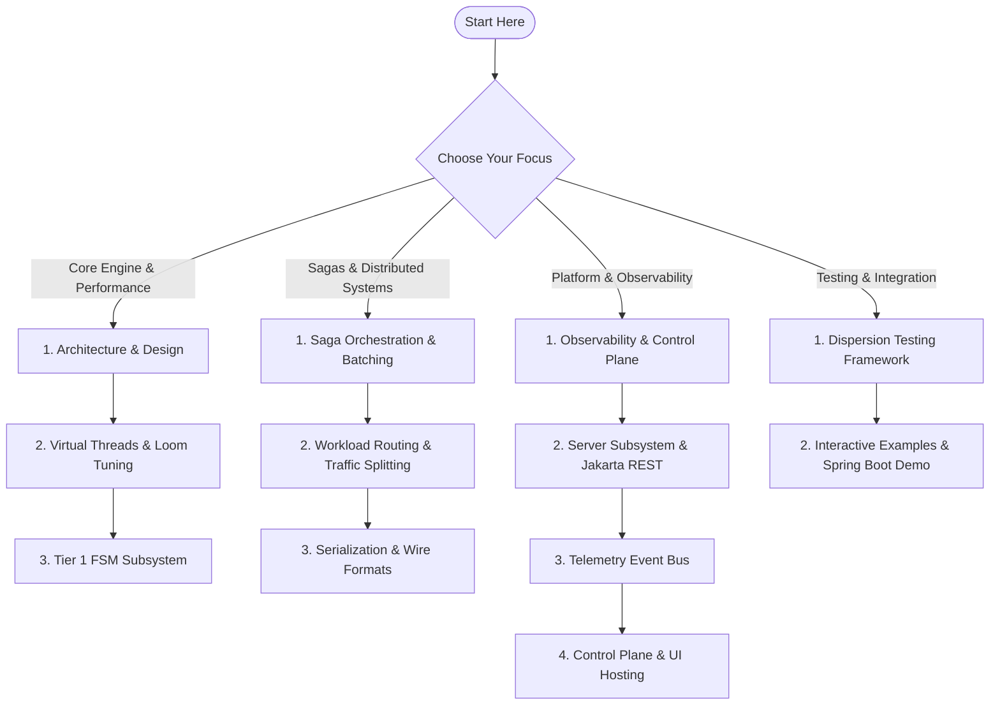

# Dispersion Documentation Hub (`docs`)

Welcome to the **Dispersion Architectural Documentation Hub**. This directory provides technical deep dives, system specifications, performance benchmarks, and deployment patterns for Dispersion — the zero-allocation, ultra-high-throughput deterministic state machine and distributed orchestration framework engineered natively for Java 25+ virtual threads.

---

## 🧭 Curated Learning Paths

Choose a guided learning path based on your role and objectives:

### Path 1: Core Engine & Low-Level Mechanics
* **Target Audience:** Systems engineers, library contributors, performance architects.
1. [**System Architecture & Hexagonal Design**](architecture-and-design.md) — Master architectural invariants, symmetrical triplet rules, and JPMS module boundaries across all 27 reactor projects.
2. [**Virtual Threads & Performance Guide**](virtual-threads-and-performance.md) — Loom continuation mechanics, carrier-thread unmounting, zero-pinning guarantees, and HotSpot C2 escape analysis.
3. [**Tier 1 FSM Subsystem Guide**](../fsm/README.md) — Dense ordinal array transition lookups (`StateMap`), zero heap allocation hot paths, and sub-microsecond atomic state transitions.

### Path 2: Distributed Workflows & Sagas
* **Target Audience:** Backend engineers building distributed microservices, payment pipelines, and multi-step transaction coordinators.
1. [**Distributed Saga Orchestration & Batching**](saga-orchestration-and-batching.md) — Turn-based execution lifecycle, safe suspension (`waitForSignal`), automated LIFO compensation rollbacks, and parallel fork-join concurrency.
2. [**Workload Routing & Traffic Splitting**](workload-routing-and-traffic-splitting.md) — Location-agnostic execution (in-process monolith vs. remote worker), Canary traffic steering, developer sandboxes, and backpressure admission.
3. [**Serialization & Wire Formats Guide**](serialization-and-wire-formats.md) — Compile-time reflection-free JSON (Avaje-Jsonb), polymorphic event discrimination schema, Apache Fury binary snapshots, and schema evolution.

### Path 3: Operations, Observability & Hosting
* **Target Audience:** Platform engineers, SREs, and DevOps integrating Dispersion into production runtimes.
1. [**Observability & Control Plane Guide**](observability-and-control-plane.md) — Operational control plane architecture, live machine topologies, dynamic Mermaid generation, and SSE streaming.
2. [**Server Subsystem Guide**](../server/README.md) — Mounting the Jakarta REST 3.1 resource and static Web UI dashboard into Spring Boot, Quarkus, or standalone Jersey.
3. [**Event Subsystem Guide**](../event/README.md) — 64k ring buffer event bus, asynchronous thread-confined event delivery, and zero-contention telemetry dispatching.
4. [**Control Plane Service & UI Hosting Design**](control-plane-service-and-ui-hosting-design.md) — Production deployment topology, dedicated control plane microservice, embedded UI hosting, and zero-CORS architecture.

### Path 4: Verification, Quality Assurance & Testing
* **Target Audience:** QA engineers, test automation developers, and application testers.
1. [**Testing Framework Guide (`dispersion-testkit`)**](../testkit/README.md) — Zero-dependency testing facade (`DispersionTestKit`), thread-safe test doubles, and deterministic test recipes.
2. [**Interactive Demo Application**](../examples/README.md) — Runnable Spring Boot 4.1 showcase app with live HTTP/SSE endpoints, multi-step sagas, embedded React UI dashboard, and burst workloads.
* 🖥️ [**`ui/README.md`**](../ui/README.md) — Web Dashboard (React 19, TanStack Router/Query, Vite, Tailwind CSS).

---

## 📚 Master Documentation Catalog

| Document | Topic & Focus Area | Subsystems Covered |
| :--- | :--- | :--- |
| [**`architecture-and-design.md`**](architecture-and-design.md) | Hexagonal decoupling, JPMS module isolation, dependency rules | All 27 Reactor Projects |
| [**`virtual-threads-and-performance.md`**](virtual-threads-and-performance.md) | Loom concurrency, carrier thread pinning avoidance, allocation profiling | `fsm`, `event`, `orchestration` |
| [**`saga-orchestration-and-batching.md`**](saga-orchestration-and-batching.md) | Sagas, compensation rollbacks, checkpoints, batch barriers | `orchestration`, `orchestration-batch` |
| [**`workload-routing-and-traffic-splitting.md`**](workload-routing-and-traffic-splitting.md) | Canary routing, developer sandboxes, worker hosts, location abstraction | `routing` |
| [**`serialization-and-wire-formats.md`**](serialization-and-wire-formats.md) | Avaje JSON codec, Apache Fury binary codec, polymorphic events | `serialization`, `event` |
| [**`observability-and-control-plane.md`**](observability-and-control-plane.md) | Control plane SPI, REST API catalog, SSE stream, UI integration | `control-plane`, `server` |
| [**`control-plane-service-and-ui-hosting-design.md`**](control-plane-service-and-ui-hosting-design.md) | Dedicated per-environment control plane, embedded UI hosting, zero-CORS, cluster query engine | `server-jakarta`, `control-plane`, `ui` |

---

## 🏛️ Subsystem README Reference Index

Every top-level subsystem contains an authoritative, self-contained `README.md` covering its module structure, code examples, and Maven dependencies:

* ⚡ [**`fsm/README.md`**](../fsm/README.md) — Tier 1 Atomic State Machine Engine.
* 🔄 [**`orchestration/README.md`**](../orchestration/README.md) — Tier 2 Turn-Based Distributed Sagas.
* 📦 [**`orchestration/batch/README.md`**](../orchestration/batch/README.md) — Tier 3 Concurrent Batch Collection Processing.
* 🚦 [**`routing/README.md`**](../routing/README.md) — Location-Agnostic Workload Routing & Canary Policies.
* 📡 [**`event/README.md`**](../event/README.md) — Telemetry Record Hierarchy & Ring Buffer Event Bus.
* 🔭 [**`control-plane/README.md`**](../control-plane/README.md) — Unified Control Plane SPI & Topologies.
* 💾 [**`serialization/README.md`**](../serialization/README.md) — Binary (Fury) and JSON (Avaje) Serialization.
* 🌐 [**`server/README.md`**](../server/README.md) — Jakarta REST 3.1 Resource & Embedded UI Dashboard Hosting.
* 🧪 [**`testkit/README.md`**](../testkit/README.md) — Unified Test Double Facade (`DispersionTestKit`).
* 💡 [**`examples/README.md`**](../examples/README.md) — Spring Boot 4.1 runnable showcase and test recipes.
* 🖥️ [**`ui/README.md`**](../ui/README.md) — Web Dashboard (React 19, TanStack Router/Query, Vite, Tailwind CSS).

---

## 🔒 Foundational Invariants Cheat Sheet

When contributing or extending Dispersion, always verify that your code upholds these repository invariants:

1. **Symmetrical Triplet Decoupling:** Every functional subsystem is decomposed into pure contract (`*-api`), virtual-thread implementation (`*-core`), and in-memory test doubles (`*-test`).
2. **Zero Split-Package Collisions:** Every module owns a distinct, non-overlapping Java package namespace.
3. **Zero Bytecode-Manipulating Mocks:** Never import Mockito, ByteBuddy, or PowerMock. Use first-class test doubles from [`dispersion-testkit`](../testkit/README.md).
4. **No Carrier-Thread Pinning:** Hot execution paths must never use `synchronized` blocks. Use thread confinement, `ReentrantLock`, or `Semaphore`.
5. **Reflection-Free Execution:** Hot paths and serialization codecs must avoid reflective runtime lookups. Pre-compile graphs into ordinal arrays and generate serialization adapters at compile time.
