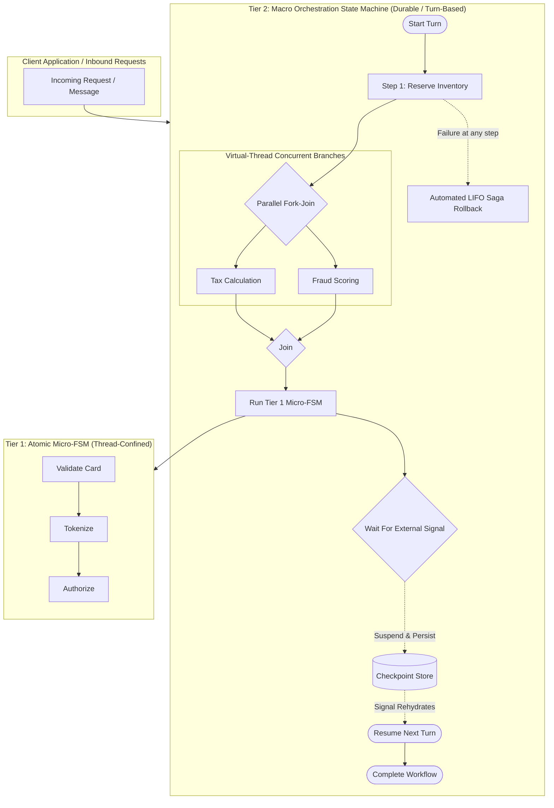
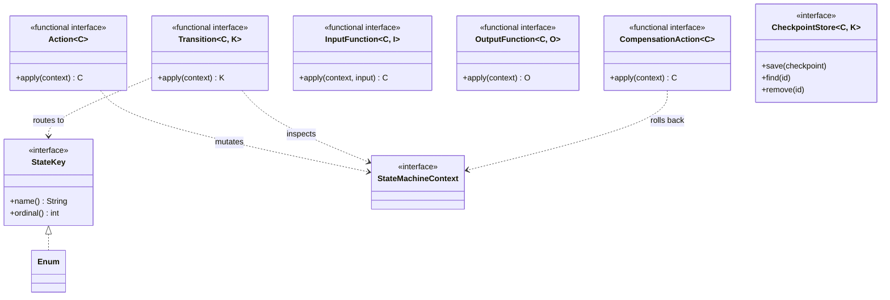
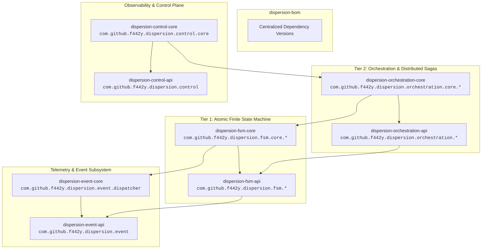

# Architecture & Core Concepts

Dispersion is a high-throughput, zero-synchronization finite state machine and distributed Saga orchestration engine engineered specifically for **Java 25+ Virtual Threads** (Project Loom).

Traditional workflow engines often incur substantial overhead: heavy thread-pool contention, distributed locks, database ping-pong per state transition, or reflection-heavy runtime proxies. Dispersion eliminates these bottlenecks through a modern architectural philosophy rooted in **thread confinement**, **sealed type hierarchies**, a **two-tiered execution model**, and a **fine-grained modular decomposition**.

---

## 1. The Two-Tiered Architecture

Dispersion separates state execution into two specialized, complementary tiers:



### Architectural Comparison

| Dimension | Tier 1: Atomic (Micro) State Machine | Tier 2: Orchestration (Macro) State Machine |
| :--- | :--- | :--- |
| **Primary Module** | `dispersion-fsm-api` / `dispersion-fsm-core` | `dispersion-orchestration-api` / `dispersion-orchestration-core` |
| **Execution Scope** | Single virtual thread, synchronous pipeline | Asynchronous, turn-based coordinator |
| **State Mutations** | Direct, thread-confined, lock-free POJO | Checkpointed snapshots & persistent rehydration |
| **Lifecycle** | High-throughput sequential graph steps | Long-lived, suspendable via external signals (`waitForSignal`) |
| **Persistence** | In-memory only (ephemeral) | Pluggable `CheckpointStore` (SQL, Key-Value, In-Memory) |
| **Distributed Sagas** | Fast-fail with fallback diversion states | **Automated LIFO compensation rollbacks** across turns |
| **Concurrency** | Single-threaded state traversal | **Concurrent parallel fork-join**, batch synchronization barriers |
| **Messaging** | In-memory | **Broker-Agnostic SPI** (Kafka, RabbitMQ, SQS, In-Memory) |
| **Primary Use Cases** | Low-latency protocol parsing, validation rules, localized logic | Distributed transactions, multi-service sagas, human approvals |

---

## 2. Fundamental Building Blocks

Every Dispersion state machine is built from a cohesive set of type-safe primitives:



### Concepts Glossary

| Concept | Module | Purpose & Responsibilities |
| :--- | :--- | :--- |
| **`StateKey`** | `dispersion-fsm-api` | An interface implemented by domain enums representing graph nodes. Prevents magic strings and enforces compile-time type safety. |
| **`StateMachineContext`** | `dispersion-fsm-api` | A mutable POJO/DTO holding accumulated business data. Thread-confined during each turn, allowing lock-free mutations. |
| **`Action<CONTEXT>`** | `dispersion-fsm-api` | Pure business logic `(ctx) -> ctx` executed upon entering a state. |
| **`Transition<CONTEXT, STATE_KEY>`** | `dispersion-fsm-api` | Routing logic `(ctx) -> nextStateKey` that evaluates context to select the next node. |
| **`InputFunction<C, I>`** | `dispersion-fsm-api` | Maps inbound parameters into a fresh context instance before the initial state executes. |
| **`OutputFunction<C, O>`** | `dispersion-fsm-api` | Extracts or formats the final return payload from context after reaching a terminal state. |
| **`CompensationAction<C>`** | `dispersion-orchestration-api` | Reversal logic `(ctx) -> ctx` executed in reverse chronological order (LIFO) if a downstream step fails. |
| **`SagaCommand<C>`** | `dispersion-orchestration-api` | A unified interface coupling forward action (`execute`) with compensating rollback (`compensate`). |
| **`CheckpointStore`** | `dispersion-orchestration-api` | Persistence abstraction for snapshotting suspended workflow state to disk/database. |
| **`SignalCommand`** | `dispersion-orchestration-api` | Domain payload carrying a `correlationKey()` for routing external webhooks to paused workflows. |
| **`CommandEnvelope<T>`** | `dispersion-orchestration-api` | Immutable record `(commandId, timestamp, command)` delivering guaranteed network deduplication. |
| **`ExecutionEvent`** | `dispersion-event-api` | Sealed hierarchy of 12 immutable telemetry records capturing every engine milestone. |
| **`ControlPlane`** | `dispersion-control-api` | Centralized in-memory registry and inspection SPI for topology discovery, live summaries, and signal routing. |

---

## 3. Thread Confinement & Concurrency Guarantees

Traditional multi-threaded frameworks rely on locks (`synchronized`, `ReentrantLock`), concurrent data structures (`ConcurrentHashMap`), or atomic references (`AtomicReference`). These introduce synchronization barriers, CPU cache bouncing, and memory stalls.

Dispersion takes an alternative approach inspired by modern hardware architectures:

1. **Virtual Thread Confinement**: Each workflow turn executes exclusively on a single virtual thread (`Thread.ofVirtual()`).
2. **Lock-Free Context Mutations**: Because the `StateMachineContext` is confined to one virtual thread for the duration of a turn, actions mutate context fields directly with zero synchronization overhead.
3. **Safe Inter-Turn Persistence**: When an Orchestration workflow suspends at a `.waitForSignal(...)` state, the context is safely captured into an immutable `OrchestrationCheckpoint` and saved via `CheckpointStore`. The virtual thread is freed immediately.
4. **Structured Parallelism**: When executing parallel branches via `.parallel()`, Dispersion forks isolated child tasks and blocks until all branches join or any branch fails, immediately cancelling sibling tasks and compensating completed branches.

---

## 4. Execution Lifecycles

### Atomic (Micro) Lifecycle
```
dispatchSync(input)
  │
  ├─► [InputFunction] -> initialize context
  ├─► [Initial State Action]
  ├─► [Transition Evaluation] -> next state
  ├─► ... loop until Terminal State ...
  ├─► [OutputFunction] -> extract result
  └─► Return O to caller
```

### Orchestration (Macro) Turn Lifecycle
```
dispatchTurnSync(turnId, input)
  │
  ├─► Turn 1:
  │     ├─► [InputFunction]
  │     ├─► [Action 1] -> Record Compensation in Saga Stack
  │     ├─► [Transition] -> Next State
  │     └─► Hit [waitForSignal] -> Snapshot checkpoint -> SUSPEND (release thread)
  │
  ├─► External Event arrives hours/days later (correlated by Key)
  │
  └─► Turn 2:
        ├─► Rehydrate context from CheckpointStore
        ├─► [Process Inbound Signal Payload]
        ├─► [Action 2] -> Record Compensation in Saga Stack
        ├─► Hit Terminal State -> Delete Checkpoint -> COMPLETE
        └─► [OutputFunction] -> Return result
```

---

## 5. Modular Topology & JPMS Package Isolation

Dispersion is partitioned into fine-grained topic modules with a symmetrical API/Core split. Each module maintains isolated package namespaces to ensure **zero split-package collisions** under the Java 25 Platform Module System (JPMS):



| Module | Automatic Module Name | Primary Responsibilities |
| :--- | :--- | :--- |
| `dispersion-bom` | `com.github.f442y.dispersion.bom` | Centralized BOM for dependency version alignment. |
| `dispersion-event-api` | `com.github.f442y.dispersion.event.api` | Sealed `ExecutionEvent` records and `ExecutionEventListener` SPI. |
| `dispersion-event-core` | `com.github.f442y.dispersion.event.core` | `AsyncExecutionEventDispatcher` (lock-free virtual-thread ring buffer). |
| `dispersion-fsm-api` | `com.github.f442y.dispersion.fsm.api` | `StateMachine`, `StateMachineExecutor`, `StateMachineContext`, `StateKey`, sealed exceptions. |
| `dispersion-fsm-core` | `com.github.f442y.dispersion.fsm.core` | `AtomicStateMachineBuilder`, `AtomicStateMachineExecutor`, `AdmissionController`. |
| `dispersion-orchestration-api` | `com.github.f442y.dispersion.orchestration.api` | `CheckpointStore`, `SagaCommand`, `CommandEnvelope`, messaging & batching SPIs. |
| `dispersion-orchestration-core` | `com.github.f442y.dispersion.orchestration.core` | `OrchestrationStateMachineBuilder`, `OrchestrationStepDriver`, parallel branches, batch runner. |
| `dispersion-control-api` | `com.github.f442y.dispersion.control.api` | `ControlPlane` SPI, `MachineDescriptor`, `ExecutionSummary`, `SignalDeliveryResult`. |
| `dispersion-control-core` | `com.github.f442y.dispersion.control.core` | `DefaultControlPlane` in-memory registry, event history replay, and signal routing. |
| `dispersion-examples` | `com.github.f442y.dispersion.examples` | Reference test suites for 500-thread pipelines and distributed order sagas. |

---

## Next Steps

- Explore **[Tier 1: Atomic State Machines](tier-1-atomic-machines.md)** to build high-performance micro-pipelines.
- Read **[Tier 2: Orchestration & Distributed Sagas](tier-2-orchestration-sagas.md)** for long-running workflows, suspensions, and rollbacks.
- Learn about **[Distributed Patterns & Messaging](distributed-messaging-and-batching.md)** for idempotency and batch barriers.
- Review **[Observability & Control Plane](observability-and-control-plane.md)** for real-time monitoring and React UI integration.
