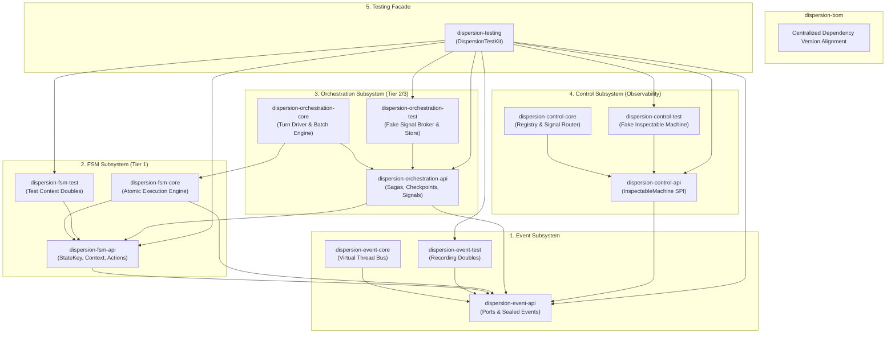
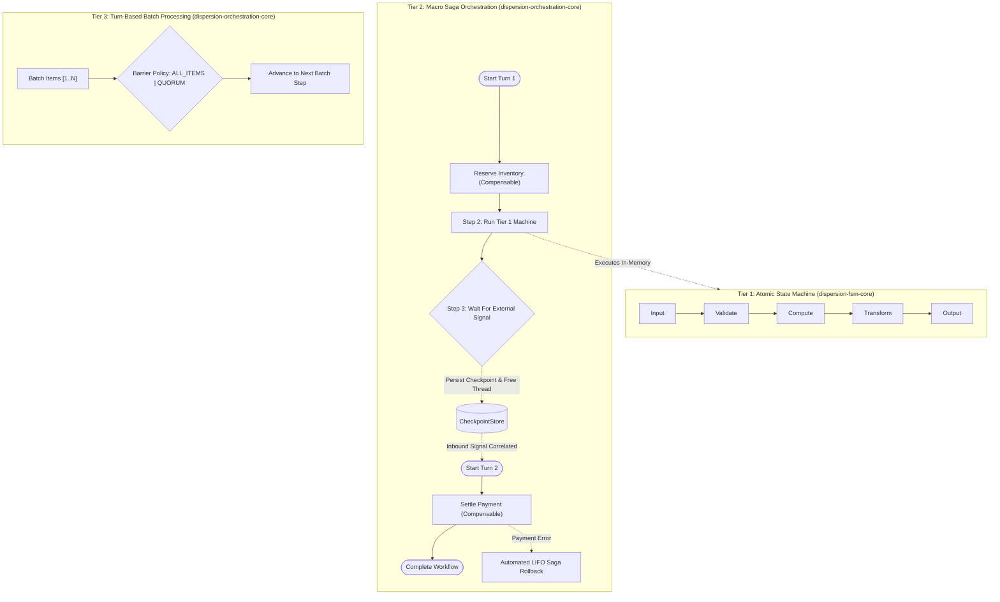

# Architecture & Hexagonal Design

Dispersion is a high-throughput, zero-synchronization finite state machine and distributed Saga orchestration engine engineered specifically for **Java 25+ Virtual Threads** (Project Loom).

Traditional workflow engines (BPMN frameworks, distributed orchestrators, reflection-heavy state libraries) incur severe performance and operational penalties:
* **Thread Contention:** Fixed OS thread pools choke under burst loads or blocked I/O.
* **Database Ping-Pong:** Persisting state to relational databases on every micro-transition degrades throughput to hundreds of ops/sec.
* **Synchronization Bottlenecks:** Pervasive locking (`synchronized`, `ReentrantLock`, `AtomicReference`) triggers cache thrashing and memory barriers across CPU cores.
* **Tight Architectural Coupling:** Monolithic designs interlock observability, persistence, and business execution.

Dispersion resolves these challenges through a unified design rooted in **thread confinement**, **pre-compiled ordinal array state graphs**, **hexagonal SPI boundaries**, and a **multi-tiered execution model**.

---

## 1. Hexagonal Decoupling & Module Symmetrical Topology

Dispersion enforces strict architectural separation using the **Ports-and-Adapters (Hexagonal)** pattern across 16 Maven modules:



### Decoupling Rules & Architectural Invariants

1. **`*-api` Modules Are Pure Contracts:**
   Contain only interfaces, sealed records, and domain exceptions. They depend exclusively on standard Java and JSpecify annotations—never on third-party frameworks or runtime engines.
2. **`*-core` Modules Contain Runtimes:**
   Implement the corresponding API. A core module **never depends on other core modules** unless architecturally hierarchical (`orchestration-core` relies on `fsm-core` to embed atomic child machines).
3. **`*-test` Modules Are Zero-Dependency Doubles:**
   Contain deterministic fakes and recorders. A test companion module **never depends on `*-core`**, ensuring test doubles cannot accidentally rely on engine internals.
4. **Control Plane Inversion via `InspectableMachine`:**
   `dispersion-control-core` has **zero compile-time dependencies** on `fsm-core` or `orchestration-core`. Executors implement the `InspectableMachine` SPI and adapt themselves via `.asInspectableMachine()`, allowing the control plane to observe any engine generically.

---

## 2. The Multi-Tier Execution Model

Dispersion partitions state machine execution into three complementary tiers:



### Architectural Dimension Matrix

| Dimension | Tier 1: Atomic (Micro) Machine | Tier 2: Orchestration (Macro) Saga | Tier 3: Turn-Based Batching |
| :--- | :--- | :--- | :--- |
| **Primary Module** | `dispersion-fsm-core` | `dispersion-orchestration-core` | `dispersion-orchestration-core` |
| **Execution Latency** | Sub-microsecond (< 1 μs) | Turn-based (< 50 μs per in-memory step) | Parallel items with barrier sync |
| **Thread Model** | Single Virtual Thread (confined) | Virtual Thread per turn | Virtual Thread per batch item |
| **State Mutability** | Direct POJO mutations (lock-free) | Checkpoint snapshots at turn boundaries | Item-level isolated context |
| **Lifecycle** | Ephemeral, in-memory only | Long-lived, suspendable (`waitForCommand`) | Batch-synchronized turns |
| **Failure Recovery** | Fast-fail terminal diversion | **Automated LIFO Saga rollbacks** | Item-level error isolation |
| **Concurrency** | Single-threaded sequential graph | Parallel fork-join branches (`.parallel()`) | Concurrent item processing |
| **Ideal Use Cases** | Protocol parsing, trading validation, rules | Distributed sagas, multi-service transactions | Bulk ingestion, payroll runs, order batches |

---

## 3. Concurrency Guarantees & Thread Confinement

Traditional multi-threaded frameworks protect shared state through synchronization primitives:
* Mutexes (`synchronized`, `ReentrantLock`)
* Atomic wrappers (`AtomicReference`, `AtomicInteger`)
* Concurrent collections (`ConcurrentHashMap`)

These primitives introduce CPU cache-line bouncing, memory bus lock signals, and context-switch latencies.

Dispersion relies instead on **Thread Confinement**:

```
                       ┌─────────────────────────────────────────────────────────┐
                       │                   Virtual Thread #42                    │
                       │                                                         │
  Inbound Request ────►│  ┌───────────────────────────────────────────────────┐  │
                       │  │      Domain Context (Mutable Lock-Free POJO)      │  │
                       │  │       • orderId = "ORD-101"                       │  │
                       │  │       • balance = 450.00                          │  │
                       │  │       • status  = VALIDATED                       │  │
                       │  └───────────────────────────────────────────────────┘  │
                       │         │                     ▲                         │
                       │         ▼                     │                         │
                       │  ┌──────────────┐      ┌──────────────┐                 │
                       │  │   Action 1   │─────►│   Action 2   │                 │
                       │  └──────────────┘      └──────────────┘                 │
                       └─────────────────────────────────────────────────────────┘
                                   Zero Locks • Zero Volatiles
```

1. **Confined Mutability:** For the duration of a turn, the `StateMachineContext` is accessed exclusively by a single Virtual Thread. Actions mutate context fields directly.
2. **Deterministic Checkpoint Snapshots:** When an orchestration machine suspends at `.waitForCommand(...)`, Dispersion captures a deep/serialized snapshot into an `OrchestrationCheckpoint`. This snapshot is saved to `CheckpointStore`, and the virtual thread terminates.
3. **Structured Parallelism:** When executing `.parallel()` branches, Dispersion creates distinct child contexts for each concurrent branch. The parent virtual thread joins child threads deterministically before reconciling state back into the primary context.

---

## 4. JPMS Module Isolation & Zero Split-Packages

Dispersion is built strictly for the Java Platform Module System (JPMS). Every module owns an isolated package namespace, guaranteeing **zero split-package collisions**:

| Module Artifact | JPMS Automatic Module Name | Package Namespace Root |
| :--- | :--- | :--- |
| `dispersion-bom` | `com.github.f442y.dispersion.bom` | *N/A (BOM POM)* |
| `dispersion-event-api` | `com.github.f442y.dispersion.event.api` | `com.github.f442y.dispersion.event` |
| `dispersion-event-core` | `com.github.f442y.dispersion.event.core` | `com.github.f442y.dispersion.event.bus`, `com.github.f442y.dispersion.event.dispatcher` |
| `dispersion-event-test` | `com.github.f442y.dispersion.event.test` | `com.github.f442y.dispersion.event.test` |
| `dispersion-fsm-api` | `com.github.f442y.dispersion.fsm.api` | `com.github.f442y.dispersion.fsm` |
| `dispersion-fsm-core` | `com.github.f442y.dispersion.fsm.core` | `com.github.f442y.dispersion.fsm.core` |
| `dispersion-fsm-test` | `com.github.f442y.dispersion.fsm.test` | `com.github.f442y.dispersion.fsm.test` |
| `dispersion-orchestration-api` | `com.github.f442y.dispersion.orchestration.api` | `com.github.f442y.dispersion.orchestration` |
| `dispersion-orchestration-core` | `com.github.f442y.dispersion.orchestration.core` | `com.github.f442y.dispersion.orchestration.core` |
| `dispersion-orchestration-test` | `com.github.f442y.dispersion.orchestration.test` | `com.github.f442y.dispersion.orchestration.test` |
| `dispersion-control-api` | `com.github.f442y.dispersion.control.api` | `com.github.f442y.dispersion.control` |
| `dispersion-control-core` | `com.github.f442y.dispersion.control.core` | `com.github.f442y.dispersion.control.core` |
| `dispersion-control-test` | `com.github.f442y.dispersion.control.test` | `com.github.f442y.dispersion.control.test` |
| `dispersion-testing` | `com.github.f442y.dispersion.testing` | `com.github.f442y.dispersion.testing` |
| `dispersion-examples` | `com.github.f442y.dispersion.examples` | `com.github.f442y.dispersion.examples` |

---

## Next Architectural Deep Dives

* ⚡ [**Virtual Threads & Performance Guide**](virtual-threads-and-performance.md) — Carrier thread scheduling, unmounting mechanics, zero-pinning guarantees, and JVM escape analysis.
* 🔄 [**Saga Orchestration & Batch Processing**](saga-orchestration-and-batching.md) — Turn-based lifecycle, LIFO compensation unwind, and batch barrier policies.
* 🔭 [**Observability & Control Plane**](observability-and-control-plane.md) — Telemetry streaming, $O(1)$ dual-pool memory topology, and React UI integration.
