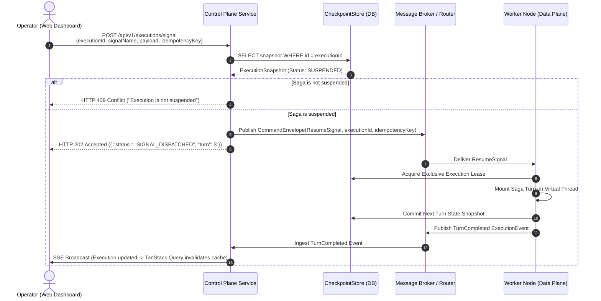

# Architectural Design Proposal: Dedicated Environment Control Plane Service & Embedded UI Hosting

> **Document Status:** Proposed Architecture & Detailed Design Specification
> **Author:** Dispersion Architecture Working Group
> **Target Release:** Dispersion 0.2.0 (Phase 4 Milestone)
> **Primary Module Impacts:** `dispersion-server-standalone`, `dispersion-control-plane-core`, `dispersion-control-plane-api`, `ui/`
> **Repository Baseline:** Java 25 Virtual Threads, Helidon SE 4.x Níma, Node.js 24, Vite 8, React 19, Avaje JSON, Fury Binary.

---

## 1. Executive Summary & Problem Formulation

### 1.1 The Operational Challenge
In distributed state engine and saga orchestration architectures, there are two distinct traffic profiles:
1. **Data Plane:** Ultra-high throughput, sub-microsecond or turn-based command execution across worker nodes running state machines, sagas, and parallel batch collections.
2. **Control Plane:** Human operators, platform engineers, and automated SRE tooling monitoring live workflows, inspecting audit timelines, visualizing state machine graphs, investigating suspended checkpoints, and dispatching manual or webhook signals.

A critical design question emerges: **How should the Web Dashboard ([`ui/`](../ui/README.md)) connect to and interact with the orchestration fleet in production environments?**

### 1.2 Evaluation of Candidate Topologies

```
Topology A: Direct Browser-to-Worker (P2P) [REJECTED]
[Browser / UI] ──❌──> [Worker Pod 1 (IP: 10.0.1.24)]
               ──❌──> [Worker Pod 2 (IP: 10.0.2.89)]
               ──❌──> [Worker Pod N (...)]

Topology B: External CDN + Split Backend Ingress [COMPLEX / OPTIONAL]
[Browser / UI] ──> [Cloudflare CDN / S3 Bucket]
       │
       └── CORS ──> [API Gateway] ──> [Control Plane Service]

Topology C: Dedicated Control Plane Service with Embedded UI Hosting [RECOMMENDED]
[Browser / UI] ── Same-Origin (Port 8080/443) ──> [Dispersion Control Plane Service (Helidon SE)]
                                                         │
                                    ┌────────────────────┴────────────────────┐
                                    ▼                                         ▼
                        [Shared CheckpointStore]                  [Telemetry Bus / Workers]
```

### 1.3 Why Direct Browser-to-Worker Fails in Production
* **VPC Ingress & Ephemeral IP Addresses:** In containerized Kubernetes/ECS environments, worker pods run in private VPC subnets with dynamically changing pod IPs and no public ingress. A browser cannot route to internal pod IPs.
* **Split-Brain Audit Timelines:** Sagas move across nodes. Turn 1 may execute on Worker A, suspend waiting for external payment, and resume hours later on Worker B. No single worker node holds the global timeline.
* **Cold Checkpoint Invisibility:** When a saga suspends at `waitForSignal`, it unmounts from virtual threads and is saved into the durable `CheckpointStore`. It is **not in memory on any worker**. A browser polling worker nodes will fail to find suspended executions.
* **SSE Connection Thrashing & CORS Sprawl:** Establishing and maintaining persistent Server-Sent Events (SSE) connections across $N$ dynamically autoscaling worker nodes leads to connection storms, complex pre-flight (`OPTIONS`) handshakes, and CORS security risks.

### 1.4 The Proposed Solution
Deploy a **Dedicated Dispersion Control Plane Service** per environment (`control-plane-staging`, `control-plane-prod`) powered by `dispersion-server-standalone` (Helidon SE 4.x Níma on Java 25 virtual threads). The standalone server **natively embeds and hosts the compiled React 19 / Vite UI bundle**, providing a turnkey, zero-CORS, single-container operational console for each deployment environment.

---

## 2. End-to-End System Architecture

```mermaid
graph TD
    subgraph BrowserClient["Operator Workplace / Browser"]
        BROWSER["Web Dashboard<br/>(React 19, TanStack Router, Mermaid.js)"]
    end

    subgraph EnvPerimeter["Environment Perimeter (e.g. Staging / Production VPC)"]
        INGRESS["TLS Ingress / Load Balancer<br/><code>https://control-plane.prod.internal</code>"]

        subgraph ControlPlaneService["Dedicated Control Plane Service (dispersion-server-standalone)"]
            STATIC_ROUTER["Helidon SE Níma WebServer (Port 8080)<br/>Virtual-Thread Native Handler"]
            UI_ASSETS["Embedded UI Assets (ui/dist)<br/>StaticContentSupport + SPA Fallback + ETag Cache"]
            REST_API["ControlPlaneApiHandler<br/>REST Endpoints (/api/v1/*)"]
            CONFIG_EP["Dynamic Environment Config<br/>GET /api/v1/config"]
            SSE_HUB["SseEventStreamHandler<br/>Aggregated Telemetry Fanout"]
            QUERY_ENG["Store-Backed Query Engine<br/>(ReadOnlyCheckpointStore SPI)"]
            SIGNAL_INGRESS["External Signal Ingress Router<br/>(Idempotent Command Dispatcher)"]
            MEM_POOL["Dual-Pool Ring Buffers<br/>(64k In-Memory Recent Telemetry)"]
        end

        subgraph SharedInfra["Shared Environmental Infrastructure"]
            STORE[("Shared Durable CheckpointStore<br/>(PostgreSQL / JDBC / Redis)")]
            BROKER["Telemetry & Signal Broker<br/>(Kafka / NATS / RabbitMQ / RingBuffer)"]
        end

        subgraph WorkerFleet["Distributed Worker Fleet (Data Plane)"]
            W1["Worker Node 1<br/>(OrderSaga Turn 1)"]
            W2["Worker Node 2<br/>(PaymentFSM Worker)"]
            W3["Worker Node 3<br/>(InventoryBatch Engine)"]
        end
    end

    BROWSER -->|HTTPS GET / (HTML/JS/CSS)| INGRESS
    BROWSER -->|HTTPS GET /api/v1/* (REST)| INGRESS
    BROWSER -->|HTTPS GET /api/v1/events/stream (SSE)| INGRESS
    BROWSER -->|HTTPS POST /api/v1/executions/signal| INGRESS

    INGRESS --> STATIC_ROUTER
    STATIC_ROUTER --> UI_ASSETS
    STATIC_ROUTER --> REST_API
    STATIC_ROUTER --> CONFIG_EP
    STATIC_ROUTER --> SSE_HUB

    REST_API --> QUERY_ENG
    SSE_HUB --> MEM_POOL
    SIGNAL_INGRESS --> BROKER

    QUERY_ENG <-->|Inspect Suspended Workflows| STORE
    BROKER -.->|Ingest Events| MEM_POOL

    W1 & W2 & W3 -.->|Persist Checkpoints on Suspension| STORE
    W1 & W2 & W3 -.->|Publish Polymorphic ExecutionEvents| BROKER
    BROKER -.->|Deliver Resume Commands| W1 & W2 & W3
```

---

## 3. Detailed Component Designs

### 3.1 Component 1: Embedded UI Hosting in Helidon SE Níma

#### 3.1.1 Helidon Virtual-Thread Static Routing Architecture
Helidon SE 4.x Níma provides lightweight, non-blocking HTTP file serving directly on virtual threads via `StaticContentSupport`. Unlike servlet containers, it does not allocate worker thread pools or buffer entire files in heap memory.

```
Incoming HTTP Request
        │
        ▼
Is path prefixed with /api/v1/* ?
 ├── YES ──> Dispatch to REST/SSE Route Handlers
 └── NO  ──> Check if static resource exists in classpath (/web/{path})
              ├── YES ──> Check If-None-Match ETag:
              │             ├── Matches ──> Return 304 Not Modified
              │             └── Differs ──> Stream file with content-hashed immutable cache
              └── NO  ──> SPA Fallback: Stream /web/index.html (HTTP 200, no-cache)
```

#### 3.1.2 Production Static Routing Handler with ETag & Fallback
In `dispersion-server-standalone`, the `StandaloneControlPlaneServer` route registration incorporates resource verification, ETag caching, and single-page routing:

```java
package com.github.f442y.dispersion.server.standalone;

import io.helidon.http.HeaderNames;
import io.helidon.http.HttpMediaTypes;
import io.helidon.http.Status;
import io.helidon.webserver.http.HttpRules;
import io.helidon.webserver.http.HttpService;
import io.helidon.webserver.http.ServerRequest;
import io.helidon.webserver.http.ServerResponse;
import io.helidon.webserver.staticcontent.StaticContentSupport;

import java.io.InputStream;
import java.nio.charset.StandardCharsets;
import java.security.MessageDigest;
import java.util.HexFormat;

/**
 * Serves embedded Web Dashboard assets with Single-Page Application (SPA) fallback,
 * virtual-thread non-blocking file streaming, and ETag revalidation.
 */
public final class WebDashboardStaticService implements HttpService {

    private static final String CLASSPATH_PREFIX = "web";
    private static final String INDEX_HTML_PATH = "web/index.html";

    private final StaticContentSupport staticContent;
    private final String indexHtmlEtag;
    private final byte[] indexHtmlBytes;

    public WebDashboardStaticService() {
        this.staticContent = StaticContentSupport.builder(CLASSPATH_PREFIX)
            .welcomeFileName("index.html")
            .build();

        // Precompute ETag and byte array for index.html at startup to avoid repeated disk reads
        byte[] bytes = new byte[0];
        String etag = "\"0\"";
        try (InputStream is = getClass().getClassLoader().getResourceAsStream(INDEX_HTML_PATH)) {
            if (is != null) {
                bytes = is.readAllBytes();
                MessageDigest md = MessageDigest.getInstance("SHA-256");
                etag = "\"" + HexFormat.of().formatHex(md.digest(bytes)).substring(0, 16) + "\"";
            }
        } catch (Exception ignored) {}
        this.indexHtmlBytes = bytes;
        this.indexHtmlEtag = etag;
    }

    @Override
    public void routing(HttpRules rules) {
        // 1. Mount immutable assets with long-term caching
        rules.register("/assets", StaticContentSupport.builder(CLASSPATH_PREFIX + "/assets").build());
        rules.register("/", staticContent);

        // 2. SPA Catch-All Fallback Handler:
        // Any unmatched GET route that is NOT under /api/* returns index.html for TanStack Router
        rules.get("/*", this::handleSpaFallback);
    }

    private void handleSpaFallback(ServerRequest req, ServerResponse res) {
        String path = req.path().path();

        // Never intercept API routes with SPA fallback (must 404 cleanly)
        if (path.startsWith("/api/")) {
            res.status(Status.NOT_FOUND_404)
               .headers().contentType(HttpMediaTypes.APPLICATION_JSON);
            res.send("{\"error\":\"Not Found\",\"path\":\"" + path + "\"}");
            return;
        }

        if (indexHtmlBytes.length == 0) {
            res.status(Status.NOT_FOUND_404)
               .send("Web Dashboard static bundle not present on classpath (/web/index.html).");
            return;
        }

        // Conditional ETag check
        var clientEtag = req.headers().findFirst(HeaderNames.IF_NONE_MATCH);
        if (clientEtag.isPresent() && clientEtag.get().equals(indexHtmlEtag)) {
            res.status(Status.NOT_MODIFIED_304).send();
            return;
        }

        res.status(Status.OK_200);
        res.headers().contentType(HttpMediaTypes.TEXT_HTML);
        res.headers().set(HeaderNames.ETAG, indexHtmlEtag);
        res.headers().set("Cache-Control", "no-cache, no-store, must-revalidate");
        res.send(indexHtmlBytes);
    }
}
```

---

### 3.2 Component 2: Dedicated Control Plane Service Functions

The dedicated control plane service provides four foundational capabilities that worker nodes cannot satisfy individually:

```
┌────────────────────────────────────────────────────────────────────────┐
│            Dispersion Dedicated Control Plane Microservice             │
│                                                                        │
│   ┌───────────────────────────┐     ┌──────────────────────────────┐   │
│   │ 1. Checkpoint Discovery   │     │ 2. Telemetry Aggregation     │   │
│   │ • Queries CheckpointStore │     │ • RingBuffer + Broker Ingest │   │
│   │ • Finds Cold Suspended    │     │ • SSE Streaming Fanout       │   │
│   │ • Timeline Reconstruction │     │ • Query Invalidation Events  │   │
│   └───────────────────────────┘     └──────────────────────────────┘   │
│   ┌───────────────────────────┐     ┌──────────────────────────────┐   │
│   │ 3. Signal Router & Ingress│     │ 4. Node & Topology Catalog   │   │
│   │ • POST /executions/signal │     │ • Aggregates Machine Graphs  │   │
│   │ • Worker Resolution       │     │ • Dynamic Mermaid Generation │   │
│   │ • Idempotent Dispatch     │     │ • Health & Uptime Metrics    │   │
│   └───────────────────────────┘     └──────────────────────────────┘   │
└────────────────────────────────────────────────────────────────────────┘
```

#### 3.2.1 Cluster-Wide Checkpoint Discovery (`ReadOnlyCheckpointStore` SPI)
When sagas suspend on worker nodes, they save their state snapshot to the `CheckpointStore` and free their virtual threads.

The Control Plane Service defines a non-blocking `ReadOnlyCheckpointStore` interface:

```java
package com.github.f442y.dispersion.control.store;

import java.time.Instant;
import java.util.List;
import java.util.Optional;

/**
 * Read-only SPI used by the Control Plane to query suspended and historic executions
 * directly from persistent storage without waking up worker JVMs.
 */
public interface ReadOnlyCheckpointStore {

    record ExecutionQuery(
        Optional<String> status,          // e.g. SUSPENDED, ACTIVE, COMPENSATED, COMPLETED
        Optional<String> machineName,     // Filter by state machine / saga definition
        Optional<String> correlationKey,  // Business lookup (e.g. order-id, invoice-ref)
        Instant since,                    // Earliest modified timestamp
        int limit,                        // Page size (1 to 100)
        Optional<String> cursor           // Keyset pagination cursor
    ) {}

    record PagedResult<T>(List<T> items, Optional<String> nextCursor, long totalEstimated) {}

    PagedResult<ExecutionSummaryRecord> searchExecutions(ExecutionQuery query);

    Optional<ExecutionSnapshotRecord> loadExecutionSnapshot(String executionId);

    List<TurnAuditRecord> fetchExecutionTimeline(String executionId);
}
```

* **Cold Inspection:** When the operator navigates to `/executions?status=SUSPENDED`, the Control Plane does **not** scan worker JVMs. Instead, it queries the shared `CheckpointStore` directly using cursor-based pagination.
* **Timeline Reconstruction:** When viewing an execution's detail drawer, the control plane stitches together in-memory active turn events with persisted checkpoint audit logs to present a seamless timeline from inception to suspension.

#### 3.2.2 Global Telemetry Aggregation & Virtual-Thread SSE Fanout
Worker nodes emit polymorphic `ExecutionEvent` records over a fast transport (in-process ring buffer for monoliths, or distributed messaging such as Kafka/NATS for clustered setups).
* **Dual-Pool In-Memory Buffer:** The Control Plane Service maintains an $O(1)$ ring buffer of the most recent 64,000 events across all machines.
* **Non-Blocking SSE Streaming:** The `/api/v1/events/stream` handler registers connected browser clients. When events arrive, they are serialized using compile-time reflection-free Avaje JSON codecs and broadcasted concurrently across virtual threads.
* **Heartbeat Keep-Alive:** Helidon SE emits a heartbeat comment (`: ping\n\n`) every 15 seconds to prevent corporate firewalls and ingress proxies (ALB/Nginx) from terminating idle SSE connections.

#### 3.2.3 Centralized External Signal Ingress & Dispatch Sequence



---

## 4. Build, Packaging & Container Pipeline (Node 24 + Java 25)

To deliver a turnkey single-binary deployment without requiring developers to manually build frontend and backend projects separately, the build lifecycle is unified.

### 4.1 Maven Reactor Integration
We use `frontend-maven-plugin` within `server/standalone/pom.xml` configured to bind to Node 24:

```xml
<plugin>
    <groupId>com.github.eirslett</groupId>
    <artifactId>frontend-maven-plugin</artifactId>
    <version>1.15.1</version>
    <configuration>
        <workingDirectory>${project.basedir}/../../ui</workingDirectory>
        <nodeVersion>v24.13.0</nodeVersion>
        <npmVersion>11.6.2</npmVersion>
    </configuration>
    <executions>
        <execution>
            <id>install-node-and-npm</id>
            <goals>
                <goal>install-node-and-npm</goal>
            </goals>
            <phase>generate-resources</phase>
        </execution>
        <execution>
            <id>npm-install</id>
            <goals>
                <goal>npm</goal>
            </goals>
            <phase>generate-resources</phase>
            <configuration>
                <arguments>ci</arguments>
            </configuration>
        </execution>
        <execution>
            <id>npm-build</id>
            <goals>
                <goal>npm</goal>
            </goals>
            <phase>generate-resources</phase>
            <configuration>
                <arguments>run build</arguments>
            </configuration>
        </execution>
    </executions>
</plugin>

<!-- Copy ui/dist into target/classes/web for embedding inside the JAR -->
<plugin>
    <groupId>org.apache.maven.plugins</groupId>
    <artifactId>maven-resources-plugin</artifactId>
    <version>3.3.1</version>
    <executions>
        <execution>
            <id>copy-ui-dist-to-web</id>
            <phase>process-resources</phase>
            <goals>
                <goal>copy-resources</goal>
            </goals>
            <configuration>
                <outputDirectory>${project.build.outputDirectory}/web</outputDirectory>
                <resources>
                    <resource>
                        <directory>${project.basedir}/../../ui/dist</directory>
                        <filtering>false</filtering>
                    </resource>
                </resources>
            </configuration>
        </execution>
    </executions>
</plugin>
```

### 4.2 Production Multi-Stage Dockerfile Specification
For containerized deployments, a clean 3-stage Dockerfile produces an ultra-lean (< 120MB) runtime image:

```dockerfile
# ==============================================================================
# Stage 1: Build Frontend Dashboard with Node 24
# ==============================================================================
FROM node:24-alpine AS ui-builder
WORKDIR /build/ui
COPY ui/package*.json ./
RUN npm ci
COPY ui/ ./
RUN npm run build

# ==============================================================================
# Stage 2: Build Helidon SE Standalone Server with Java 25 & Maven
# ==============================================================================
FROM maven:3.9-eclipse-temurin-25-alpine AS backend-builder
WORKDIR /build
COPY pom.xml ./
COPY bom/ ./bom/
COPY event/ ./event/
COPY fsm/ ./fsm/
COPY routing/ ./routing/
COPY orchestration/ ./orchestration/
COPY control/ ./control/
COPY serialization/ ./serialization/
COPY server/ ./server/
COPY testkit/ ./testkit/

# Inject compiled UI bundle from Stage 1 into standalone resources
COPY --from=ui-builder /build/ui/dist ./server/standalone/src/main/resources/web/

# Compile and package executable server JAR
RUN mvn clean package -pl server/standalone -am -DskipTests

# ==============================================================================
# Stage 3: Minimal Production Container
# ==============================================================================
FROM eclipse-temurin:25-jre-alpine AS runtime
WORKDIR /app

# Non-root security user
RUN addgroup -S dispersion && adduser -S dispersion -G dispersion
USER dispersion

COPY --from=backend-builder /build/server/standalone/target/dispersion-server-standalone-*.jar ./dispersion-control-plane.jar

EXPOSE 8080

ENTRYPOINT ["java", \
  "--enable-preview", \
  "-XX:+UseZGC", \
  "-XX:+ZGenerational", \
  "-jar", "dispersion-control-plane.jar"]
```

---

## 5. Architectural Innovations & Advanced Ideas to Consider

Here are **7 advanced architectural ideas** for the design of the Dispersion Control Plane Service:

### Idea 1: Multi-Cluster Federation & Environment Switcher (Control Plane Mesh)
* **The Need:** Enterprise SREs manage workflows across multiple environments (`local-dev`, `staging`, `prod-us-east`, `prod-eu-west`). Forcing operators to bookmark 5 different dashboard URLs impairs incident response.
* **The Design:** The embedded UI includes a top-nav **Environment Switcher** dropdown.
  * *Option A (Client-Side Switcher):* The UI stores configured environment target URLs in `localStorage`. Selecting a target changes the TanStack Query client base URL and requests the remote Control Plane's token.
  * *Option B (Federated Control Plane Gateway):* A single designated Control Plane service acts as a federation proxy. It maintains secure mTLS links to peer regional Control Plane services. Requests like `GET /api/v1/federation/clusters` and `GET /api/v1/federation/{clusterId}/executions` proxy directly through the gateway.

### Idea 2: Interactive Signal Injection Sandbox & "Dry-Run" Simulation
* **The Need:** In high-value banking or logistics workflows, manually resuming a suspended saga or injecting an approval signal carries risk. Operators need confidence in what turn will execute and what side-effects will occur.
* **The Design:** Provide a **"Dry-Run"** toggle on the Signal Console modal.
  * When checked, the browser invokes `POST /api/v1/executions/{id}/dry-run-signal`.
  * The Control Plane clones the persisted checkpoint into an isolated in-memory test runner (using [`DispersionTestKit`](../testkit/README.md)), applies the signal, and executes the turn against registered compensation and action descriptors without committing writes to the live `CheckpointStore`.
  * The UI renders a diff: **"Projected Next State: `CAPTURED`", "Projected Compensations Added: `RefundPaymentCompensation`", "Database Writes: 0 (Simulated)"**. Once verified, the operator clicks "Confirm Live Resume".

### Idea 3: Dynamic Environment Configuration API (`GET /api/v1/config`)
* **The Problem:** Compiling environment flags (e.g. cluster name, read-only mode, feature toggles) into frontend Vite bundles requires rebuilding Docker containers for each environment.
* **The Solution:** On application bootstrap, TanStack Router fetches `GET /api/v1/config` before rendering routes:
  ```json
  {
    "environment": "production-us-east-1",
    "clusterId": "dispersion-node-cluster-a",
    "readOnly": false,
    "auth": {
      "enabled": true,
      "provider": "oidc",
      "clientId": "dispersion-dashboard"
    },
    "features": {
      "signalInjection": true,
      "dryRunSimulation": true,
      "rawJsonEditor": false
    },
    "version": "0.2.0-SNAPSHOT"
  }
  ```
  This guarantees that **a single, identical container image can be promoted from dev to staging to prod** without rebuilding or touching UI assets.

### Idea 4: Role-Based Access Control (RBAC) & Immutable Operator Audit Trail
* **Security Model:** Introduce 3 standard RBAC roles mapped via JWT claims or mTLS headers:
  1. `ROLE_OBSERVER`: Read-only queries to state graphs, active executions, timelines, and SSE streams. Action buttons (Signal, Cancel, Retry) are disabled in the UI.
  2. `ROLE_OPERATOR`: Permitted to dispatch signals, resume suspended sagas, and trigger compensation sequences.
  3. `ROLE_ADMIN`: Permitted to update Canary routing weights, drain worker nodes, and reassign partition leases.
* **Audit Trail Invariant:** Every mutating control plane action automatically constructs and publishes an immutable `OperatorActionExecutionEvent` into the ring buffer:
  ```java
  public record OperatorActionExecutionEvent(
      EventId eventId,
      Instant timestamp,
      String operatorSubject,    // e.g. "alice@corp.internal"
      String operatorIp,         // e.g. "10.14.2.11"
      String actionType,         // e.g. "DISPATCH_SIGNAL"
      String targetExecutionId,  // e.g. "ORD-9921"
      String payloadHash         // SHA-256 of the injected payload
  ) implements ExecutionEvent {}
  ```
  This creates an airtight audit trail directly inside the saga's timeline.

### Idea 5: Pre-Compressed Static Assets & In-Memory Gzip/Brotli Streaming
* **The Need:** In constrained network environments, edge sites, or air-gapped industrial facilities, dashboard load time and bandwidth are critical.
* **The Design:**
  1. Vite build executes `vite-plugin-compression` to emit `.gz` and `.br` files alongside standard assets during `npm run build`.
  2. Helidon SE detects `Accept-Encoding: gzip` or `Accept-Encoding: br` headers.
  3. Helidon streams the pre-compressed byte buffers directly to the socket without invoking runtime CPU compression algorithms. Reduces bundle delivery size from ~280KB to ~68KB with zero server CPU overhead.

### Idea 6: Rolling Upgrade Notification & Live UI Invalidation Protocol
* **The Challenge:** When an SRE updates the Control Plane container during a deployment, operators with open browser tabs running an older JS bundle might experience schema mismatches against new API endpoints.
* **The Protocol:**
  1. When a new Control Plane server starts, it publishes a system event on the SSE stream:
     ```
     event: system.version_change
     data: {"serverVersion":"0.2.1","bundleHash":"9a8f12","releasedAt":"2026-09-27T02:00:00Z"}
     ```
  2. TanStack Query captures this event and displays a clean, non-intrusive banner in the top navigation:
     > ⚡ **Control Plane Updated (v0.2.1).** A new version of the dashboard is available. [**Reload Dashboard**]
  3. The operator can choose when to reload without losing their place in an active debugging session.

### Idea 7: Transport Protocol Trade-Off Analysis

| Criteria | Server-Sent Events (SSE) + REST [SELECTED] | WebSockets (WS) | gRPC-Web / Connect-Web |
| :--- | :--- | :--- | :--- |
| **Connection Topology** | Simplex stream (server-to-client) + HTTP/2 REST calls. | Full-duplex persistent TCP/WS connection. | HTTP/2 or HTTP/3 Protobuf over Fetch/XHR. |
| **Proxy / Corporate Ingress** | **Flawless.** Passes through all enterprise firewalls, ALBs, Cloudflare, and Nginx. | Frequent issues with corporate proxies, timeout drops, and proxy buffering. | Requires HTTP/2 or Envoy proxy translation. |
| **Virtual Thread Efficiency** | **Native.** Virtual threads handle blocking HTTP/2 streams effortlessly. | Virtual-thread friendly, but requires socket state maintenance per client. | High efficiency, but requires gRPC runtime dependencies. |
| **Automatic Reconnection** | **Built-in.** Browsers natively retry with `Last-Event-ID` header. | Custom client-side reconnection and backoff logic required. | Custom reconnection logic required. |
| **Browser Tooling & Curl** | Trivial debugging via `curl -N http://localhost:8080/api/v1/events/stream`. | Requires specialized WebSocket debugging tools (`wscat`). | Requires `grpcurl` or Protobuf decoders. |
| **Verdict** | **Recommended Default.** Cleanest operational profile and zero third-party dependencies. | Consider only if real-time bidirectional typing is required (e.g. collaborative multi-operator terminal). | Valuable if the organization is already standardized on Protobuf schemas. |

---

## 6. Failure Modes & Resilience Analysis

| Failure Scenario | Impact | Mitigation Mechanism |
| :--- | :--- | :--- |
| **Worker Node Crash During Execution** | Sagas running turn on failed worker stop abruptly. | Worker heartbeat expires; lease manager reassigns saga; new worker reads latest snapshot from `CheckpointStore`. Control Plane reflects transition failure event. |
| **Control Plane Service Crash / Restart** | UI disconnects; operators lose live view. **Zero impact on Data Plane.** | State machines and sagas continue running uninterrupted on worker nodes. When Control Plane restarts, browser reconnects via SSE, queries `/executions`, and rehydrates state from `CheckpointStore`. |
| **Slow or Disconnected SSE Browser Clients** | Browser tab sleeps or network degrades. | Control plane ring buffers use bounded unblocking queues per subscriber. If a browser buffer overflows, oldest events are dropped with an `EventLagWarning` rather than applying backpressure to worker threads. |
| **Duplicate Signal Dispatch (Operator Double-Click)** | Operator clicks "Resume" twice in UI. | `POST /api/v1/executions/signal` carries unique `idempotencyKey` and `CommandEnvelope`. Checkpoint store and executor reject duplicate signal delivery once turn state advances. |
| **Checkpoint Store Temporary Network Partition** | Control Plane cannot query suspended sagas. | Control Plane returns `503 Service Unavailable` with `Retry-After: 5` header; in-memory recent event buffer remains functional; Data Plane queues checkpoints locally. |

---

## 7. Implementation Phasing & Work Breakdown

### Phase 4.1: Static Content Hosting & SPA Fallback in `dispersion-server-standalone`
- [ ] Add `WebDashboardStaticService` utilizing Helidon SE `StaticContentSupport`.
- [ ] Implement ETag computation and SPA fallback route handler to serve `/index.html` on deep client routes.
- [ ] Add unit and integration tests verifying:
  - Direct asset resolution (`/assets/index-*.js` $\rightarrow$ 200 OK + `immutable` header).
  - SPA fallback resolution (`/executions/ORDER-123` $\rightarrow$ 200 OK + `text/html`).
  - API non-collision (`/api/v1/unknown` $\rightarrow$ 404 Not Found, never returns HTML).

### Phase 4.2: Build Pipeline & Packaging Integration
- [ ] Configure `server/standalone/pom.xml` with `frontend-maven-plugin` and `maven-resources-plugin`.
- [ ] Verify clean reactor build with `./mvnw clean package -pl server/standalone -am`.
- [ ] Provide official multi-stage `Dockerfile` in `server/standalone/Dockerfile`.

### Phase 4.3: Store-Backed Query Engine & Telemetry Ingest
- [ ] Formalize `ReadOnlyCheckpointStore` SPI interface in `dispersion-control-plane-api`.
- [ ] Implement database-backed query filtering in `dispersion-control-plane-core` (`status`, `correlationKey`, `timestamp`).
- [ ] Implement `GET /api/v1/config` dynamic environment bootstrap endpoint.
- [ ] Add signal dispatch abstraction resolving worker nodes via `WorkloadRouter` or message broker topics.

### Phase 4.4: Advanced Operator Capabilities
- [ ] Implement "Dry-Run" simulation endpoint (`POST /api/v1/executions/{id}/dry-run-signal`).
- [ ] Add RBAC role checks (`ROLE_OBSERVER`, `ROLE_OPERATOR`, `ROLE_ADMIN`) and operator audit logging.
- [ ] Implement `system.version_change` SSE broadcast event for rolling container upgrades.

---

## 8. Verification & Testing Strategy

In compliance with repository **Invariant 3 (Zero-Mock Policy)** and **Invariant 4 (Non-Pinning Primitives)**:

1. **Deterministic Static Asset Tests:**
   * Test fixture mounting mock classpath resources and verifying that Helidon SE Níma serves correct MIME types (`text/javascript`, `text/css`, `text/html`) without blocking virtual threads.
2. **SPA Fallback Verification:**
   * Assert that `GET /machines/OrderWorkflow` without `Accept: application/json` returns the SPA HTML entrypoint, while `GET /api/v1/machines/OrderWorkflow` strictly returns the JSON machine descriptor.
3. **Zero Carrier-Thread Pinning:**
   * Execute static file transfers and SSE streams under Java 25 `-Djdk.tracePinnedThreads=full` to guarantee zero carrier thread pinning during high-concurrency asset delivery.
4. **Idempotent Signal Stress Test:**
   * Issue 100 concurrent virtual-thread `POST /api/v1/executions/signal` requests with the same `idempotencyKey` to verify that exactly one resumption turn is triggered.
