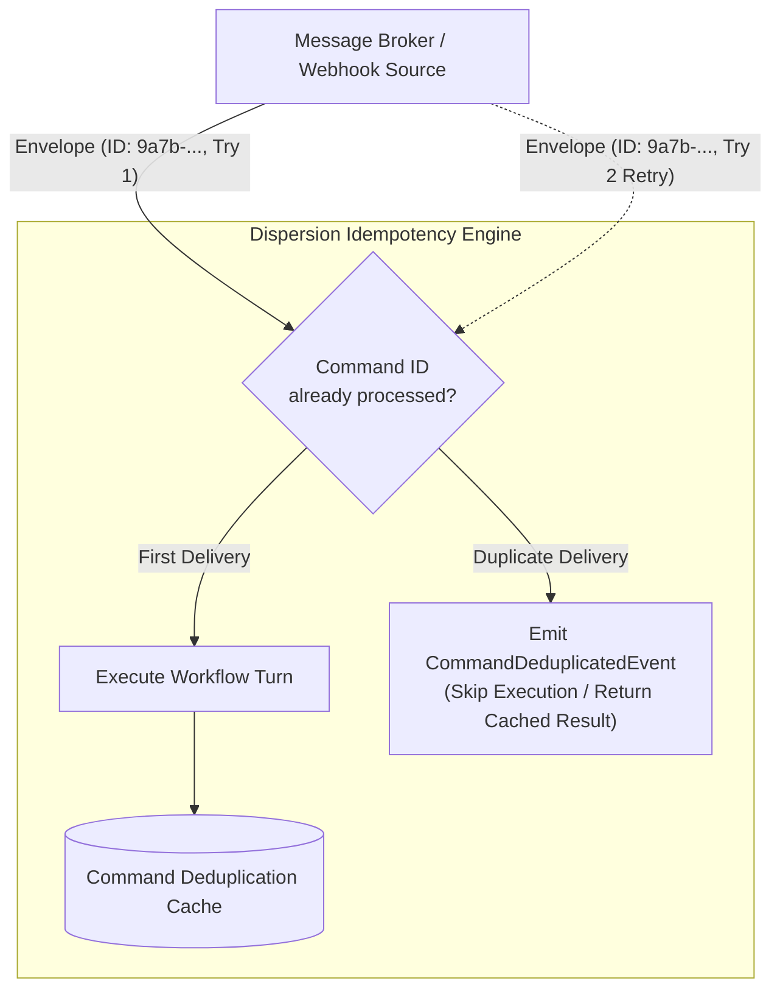
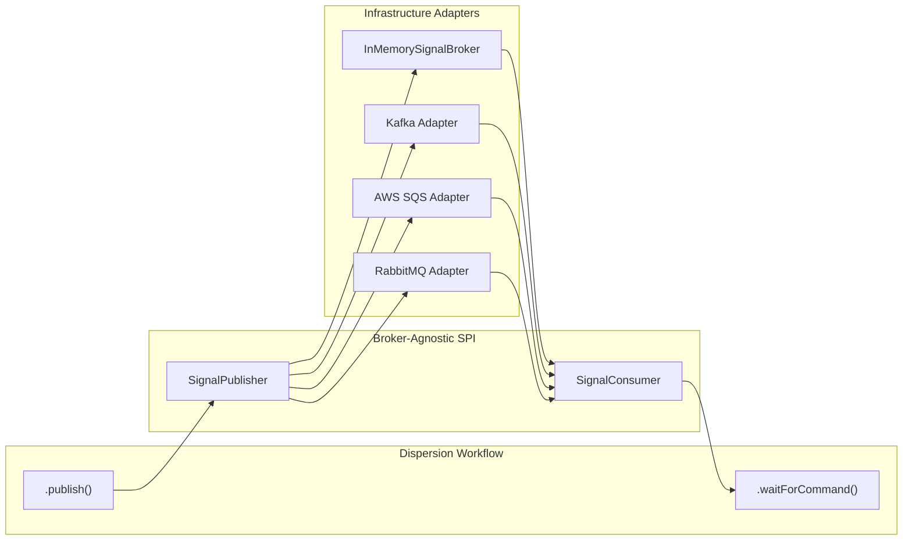
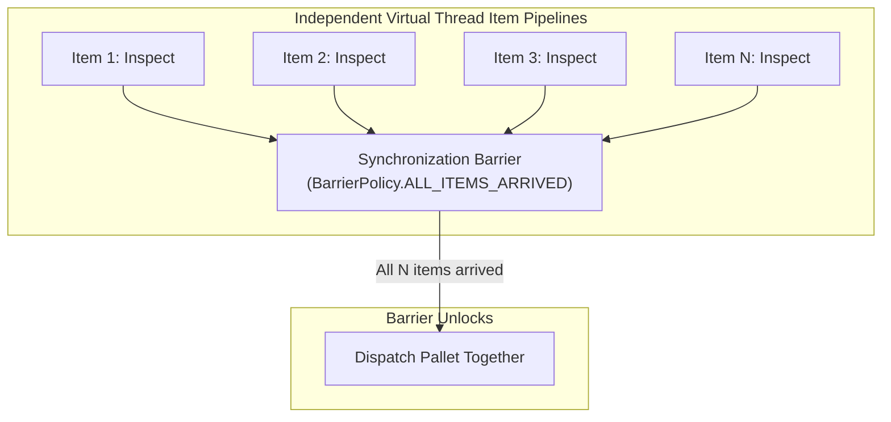

# Distributed Messaging & Batch Orchestration

In modern distributed systems, state machines must interact with external message brokers, survive network retries without double-processing side effects, and coordinate batches of items streaming in parallel. Dispersion provides native, broker-agnostic building blocks for these scenarios.

---

## 1. Idempotent Command Processing & Deduplication

In distributed networks, transient timeouts frequently trigger message re-deliveries. Dispersion provides first-class, memory-efficient deduplication through `CommandEnvelope<T>` and `SignalCommand`.



### Implementing Idempotent Commands

1. Implement `SignalCommand` on your command payload and declare its `correlationKey()`:

```java
import com.github.f442y.dispersion.orchestration.command.SignalCommand;

public record ApproveOrderCommand(String orderId, String reviewerId, boolean approved)
        implements SignalCommand {
    @Override
    public String correlationKey() {
        return orderId;
    }
}
```

2. Wrap the command in an immutable `CommandEnvelope`:

```java
import com.github.f442y.dispersion.orchestration.command.CommandEnvelope;
import java.time.Instant;
import java.util.UUID;

UUID deduplicationId = UUID.fromString("4a62dc84-5f40-4ce0-9852-6e27bc89d891");

CommandEnvelope<ApproveOrderCommand> envelope = new CommandEnvelope<>(
    deduplicationId,
    Instant.now(),
    new ApproveOrderCommand("ORD-101", "reviewer-alice", true)
);

// Dispatch to state machine executor
executor.handleCommand(envelope).get();
```

Even if the envelope is delivered 10 times concurrently over the network, Dispersion executes the turn on the 1st delivery and transparently deduplicates the remaining 9 deliveries, firing `ExecutionEvent.CommandDeduplicatedEvent`.

---

## 2. Broker-Agnostic Messaging SPI

Dispersion decouples state machines from specific messaging technologies (Apache Kafka, AWS SQS, RabbitMQ, Pulsar, or In-Memory queues) using a uniform messaging SPI:



### Outbound Publishing & Inbound Subscriptions

```java
import com.github.f442y.dispersion.orchestration.OrchestrationStateMachineBuilder;
import com.github.f442y.dispersion.orchestration.OrchestrationStateMachineExecutor;
import com.github.f442y.dispersion.orchestration.messaging.InMemorySignalBroker;
import com.github.f442y.dispersion.orchestration.messaging.SignalReceiver;

// 1. Create a broker instance (InMemorySignalBroker for local testing or custom Kafka adapter)
try (InMemorySignalBroker broker = new InMemorySignalBroker()) {

    // 2. Build the state machine with outbound publish and inbound command wait
    try (OrchestrationStateMachineExecutor<ShippingContext, ShippingState, Void, String> executor =
            OrchestrationStateMachineBuilder.<ShippingContext, ShippingState, Void, String>create("ShippingPipeline", ShippingState.class)
                .context(ShippingContext::new)
                .initialState(ShippingState.INIT)
                .checkpointStore(checkpointStore)
                .correlationKey(ctx -> ctx.shipmentId)

                // Outbound: Publish request to warehouse queue
                .state(ShippingState.INIT)
                    .publish(broker, "warehouse-dispatch-queue", ctx -> new DispatchShipmentRequest(ctx.shipmentId))
                    .transition(ShippingState.AWAIT_DISPATCH)

                // Inbound: Suspend and await PackageDispatchedCommand from warehouse
                .state(ShippingState.AWAIT_DISPATCH)
                    .waitForCommand(PackageDispatchedCommand.class, (ctx, cmd) -> {
                        ctx.trackingNumber = cmd.trackingNumber();
                        return ctx;
                    })
                    .transition(ShippingState.COMPLETED)

                .endStates(ShippingState.COMPLETED)
                .buildExecutor()) {

        // 3. Connect broker subscription to the state machine via SignalReceiver
        SignalReceiver receiver = SignalReceiver.forExecutor(executor);
        broker.subscribe("shipping-events", receiver);
    }
}
```

---

## 3. Batch Orchestration & Dynamic Synchronization Barriers

Real-world batch systems (e.g. palletizing warehouse packages, bulk payment settlements, or ETL data ingestion) require individual items to process independently on Virtual Threads, but group and synchronize before entering downstream operations.

Dispersion provides `BatchOrchestrationStateMachineBuilder` and `BarrierPolicy` for high-throughput parallel item processing with dynamic synchronization barriers:



### Batch Orchestration Example

```java
import com.github.f442y.dispersion.orchestration.batch.BarrierPolicy;
import com.github.f442y.dispersion.orchestration.batch.BatchOrchestrationExecutor;
import com.github.f442y.dispersion.orchestration.batch.BatchOrchestrationStateMachineBuilder;
import com.github.f442y.dispersion.state.StateKey;
import java.util.List;

public enum PalletState implements StateKey {
    SCAN_ITEM,
    HOLD_AT_PALLET_BARRIER,
    SHRINK_WRAP_AND_LOAD,
    PALLET_DISPATCHED
}

// 1. Declare Batch Context and Item Context
public class BatchContext implements StateMachineContext {
    public String palletId;
    public int totalItems;
}

public class ItemContext implements StateMachineContext {
    public String packageId;
    public boolean scanned;
    public boolean loaded;
    public ItemContext(String packageId) { this.packageId = packageId; }
}

// 2. Configure the Batch Machine
try (BatchOrchestrationExecutor<BatchContext, ItemContext, PalletState, String> batchExecutor =
        BatchOrchestrationStateMachineBuilder.<BatchContext, ItemContext, PalletState, String>create("PalletWorkflow", PalletState.class)
            .batchContext(BatchContext::new)
            .batchKey(b -> b.palletId)
            .itemKey(i -> i.packageId)
            .initialState(PalletState.SCAN_ITEM)

            // Step 1: Each item scans concurrently on a virtual thread
            .itemState(PalletState.SCAN_ITEM)
                .action(item -> {
                    item.scanned = true;
                    System.out.println("Scanned package " + item.packageId);
                    return item;
                })
                .transition(PalletState.HOLD_AT_PALLET_BARRIER)

            // Step 2: BARRIER - Items hold here until ALL items in the batch arrive
            .itemState(PalletState.HOLD_AT_PALLET_BARRIER)
                .barrier(BarrierPolicy.ALL_ITEMS_ARRIVED)
                .transition(PalletState.SHRINK_WRAP_AND_LOAD)

            // Step 3: All items unlock simultaneously and load together
            .itemState(PalletState.SHRINK_WRAP_AND_LOAD)
                .action(item -> {
                    item.loaded = true;
                    return item;
                })
                .transition(PalletState.PALLET_DISPATCHED)

            .endStates(PalletState.PALLET_DISPATCHED)
            .buildExecutor()) {

    BatchContext pallet = new BatchContext();
    pallet.palletId = "PALLET-770";

    List<ItemContext> items = List.of(
        new ItemContext("PKG-1"),
        new ItemContext("PKG-2"),
        new ItemContext("PKG-3")
    );

    // Concurrently dispatches items across virtual threads and synchronizes at barrier
    batchExecutor.dispatchBatchSync(pallet, items);
}
```

### Barrier Policies

| Policy | Behavior |
| :--- | :--- |
| `BarrierPolicy.ALL_ITEMS_ARRIVED` | Items wait at the barrier until the last item in the collection arrives. Once all items arrive, the barrier unlocks and all items proceed concurrently. |
| `BarrierPolicy.SIGNAL_TRIGGERED` | Items accumulate at the barrier indefinitely until an external coordinator fires a release signal to flush the batch. |

---

## Next Steps

- Explore **[Observability & Control Plane](observability-and-control-plane.md)** to monitor real-time execution events and inspect active batch progress.
- Read **[Java 25+ Language Features](java-25-features.md)** to learn how records and sealed patterns optimize engine performance.
