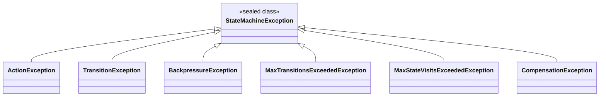

# Java 25+ Language Features in Action

Dispersion is built specifically for **Java 25+**, taking full advantage of modern language capabilities to provide maximum performance, strict type safety, and clean API ergonomics.

---

## 1. Virtual Threads (Project Loom)

In traditional thread-per-request systems, blocking an OS thread during network I/O or wait states consumes 1–2 MB of stack memory and rapidly exhausts thread pools.

Dispersion leverages Java Virtual Threads (`Thread.ofVirtual()`):
- **Cheap Concurrency**: Spin up hundreds of thousands of concurrent state machine workflows with sub-millisecond dispatch overhead.
- **Thread Confinement**: Context mutations remain lock-free and thread-safe because each turn is confined to a single virtual thread.
- **Synchronous Simplicity**: Write straightforward imperative code (e.g. blocking database calls or message publishing) without nested reactive callback chains (`CompletableFuture`, `Mono`, `Flux`).

---

## 2. Exhaustive Pattern Matching on Sealed Hierarchies

Dispersion uses `sealed` interfaces and classes to strictly control subtype hierarchies. This empowers the Java compiler to guarantee **exhaustive pattern matching** at compile time without requiring fallback `default:` branches.

### Sealed Exceptions
`StateMachineException` is a sealed class that permits only specific error types:



```java
import com.github.f442y.dispersion.exception.*;

try {
    executor.dispatchSync(input);
} catch (StateMachineException ex) {
    // Compile-time exhaustive switch: no default branch required!
    String diagnostic = switch (ex) {
        case ActionException ae ->
            "Action failed in state [" + ae.getStateName() + "]: " + ae.getCause().getMessage();
        case TransitionException te ->
            "Invalid transition from [" + te.getSourceStateName() + "] to [" + te.getTargetStateName() + "]";
        case BackpressureException be ->
            "Admission backpressure: " + be.getMessage();
        case MaxTransitionsExceededException mte ->
            "Global transition limit reached: " + mte.getMaxTransitions();
        case MaxStateVisitsExceededException msve ->
            "Max visits exceeded for state [" + msve.getStateName() + "]";
        case CompensationException ce ->
            "Saga rollback error in state [" + ce.getStateName() + "]";
    };
    logger.error(diagnostic, ex);
}
```

If a new exception subtype is added to `StateMachineException` in future releases, the compiler will flag any non-exhaustive switch statements at build time.

---

## 3. Sealed Records & Telemetry Matching

Dispersion's `ExecutionEvent` sealed interface defines 12 immutable record variants. You can consume lifecycle telemetry with type-safe pattern matching:

```java
import com.github.f442y.dispersion.event.ExecutionEvent;

public void processTelemetry(ExecutionEvent event) {
    switch (event) {
        case ExecutionEvent.TurnStartedEvent(var mid, var mname, var tid, var initKey, var ts) ->
            System.out.println("Started turn " + tid + " on " + mname);

        case ExecutionEvent.TurnSuspendedEvent(var mid, var mname, var suspKey, var sig, var corrKey, var ts) ->
            System.out.printf("Suspended at %s awaiting signal %s (key: %s)%n", suspKey, sig, corrKey);

        case ExecutionEvent.TurnCompletedEvent(var mid, var mname, var termKey, var out, var ts) ->
            System.out.println("Completed turn at " + termKey);

        case ExecutionEvent.TurnCompensatedEvent(var mid, var mname, var errKey, var cause, var ts) ->
            System.err.println("Compensated turn after failure in " + errKey + ": " + cause.getMessage());

        case ExecutionEvent.StateEnteredEvent(var mid, var mname, var key, var ts) ->
            System.out.println("Entered state: " + key);

        case ExecutionEvent.StateExitedEvent(var mid, var mname, var key, var dur, var ts) ->
            System.out.println("Exited state: " + key + " in " + dur.toMillis() + "ms");

        case ExecutionEvent.TransitionEvaluatedEvent(var mid, var mname, var src, var tgt, var ts) ->
            System.out.println("Transition: " + src + " -> " + tgt);

        case ExecutionEvent.SignalAwaitedEvent(var mid, var mname, var sig, var corrKey, var ts) ->
            System.out.println("Awaiting signal: " + sig);

        case ExecutionEvent.SignalDeliveredEvent(var mid, var mname, var sig, var corrKey, var ts) ->
            System.out.println("Delivered signal: " + sig);

        case ExecutionEvent.CommandDeduplicatedEvent(var mid, var mname, var cmdId, var type, var ts) ->
            System.out.println("Deduplicated command: " + cmdId);

        case ExecutionEvent.BatchBarrierReachedEvent(var bid, var mid, var key, var iid, var ts) ->
            System.out.println("Item " + iid + " reached barrier for batch " + bid);

        case ExecutionEvent.BatchBarrierUnlockedEvent(var bid, var mid, var key, var count, var pol, var ts) ->
            System.out.println("Unlocked barrier for batch " + bid + " (" + count + " items)");
    }
}
```

---

## 4. Nested Record Pattern Deconstruction

Dispersion makes heavy use of records (`CommandEnvelope`, `SignalDeliveryResult`, `ExecutionSummary`, `MachineDescriptor`). With record patterns, you can deconstruct nested data structures directly in conditional statements:

```java
import com.github.f442y.dispersion.orchestration.command.CommandEnvelope;

if (envelope instanceof CommandEnvelope(UUID id, Instant ts, PaymentSignal(String orderId, double amount))) {
    System.out.printf("Command %s processed payment for order %s: $%.2f%n", id, orderId, amount);
}
```

---

## 5. Null Safety with JSpecify Annotations

Dispersion applies `@NullMarked` and `@Nullable` annotations across all public API modules. This ensures:
- Strict IDE and compiler static analysis checks against `NullPointerException`.
- Seamless interoperability with Kotlin and modern Java static analyzers (e.g. NullAway, SpotBugs).
