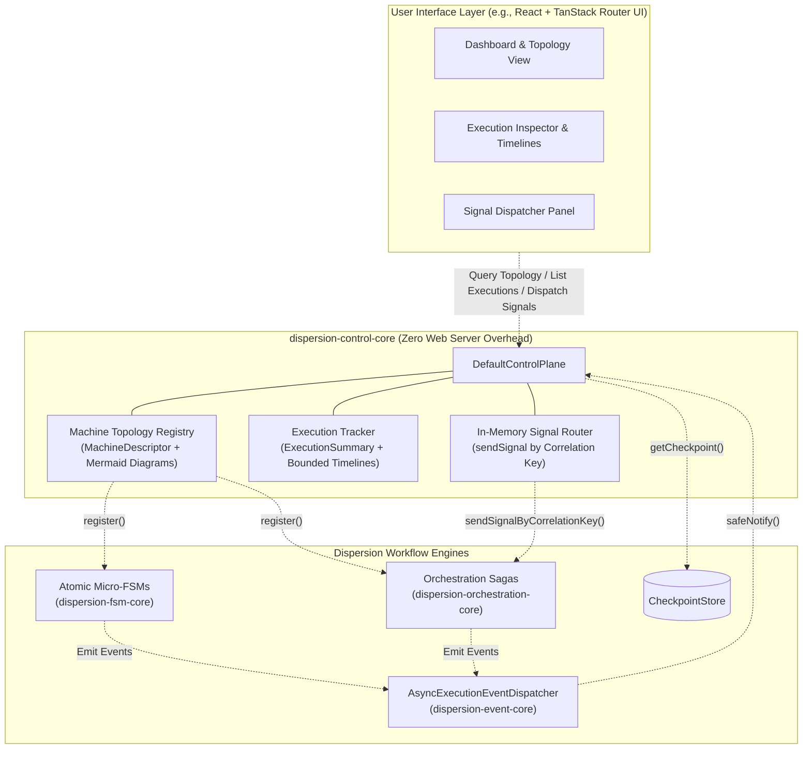

# Observability & Control Plane

To provide full transparency into distributed workflows, Dispersion provides a fine-grained, decoupled observability and management architecture across dedicated modules:
1. **Event Lifecycle SPI (`dispersion-event-api`)**: Fine-grained, zero-cost lifecycle telemetry emitted at each state, turn, signal, and compensation via 12 sealed `ExecutionEvent` records.
2. **Asynchronous Ring Buffer Dispatcher (`dispersion-event-core`)**: Lock-free virtual-thread event dispatcher with backpressure handling (drop/buffer/block) implementing `Flow.Publisher<ExecutionEvent>`.
3. **Control Plane Contracts (`dispersion-control-api`)**: Unified SPI (`ControlPlane`), topology descriptors (`MachineDescriptor`), and execution summaries (`ExecutionSummary`, `SignalDeliveryResult`).
4. **Core Java Control Plane (`dispersion-control-core`)**: An in-memory, thread-safe registry and control implementation (`DefaultControlPlane`) that tracks live executions, inspects suspended checkpoints, extracts Mermaid diagrams, and routes external signals—serving as the foundational backend for monitoring tools and modern reactive Web UIs (such as a React + TanStack Router dashboard).

> **Maven Coordinates:**
> - Event Telemetry SPI: `com.github.f442y.dispersion:dispersion-event-api`
> - Event Dispatcher Runtime: `com.github.f442y.dispersion:dispersion-event-core`
> - Control Plane Contracts: `com.github.f442y.dispersion:dispersion-control-api`
> - Control Plane Runtime: `com.github.f442y.dispersion:dispersion-control-core`

---

## 1. Architectural Overview



---

## 2. Event Lifecycle SPI

### Zero-Cost Hot Path & Fault Isolation
- **Zero-Cost Hot Path**: When telemetry is not attached (`eventListener == null`), the runtime performs a single untaken conditional branch: **0** event allocations, **0** clock reads, and **0** queue contention.
- **Strict Fault Isolation**: All listener notifications are wrapped in `safeNotify`. Any uncaught listener exception or network drop is logged and **never** causes workflow state transitions or Saga compensations to abort.

### The 12 Sealed Execution Events
`ExecutionEvent` is a sealed interface permitting 12 immutable record types:

| Event Record | Emitted When | Payload Highlights |
| :--- | :--- | :--- |
| `TurnStartedEvent` | Orchestration turn starts | `executionId`, `machineName`, `turnId`, `initialStateKey` |
| `TurnSuspendedEvent` | Workflow pauses awaiting signal | `executionId`, `suspendedStateKey`, `expectedSignal`, `correlationKey` |
| `TurnCompletedEvent` | Workflow reaches terminal end state | `executionId`, `terminalStateKey`, `output` |
| `TurnCompensatedEvent` | Saga rollback occurs after error | `executionId`, `errorStateKey`, `cause` |
| `StateEnteredEvent` | Entering any state node | `executionId`, `stateKey` |
| `StateExitedEvent` | Exiting a state after action finishes | `executionId`, `stateKey`, `duration` |
| `TransitionEvaluatedEvent` | Evaluating next transition edge | `executionId`, `sourceStateKey`, `targetStateKey` |
| `SignalAwaitedEvent` | Workflow suspends on `waitForSignal` | `executionId`, `expectedSignal`, `correlationKey` |
| `SignalDeliveredEvent` | Inbound signal arrives and rehydrates turn | `executionId`, `signalName`, `correlationKey` |
| `CommandDeduplicatedEvent`| Network re-delivery deduplicated | `executionId`, `commandId`, `commandType` |
| `BatchBarrierReachedEvent`| Batch item arrives at barrier | `batchId`, `itemId`, `barrierStateKey` |
| `BatchBarrierUnlockedEvent`| Barrier releases batch items | `batchId`, `itemCount`, `policy` |

### Exhaustive Pattern Matching on Sealed Events
Because `ExecutionEvent` is `sealed`, Java 25 verifies compile-time exhaustiveness in switch expressions without requiring a `default:` branch:

```java
import com.github.f442y.dispersion.event.ExecutionEvent;

public void handleEvent(ExecutionEvent event) {
    String logMessage = switch (event) {
        case ExecutionEvent.TurnStartedEvent e ->
            "Turn started for turnId: " + e.turnId() + " in state: " + e.initialStateKey().name();
        case ExecutionEvent.TurnSuspendedEvent e ->
            "Turn suspended in state: " + e.suspendedStateKey().name() + " (awaits: " + e.expectedSignal() + ")";
        case ExecutionEvent.TurnCompletedEvent e ->
            "Turn completed with terminal state: " + e.terminalStateKey().name();
        case ExecutionEvent.TurnCompensatedEvent e ->
            "Saga turn compensated due to: " + e.cause().getMessage();
        case ExecutionEvent.StateEnteredEvent e ->
            "Entered state: " + e.stateKey().name();
        case ExecutionEvent.StateExitedEvent e ->
            "Exited state: " + e.stateKey().name() + " [elapsed: " + e.duration().toMillis() + "ms]";
        case ExecutionEvent.TransitionEvaluatedEvent e ->
            "Transition: [" + e.sourceStateKey().name() + "] -> [" + e.targetStateKey().name() + "]";
        case ExecutionEvent.SignalAwaitedEvent e ->
            "Workflow paused awaiting signal: " + e.expectedSignal() + " (corr: " + e.correlationKey() + ")";
        case ExecutionEvent.SignalDeliveredEvent e ->
            "Signal delivered: " + e.signalName() + " (corr: " + e.correlationKey() + ")";
        case ExecutionEvent.CommandDeduplicatedEvent e ->
            "Command deduplicated: " + e.commandId() + " (type: " + e.commandType() + ")";
        case ExecutionEvent.BatchBarrierReachedEvent e ->
            "Batch item [" + e.itemId() + "] arrived at barrier for batch: " + e.batchId();
        case ExecutionEvent.BatchBarrierUnlockedEvent e ->
            "Batch barrier unlocked for batch: " + e.batchId() + " (items: " + e.itemCount() + ")";
    };
    System.out.println(logMessage);
}
```

---

## 3. Asynchronous Dispatcher & Reactive Streams

`VirtualThreadEventBus` (and `AsyncExecutionEventDispatcher`) decouples workflow execution from telemetry consumers. Events are queued into a fast bounded buffer on the state machine thread and consumed on a dedicated Virtual Thread (`dispersion-event-bus-worker`).

### Pure Virtual-Thread Design (Zero Reactive Baggage):
Instead of complex reactive streams (`Flow.Publisher`, `Subscriber`, `request(n)` demand tracking), Dispersion uses **100% imperative, Virtual Thread-native abstractions**:
- **Strongly-Typed Subscriptions**: Subscribe directly to sealed record types like `TurnFailedEvent` without manual casting or instanceof checks.
- **Pull-Based Virtual Thread Streaming (`EventStream`)**: Consumers (such as Server-Sent Events or WebSocket endpoints) pull sequentially with blocking `take()` or `poll(timeout)` calls on their own lightweight virtual threads.
- **Circular History Replay**: In-memory ring buffer for immediate historical queries.

```java
import com.github.f442y.dispersion.event.EventBus;
import com.github.f442y.dispersion.event.EventStream;
import com.github.f442y.dispersion.event.ExecutionEvent;
import com.github.f442y.dispersion.event.OverflowPolicy;
import com.github.f442y.dispersion.event.Subscription;
import com.github.f442y.dispersion.event.bus.VirtualThreadEventBus;
import java.time.Duration;

// 1. Initialize Event Bus (10,000 buffer capacity, 1,000 history items)
try (EventBus eventBus = VirtualThreadEventBus.builder()
        .bufferCapacity(10_000)
        .historyCapacity(1_000)
        .overflowPolicy(OverflowPolicy.DROP_OLDEST)
        .build()) {

    // 2. Strongly-typed subscription: only receives TurnFailedEvent
    Subscription failureSub = eventBus.subscribe(
            ExecutionEvent.TurnFailedEvent.class,
            event -> System.err.printf("ALERT: Machine [%s] failed: %s%n", event.machineId(), event.cause().getMessage())
    );

    // 3. Virtual Thread Pull-Stream (e.g. bridging directly to an SSE / WebSocket controller)
    Thread.ofVirtual().start(() -> {
        try (EventStream stream = eventBus.openStream()) {
            for (ExecutionEvent event : stream) {
                // Cheap, clean Virtual Thread blocking — zero reactive ceremony!
                sseEmitter.send(event);
            }
        }
    });
}
```

---

## 4. Core Java Control Plane (`DefaultControlPlane`)

`DefaultControlPlane` is a thread-safe, pure Java implementation designed to be embedded in your service. It manages state machine metadata and live execution status **with zero HTTP server dependency**, making it easy to expose over REST, GraphQL, gRPC, or WebSockets when desired.

### Capabilities:
1. **Universal `InspectableMachine` SPI**: Decouples the control plane from concrete engine internals. Any machine (atomic, orchestration saga, batch, or custom) can register its topology, signal router, and checkpoint inspector via `register(InspectableMachine)`. Convenient overloads automatically adapt `AtomicStateMachineExecutor` and `OrchestrationStateMachineExecutor`.
2. **Segmented $O(1)$ Eviction Architecture**:
   - **Active Pool (`activeExecutions`)**: In-flight workflows (`RUNNING` or `SUSPENDED`) represent live business processes waiting for steps or inbound signals (e.g. human approvals, webhooks). They are **strictly protected from eviction** and never pruned regardless of how many completed workflows arrive.
   - **Terminal Pool (`terminalExecutions`)**: Finished workflows (`COMPLETED`, `FAILED`, `COMPENSATED`) are bounded by `maxTrackedExecutions`. Pruning is performed in **strictly $O(1)$ time** via a concurrent FIFO queue and atomic counters, completely eliminating expensive $O(N)$ linear scans across the entire collection.
   - **Recent Event Ring Buffer**: Bounded by an atomic counter for zero-overhead, strictly $O(1)$ sliding window tracking without traversing linked lists.
3. **Virtual Thread Live-Streaming (`EventStream`)**:
   - `controlPlane.watchExecution(executionId)`: Opens a dedicated, pull-based stream filtered to a single workflow execution.
   - `controlPlane.watchMachine(machineName)`: Opens a stream for all lifecycle events emitted by any instance of a named machine.
   - Subscribers pull events sequentially with `stream.take()` or `stream.poll(timeout)` directly on lightweight Virtual Threads without reactive framework overhead.
4. **Direct In-Memory Signal Routing**: Routes external control signals (`sendSignal`) to suspended instances by correlation key, returning a `CompletableFuture<SignalDeliveryResult>`.
5. **Universal Checkpoint Inspection**: Retrieves durable workflow snapshots via `inspectCheckpoint(machineName, correlationKey)`.

### Complete Control Plane Usage Example:

```java
import com.github.f442y.dispersion.control.ControlPlane;
import com.github.f442y.dispersion.control.ExecutionStatus;
import com.github.f442y.dispersion.control.ExecutionSummary;
import com.github.f442y.dispersion.control.MachineDescriptor;
import com.github.f442y.dispersion.control.SignalDeliveryResult;
import com.github.f442y.dispersion.control.core.DefaultControlPlane;
import com.github.f442y.dispersion.event.EventStream;
import com.github.f442y.dispersion.event.ExecutionEvent;
import com.github.f442y.dispersion.event.dispatcher.AsyncExecutionEventDispatcher;
import java.time.Duration;
import java.util.List;
import java.util.concurrent.CompletableFuture;

// 1. Initialize Control Plane (max 10,000 terminal executions, 200 events/execution, 5,000 recent events)
try (DefaultControlPlane controlPlane = new DefaultControlPlane(10_000, 200, 5_000);
     AsyncExecutionEventDispatcher eventDispatcher = new AsyncExecutionEventDispatcher()) {

    // 2. Wire Control Plane listener to dispatcher
    controlPlane.attachTo(eventDispatcher);

    // 3. Register state machine executors (or custom InspectableMachine implementations)
    controlPlane.register(loanOrchestrationExecutor);
    controlPlane.register(paymentAtomicExecutor);

    // 4. Query Registered Topology (e.g. for React diagram rendering)
    MachineDescriptor desc = controlPlane.getMachine("LoanWorkflow").orElseThrow();
    System.out.println("Machine Name: " + desc.name());
    System.out.println("Initial State: " + desc.initialState());
    System.out.println("All States: " + desc.allStates());
    System.out.println("Mermaid Diagram:\n" + desc.mermaidGraph());

    // 5. Open Real-Time Virtual Thread Stream for a specific execution instance
    Thread.ofVirtual().start(() -> {
        try (EventStream stream = controlPlane.watchExecution("exec-loan-1002")) {
            for (ExecutionEvent event : stream) {
                // Non-blocking for OS threads; lightweight virtual-thread pull
                System.out.println("Real-time event: " + event.getClass().getSimpleName());
            }
        } catch (InterruptedException e) {
            Thread.currentThread().interrupt();
        }
    });

    // 6. Query Suspended Executions (Active Pool is never evicted!)
    List<ExecutionSummary> suspended = controlPlane.listExecutions("LoanWorkflow", ExecutionStatus.SUSPENDED, 20);
    for (ExecutionSummary exec : suspended) {
        System.out.printf("Execution %s suspended at %s awaiting %s (corrKey: %s)%n",
            exec.executionId(), exec.currentState(), exec.suspendedSignal(), exec.correlationKey());
    }

    // 7. Route External Control Signal
    CompletableFuture<SignalDeliveryResult> future = controlPlane.sendSignal(
        "LoanWorkflow",
        "LOAN-1002",
        "LoanApproval",
        new LoanApprovalSignal("LOAN-1002", "Sarah Connor", true)
    );

    SignalDeliveryResult result = future.join();
    System.out.println("Delivered: " + result.delivered());
    System.out.println("Completed: " + result.completed());
    System.out.println("Resulting State: " + result.resultingState());
}
```

---

## 5. Web UI Integration (React + TanStack Router)

Because `ControlPlane` exposes pure Java methods and Virtual Thread event streams, building a React frontend on top of it is straightforward:

| Frontend Feature | Control Plane SPI Method | UI View |
| :--- | :--- | :--- |
| **Topology View** | `controlPlane.getMachine(name).mermaidGraph()` | Render interactive SVG graph via Mermaid or React Flow |
| **Execution Table** | `controlPlane.listExecutions(name, status, limit)` | Filterable TanStack Table showing active vs terminal status, turns, and correlation keys |
| **Execution Timeline**| `controlPlane.getExecutionTimeline(execId)` | Visual audit trail showing every state entry, exit, and transition |
| **Live SSE / WebSocket** | `controlPlane.watchExecution(...)` / `watchMachine(...)` | Real-time state progress updates pulled sequentially without polling |
| **Checkpoint Inspection**| `controlPlane.inspectCheckpoint(name, corrKey)` | JSON drawer inspecting persisted Saga context and history |
| **Manual Signal Actions**| `controlPlane.sendSignal(...)` | Form modal allowing operators to manually approve or trigger signals |

---

## Next Steps

- Review **[Java 25+ Language Features](java-25-features.md)** to see how sealed hierarchies and records power the engine.
- Revisit **[Tier 2: Orchestration & Distributed Sagas](tier-2-orchestration-sagas.md)** for turn suspension details.
