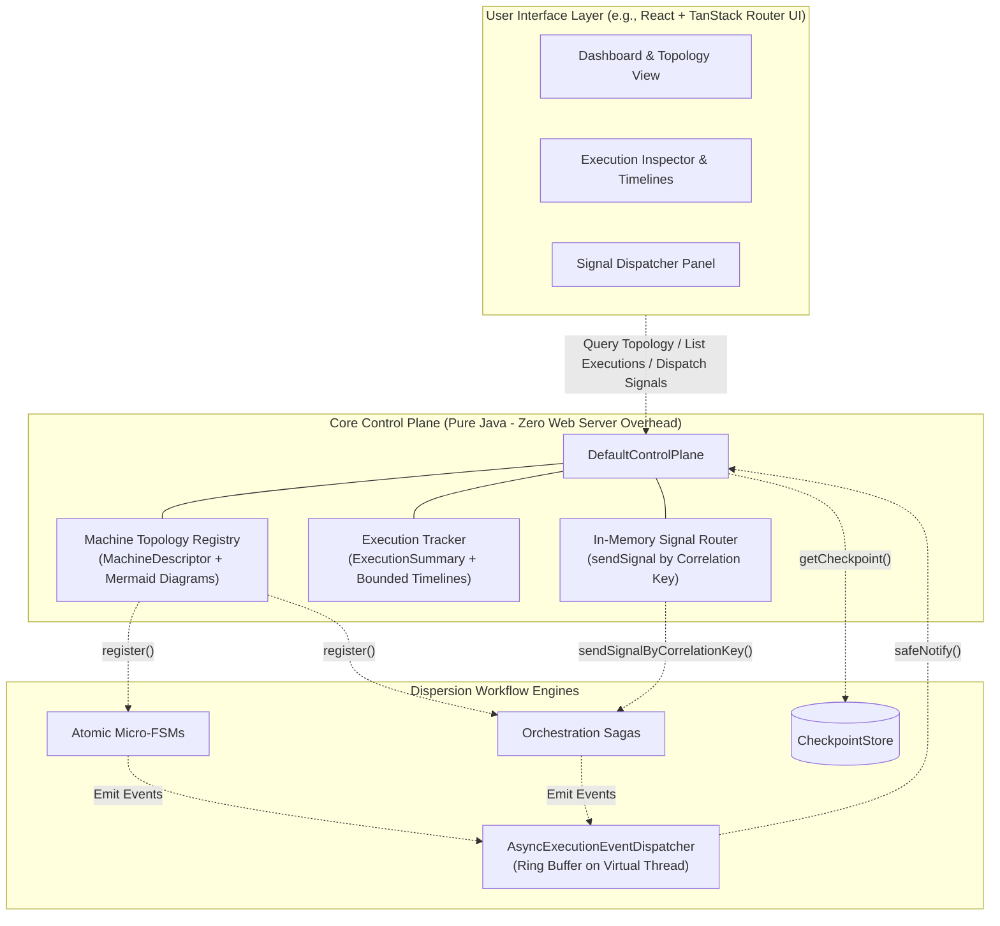

# Observability & Control Plane

To provide full transparency into distributed workflows, Dispersion provides a two-layer observability and management architecture:
1. **Event Lifecycle SPI (`dispersion-api`)**: Fine-grained, zero-cost lifecycle telemetry emitted at each state, turn, signal, and compensation.
2. **Core Java Control Plane (`dispersion-core`)**: An in-memory, thread-safe registry and control API that tracks live executions, inspects suspended checkpoints, extracts Mermaid diagrams, and routes external signals—serving as the foundational backend for monitoring tools and modern reactive Web UIs (such as a React + TanStack Router dashboard).

---

## 1. Architectural Overview



---

## 2. Event Lifecycle SPI

### Zero-Cost Hot Path & Fault Isolation
- **Zero-Cost Hot Path**: When telemetry is not attached (`eventListener == null`), the runtime performs a single untaken conditional branch: **0** event allocations, **0** clock reads, and **0** queue contention.
- **Strict Fault Isolation**: All listener notifications are wrapped in `safeNotify`. Any uncaught listener exception or network drop is logged and **never** causes workflow state transitions or Saga compensations to abort.

### The 12 Sealed Execution Events
`ExecutionEvent` is a sealed interface permitting 12 immutable record types:

| Event Record | Emitted When | Payload Highlights |
| :--- | :--- | :--- |
| `TurnStartedEvent` | Orchestration turn starts | `executionId`, `machineName`, `turnId`, `initialStateKey` |
| `TurnSuspendedEvent` | Workflow pauses awaiting signal | `executionId`, `suspendedStateKey`, `expectedSignal`, `correlationKey` |
| `TurnCompletedEvent` | Workflow reaches terminal end state | `executionId`, `terminalStateKey`, `output` |
| `TurnCompensatedEvent` | Saga rollback occurs after error | `executionId`, `errorStateKey`, `cause` |
| `StateEnteredEvent` | Entering any state node | `executionId`, `stateKey` |
| `StateExitedEvent` | Exiting a state after action finishes | `executionId`, `stateKey`, `duration` |
| `TransitionEvaluatedEvent` | Evaluating next transition edge | `executionId`, `sourceStateKey`, `targetStateKey` |
| `SignalAwaitedEvent` | Workflow suspends on `waitForSignal` | `executionId`, `expectedSignal`, `correlationKey` |
| `SignalDeliveredEvent` | Inbound signal arrives and rehydrates turn | `executionId`, `signalName`, `correlationKey` |
| `CommandDeduplicatedEvent`| Network re-delivery deduplicated | `executionId`, `commandId`, `commandType` |
| `BatchBarrierReachedEvent`| Batch item arrives at barrier | `batchId`, `itemId`, `barrierStateKey` |
| `BatchBarrierUnlockedEvent`| Barrier releases batch items | `batchId`, `itemCount`, `policy` |

### Exhaustive Pattern Matching on Sealed Events
Because `ExecutionEvent` is `sealed`, Java 25 verifies compile-time exhaustiveness in switch expressions without requiring a `default:` branch:

```java
import com.github.f442y.dispersion.event.ExecutionEvent;

public void handleEvent(ExecutionEvent event) {
    String logMessage = switch (event) {
        case ExecutionEvent.TurnStartedEvent e ->
            "Turn started for turnId: " + e.turnId() + " in state: " + e.initialStateKey().name();
        case ExecutionEvent.TurnSuspendedEvent e ->
            "Turn suspended in state: " + e.suspendedStateKey().name() + " (awaits: " + e.expectedSignal() + ")";
        case ExecutionEvent.TurnCompletedEvent e ->
            "Turn completed with terminal state: " + e.terminalStateKey().name();
        case ExecutionEvent.TurnCompensatedEvent e ->
            "Saga turn compensated due to: " + e.cause().getMessage();
        case ExecutionEvent.StateEnteredEvent e ->
            "Entered state: " + e.stateKey().name();
        case ExecutionEvent.StateExitedEvent e ->
            "Exited state: " + e.stateKey().name() + " [elapsed: " + e.duration().toMillis() + "ms]";
        case ExecutionEvent.TransitionEvaluatedEvent e ->
            "Transition: [" + e.sourceStateKey().name() + "] -> [" + e.targetStateKey().name() + "]";
        case ExecutionEvent.SignalAwaitedEvent e ->
            "Workflow paused awaiting signal: " + e.expectedSignal() + " (corr: " + e.correlationKey() + ")";
        case ExecutionEvent.SignalDeliveredEvent e ->
            "Signal delivered: " + e.signalName() + " (corr: " + e.correlationKey() + ")";
        case ExecutionEvent.CommandDeduplicatedEvent e ->
            "Command deduplicated: " + e.commandId() + " (type: " + e.commandType() + ")";
        case ExecutionEvent.BatchBarrierReachedEvent e ->
            "Batch item [" + e.itemId() + "] arrived at barrier for batch: " + e.batchId();
        case ExecutionEvent.BatchBarrierUnlockedEvent e ->
            "Batch barrier unlocked for batch: " + e.batchId() + " (items: " + e.itemCount() + ")";
    };
    System.out.println(logMessage);
}
```

---

## 3. Asynchronous Dispatcher & Reactive Streams

`AsyncExecutionEventDispatcher` decouples workflow execution from telemetry consumers. Events are queued into a bounded buffer and consumed on a dedicated Virtual Thread (`dispersion-event-dispatcher-worker`).

It also implements `Flow.Publisher<ExecutionEvent>`, providing backpressure-aware streaming directly into WebSockets or Server-Sent Events (SSE):

```java
import com.github.f442y.dispersion.event.AsyncExecutionEventDispatcher;
import com.github.f442y.dispersion.event.AsyncExecutionEventDispatcher.OverflowPolicy;
import java.util.concurrent.Flow;

// Bounded queue with 10,000 capacity; drop oldest if consumers fall behind
try (AsyncExecutionEventDispatcher dispatcher = new AsyncExecutionEventDispatcher(10_000, OverflowPolicy.DROP_OLDEST)) {

    // Subscribe reactive stream (e.g. bridging to an SSE controller)
    dispatcher.subscribe(new Flow.Subscriber<>() {
        private Flow.Subscription subscription;

        @Override
        public void onSubscribe(Flow.Subscription sub) {
            this.subscription = sub;
            sub.request(100); // Backpressure batch request
        }

        @Override
        public void onNext(ExecutionEvent event) {
            // Push event over SSE / WebSocket to TanStack Router Web UI
            subscription.request(1);
        }

        @Override
        public void onError(Throwable t) {}

        @Override
        public void onComplete() {}
    });
}
```

---

## 4. Core Java Control Plane (`DefaultControlPlane`)

`DefaultControlPlane` is a thread-safe, pure Java implementation designed to be embedded in your service. It manages state machine metadata and live execution status **with zero HTTP server dependency**, making it easy to expose over REST, GraphQL, gRPC, or WebSockets when desired.

### Capabilities:
1. **Dynamic Registry**: Registers both `AtomicStateMachineExecutor` and `OrchestrationStateMachineExecutor`, discovering initial states, end states, intermediate nodes, and pre-rendering Mermaid flowcharts via `MachineDescriptor`.
2. **Live Execution Tracking**: Real-time summaries (`ExecutionSummary`) across all statuses (`RUNNING`, `SUSPENDED`, `COMPLETED`, `COMPENSATED`, `FAILED`).
3. **Bounded Timeline Buffering**: Maintains a bounded ring buffer of events per execution ID and cluster-wide with LRU/FIFO eviction for predictable memory bounds.
4. **Direct In-Memory Signal Routing**: Routes external control signals (`sendSignal`) to suspended instances by correlation key, returning a `CompletableFuture<SignalDeliveryResult>`.
5. **Checkpoint Inspection**: Retrieves durable checkpoints directly from the registered `CheckpointStore`.

### Complete Control Plane Usage Example:

```java
import com.github.f442y.dispersion.control.ControlPlane;
import com.github.f442y.dispersion.control.DefaultControlPlane;
import com.github.f442y.dispersion.control.ExecutionStatus;
import com.github.f442y.dispersion.control.ExecutionSummary;
import com.github.f442y.dispersion.control.MachineDescriptor;
import com.github.f442y.dispersion.control.SignalDeliveryResult;
import com.github.f442y.dispersion.event.AsyncExecutionEventDispatcher;
import java.util.List;
import java.util.concurrent.CompletableFuture;

// 1. Initialize Control Plane (max 10,000 active executions, 200 events/execution, 5,000 global events)
try (DefaultControlPlane controlPlane = new DefaultControlPlane(10_000, 200, 5_000);
     AsyncExecutionEventDispatcher eventDispatcher = new AsyncExecutionEventDispatcher()) {

    // 2. Wire Control Plane listener to dispatcher
    controlPlane.attachTo(eventDispatcher);

    // 3. Register state machine executors
    controlPlane.register(loanOrchestrationExecutor);
    controlPlane.register(paymentAtomicExecutor);

    // 4. Query Registered Topology (e.g. for React diagram rendering)
    MachineDescriptor desc = controlPlane.getMachine("LoanWorkflow").orElseThrow();
    System.out.println("Machine Name: " + desc.name());
    System.out.println("Initial State: " + desc.initialState());
    System.out.println("All States: " + desc.allStates());
    System.out.println("Mermaid Diagram:\n" + desc.mermaidDiagram());

    // 5. Query Suspended Executions
    List<ExecutionSummary> suspended = controlPlane.listExecutions("LoanWorkflow", ExecutionStatus.SUSPENDED, 20);
    for (ExecutionSummary exec : suspended) {
        System.out.printf("Execution %s suspended at %s awaiting %s (corrKey: %s)%n",
            exec.executionId(), exec.currentState(), exec.suspendedSignal(), exec.correlationKey());
    }

    // 6. Inspect Execution Event Timeline
    List<ExecutionEvent> timeline = controlPlane.getExecutionTimeline("exec-loan-1002");
    timeline.forEach(event ->
        System.out.printf("[%s] %s -> State: %s%n",
            event.timestamp(), event.getClass().getSimpleName(), event.executionId())
    );

    // 7. Route External Control Signal
    CompletableFuture<SignalDeliveryResult> future = controlPlane.sendSignal(
        "LoanWorkflow",
        "LOAN-1002",
        "LoanApproval",
        new LoanApprovalSignal("LOAN-1002", "Sarah Connor", true)
    );

    SignalDeliveryResult result = future.join();
    System.out.println("Delivered: " + result.delivered());
    System.out.println("Completed: " + result.completed());
    System.out.println("Resulting State: " + result.currentState());
}
```

---

## 5. Web UI Integration (React + TanStack Router)

Because `ControlPlane` exposes pure Java methods and reactive event streams, building a React frontend on top of it is straightforward:

| Frontend Feature | Control Plane SPI Method | UI View |
| :--- | :--- | :--- |
| **Topology View** | `controlPlane.getMachine(name).mermaidDiagram()` | Render interactive SVG graph via Mermaid or React Flow |
| **Execution Table** | `controlPlane.listExecutions(name, status, limit)` | Filterable TanStack Table showing status, turns, and correlation keys |
| **Execution Timeline**| `controlPlane.getExecutionTimeline(execId)` | Visual audit trail showing every state entry, exit, and transition |
| **Live Updates** | `dispatcher.subscribe(...)` -> SSE / WebSocket | Real-time state progress updates without manual polling |
| **Manual Signal Actions**| `controlPlane.sendSignal(...)` | Form modal allowing operators to manually approve or trigger signals |

---

## Next Steps

- Review **[Java 25+ Language Features](java-25-features.md)** to see how sealed hierarchies and records power the engine.
- Revisit **[Tier 2: Orchestration & Distributed Sagas](tier-2-orchestration-sagas.md)** for turn suspension details.
