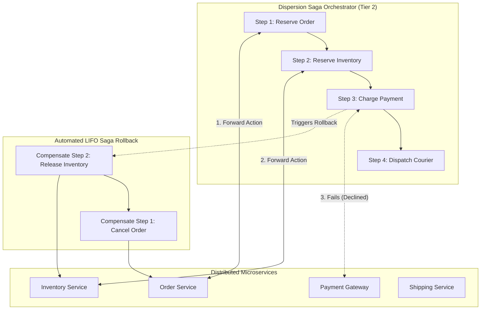
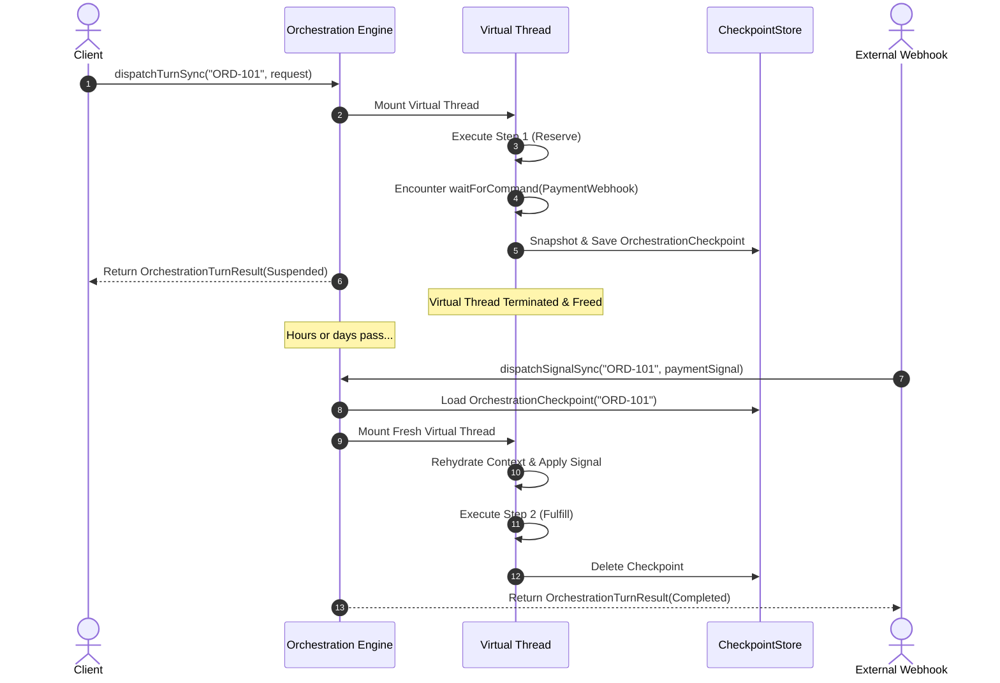
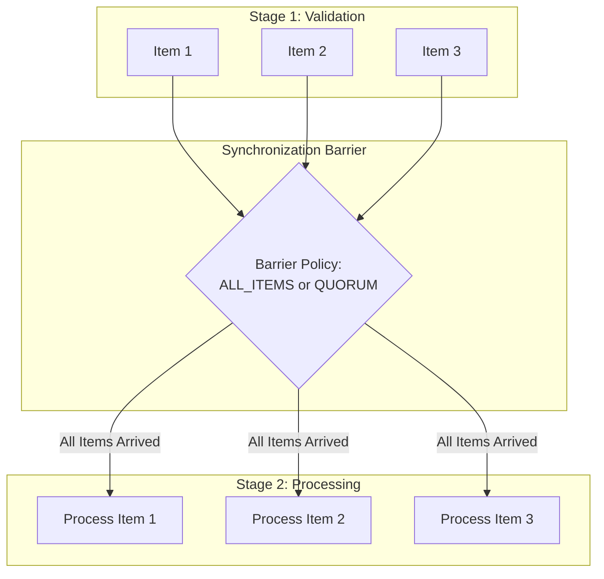

# Saga Orchestration & Batch Processing Guide

In distributed microservice architectures, traditional ACID database transactions spanning multiple network boundaries (such as Two-Phase Commit / 2PC) fail due to network partitioning, high locking latencies, and coordinator bottlenecks.

Dispersion provides an industry-grade **Distributed Saga Orchestration and Turn-Based Batching Engine** built on **Java 25 Virtual Threads**. This guide details the turn-based lifecycle, automated LIFO compensation rollbacks, network deduplication, and batch barrier synchronization.

---

## 1. Saga Orchestration Architecture

### Orchestration vs. Choreography
* **Choreography:** Services publish and listen to events blindly. Workflows become fragmented, difficult to monitor, prone to cyclic dependencies, and nearly impossible to debug when failures occur.
* **Orchestration (Dispersion's Approach):** A central coordinator manages the state machine, invokes actions, coordinates parallel branches, persists checkpoints, and orchestrates rollbacks deterministically.



---

## 2. The Turn-Based Lifecycle & Checkpoint Storage

Long-running workflows cannot hold virtual threads or database connections open indefinitely while waiting for external events (e.g., asynchronous payment webhooks, manager approvals, or courier tracking updates).

Dispersion divides execution into **Turns**:



### Pluggable `CheckpointStore`
The `CheckpointStore` interface persists suspended workflow state to any durable storage backend:

```java
public interface CheckpointStore<CONTEXT extends StateMachineContext, STATE_KEY extends Enum<STATE_KEY> & StateKey> {
    void save(@NonNull OrchestrationCheckpoint<CONTEXT, STATE_KEY> checkpoint);
    @NonNull Optional<OrchestrationCheckpoint<CONTEXT, STATE_KEY>> find(@NonNull String correlationKey);
    void remove(@NonNull String correlationKey);
}
```

Implementations include `InMemoryCheckpointStore` (for local development and testing), as well as relational (PostgreSQL, MySQL via JSONB) or document/key-value backends (Redis, DynamoDB).

---

## 3. Automated LIFO Saga Rollbacks

Forward state transitions register compensation closures via `.compensate(...)`. When any step throws an unhandled exception:
1. The `OrchestrationStepDriver` catches the error.
2. The forward execution stops immediately.
3. The engine unwinds the registered compensation closures in **Last-In, First-Out (LIFO)** order.
4. If an atomic micro-machine was embedded in a step, its configured compensation is also invoked.
5. An `ExecutionEvent.TurnCompensatedEvent` is emitted to the telemetry bus.

```java
.state(OrderState.RESERVE_INVENTORY)
    .action((OrderContext ctx) -> inventoryClient.allocate(ctx.orderId))
    .compensate((OrderContext ctx) -> {
        inventoryClient.release(ctx.orderId);
        log.atWarn().addKeyValue("order_id", ctx.orderId).log("Compensated inventory allocation");
        return ctx;
    })
    .transition(OrderState.PROCESS_PAYMENT)
```

---

## 4. Structured Parallel Fork-Join Concurrency

Workflows can execute independent tasks concurrently on virtual threads using `.parallel()`:

```java
.state(OrderState.RUN_CHECKS)
    .parallel(
        // Branch 1: Fraud Evaluation
        ParallelBranch.of("fraud-check", (OrderContext ctx) -> fraudService.evaluate(ctx.orderId)),
        // Branch 2: Credit Limit Verification
        ParallelBranch.of("credit-check", (OrderContext ctx) -> creditService.checkLimit(ctx.customerId)),
        // Branch 3: Tax Calculation
        ParallelBranch.of("tax-calc", (OrderContext ctx) -> taxService.compute(ctx.amountCents))
    )
    .join((OrderContext parent, List<OrderContext> branchResults) -> {
        // Deterministically reconcile branch results back into parent context
        for (OrderContext branch : branchResults) {
            parent.merge(branch);
        }
        return parent;
    })
    .transition(OrderState.CONFIRMED)
```

### Fail-Fast Compensation
If any parallel branch fails:
* All running sibling branches are immediately cancelled.
* Completed branches have their compensation actions invoked in reverse order.
* The parent saga transitions to rollback mode.

---

## 5. Network Idempotency & Deduplication

In distributed networks, messages are often delivered more than once ("at-least-once" semantics). Dispersion provides `CommandEnvelope` to guarantee end-to-end idempotency:

```java
package com.example.messaging;

import com.github.f442y.dispersion.orchestration.command.CommandEnvelope;
import com.github.f442y.dispersion.orchestration.command.SignalCommand;
import org.jspecify.annotations.NonNull;

import java.time.Instant;
import java.util.UUID;

public record PaymentConfirmedSignal(
    @NonNull String correlationKey,
    @NonNull String transactionId
) implements SignalCommand {
    @Override
    @NonNull
    public String signalName() {
        return "PaymentConfirmedSignal";
    }

    public static CommandEnvelope<PaymentConfirmedSignal> wrap(PaymentConfirmedSignal signal) {
        return new CommandEnvelope<>(
            UUID.randomUUID().toString(),
            Instant.now(),
            signal
        );
    }
}
```

The orchestrator checks `CommandEnvelope.commandId()` against its sliding deduplication history. If a duplicate command arrives, Dispersion skips redundant state transitions and emits an `ExecutionEvent.CommandDeduplicatedEvent`.

---

## 6. Turn-Based Batch Processing & Barrier Policies

`BatchOrchestrationExecutor` manages bulk workflows (e.g. daily settlement runs, bulk data migrations, payroll processing) where batches of items advance through coordinated stages.



### Barrier Policies

```java
import com.github.f442y.dispersion.orchestration.batch.BarrierPolicy;

// 1. ALL_ITEMS: All items must reach the barrier before advancing
BarrierPolicy allPolicy = BarrierPolicy.ALL_ITEMS;

// 2. QUORUM: Advances as soon as the threshold ratio (e.g. 80%) reaches the barrier
BarrierPolicy quorumPolicy = BarrierPolicy.quorum(0.80);
```

### Batch Engine Capabilities
* **Item-Level Virtual Threads:** Each item in the batch is processed concurrently on its own virtual thread.
* **Item-Level Signal Routing:** External signals can target individual items within a batch or the batch as a whole.
* **Granular Checkpointing:** The `BatchOrchestrationCheckpoint` records the progress of every individual item, allowing interrupted batches to resume without reprocessing completed items.
