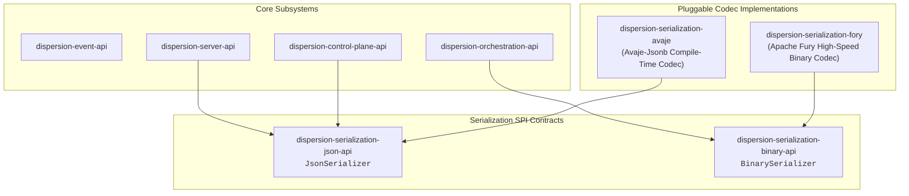

# Serialization & Wire Formats Guide

The **Dispersion Serialization Subsystem** provides high-throughput, low-latency, reflection-free serialization contracts and implementations for telemetry event streams, control plane descriptors, saga checkpoints, and inter-node network envelopes.

---

## 1. Architectural Architecture & SPI Inversion

Dispersion strictly decouples serialization through Service Provider Interfaces (SPI). Core workflow and orchestration engines never directly depend on third-party serialization libraries (such as Jackson, Avaje, or Fury). Instead, codecs plug in at runtime or compile time via standard Java module contracts:



### Module Matrix

| Module | JPMS Module Name | Responsibilities |
| :--- | :--- | :--- |
| **`dispersion-serialization-json-api`** | `com.github.f442y.dispersion.serialization.json` | Pure contract for `JsonSerializer`. Zero external dependencies. |
| **`dispersion-serialization-avaje`** | `com.github.f442y.dispersion.serialization.avaje` | Compile-time generated, reflection-free JSON serialization powered by **Avaje-Jsonb**. |
| **`dispersion-serialization-binary-api`** | `com.github.f442y.dispersion.serialization.binary` | Pure contract for `BinarySerializer`. Zero external dependencies. |
| **`dispersion-serialization-fory`** | `com.github.f442y.dispersion.serialization.fory` | High-throughput binary serialization powered by **Apache Fury** for checkpoints and transports. |

---

## 2. Compile-Time Reflection-Free JSON (Avaje-Jsonb)

### Why Avoid Runtime Reflection on Virtual Threads?
Traditional JSON frameworks (such as standard Jackson `ObjectMapper` or Gson) rely heavily on runtime reflection, runtime bytecode generation, and dynamic field inspection:
* **Cold-Start Latency:** Inspecting hundreds of records at startup introduces significant latency and JIT warm-up time.
* **Heap Churn:** Reflective access creates temporary metadata objects that pollute the young generation.
* **Native Image Incompatibility:** Reflection requires extensive GraalVM reflection configuration files.

Dispersion's `dispersion-serialization-avaje` uses **compile-time annotation processing** (`avaje-jsonb-generator`):
* Codecs are generated directly as Java source code at compile time.
* Serialization hot paths write directly to byte and character buffers with **zero reflection**.
* Fully compatible with ahead-of-time (AOT) compilation and GraalVM native images.

---

## 3. Polymorphic Telemetry Event Serialization

Dispersion publishes a rich hierarchy of 28 immutable record events implementing [`ExecutionEvent`](file:///C:/Users/faiza/development/dispersion/event/api/src/main/java/com/github/f442y/dispersion/event/ExecutionEvent.java).

### Discriminated Type Hierarchy
All events are serialized with a standard `"type"` discriminator attribute:

```json
{
  "type": "TurnStartedEvent",
  "eventId": "evt-019283",
  "machineId": "order-workflow-42",
  "turnNumber": 1,
  "timestamp": 1727400000000
}
```

```json
{
  "type": "StateTransitionedEvent",
  "eventId": "evt-019284",
  "machineId": "order-workflow-42",
  "fromState": "VALIDATE_ORDER",
  "toState": "RESERVE_INVENTORY",
  "turnNumber": 1,
  "timestamp": 1727400000150
}
```

### Supported Event Hierarchy

| Category | Event Record Types |
| :--- | :--- |
| **Turn Lifecycle** | `TurnStartedEvent`, `TurnCompletedEvent`, `TurnSuspendedEvent`, `TurnFailedEvent` |
| **State Execution** | `StateEnteredEvent`, `StateExitedEvent`, `StateTransitionedEvent`, `StateSkippedEvent` |
| **Signal Handling** | `SignalReceivedEvent`, `SignalDeliveredEvent`, `SignalIgnoredEvent` |
| **Compensation** | `CompensationStartedEvent`, `CompensationCompletedEvent`, `CompensationFailedEvent` |
| **Retries & Guards** | `ActionRetryAttemptedEvent`, `GuardEvaluatedEvent` |
| **Fork-Join & Parallel** | `ParallelBranchStartedEvent`, `ParallelBranchCompletedEvent`, `ChildMachineSpawnedEvent` |
| **Batch Progression** | `BatchItemProcessedEvent`, `BatchBarrierReachedEvent`, `BatchCompletedEvent` |
| **Control & Routing** | `MachineRegisteredEvent`, `WorkloadRoutedEvent` |

### Code Example: Polymorphic Serialization

```java
import com.github.f442y.dispersion.event.ExecutionEvent;
import com.github.f442y.dispersion.event.transition.StateTransitionedEvent;
import com.github.f442y.dispersion.serialization.avaje.AvajeJsonSerializer;
import com.github.f442y.dispersion.serialization.json.JsonSerializer;

JsonSerializer serializer = new AvajeJsonSerializer();

// 1. Serialize any concrete polymorphic event
StateTransitionedEvent event = new StateTransitionedEvent(
    "evt-101", "order-fsm-1", "PAYMENT_PENDING", "PAYMENT_CONFIRMED", 2, System.currentTimeMillis()
);
String json = serializer.toJson(event);

// 2. Deserialize polymorphically back into the exact record instance
ExecutionEvent rehydrated = serializer.fromJson(json, ExecutionEvent.class);
assert rehydrated instanceof StateTransitionedEvent;
```

---

## 4. Sub-Microsecond Binary Serialization (Apache Fury)

While JSON is ideal for browser SSE streams, REST queries, and human observability, distributed sagas and high-volume checkpointing require maximum performance.

`dispersion-serialization-fory` integrates **Apache Fury**, a high-speed multi-language serialization framework:
* **Sub-Microsecond Speed:** Serializes complex context objects in under 500 nanoseconds.
* **Zero-Copy Byte Buffers:** Minimizes heap allocations by writing directly to contiguous off-heap or direct byte buffers.
* **Compact Footprint:** Binary representations are typically 70–85% smaller than equivalent JSON payloads.

```java
import com.github.f442y.dispersion.serialization.binary.BinarySerializer;
import com.github.f442y.dispersion.serialization.fory.ForyBinarySerializer;

BinarySerializer binarySerializer = new ForyBinarySerializer();

// 1. Serialize domain context or checkpoint snapshot
byte[] payload = binarySerializer.serialize(orderContext);

// 2. Deserialize with high-throughput zero-reflection decoder
OrderContext restored = binarySerializer.deserialize(payload, OrderContext.class);
```

---

## 5. Schema Evolution & Long-Lived Sagas

In distributed saga systems, a workflow execution may suspend in `waitForSignal` for minutes, hours, or even days waiting for external events (e.g. human approval or webhook callbacks). During this time, application code may be redeployed with updated schema versions.

### Best Practices for Resilient Evolution:
1. **Additive Evolution:** When modifying context records, always append new fields with nullable types (`java.lang.String`, optional fields) or default primitive values.
2. **Immutable Keys:** Never rename `StateKey` enum ordinals or string values across active rolling deployments.
3. **Discriminator Preservation:** Preserve the exact `"type"` discriminator strings for event records.
4. **Idempotent Deserialization:** The `JsonSerializer` and `BinarySerializer` ignore unknown JSON attributes and handle missing optional fields gracefully.

---

## 6. Maven Configuration

To include the Avaje JSON and Apache Fury binary codecs in your project:

```xml
<dependencyManagement>
    <dependencies>
        <dependency>
            <groupId>com.github.f442y.dispersion</groupId>
            <artifactId>dispersion-bom</artifactId>
            <version>0.1.0-SNAPSHOT</version>
            <type>pom</type>
            <scope>import</scope>
        </dependency>
    </dependencies>
</dependencyManagement>

<dependencies>
    <!-- Avaje-Jsonb Compile-Time JSON Serializer -->
    <dependency>
        <groupId>com.github.f442y.dispersion</groupId>
        <artifactId>dispersion-serialization-avaje</artifactId>
    </dependency>

    <!-- Apache Fury Binary Serializer (Optional: for binary stores) -->
    <dependency>
        <groupId>com.github.f442y.dispersion</groupId>
        <artifactId>dispersion-serialization-fory</artifactId>
    </dependency>
</dependencies>
```

---

## 🔗 Related Subsystems & Guides

* 🏠 [**Project Showcase (`README.md`)**](../README.md) — Subsystem catalog and quickstarts.
* 🔭 [**Observability & Control Plane Guide**](observability-and-control-plane.md) — Server REST and SSE streaming endpoints.
* 🌐 [**Workload Routing & Traffic Splitting Guide**](workload-routing-and-traffic-splitting.md) — Wire envelopes and network messaging.
* 🔄 [**Saga Orchestration & Batching Guide**](saga-orchestration-and-batching.md) — Checkpoint persistence and suspension turns.
* 🧭 [**Documentation Hub (`docs/README.md`)**](README.md) — Master navigation and reading paths.
