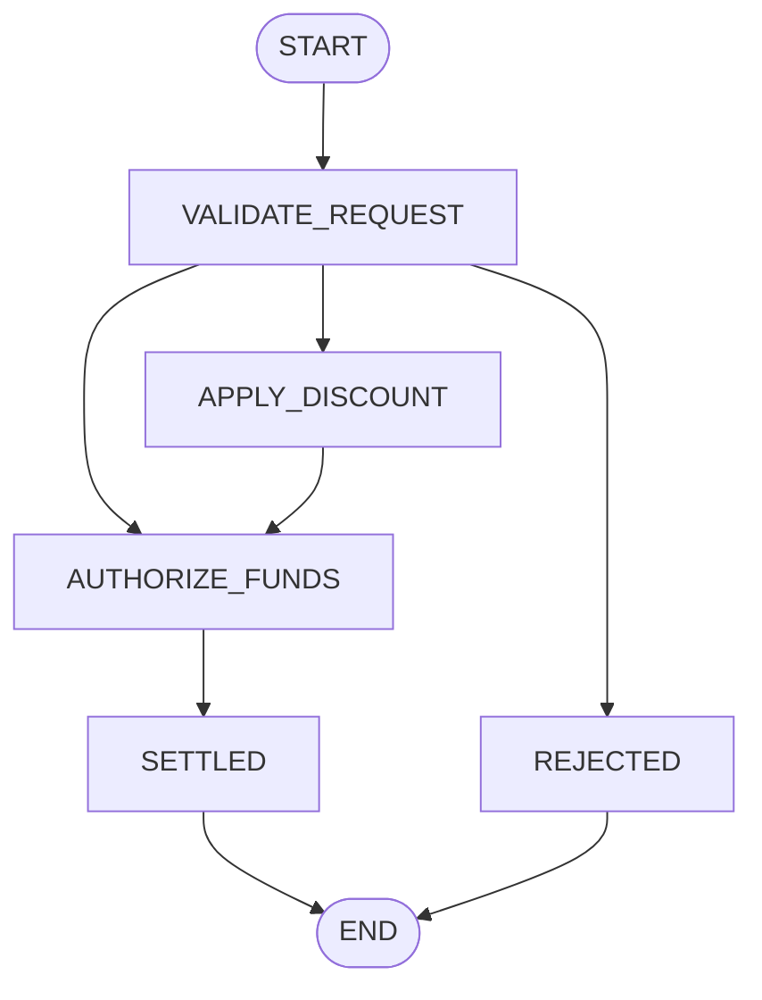

# Tier 1: Atomic (Micro) State Machines

Atomic state machines are designed for **in-memory, high-throughput, thread-confined execution**. Operating strictly within a single Virtual Thread, an atomic machine transitions sequentially through a deterministic directed graph from an initial state to a declared terminal state.

Atomic state machines are ideal for:
- Low-latency business validation rules.
- Protocol decoding and packet parsing.
- Financial trade validation and order sizing.
- Single-turn micro-workflows embedded as child machines inside Orchestration Sagas.

---

## 1. Defining States & Context

All state definitions in Dispersion are type-safe enums implementing the `StateKey` interface. Context objects hold domain data and must implement `StateMachineContext`.

```java
import com.github.f442y.dispersion.context.StateMachineContext;
import com.github.f442y.dispersion.state.StateKey;

// 1. Declare State Keys as an Enum
public enum PaymentState implements StateKey {
    VALIDATE_REQUEST,
    APPLY_DISCOUNT,
    AUTHORIZE_FUNDS,
    SETTLED,
    REJECTED
}

// 2. Declare Domain Context (thread-confined POJO)
public class PaymentContext implements StateMachineContext {
    public String transactionId;
    public double amount;
    public boolean discountEligible;
    public double finalAmount;
    public String approvalCode;
    public String failureReason;
}

// 3. Declare Input & Output DTOs
public record PaymentRequest(String transactionId, double amount, boolean discountEligible) {}
public record PaymentResult(String transactionId, double chargedAmount, String approvalCode, boolean success) {}
```

---

## 2. Building the State Machine

Use `AtomicStateMachineBuilder` to assemble the topology, configure actions, map inputs, and extract outputs:

```java
import com.github.f442y.dispersion.atomic.AtomicStateMachineBuilder;
import com.github.f442y.dispersion.atomic.AtomicStateMachineExecutor;
import com.github.f442y.dispersion.config.StateMachineConfiguration;
import java.util.Set;

StateMachineConfiguration<PaymentContext, PaymentState, PaymentRequest, PaymentResult> config =
    AtomicStateMachineBuilder.<PaymentContext, PaymentState, PaymentRequest, PaymentResult>create(PaymentState.class)
        // Fresh context instance per execution
        .context(PaymentContext::new)

        // Starting state
        .initialState(PaymentState.VALIDATE_REQUEST)

        // Input mapping: maps external request to context
        .input((ctx, req) -> {
            ctx.transactionId = req.transactionId();
            ctx.amount = req.amount();
            ctx.discountEligible = req.discountEligible();
            ctx.finalAmount = req.amount();
            return ctx;
        })

        // State 1: Validation with Dynamic Branching
        .state(PaymentState.VALIDATE_REQUEST)
            .action(ctx -> {
                if (ctx.amount <= 0) {
                    ctx.failureReason = "Amount must be strictly positive";
                }
                return ctx;
            })
            // Branch conditionally: if invalid -> REJECTED; else if discount -> APPLY_DISCOUNT; else -> AUTHORIZE_FUNDS
            .transitionsTo(
                Set.of(PaymentState.REJECTED, PaymentState.APPLY_DISCOUNT, PaymentState.AUTHORIZE_FUNDS),
                ctx -> {
                    if (ctx.failureReason != null) return PaymentState.REJECTED;
                    return ctx.discountEligible ? PaymentState.APPLY_DISCOUNT : PaymentState.AUTHORIZE_FUNDS;
                }
            )

        // State 2: Apply Discount
        .state(PaymentState.APPLY_DISCOUNT)
            .action(ctx -> {
                ctx.finalAmount = ctx.amount * 0.90; // 10% discount
                return ctx;
            })
            .transition(PaymentState.AUTHORIZE_FUNDS)

        // State 3: Authorize Funds
        .state(PaymentState.AUTHORIZE_FUNDS)
            .action(ctx -> {
                ctx.approvalCode = "AUTH-" + ctx.transactionId.hashCode();
                return ctx;
            })
            .transition(PaymentState.SETTLED)

        // Terminal End States
        .endStates(PaymentState.SETTLED, PaymentState.REJECTED)

        // Output mapping: maps final context to caller result
        .output(ctx -> new PaymentResult(
            ctx.transactionId,
            ctx.finalAmount,
            ctx.approvalCode,
            ctx.failureReason == null
        ))
        .build();
```

---

## 3. Synchronous & Asynchronous Dispatching

Wrap the configuration in an `AtomicStateMachineExecutor` to execute workloads on Virtual Threads:

```java
// Recommended: Wrap executor in try-with-resources
try (AtomicStateMachineExecutor<PaymentContext, PaymentState, PaymentRequest, PaymentResult> executor =
        new AtomicStateMachineExecutor<>("payment-engine", config)) {

    // Synchronous Dispatch (blocks caller until execution reaches terminal state)
    PaymentResult result = executor.dispatchSync(new PaymentRequest("TX-1001", 250.00, true));
    System.out.printf("Approved: %s, Amount: $%.2f, Auth: %s%n",
        result.success(), result.chargedAmount(), result.approvalCode());

    // Asynchronous Dispatch (returns a CompletableFuture on a Virtual Thread)
    executor.dispatchAsync(new PaymentRequest("TX-1002", 50.00, false))
        .thenAccept(res -> System.out.println("Async result: " + res.approvalCode()));
}
```

---

## 4. Resilience & Graph Safety

Dispersion incorporates built-in defensive guards directly within the state machine runtime:

### State Visit Limits (`maxVisits`)
Prevent cyclic infinite loops or infinite retry traps by specifying how many times an individual state may be entered before diverting execution to a safe fallback state:

```java
.state(PaymentState.AUTHORIZE_FUNDS)
    .action(ctx -> callGateway(ctx))
    // If visited more than 3 times, divert execution immediately to FALLBACK_OFFLINE
    .maxVisits(3, PaymentState.FALLBACK_OFFLINE)
    .transition(PaymentState.SETTLED)
```

If no fallback state is supplied, exceeding the visit threshold throws `MaxStateVisitsExceededException`.

### Global Transition Limits (`maxTransitions`)
Guards the entire execution against unintended circular graph traversal:

```java
AtomicStateMachineBuilder.<MyContext, MyState, In, Out>create(MyState.class)
    // Abort execution if total state transitions exceed 50
    .maxTransitions(50)
    // ...
```

### Admission Control & Backpressure (`AdmissionController`)
Buffer incoming virtual thread tasks to prevent memory exhaustion under burst traffic spikes:

```java
import com.github.f442y.dispersion.executor.AdmissionController;
import com.github.f442y.dispersion.executor.BufferedStateMachineExecutor;

// Buffer up to 10,000 tasks; reject immediately with BackpressureException if full
AdmissionController admission = AdmissionController.rejectImmediately(10_000);

BufferedStateMachineExecutor<PaymentContext, PaymentState, PaymentRequest, PaymentResult> bufferedExecutor =
    new BufferedStateMachineExecutor<>("buffered-payment", config, admission);

PaymentResult res = bufferedExecutor.dispatchSync(request);
```

---

## 5. Visualizing Topology with Mermaid Diagrams

Dispersion validates graph continuity at build time and can generate Mermaid flowchart diagrams for instant architectural inspection:

```java
String mermaid = config.getStateMap().toMermaid();
System.out.println(mermaid);
```

**Generated Mermaid Diagram:**



---

## Next Steps

- Proceed to **[Tier 2: Orchestration & Distributed Sagas](tier-2-orchestration-sagas.md)** to implement durable, turn-based workflows with automated LIFO Saga rollbacks.
- Check **[Observability & Control Plane](observability-and-control-plane.md)** to inspect state machine topology and stream execution events in real-time.
