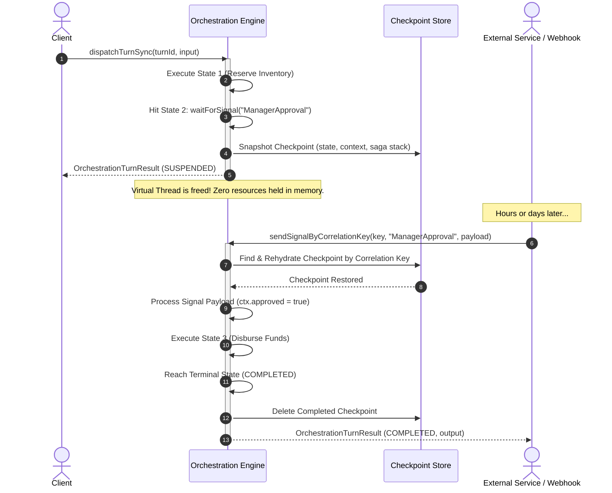
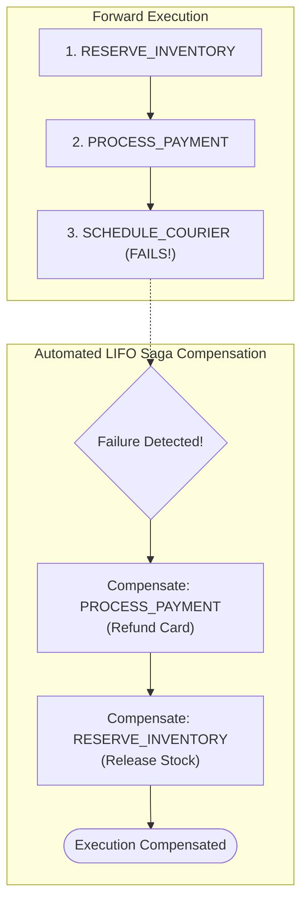

# Tier 2: Orchestration (Macro) State Machines & Distributed Sagas

Orchestration state machines coordinate **long-running, durable, multi-turn distributed workflows**. Unlike atomic state machines that run to completion on a single virtual thread, orchestration workflows can pause at suspension states, snapshot their state into a `CheckpointStore`, release virtual threads, and resume hours or days later upon receiving external signals.

Moreover, Orchestration machines provide **automated LIFO Saga compensation rollbacks**, **concurrent parallel fork-join execution**, and **resilient child machine retry loops**.

> **Maven Coordinates:**
> - Contract / API: `com.github.f442y.dispersion:dispersion-orchestration-api`
> - Runtime / Core: `com.github.f442y.dispersion:dispersion-orchestration-core`
> - Base FSM Primitives: `com.github.f442y.dispersion:dispersion-fsm-api`

---

## 1. The Turn-Based Execution Model

An orchestration workflow advances in discrete execution **turns**.



---

## 2. Defining States, Context & Checkpoint Persistence

```java
import com.github.f442y.dispersion.fsm.context.StateMachineContext;
import com.github.f442y.dispersion.fsm.state.StateKey;
import com.github.f442y.dispersion.orchestration.CheckpointStore;
import com.github.f442y.dispersion.orchestration.core.InMemoryCheckpointStore;

// 1. Declare States
public enum OrderState implements StateKey {
    VALIDATE_ORDER,
    RESERVE_INVENTORY,
    PROCESS_PAYMENT,
    AWAIT_DISPATCH_CONFIRMATION,
    ORDER_COMPLETED
}

// 2. Domain Context
public class OrderContext implements StateMachineContext {
    public String orderId;
    public double amount;
    public boolean stockReserved;
    public boolean paymentCaptured;
    public String trackingNumber;
}

// 3. Signal Payload Record
public record DispatchConfirmedSignal(String orderId, String trackingNumber) {}

// 4. Checkpoint Store (in-memory or persistent database adapter)
CheckpointStore<OrderContext, OrderState> checkpointStore = new InMemoryCheckpointStore<>();
```

---

## 3. Building an Orchestration Workflow

Use `OrchestrationStateMachineBuilder` to configure your workflow:

```java
import com.github.f442y.dispersion.orchestration.OrchestrationTurnResult;
import com.github.f442y.dispersion.orchestration.core.OrchestrationStateMachineBuilder;
import com.github.f442y.dispersion.orchestration.core.OrchestrationStateMachineExecutor;

OrchestrationStateMachineExecutor<OrderContext, OrderState, OrderContext, String> executor =
    OrchestrationStateMachineBuilder.<OrderContext, OrderState, OrderContext, String>create("OrderPipeline", OrderState.class)
        .context(OrderContext::new)
        .initialState(OrderState.VALIDATE_ORDER)
        .checkpointStore(checkpointStore)
        // Establishes the correlation key for routing inbound signals:
        .correlationKey(ctx -> ctx.orderId)
        .input((ctx, input) -> {
            ctx.orderId = input.orderId;
            ctx.amount = input.amount;
            return ctx;
        })

        // Step 1: Validate Order
        .state(OrderState.VALIDATE_ORDER)
            .action(ctx -> {
                System.out.println("Validating order " + ctx.orderId);
                return ctx;
            })
            .transition(OrderState.RESERVE_INVENTORY)

        // Step 2: Reserve Inventory with Saga Compensation
        .state(OrderState.RESERVE_INVENTORY)
            .action(ctx -> {
                ctx.stockReserved = true;
                System.out.println("Stock reserved for order " + ctx.orderId);
                return ctx;
            })
            .compensate(ctx -> {
                ctx.stockReserved = false;
                System.out.println("SAGA COMPENSATION: Released reserved stock for " + ctx.orderId);
                return ctx;
            })
            .transition(OrderState.PROCESS_PAYMENT)

        // Step 3: Process Payment with Saga Compensation
        .state(OrderState.PROCESS_PAYMENT)
            .action(ctx -> {
                ctx.paymentCaptured = true;
                System.out.println("Charged payment for order " + ctx.orderId);
                return ctx;
            })
            .compensate(ctx -> {
                ctx.paymentCaptured = false;
                System.out.println("SAGA COMPENSATION: Refunded payment for " + ctx.orderId);
                return ctx;
            })
            .transition(OrderState.AWAIT_DISPATCH_CONFIRMATION)

        // Step 4: Suspension Point - Awaits Warehouse Dispatch Signal
        .state(OrderState.AWAIT_DISPATCH_CONFIRMATION)
            .waitForSignal("DispatchConfirmed", DispatchConfirmedSignal.class, (ctx, signal) -> {
                ctx.trackingNumber = signal.trackingNumber();
                System.out.println("Dispatch signal received! Tracking: " + ctx.trackingNumber);
                return ctx;
            })
            .transition(OrderState.ORDER_COMPLETED)

        .endStates(OrderState.ORDER_COMPLETED)
        .output(ctx -> "Order " + ctx.orderId + " completed. Tracking: " + ctx.trackingNumber)
        .buildExecutor();
```

---

## 4. Executing Turns & Sending Signals

### Turn 1: Initial Dispatch (Suspension)
```java
OrderContext initialOrder = new OrderContext();
initialOrder.orderId = "ORD-9901";
initialOrder.amount = 149.99;

// Turn 1 executes VALIDATE_ORDER -> RESERVE_INVENTORY -> PROCESS_PAYMENT -> AWAIT_DISPATCH_CONFIRMATION
OrchestrationTurnResult<OrderContext, OrderState, String> turn1 =
    executor.dispatchTurnSync(null, initialOrder);

System.out.println("Turn 1 Suspended: " + turn1.isSuspended()); // true
System.out.println("Current State: " + turn1.currentStateKey()); // AWAIT_DISPATCH_CONFIRMATION
```

### Turn 2: Inbound Signal Delivery (Completion)
When the external webhook arrives hours later, dispatch the signal using the correlation key:

```java
OrchestrationTurnResult<OrderContext, OrderState, String> turn2 = executor.sendSignalByCorrelationKey(
    "ORD-9901",
    "DispatchConfirmed",
    new DispatchConfirmedSignal("ORD-9901", "TRACK-XYZ-888")
).get();

System.out.println("Turn 2 Completed: " + turn2.isCompleted()); // true
System.out.println("Result: " + turn2.output()); // Order ORD-9901 completed. Tracking: TRACK-XYZ-888
```

---

## 5. Automated LIFO Saga Rollbacks

If any state execution throws an exception, Dispersion immediately halts forward execution and unwinds previously completed compensations in **strict reverse chronological (LIFO) order**.



If an error occurs in step 3:
1. Engine halts execution.
2. Step 2 compensation (`Refund payment`) runs first.
3. Step 1 compensation (`Release reserved stock`) runs second.
4. Checkpoint status is marked `COMPENSATED` and an `ExecutionEvent.TurnCompensatedEvent` is emitted.

---

## 6. Concurrent Parallel Fork-Join Execution

Execute independent branches concurrently on Virtual Threads using `.parallel()`. If any branch fails, sibling branches are automatically cancelled and completed sibling branches are compensated:

```java
.state(OrderState.PARALLEL_ENRICHMENT)
    .parallel()
        // Branch 1: Check credit score
        .branch("credit-score",
            ctx -> {
                ctx.creditScore = creditService.fetch(ctx.userId);
                return ctx;
            },
            ctx -> {
                // Compensation if sibling fails
                return ctx;
            }
        )
        // Branch 2: Run fraud analysis
        .branch("fraud-detection",
            ctx -> {
                ctx.fraudScore = fraudService.analyze(ctx.orderId);
                return ctx;
            },
            ctx -> {
                // Fraud check rollback
                return ctx;
            }
        )
        // Branch 3: Calculate taxes
        .branch("tax-calculation",
            ctx -> {
                ctx.taxAmount = taxService.calculate(ctx.amount);
                return ctx;
            }
        )
    .transition(OrderState.FINALIZE_APPROVAL)
```

---

## 7. Embedding Child Atomic FSMs with Retries

Orchestration workflows can embed Tier 1 Atomic state machines as discrete states, configured with exponential backoff and context sanitization:

```java
import com.github.f442y.dispersion.orchestration.RetryPolicy;
import java.time.Duration;

.state(OrderState.CHARGE_PAYMENT)
    // Embed Atomic child FSM
    .atomicMachine(cardPaymentMicroExecutor)
    .input(ctx -> new CardPaymentInput(ctx.orderId, ctx.amount))
    .output((ctx, authCode) -> {
        ctx.authorizationCode = authCode;
        return ctx;
    })
    // Exponential retry policy: 3 attempts, initial delay 100ms, 2.0x backoff multiplier
    .retry(RetryPolicy.exponentialBackoff(3, Duration.ofMillis(100), 2.0))
    // Context Recoverer: Generates fresh idempotency key before retry
    .recoverer((ctx, error, attempt) -> {
        System.out.printf("Retry attempt %d due to: %s%n", attempt, error.getMessage());
        ctx.idempotencyKey = "IDEMP-" + ctx.orderId + "-TRY-" + attempt;
        return ctx;
    })
    .transition(OrderState.FULFILLMENT)
```

---

## Next Steps

- Learn about **[Distributed Messaging & Batch Barriers](distributed-messaging-and-batching.md)** to process exactly-once commands and streaming batch collections.
- Explore **[Observability & Control Plane](observability-and-control-plane.md)** to inspect suspended checkpoints and dispatch signals via the Control Plane registry.
