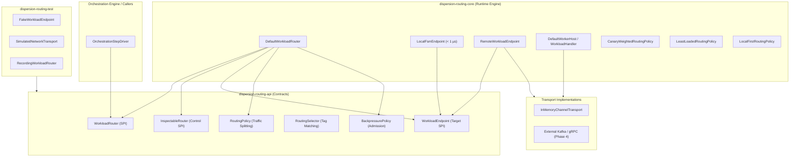

# Workload Routing & Traffic Splitting Guide

The **Dispersion Workload Routing Subsystem** delivers a high-throughput, **location-agnostic execution router** engineered for **Java 25+ Virtual Threads**. It enables state machine actions to execute interchangeably as **sub-microsecond in-process monolith calls** (< 1 µs latency, zero serialization, zero network) or as **distributed microservice worker invocations**, equipped with dynamic traffic policies (Canary rolling updates, developer sandboxes), backpressure admission control, and live Control Plane observability.

---

## 1. Architectural Architecture & Hexagonal Decoupling

The routing subsystem enforces strict hexagonal boundaries. The core orchestration and state machine engines interact exclusively with abstract contracts:



### Module Isolation Matrix

| Module | JPMS Module Name | Responsibilities |
| :--- | :--- | :--- |
| **`dispersion-routing-api`** | `com.github.f442y.dispersion.routing.api` | Contracts for `WorkloadRouter`, `InspectableRouter`, `WorkloadEndpoint`, `RoutingSelector`, and `WorkloadEnvelope`. Zero dependencies beyond `jspecify` and `slf4j-api`. |
| **`dispersion-routing-core`** | `com.github.f442y.dispersion.routing.core` | Lock-free routing registry, Canary traffic splitters, worker hosts, in-process local endpoints, and in-memory transports. |
| **`dispersion-routing-test`** | `com.github.f442y.dispersion.routing.test` | Deterministic testing doubles (`FakeWorkloadEndpoint`, `SimulatedNetworkTransport`, `RecordingWorkloadRouter`). |

---

## 2. Location-Agnostic Execution: Monolith to Microservice

A critical advantage of Dispersion's routing architecture is **location independence**. State machines define service invocations conceptually (e.g., `invoke("pricing-service")`) without knowledge of physical topology:

```
                      ┌─── "pricing-service" ───┐
                      │                         │
            [WorkloadRouter]                    │
                      │                         │
         ┌────────────┴────────────┐            │
         ▼                         ▼            │
[LocalFsmEndpoint]       [RemoteWorkloadEndpoint]
  • In-Process Monolith    • Distributed Microservice
  • < 1 µs Latency         • Network Transport
  • Zero Serialization     • Async Request-Reply
  • Zero Network           • Partition Fault Tolerance
```

### 1. In-Process Monolith Execution (`LocalFsmEndpoint`)
When a service is co-located in the same JVM process, the router dispatches directly on the caller's Java 25 virtual thread:
* **Zero serialization:** Objects pass by reference without JSON/binary encoding overhead.
* **Sub-microsecond latency:** Transitions execute in under 1 microsecond.
* **Zero network stack:** No socket allocations, frame encoding, or serialization hops.

### 2. Distributed Microservice Worker (`RemoteWorkloadEndpoint` + `DefaultWorkerHost`)
When a service is partitioned out into remote worker nodes:
* The client wraps the payload into a `WorkloadEnvelope`.
* `RemoteWorkloadEndpoint` transmits the envelope across a `ChannelTransport` (in-memory bus, Kafka topic, or gRPC stream).
* `DefaultWorkerHost` runs on the worker node, receives the message, invokes the registered `WorkloadHandler` on a virtual thread, and dispatches the correlated response back across the transport.

---

## 3. Dynamic Traffic Policies & Canary Releases

Dispersion provides first-class traffic steering via `RoutingPolicy`:

### 1. Canary Rolling Deployments (`CanaryWeightedRoutingPolicy`)
Safely roll out service revisions by splitting live production traffic across versions based on deterministic modulo hashing or weighted random distribution:

```java
import com.github.f442y.dispersion.routing.core.DefaultWorkloadRouter;
import com.github.f442y.dispersion.routing.core.policy.CanaryWeightedRoutingPolicy;
import java.util.Map;

// 90% production baseline (v1.0.0), 10% canary candidate (v2.0.0)
CanaryWeightedRoutingPolicy canaryPolicy = new CanaryWeightedRoutingPolicy(
    Map.of("version", "1.0.0"),  // Baseline endpoint tags
    Map.of("version", "2.0.0"),  // Canary endpoint tags
    10                           // 10% canary traffic
);

DefaultWorkloadRouter router = DefaultWorkloadRouter.builder()
    .routingPolicy("pricing-service", canaryPolicy)
    .build();
```

### 2. Local-First Routing (`LocalFirstRoutingPolicy`)
Prioritizes in-process `LocalFsmEndpoint` instances whenever available, automatically failing over to remote endpoints only when the local endpoint is saturated or unavailable.

### 3. Least-Loaded Routing (`LeastLoadedRoutingPolicy`)
Inspects active concurrency counters across all registered endpoints and dynamically selects the worker with the lowest in-flight execution count.

---

## 4. Developer Sandboxes & Tag-Based Isolation

In shared development and staging environments, developers often need to route traffic to local worker instances without polluting production streams. Dispersion solves this with **Tag-Based Routing Selectors**:

```java
import com.github.f442y.dispersion.routing.selector.RoutingSelector;

// Match workers explicitly tagged for developer sandbox testing
RoutingSelector developerSandbox = RoutingSelector.requireTag("developer", "faizan");

// Dispatch with developer tag override
PricingResult result = router.routeSync(
    "pricing-service",
    new PricingRequest("ORD-101", 100.0),
    WorkloadMetadata.builder("pricing-service", "corr-101")
        .selector(developerSandbox)
        .build(),
    Duration.ofSeconds(2)
);
```

If no worker matches the tag selector, the router responds according to the configured fallback policy (rejection or fallback to baseline pool).

---

## 5. Backpressure Admission Control

To protect worker nodes against cascading thundering herds, every `WorkloadEndpoint` enforces admission control:

| Policy | Behavior | Typical Scenario |
| :--- | :--- | :--- |
| **`FAIL_FAST`** | Instantly throws `BackpressureExceededException` when active concurrency reaches endpoint capacity. | Low-latency client APIs with strict SLA timeouts. |
| **`PARK_WITH_TIMEOUT`** | Parks the invoking Java 25 virtual thread using lightweight carrier unmounting until capacity is released. | High-throughput background ingestion pipelines. |

---

## 6. Integration with Distributed Sagas

Within the Orchestration engine (`orchestration/`), state nodes bind directly to the `WorkloadRouter`:

```java
import com.github.f442y.dispersion.orchestration.core.OrchestrationBuilder;
import com.github.f442y.dispersion.routing.selector.RoutingSelector;
import java.time.Duration;

OrchestrationBuilder.<OrderContext, OrderState, OrderRequest, OrderResult>create("OrderSaga", OrderState.class)
    .workloadRouter(router)

    .state(OrderState.RESERVE_INVENTORY)
        // Network-routed invocation
        .invoke("inventory-service", ReserveRequest.class, ReserveResponse.class)
            .input(ctx -> new ReserveRequest(ctx.orderId, ctx.items))
            .output((ctx, res) -> { ctx.reservationId = res.reservationId(); return ctx; })
            .routingSelector(RoutingSelector.requireTag("tier", "prod"))
            // Network-routed automated LIFO compensation rollback
            .compensate(ctx -> new ReleaseRequest(ctx.reservationId))
            .timeout(Duration.ofSeconds(5))
            .transition(OrderState.PROCESS_PAYMENT);
```

When an orchestration step fails downstream, the engine automatically walks the compensation stack in LIFO order, routing compensation commands through the `WorkloadRouter` back to the responsible worker services.

---

## 7. Control Plane Observability (`InspectableRouter`)

The router implements the `InspectableRouter` SPI, enabling seamless registration into the Control Plane:

```java
import com.github.f442y.dispersion.control.core.DefaultControlPlane;

DefaultControlPlane controlPlane = DefaultControlPlane.createDefault();
controlPlane.registerRouter(router.asInspectableRouter());
```

Operators querying the Control Plane REST/SSE endpoints can inspect:
* Active endpoints by service name and node ID.
* Endpoint metadata tags (`version`, `region`, `developer`).
* Live in-flight concurrency, total routed workloads, and backpressure rejection counts.

---

## 8. Deterministic Testing (`dispersion-routing-test`)

The `dispersion-routing-test` module provides pure in-memory test doubles without third-party mocking libraries:

```java
import com.github.f442y.dispersion.routing.test.FakeWorkloadEndpoint;
import com.github.f442y.dispersion.routing.test.SimulatedNetworkTransport;
import java.time.Duration;

// 1. Simulate network transport with latency and packet drops
SimulatedNetworkTransport transport = new SimulatedNetworkTransport(
    Duration.ofMillis(25), // Injected artificial latency
    0.05                   // 5% simulated packet loss rate
);

// 2. Deterministic fake endpoint with programmable behavior
FakeWorkloadEndpoint<String, String> fakeEndpoint = new FakeWorkloadEndpoint<>(
    "fake-worker-1",
    "fraud-check",
    in -> in.equals("RISK") ? "DECLINED" : "APPROVED"
);

router.registerEndpoint(fakeEndpoint);
```

---

## 🔗 Related Subsystems & Guides

* 🏠 [**Project Showcase (`README.md`)**](../README.md) — High-level landing page and quickstarts.
* 🔄 [**Saga Orchestration & Batching Guide**](saga-orchestration-and-batching.md) — Turn-based workflows and routed compensations.
* 🔭 [**Observability & Control Plane Guide**](observability-and-control-plane.md) — Monitoring router metrics and endpoint registries.
* ⚡ [**Virtual Threads Performance Guide**](virtual-threads-and-performance.md) — Unmounting, non-pinning locks, and Loom mechanics.
* 🧭 [**Documentation Hub (`docs/README.md`)**](README.md) — Master navigation and reading paths.
