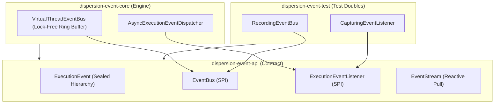

# Dispersion Event Subsystem (`event`)

The **Dispersion Event Subsystem** is an asynchronous, high-throughput telemetry and event delivery backbone built for **Java 25+ Virtual Threads**. It provides engine-wide visibility into state machine executions, transitions, saga compensations, signals, and batch barrier synchronizations without impeding hot-path execution.

---

## 1. Module Structure & Hexagonal Topology

The event subsystem is decomposed into three strictly decoupled modules conforming to the Ports-and-Adapters (Hexagonal) pattern:



### Module Matrix

| Module | JPMS Module Name | Description |
| :--- | :--- | :--- |
| **`dispersion-event-api`** | `com.github.f442y.dispersion.event.api` | Sealed event records, SPI listener interfaces, overflow policies, and event stream contracts. Zero runtime dependencies. |
| **`dispersion-event-core`** | `com.github.f442y.dispersion.event.core` | High-performance virtual thread event bus with lock-free ring buffering, bounded history replay, and configurable overflow policies. |
| **`dispersion-event-test`** | `com.github.f442y.dispersion.event.test` | Reusable in-memory test doubles (`RecordingEventBus`, `CapturingEventListener`) for zero-dependency unit and integration testing. |

---

## 2. Sealed Telemetry Events (`ExecutionEvent`)

Every milestone in a state machine lifecycle emits an immutable, strongly-typed record extending `ExecutionEvent`. In Java 25, the sealed interface permits exhaustive pattern-matching `switch` expressions with arrow (`->`) syntax:

```java
package com.example.telemetry;

import com.github.f442y.dispersion.event.ExecutionEvent;
import org.slf4j.Logger;
import org.slf4j.LoggerFactory;

public final class TelemetryLogger {

    private static final Logger log = LoggerFactory.getLogger(TelemetryLogger.class);

    public void processEvent(ExecutionEvent event) {
        switch (event) {
            case ExecutionEvent.TurnStartedEvent started ->
                log.atInfo()
                   .addKeyValue("machine_id", started.machineId())
                   .addKeyValue("machine_name", started.machineName())
                   .log("Turn execution started");

            case ExecutionEvent.StateEnteredEvent entered ->
                log.atDebug()
                   .addKeyValue("machine_id", entered.machineId())
                   .addKeyValue("state", entered.stateName())
                   .log("Entering state");

            case ExecutionEvent.ActionExecutedEvent action ->
                log.atDebug()
                   .addKeyValue("machine_id", action.machineId())
                   .addKeyValue("state", action.stateName())
                   .addKeyValue("duration_ms", action.duration().toMillis())
                   .log("State action executed successfully");

            case ExecutionEvent.TransitionEvaluatedEvent transition ->
                log.atDebug()
                   .addKeyValue("machine_id", transition.machineId())
                   .addKeyValue("source", transition.sourceState())
                   .addKeyValue("target", transition.targetState())
                   .log("State transition evaluated");

            case ExecutionEvent.StateExitedEvent exited ->
                log.atDebug()
                   .addKeyValue("machine_id", exited.machineId())
                   .addKeyValue("state", exited.stateName())
                   .addKeyValue("duration_ms", exited.duration().toMillis())
                   .log("Exited state");

            case ExecutionEvent.SignalAwaitedEvent awaited ->
                log.atInfo()
                   .addKeyValue("machine_id", awaited.machineId())
                   .addKeyValue("state", awaited.stateName())
                   .addKeyValue("expected_signal", awaited.expectedSignal())
                   .log("Workflow suspended waiting for external signal");

            case ExecutionEvent.SignalDeliveredEvent delivered ->
                log.atInfo()
                   .addKeyValue("machine_id", delivered.machineId())
                   .addKeyValue("signal", delivered.signalName())
                   .log("External signal delivered to workflow");

            case ExecutionEvent.TurnSuspendedEvent suspended ->
                log.atInfo()
                   .addKeyValue("machine_id", suspended.machineId())
                   .addKeyValue("state", suspended.stateName())
                   .log("Turn suspended and state checkpointed");

            case ExecutionEvent.TurnCompensatedEvent compensated ->
                log.atWarn()
                   .addKeyValue("machine_id", compensated.machineId())
                   .addKeyValue("failed_state", compensated.failedStateName())
                   .log("Turn failure triggered LIFO Saga compensation rollback");

            case ExecutionEvent.TurnCompletedEvent completed ->
                log.atInfo()
                   .addKeyValue("machine_id", completed.machineId())
                   .addKeyValue("duration_ms", completed.duration().toMillis())
                   .log("Turn execution completed successfully");

            case ExecutionEvent.TurnFailedEvent failed ->
                log.atError()
                   .addKeyValue("machine_id", failed.machineId())
                   .addKeyValue("failed_state", failed.failedStateName())
                   .setCause(failed.cause())
                   .log("Turn execution failed");

            case ExecutionEvent.BatchBarrierReachedEvent barrier ->
                log.atDebug()
                   .addKeyValue("machine_id", barrier.machineId())
                   .addKeyValue("item_key", barrier.itemKey())
                   .log("Batch item reached synchronization barrier");

            case ExecutionEvent.BatchBarrierUnlockedEvent unlocked ->
                log.atInfo()
                   .addKeyValue("machine_id", unlocked.machineId())
                   .addKeyValue("state", unlocked.stateName())
                   .log("Batch barrier unlocked; advancing to next stage");
        }
    }
}
```

---

## 3. High-Performance Virtual Thread Event Bus

The `VirtualThreadEventBus` delivers events asynchronously to registered subscribers without allocating OS threads or blocking the state machine runner.

### Key Features
* **Virtual Thread Worker Pool:** Event delivery runs on lightweight Loom virtual threads.
* **Overflow Protection:** Prevents out-of-memory errors under extreme burst conditions using configurable `OverflowPolicy`:
  * `DROP_OLDEST`: Drops the oldest unprocessed event in the ring buffer when full.
  * `DROP_LATEST`: Discards the inbound event if the ring buffer is at capacity.
  * `BLOCK`: Temporarily halts publishing until buffer space becomes available.
* **Bounded Historical Replay:** Retains a sliding window of recent events, allowing late-joining telemetry collectors, debuggers, or the Control Plane to reconstruct past timelines via `.history(limit)`.
* **Push & Pull APIs:** Supports push listeners via `.subscribe(listener)` and reactive pull streams via `.openStream()`.

### Configuration Example

```java
package com.example.event;

import com.github.f442y.dispersion.event.EventBusMetrics;
import com.github.f442y.dispersion.event.EventStream;
import com.github.f442y.dispersion.event.ExecutionEvent;
import com.github.f442y.dispersion.event.OverflowPolicy;
import com.github.f442y.dispersion.event.Subscription;
import com.github.f442y.dispersion.event.bus.VirtualThreadEventBus;
import org.slf4j.Logger;
import org.slf4j.LoggerFactory;

import java.time.Duration;
import java.util.List;

public final class EventBusExample {

    private static final Logger log = LoggerFactory.getLogger(EventBusExample.class);

    public void demonstrateBus() throws Exception {
        // 1. Instantiate VirtualThreadEventBus with buffer capacity 10,000 and DROP_OLDEST policy
        try (VirtualThreadEventBus bus = new VirtualThreadEventBus(10_000, OverflowPolicy.DROP_OLDEST, 500)) {

            // 2. Subscribe a push listener
            Subscription subscription = bus.subscribe(event -> {
                log.atInfo()
                   .addKeyValue("event_type", event.getClass().getSimpleName())
                   .addKeyValue("machine_name", event.machineName())
                   .log("Received telemetry event");
            });

            // 3. Open a pull stream for dedicated processing
            try (EventStream stream = bus.openStream()) {
                // Polling events with timeouts
                ExecutionEvent nextEvent = stream.poll(Duration.ofSeconds(2));
                if (nextEvent != null) {
                    log.atInfo()
                       .addKeyValue("stream_event", nextEvent.getClass().getSimpleName())
                       .log("Polled event from stream");
                }
            }

            // 4. Inspect historical events
            List<ExecutionEvent> history = bus.history(50);
            log.atInfo()
               .addKeyValue("history_size", history.size())
               .log("Queried historical execution events");

            // 5. Query metrics
            EventBusMetrics metrics = bus.metrics();
            log.atInfo()
               .addKeyValue("published_count", metrics.publishedCount())
               .addKeyValue("dropped_count", metrics.droppedCount())
               .log("Event bus performance metrics");

            // Unsubscribe listener when done
            subscription.unsubscribe();
        }
    }
}
```

---

## 4. Testing with Reusable Fakes (`dispersion-event-test`)

The `dispersion-event-test` module provides lightweight, zero-dependency test doubles that eliminate the need for mocking frameworks like Mockito:

* **`RecordingEventBus`**: Captures every emitted event synchronously into thread-safe collections. Exposes fluent assertions (`hasEventMatching(...)`, `clear()`, `allEvents()`).
* **`CapturingEventListener`**: Synchronous listener collecting events for immediate test inspection.

```java
package com.example.event;

import com.github.f442y.dispersion.event.ExecutionEvent;
import com.github.f442y.dispersion.event.test.CapturingEventListener;
import com.github.f442y.dispersion.event.test.RecordingEventBus;
import org.junit.jupiter.api.DisplayName;
import org.junit.jupiter.api.Test;

import java.util.List;

import static org.assertj.core.api.Assertions.assertThat;

public class EventTestingExampleTests {

    @Test
    @DisplayName("Should capture published events synchronously using RecordingEventBus")
    public void testRecordingEventBus() {
        RecordingEventBus bus = new RecordingEventBus();
        CapturingEventListener listener = new CapturingEventListener();
        bus.subscribe(listener);

        // State machine publishes events to the bus...
        // bus.publish(event);

        List<ExecutionEvent> captured = listener.capturedEvents();
        assertThat(captured).isNotNull();
    }
}
```

---

## 5. Maven Dependency Setup

Include the Event modules using the centralized BOM:

```xml
<dependencyManagement>
    <dependencies>
        <dependency>
            <groupId>com.github.f442y.dispersion</groupId>
            <artifactId>dispersion-bom</artifactId>
            <version>1.0.0-SNAPSHOT</version>
            <type>pom</type>
            <scope>import</scope>
        </dependency>
    </dependencies>
</dependencyManagement>

<dependencies>
    <!-- Public API Contract -->
    <dependency>
        <groupId>com.github.f442y.dispersion</groupId>
        <artifactId>dispersion-event-api</artifactId>
    </dependency>

    <!-- Runtime Engine -->
    <dependency>
        <groupId>com.github.f442y.dispersion</groupId>
        <artifactId>dispersion-event-core</artifactId>
    </dependency>

    <!-- Testing Utilities (Scope: Test) -->
    <dependency>
        <groupId>com.github.f442y.dispersion</groupId>
        <artifactId>dispersion-event-test</artifactId>
        <scope>test</scope>
    </dependency>
</dependencies>
```
