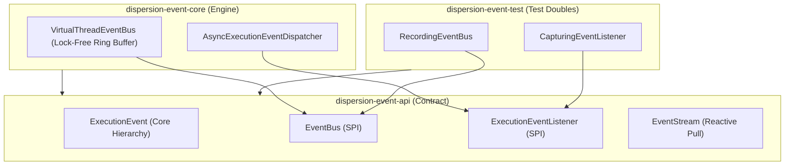

# Dispersion Event Subsystem (`event`)

The **Dispersion Event Subsystem** is an asynchronous, high-throughput telemetry and event delivery backbone built for **Java 25+ Virtual Threads**. It provides engine-wide visibility into state machine executions, transitions, saga compensations, signals, and batch barrier synchronizations without impeding hot-path execution.

---

## 1. Module Structure & Hexagonal Topology

The event subsystem is decomposed into three strictly decoupled modules conforming to the Ports-and-Adapters (Hexagonal) pattern:



### Module Matrix

| Module | JPMS Module Name | Description |
| :--- | :--- | :--- |
| **`dispersion-event-api`** | `com.github.f442y.dispersion.event.api` | Core telemetry event records, SPI listener interfaces, overflow policies, and event stream contracts. Zero runtime dependencies. |
| **`dispersion-event-core`** | `com.github.f442y.dispersion.event.core` | High-performance virtual thread event bus with lock-free ring buffering, bounded history replay, and configurable overflow policies. |
| **`dispersion-event-test`** | `com.github.f442y.dispersion.event.test` | Reusable in-memory test doubles (`RecordingEventBus`, `CapturingEventListener`) for zero-dependency unit and integration testing. |

---

## 2. Telemetry Events (`ExecutionEvent`)

Every milestone in a state machine lifecycle emits an immutable, strongly-typed record implementing `ExecutionEvent`. Core state machine lifecycle events are defined directly within modular subpackages (`event.turn`, `event.state`, `event.signal`, `event.compensation`, `event.retry`, `event.child`, `event.parallel`, `event.guard`, `event.control`), while domain-specific events (such as `CommandDeduplicatedEvent` in `orchestration/api` or `BatchBarrierReachedEvent` in `orchestration/batch`) implement `ExecutionEvent` cleanly from their own modules without cyclic dependencies.

In Java 25, pattern-matching `switch` expressions with arrow (`->`) syntax allow elegant consumption:

```java
package com.example.telemetry;

import com.github.f442y.dispersion.event.ExecutionEvent;
import com.github.f442y.dispersion.event.child.ChildMachineCompletedEvent;
import com.github.f442y.dispersion.event.child.ChildMachineSpawnedEvent;
import com.github.f442y.dispersion.event.compensation.CompensationStepCompletedEvent;
import com.github.f442y.dispersion.event.compensation.CompensationStepFailedEvent;
import com.github.f442y.dispersion.event.compensation.CompensationStepStartedEvent;
import com.github.f442y.dispersion.event.control.ExecutionCancelledEvent;
import com.github.f442y.dispersion.event.guard.CircuitBreakerTrippedEvent;
import com.github.f442y.dispersion.event.guard.StateVisitLimitExceededEvent;
import com.github.f442y.dispersion.event.parallel.ParallelBranchCompletedEvent;
import com.github.f442y.dispersion.event.parallel.ParallelForkStartedEvent;
import com.github.f442y.dispersion.event.parallel.ParallelJoinCompletedEvent;
import com.github.f442y.dispersion.event.retry.RetryAttemptedEvent;
import com.github.f442y.dispersion.event.retry.RetryExhaustedEvent;
import com.github.f442y.dispersion.event.signal.SignalAwaitedEvent;
import com.github.f442y.dispersion.event.signal.SignalDeliveredEvent;
import com.github.f442y.dispersion.event.state.ActionExecutedEvent;
import com.github.f442y.dispersion.event.state.StateEnteredEvent;
import com.github.f442y.dispersion.event.state.StateExitedEvent;
import com.github.f442y.dispersion.event.state.TransitionEvaluatedEvent;
import com.github.f442y.dispersion.event.turn.TurnCompensatedEvent;
import com.github.f442y.dispersion.event.turn.TurnCompletedEvent;
import com.github.f442y.dispersion.event.turn.TurnFailedEvent;
import com.github.f442y.dispersion.event.turn.TurnStartedEvent;
import com.github.f442y.dispersion.event.turn.TurnSuspendedEvent;
import org.slf4j.Logger;
import org.slf4j.LoggerFactory;

public final class TelemetryLogger {

    private static final Logger log = LoggerFactory.getLogger(TelemetryLogger.class);

    public void processEvent(ExecutionEvent event) {
        switch (event) {
            case TurnStartedEvent started ->
                log.atInfo()
                   .addKeyValue("machine_id", started.machineId())
                   .addKeyValue("machine_name", started.machineName())
                   .log("Turn execution started");

            case StateEnteredEvent entered ->
                log.atDebug()
                   .addKeyValue("machine_id", entered.machineId())
                   .addKeyValue("state", entered.stateName())
                   .log("Entering state");

            case ActionExecutedEvent action ->
                log.atDebug()
                   .addKeyValue("machine_id", action.machineId())
                   .addKeyValue("state", action.stateName())
                   .addKeyValue("duration_ms", action.duration().toMillis())
                   .log("State action executed successfully");

            case TransitionEvaluatedEvent transition ->
                log.atDebug()
                   .addKeyValue("machine_id", transition.machineId())
                   .addKeyValue("source", transition.sourceState())
                   .addKeyValue("target", transition.targetState())
                   .log("State transition evaluated");

            case StateExitedEvent exited ->
                log.atDebug()
                   .addKeyValue("machine_id", exited.machineId())
                   .addKeyValue("state", exited.stateName())
                   .addKeyValue("duration_ms", exited.duration().toMillis())
                   .log("Exited state");

            case SignalAwaitedEvent awaited ->
                log.atInfo()
                   .addKeyValue("machine_id", awaited.machineId())
                   .addKeyValue("state", awaited.stateName())
                   .addKeyValue("expected_signal", awaited.expectedSignal())
                   .log("Workflow suspended waiting for external signal");

            case SignalDeliveredEvent delivered ->
                log.atInfo()
                   .addKeyValue("machine_id", delivered.machineId())
                   .addKeyValue("signal", delivered.signalName())
                   .log("External signal delivered to workflow");

            case TurnSuspendedEvent suspended ->
                log.atInfo()
                   .addKeyValue("machine_id", suspended.machineId())
                   .addKeyValue("state", suspended.stateName())
                   .log("Turn suspended and state checkpointed");

            case TurnCompensatedEvent compensated ->
                log.atWarn()
                   .addKeyValue("machine_id", compensated.machineId())
                   .addKeyValue("failed_state", compensated.failedStateName())
                   .log("Turn failure triggered LIFO Saga compensation rollback");

            case TurnCompletedEvent completed ->
                log.atInfo()
                   .addKeyValue("machine_id", completed.machineId())
                   .addKeyValue("duration_ms", completed.duration().toMillis())
                   .log("Turn execution completed successfully");

            case TurnFailedEvent failed ->
                log.atError()
                   .addKeyValue("machine_id", failed.machineId())
                   .addKeyValue("failed_state", failed.failedStateName())
                   .setCause(failed.cause())
                   .log("Turn execution failed");

            case CompensationStepStartedEvent compStarted ->
                log.atInfo()
                   .addKeyValue("machine_id", compStarted.machineId())
                   .addKeyValue("state", compStarted.stateName())
                   .addKeyValue("routed", compStarted.isRouted())
                   .log("Executing single state Saga compensation rollback");

            case CompensationStepCompletedEvent compCompleted ->
                log.atInfo()
                   .addKeyValue("machine_id", compCompleted.machineId())
                   .addKeyValue("state", compCompleted.stateName())
                   .addKeyValue("duration_ms", compCompleted.duration().toMillis())
                   .log("State compensation completed");

            case CompensationStepFailedEvent compFailed ->
                log.atError()
                   .addKeyValue("machine_id", compFailed.machineId())
                   .addKeyValue("state", compFailed.stateName())
                   .setCause(compFailed.cause())
                   .log("State compensation failed");

            case RetryAttemptedEvent retry ->
                log.atWarn()
                   .addKeyValue("machine_id", retry.machineId())
                   .addKeyValue("state", retry.stateName())
                   .addKeyValue("attempt", retry.attempt())
                   .addKeyValue("delay_ms", retry.delay().toMillis())
                   .log("Workload action failed; scheduling retry");

            case RetryExhaustedEvent retryExhausted ->
                log.atError()
                   .addKeyValue("machine_id", retryExhausted.machineId())
                   .addKeyValue("state", retryExhausted.stateName())
                   .addKeyValue("attempts", retryExhausted.attempts())
                   .setCause(retryExhausted.finalCause())
                   .log("Workload retries exhausted");

            case ChildMachineSpawnedEvent childSpawned ->
                log.atInfo()
                   .addKeyValue("parent_machine_id", childSpawned.machineId())
                   .addKeyValue("child_machine_id", childSpawned.childMachineId())
                   .addKeyValue("child_machine_name", childSpawned.childMachineName())
                   .log("Spawned sub-workflow execution");

            case ChildMachineCompletedEvent childCompleted ->
                log.atInfo()
                   .addKeyValue("parent_machine_id", childCompleted.machineId())
                   .addKeyValue("child_machine_id", childCompleted.childMachineId())
                   .log("Sub-workflow completed");

            case ParallelForkStartedEvent fork ->
                log.atInfo()
                   .addKeyValue("machine_id", fork.machineId())
                   .addKeyValue("state", fork.stateName())
                   .addKeyValue("branch_count", fork.branchNames().size())
                   .log("Forked concurrent parallel branches on virtual threads");

            case ParallelBranchCompletedEvent branch ->
                log.atDebug()
                   .addKeyValue("machine_id", branch.machineId())
                   .addKeyValue("branch", branch.branchName())
                   .addKeyValue("duration_ms", branch.duration().toMillis())
                   .log("Parallel branch finished");

            case ParallelJoinCompletedEvent join ->
                log.atInfo()
                   .addKeyValue("machine_id", join.machineId())
                   .addKeyValue("state", join.stateName())
                   .addKeyValue("total_branches", join.totalBranches())
                   .addKeyValue("duration_ms", join.duration().toMillis())
                   .log("Parallel branches joined and reduced successfully");

            case CircuitBreakerTrippedEvent cb ->
                log.atError()
                   .addKeyValue("machine_id", cb.machineId())
                   .addKeyValue("max_transitions", cb.maxTransitions())
                   .log("Safety circuit breaker tripped");

            case StateVisitLimitExceededEvent loop ->
                log.atWarn()
                   .addKeyValue("machine_id", loop.machineId())
                   .addKeyValue("state", loop.stateName())
                   .addKeyValue("fallback", loop.fallbackState())
                   .log("State visit limit exceeded; loop threshold triggered");

            case ExecutionCancelledEvent cancelled ->
                log.atWarn()
                   .addKeyValue("machine_id", cancelled.machineId())
                   .addKeyValue("operator", cancelled.operatorId())
                   .addKeyValue("reason", cancelled.reason())
                   .log("Execution cancelled by operator");

            default ->
                log.atDebug()
                   .addKeyValue("machine_id", event.machineId())
                   .addKeyValue("event_type", event.getClass().getSimpleName())
                   .log("Domain telemetry event received");
        }
    }
}
```

---

## 3. High-Performance Virtual Thread Event Bus

The `VirtualThreadEventBus` delivers events asynchronously to registered subscribers without allocating OS threads or blocking the state machine runner.

### Key Features
* **Virtual Thread Worker Pool:** Event delivery runs on lightweight Loom virtual threads.
* **Overflow Protection:** Prevents out-of-memory errors under extreme burst conditions using configurable `OverflowPolicy`:
  * `DROP_OLDEST`: Drops the oldest unprocessed event in the ring buffer when full.
  * `DROP_LATEST`: Discards the inbound event if the ring buffer is at capacity.
  * `BLOCK`: Temporarily halts publishing until buffer space becomes available.
* **Bounded Historical Replay:** Retains a sliding window of recent events, allowing late-joining telemetry collectors, debuggers, or the Control Plane to reconstruct past timelines via `.history(limit)`.
* **Push & Pull APIs:** Supports push listeners via `.subscribe(listener)` and reactive pull streams via `.openStream()`.

### Configuration Example

```java
package com.example.event;

import com.github.f442y.dispersion.event.EventBusMetrics;
import com.github.f442y.dispersion.event.EventStream;
import com.github.f442y.dispersion.event.ExecutionEvent;
import com.github.f442y.dispersion.event.OverflowPolicy;
import com.github.f442y.dispersion.event.Subscription;
import com.github.f442y.dispersion.event.bus.VirtualThreadEventBus;
import org.slf4j.Logger;
import org.slf4j.LoggerFactory;

import java.time.Duration;
import java.util.List;

public final class EventBusExample {

    private static final Logger log = LoggerFactory.getLogger(EventBusExample.class);

    public void demonstrateBus() throws Exception {
        // 1. Instantiate VirtualThreadEventBus with buffer capacity 10,000 and DROP_OLDEST policy
        try (VirtualThreadEventBus bus = new VirtualThreadEventBus(10_000, OverflowPolicy.DROP_OLDEST, 500)) {

            // 2. Subscribe a push listener
            Subscription subscription = bus.subscribe(event -> {
                log.atInfo()
                   .addKeyValue("event_type", event.getClass().getSimpleName())
                   .addKeyValue("machine_name", event.machineName())
                   .log("Received telemetry event");
            });

            // 3. Open a pull stream for dedicated processing
            try (EventStream stream = bus.openStream()) {
                // ... state machine dispatches occur ...

                // Drain events with virtual-thread non-blocking poll
                List<ExecutionEvent> drained = stream.poll(Duration.ofMillis(100), 100);
                log.atInfo().addKeyValue("drained_count", drained.size()).log("Polled telemetry events");
            }

            // 4. Query runtime bus metrics
            EventBusMetrics metrics = bus.metrics();
            log.atInfo()
               .addKeyValue("published", metrics.publishedCount())
               .addKeyValue("dropped", metrics.droppedCount())
               .addKeyValue("subscribers", metrics.activeSubscribers())
               .log("Event bus health report");
        }
    }
}
```

---

## 4. Testing Events (`dispersion-event-test`)

Use `dispersion-event-test` for deterministic unit testing:
* **`RecordingEventBus`**: Captures published events synchronously in an append-only list for immediate test assertions.
* **`CapturingEventListener`**: Thread-safe listener capturing delivered events.

```java
package com.example.event;

import com.github.f442y.dispersion.event.ExecutionEvent;
import com.github.f442y.dispersion.event.test.CapturingEventListener;
import com.github.f442y.dispersion.event.test.RecordingEventBus;
import com.github.f442y.dispersion.event.turn.TurnStartedEvent;
import org.junit.jupiter.api.DisplayName;
import org.junit.jupiter.api.Test;

import java.time.Instant;
import java.util.UUID;

import static org.assertj.core.api.Assertions.assertThat;

public class EventTestingExampleTests {

    @Test
    @DisplayName("Should capture published events using RecordingEventBus")
    public void testRecordingEventBus() {
        RecordingEventBus bus = new RecordingEventBus();
        CapturingEventListener listener = new CapturingEventListener();
        bus.subscribe(listener);

        ExecutionEvent event = new TurnStartedEvent(
            UUID.randomUUID(),
            "SampleMachine",
            Instant.now()
        );
        bus.publish(event);

        assertThat(bus.events()).containsExactly(event);
        assertThat(listener.capturedEvents()).containsExactly(event);
    }
}
```

---

## 5. Maven Dependency Setup

```xml
<dependencyManagement>
    <dependencies>
        <dependency>
            <groupId>com.github.f442y.dispersion</groupId>
            <artifactId>dispersion-bom</artifactId>
            <version>0.1.0-SNAPSHOT</version>
            <type>pom</type>
            <scope>import</scope>
        </dependency>
    </dependencies>
</dependencyManagement>

<dependencies>
    <!-- Public API Contract -->
    <dependency>
        <groupId>com.github.f442y.dispersion</groupId>
        <artifactId>dispersion-event-api</artifactId>
    </dependency>

    <!-- Runtime Virtual Thread Bus -->
    <dependency>
        <groupId>com.github.f442y.dispersion</groupId>
        <artifactId>dispersion-event-core</artifactId>
    </dependency>

    <!-- Testing Doubles (Scope: Test) -->
    <dependency>
        <groupId>com.github.f442y.dispersion</groupId>
        <artifactId>dispersion-event-test</artifactId>
        <scope>test</scope>
    </dependency>
</dependencies>
```

---

## 🔗 Related Subsystems & Guides

* 🏠 [**Project Showcase (`README.md`)**](../README.md) — High-level landing page, quickstarts, and architecture map.
* ⚡ [**Tier 1 FSM Subsystem (`fsm/`)**](../fsm/README.md) — Microsecond atomic machines emitting telemetry events.
* 🔄 [**Tier 2 Orchestration Subsystem (`orchestration/`)**](../orchestration/README.md) — Long-lived sagas, checkpoints, and automated rollbacks.
* 🔭 [**Control Subsystem (`control/`)**](../control-plane/README.md) — Observability control plane consuming `ExecutionEvent` streams.
* 🧪 [**Testing Framework (`testing/`)**](../testkit/README.md) — Unified test doubles with `DispersionTestKit`.
* 🔭 [**Observability Deep Dive**](../docs/observability-and-control-plane.md) — High-throughput event delivery and React UI integration patterns.
