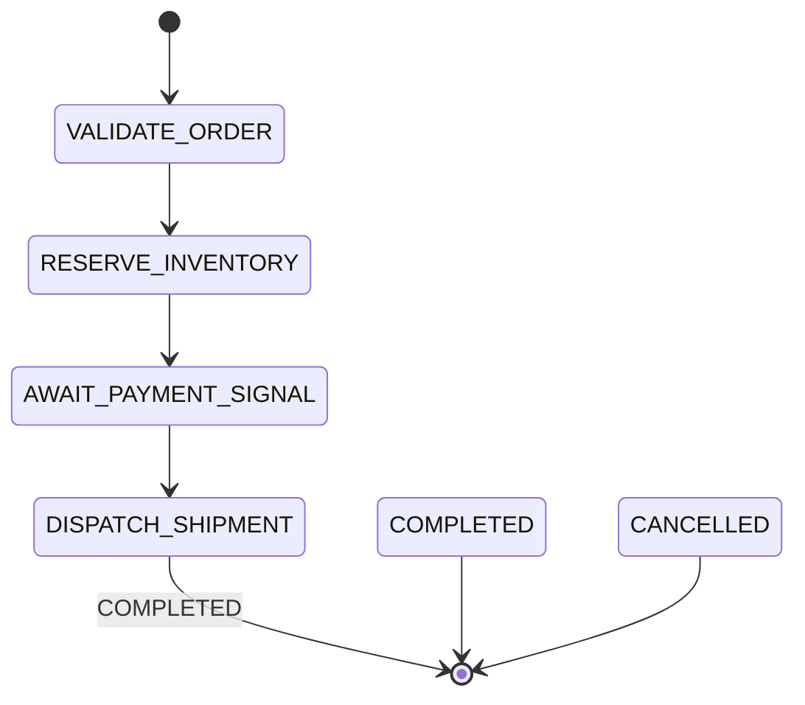

# Dispersion Interactive Demo Application (`DispersionDemoApp`)

> **Location:** [`examples/src/main/java/com/github/f442y/dispersion/examples/DispersionDemoApp.java`](file:///C:/Users/faiza/development/dispersion/examples/src/main/java/com/github/f442y/dispersion/examples/DispersionDemoApp.java)
> **Server Engine:** Helidon SE 4.x Níma (Imperative Loom HTTP & SSE WebServer)
> **Default Port:** `8080` (Base path: `/api/v1`)
> **Java Version:** OpenJDK 25+ (Loom Virtual Threads)

The **Dispersion Demo Application** is a self-contained, interactive environment designed for local development, API exploration, and testing. It spins up an embedded virtual-thread HTTP/SSE server and registers three distinct state machine engines directly into the [DefaultControlPlane](file:///C:/Users/faiza/development/dispersion/control/core/src/main/java/com/github/f442y/dispersion/control/core/DefaultControlPlane.java):

1. **`OrderWorkflow` (Tier 2 Orchestration Saga)**:
   - Validates orders, reserves inventory with registered compensating rollbacks, and suspends turn execution at `AWAIT_PAYMENT_SIGNAL`.
   - Automatically pre-seeds a suspended order (`ORDER-DEMO-99`) awaiting external payment signal injection.
2. **`MetricsPipeline` (Tier 1 Atomic FSM)**:
   - High-throughput atomic pipeline processing metric sensor bursts (`INGEST` &rarr; `ENRICH` &rarr; `TRANSFORM` &rarr; `EXPORT` &rarr; `FINISHED`).
   - Generates background virtual-thread bursts every 500ms to drive live Server-Sent Events (SSE).
3. **`BatchProcessor` (Tier 3 Batch Orchestration)**:
   - Turn-based item processing with barrier synchronization (`ALL_ITEMS_ARRIVED` and `SIGNAL_TRIGGERED`).

---

## 🚀 How to Run the Demo

### Option 1: Run in IntelliJ IDEA
1. Open the project in IntelliJ IDEA (ensure Java 25 SDK is configured in Project Structure).
2. Navigate to [`examples/src/main/java/com/github/f442y/dispersion/examples/DispersionDemoApp.java`](file:///C:/Users/faiza/development/dispersion/examples/src/main/java/com/github/f442y/dispersion/examples/DispersionDemoApp.java).
3. Right-click the file or click the green run arrow next to `public static void main(String[] args)`.
4. Click **Run 'DispersionDemoApp.main()'**.

### Option 2: Run via Maven CLI
From the repository root:

- **Windows (PowerShell / CMD):**
  ```powershell
  .\mvnw compile exec:java -pl examples -Dexec.mainClass="com.github.f442y.dispersion.examples.DispersionDemoApp"
  ```

- **Linux / macOS (Bash / Zsh):**
  ```bash
  ./mvnw compile exec:java -pl examples -Dexec.mainClass="com.github.f442y.dispersion.examples.DispersionDemoApp"
  ```

When started, the application displays an interactive banner confirming the server is listening:

```text
========================================================================================
🚀 DISPERSION CONTROL PLANE & HELIDON SE DEMO IS RUNNING
========================================================================================
Base HTTP URL: http://localhost:8080/api/v1

✨ Pre-registered Machines:
   • OrderWorkflow    (Orchestration Saga: Suspended order 'ORDER-DEMO-99' awaiting signal)
   • MetricsPipeline  (Atomic FSM: Emitting continuous background events)
   • BatchProcessor   (Turn-based item batch with quorum barrier)
...
```

---

## 📡 Universal HTTP Commands (Bash, Zsh, PowerShell, Windows CMD)

Below are cross-platform commands formatted to work consistently across shells (Bash, Zsh, Windows PowerShell, PowerShell Core, and Windows Command Prompt).

> [!NOTE]
> On Windows PowerShell, the command `curl` is often an alias for `Invoke-WebRequest`. To invoke the real `curl` binary on Windows, use `curl.exe` or call the native PowerShell command `Invoke-RestMethod` shown below.

---

### 1. List Registered State Machines
Retrieve descriptors for all state machines registered in the control plane:

#### Universal `curl` (Bash, Zsh, Windows CMD, macOS):
```bash
curl -s "http://localhost:8080/api/v1/machines"
```

#### Windows PowerShell (`curl.exe` or `Invoke-RestMethod`):
```powershell
curl.exe -s "http://localhost:8080/api/v1/machines"
```
*Or native PowerShell:*
```powershell
Invoke-RestMethod -Uri "http://localhost:8080/api/v1/machines" | ConvertTo-Json -Depth 3
```

**Example JSON Response:**
```json
[
  {
    "name": "OrderWorkflow",
    "type": "ORCHESTRATION",
    "initialState": "VALIDATE_ORDER",
    "endStates": ["COMPLETED", "CANCELLED"],
    "allStates": ["VALIDATE_ORDER", "RESERVE_INVENTORY", "AWAIT_PAYMENT_SIGNAL", "DISPATCH_SHIPMENT", "COMPLETED", "CANCELLED"]
  },
  {
    "name": "MetricsPipeline",
    "type": "ATOMIC",
    "initialState": "INGEST",
    "endStates": ["FINISHED"],
    "allStates": ["INGEST", "ENRICH", "TRANSFORM", "EXPORT", "FINISHED"]
  },
  {
    "name": "BatchProcessor",
    "type": "BATCH",
    "initialState": "IMPORT",
    "endStates": ["COMPLETE"],
    "allStates": ["IMPORT", "RUN_CHECKS", "AWAIT_TRIGGER", "COMPLETE"]
  }
]
```

---

### 2. Inspect Machine Topology & Mermaid Diagram
Fetch detailed state transitions and generated Mermaid state diagram graph for `OrderWorkflow`:

#### Universal `curl`:
```bash
curl -s "http://localhost:8080/api/v1/machines/OrderWorkflow"
```

#### Windows PowerShell:
```powershell
curl.exe -s "http://localhost:8080/api/v1/machines/OrderWorkflow"
```
*To extract just the Mermaid diagram in PowerShell:*
```powershell
(Invoke-RestMethod -Uri "http://localhost:8080/api/v1/machines/OrderWorkflow").mermaidGraph
```

*Or with `jq` in Bash:*
```bash
curl -s "http://localhost:8080/api/v1/machines/OrderWorkflow" | jq -r '.mermaidGraph'
```

**Output:**


---

### 3. Query Suspended Executions
List workflows currently paused at a signal wait step (such as pre-seeded `ORDER-DEMO-99`):

#### Universal `curl`:
```bash
curl -s "http://localhost:8080/api/v1/executions?status=SUSPENDED"
```

#### Windows PowerShell:
```powershell
curl.exe -s "http://localhost:8080/api/v1/executions?status=SUSPENDED"
```
*Or native PowerShell:*
```powershell
Invoke-RestMethod -Uri "http://localhost:8080/api/v1/executions?status=SUSPENDED" | ConvertTo-Json
```

**Example Response:**
```json
[
  {
    "machineName": "OrderWorkflow",
    "correlationKey": "ORDER-DEMO-99",
    "currentState": "AWAIT_PAYMENT_SIGNAL",
    "status": "SUSPENDED"
  }
]
```

---

### 4. Stream Real-Time Telemetry Events (Server-Sent Events)
Stream live telemetry events over an HTTP SSE connection (`text/event-stream`). The demo's background virtual-thread activity simulator continuously emits events into this stream:

#### Universal `curl` (`-N` disables buffering):
```bash
curl -N "http://localhost:8080/api/v1/events/stream"
```

#### Windows PowerShell:
```powershell
curl.exe -N "http://localhost:8080/api/v1/events/stream"
```

**Live SSE Stream Sample:**
```text
event: StateEntered
data: {"@type":"StateEntered","timestamp":1758503412000,"machineName":"MetricsPipeline","correlationKey":"sensor-4","state":"INGEST"}

event: TransitionEvaluated
data: {"@type":"TransitionEvaluated","timestamp":1758503412001,"machineName":"MetricsPipeline","correlationKey":"sensor-4","fromState":"INGEST","toState":"ENRICH"}

event: StateEntered
data: {"@type":"StateEntered","timestamp":1758503412002,"machineName":"MetricsPipeline","correlationKey":"sensor-4","state":"ENRICH"}
```

---

### 5. Resume a Suspended Workflow via Signal Delivery
Deliver a `PaymentSignal` to resume the pre-seeded suspended order `ORDER-DEMO-99`. The orchestration engine wakes up on a virtual thread, transitions through `DISPATCH_SHIPMENT`, and reaches terminal `COMPLETED`.

#### Cross-Platform Universal `curl` (Single-line escaped JSON, runs identically in Bash, Zsh, CMD, Git Bash, and PowerShell):
```bash
curl -X POST "http://localhost:8080/api/v1/executions/signal" -H "Content-Type: application/json" -d "{\"machineName\":\"OrderWorkflow\",\"correlationKey\":\"ORDER-DEMO-99\",\"signalName\":\"PaymentSignal\",\"payload\":{\"correlationKey\":\"ORDER-DEMO-99\",\"paymentMethod\":\"APPLE_PAY\",\"amountCents\":9995}}"
```

#### Bash / Zsh Multi-line format:
```bash
curl -X POST "http://localhost:8080/api/v1/executions/signal" \
  -H "Content-Type: application/json" \
  -d '{
    "machineName": "OrderWorkflow",
    "correlationKey": "ORDER-DEMO-99",
    "signalName": "PaymentSignal",
    "payload": {
      "correlationKey": "ORDER-DEMO-99",
      "paymentMethod": "APPLE_PAY",
      "amountCents": 9995
    }
  }'
```

#### Windows PowerShell Native (`Invoke-RestMethod`):
```powershell
Invoke-RestMethod -Method Post -Uri "http://localhost:8080/api/v1/executions/signal" `
  -ContentType "application/json" `
  -Body '{"machineName":"OrderWorkflow","correlationKey":"ORDER-DEMO-99","signalName":"PaymentSignal","payload":{"correlationKey":"ORDER-DEMO-99","paymentMethod":"APPLE_PAY","amountCents":9995}}'
```

**Example JSON Response:**
```json
{
  "delivered": true,
  "machineName": "OrderWorkflow",
  "correlationKey": "ORDER-DEMO-99",
  "message": "Signal accepted and processed successfully"
}
```

Verify that `ORDER-DEMO-99` is no longer suspended:

```bash
curl -s "http://localhost:8080/api/v1/executions?status=SUSPENDED"
```

---

### 6. Filter Event Streams by Machine Name or Correlation Key
You can filter the real-time event stream to isolate a specific engine or execution:

#### Universal `curl`:
```bash
# Only stream events for OrderWorkflow
curl -N "http://localhost:8080/api/v1/events/stream?machine=OrderWorkflow"

# Only stream events for a specific correlation key
curl -N "http://localhost:8080/api/v1/events/stream?key=ORDER-DEMO-99"
```

#### Windows PowerShell:
```powershell
curl.exe -N "http://localhost:8080/api/v1/events/stream?machine=OrderWorkflow"
curl.exe -N "http://localhost:8080/api/v1/events/stream?key=ORDER-DEMO-99"
```

---

## 🧪 Automated End-to-End Tests

The demo application's behavior and HTTP endpoints are tested end-to-end in [`DispersionDemoAppIntegrationTests.java`](file:///C:/Users/faiza/development/dispersion/examples/src/test/java/com/github/f442y/dispersion/examples/DispersionDemoAppIntegrationTests.java).

Run the tests at any time via:

- **Windows PowerShell:**
  ```powershell
  .\mvnw test -pl examples -am
  ```

- **Linux / macOS:**
  ```bash
  ./mvnw test -pl examples -am
  ```
