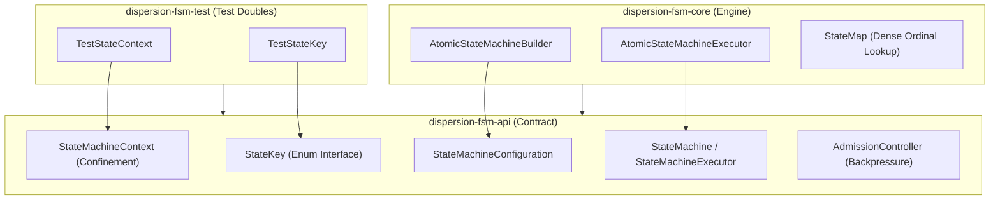

# Dispersion Finite State Machine Subsystem (`fsm`)

The **Dispersion FSM Subsystem** delivers a high-throughput, zero-synchronization **Tier 1 Atomic State Machine Engine** engineered for **Java 25+ Virtual Threads**. It is optimized for micro-workflows requiring sub-microsecond latency, zero heap allocation on transition hot paths, and deterministic sequential execution.

---

## 1. Module Structure & Hexagonal Architecture

The FSM subsystem is strictly partitioned into three decoupled modules:



### Module Matrix

| Module | JPMS Module Name | Description |
| :--- | :--- | :--- |
| **`dispersion-fsm-api`** | `com.github.f442y.dispersion.fsm.api` | Contracts for state keys, context interfaces, transitions, actions, configurations, futures, and admission control policies. |
| **`dispersion-fsm-core`** | `com.github.f442y.dispersion.fsm.core` | Atomic state machine builder and virtual thread executor with dense ordinal array transitions and adaptive admission controllers. |
| **`dispersion-fsm-test`** | `com.github.f442y.dispersion.fsm.test` | In-memory testing scaffolding (`TestStateContext`, `TestStateKey`) for unit testing without third-party mocking libraries. |

---

## 2. Architectural Design & Zero-Allocation Hot Paths

### 1. Pre-Compiled Graph Topology (`StateMap`)
Rather than querying dynamic hash maps, string tables, or reflective proxies on each state transition, `AtomicStateMachineBuilder` pre-compiles the state graph into dense ordinal array lookup tables:
* State transitions index directly by `stateKey.ordinal()`.
* Terminal states are indexed into compact bitmasks.
* The transition evaluation hot path executes in **$O(1)$** sub-microsecond CPU time with zero object allocations on the heap.

### 2. Strict Virtual Thread Confinement
* Each execution instance runs confined to a single Java 25 Virtual Thread (`Thread.ofVirtual()`).
* The domain `StateMachineContext` is mutable and confined to this thread.
* Actions mutate context properties directly with **zero locking** (`synchronized`, `ReentrantLock`, `AtomicReference`), eliminating cache invalidation and thread contention.

### 3. Adaptive Admission Control & Backpressure
The `AdmissionController` regulates system load under high-volume bursts. When concurrency limits are reached:
* **`BLOCK`**: Pauses the virtual thread using lightweight carrier unmounting until execution capacity frees up.
* **`REJECT_IMMEDIATELY`**: Instantly throws `CapacityExceededException` to protect downstream systems.
* **`WAIT_WITH_TIMEOUT`**: Waits up to a configured duration before rejecting.

---

## 3. End-to-End Implementation Guide

Here is a complete, production-grade example modeling an atomic payment validation machine:

```java
package com.example.fsm;

import com.github.f442y.dispersion.fsm.StateMachineFuture;
import com.github.f442y.dispersion.fsm.config.StateMachineConfiguration;
import com.github.f442y.dispersion.fsm.context.StateMachineContext;
import com.github.f442y.dispersion.fsm.core.atomic.AtomicStateMachineBuilder;
import com.github.f442y.dispersion.fsm.core.atomic.AtomicStateMachineExecutor;
import com.github.f442y.dispersion.fsm.state.StateKey;
import org.slf4j.Logger;
import org.slf4j.LoggerFactory;

import java.util.Set;

public final class PaymentProcessingPipeline {

    private static final Logger log = LoggerFactory.getLogger(PaymentProcessingPipeline.class);

    // 1. Declare State Keys as an Enum implementing StateKey
    public enum PaymentState implements StateKey {
        VALIDATE,
        APPLY_DISCOUNT,
        AUTHORIZE,
        APPROVED,
        DECLINED
    }

    // 2. Declare Domain Context (Thread-Confined POJO)
    public static final class PaymentContext implements StateMachineContext {
        public String transactionId;
        public double rawAmount;
        public double finalAmount;
        public boolean vipCustomer;
        public String authCode;
        public String declineReason;
    }

    // 3. Declare Inbound Input and Outbound Output Records
    public record PaymentRequest(String transactionId, double amount, boolean vipCustomer) {}
    public record PaymentResult(String transactionId, double chargedAmount, String authCode, boolean success) {}

    public static void main(String[] args) throws Exception {
        // 4. Build State Machine Configuration
        StateMachineConfiguration<PaymentContext, PaymentState, PaymentRequest, PaymentResult> config =
            AtomicStateMachineBuilder.<PaymentContext, PaymentState, PaymentRequest, PaymentResult>create("PaymentEngine", PaymentState.class)
                .context(PaymentContext::new)
                .initialState(PaymentState.VALIDATE)
                .endStates(PaymentState.APPROVED, PaymentState.DECLINED)

                // Input Mapping: initializes context from inbound request
                .input((PaymentContext context, PaymentRequest request) -> {
                    context.transactionId = request.transactionId();
                    context.rawAmount = request.amount();
                    context.finalAmount = request.amount();
                    context.vipCustomer = request.vipCustomer();
                    return context;
                })

                // State 1: Validation
                .state(PaymentState.VALIDATE)
                    .action((PaymentContext context) -> {
                        if (context.rawAmount <= 0.0) {
                            context.declineReason = "Amount must be strictly positive";
                        }
                        return context;
                    })
                    .transitionsTo(
                        Set.of(PaymentState.DECLINED, PaymentState.APPLY_DISCOUNT, PaymentState.AUTHORIZE),
                        (PaymentContext context) -> {
                            if (context.declineReason != null) {
                                return PaymentState.DECLINED;
                            }
                            return context.vipCustomer ? PaymentState.APPLY_DISCOUNT : PaymentState.AUTHORIZE;
                        }
                    )

                // State 2: Apply VIP Discount
                .state(PaymentState.APPLY_DISCOUNT)
                    .action((PaymentContext context) -> {
                        context.finalAmount = context.rawAmount * 0.90; // 10% discount
                        return context;
                    })
                    .transition(PaymentState.AUTHORIZE)

                // State 3: Authorize Funds
                .state(PaymentState.AUTHORIZE)
                    .action((PaymentContext context) -> {
                        context.authCode = "AUTH-" + System.currentTimeMillis();
                        return context;
                    })
                    .transition(PaymentState.APPROVED)

                // Output Extraction: maps terminal context into final return type
                .output((PaymentContext context) -> new PaymentResult(
                    context.transactionId,
                    context.finalAmount,
                    context.authCode,
                    context.declineReason == null
                ))
                .build();

        // 5. Execute via AtomicStateMachineExecutor
        // Capacity: 500 concurrent virtual thread workers
        try (AtomicStateMachineExecutor<PaymentContext, PaymentState, PaymentRequest, PaymentResult> executor =
                 new AtomicStateMachineExecutor<>("payment-executor", config, 500)) {

            // Synchronous dispatch
            PaymentRequest request = new PaymentRequest("TX-1001", 250.00, true);
            PaymentResult result = executor.dispatchSync(request);

            log.atInfo()
               .addKeyValue("tx_id", result.transactionId())
               .addKeyValue("charged", result.chargedAmount())
               .addKeyValue("auth_code", result.authCode())
               .addKeyValue("success", result.success())
               .log("Payment processed synchronously");

            // Asynchronous virtual-thread dispatch
            StateMachineFuture<PaymentResult> future = executor.dispatchAsync(new PaymentRequest("TX-1002", 50.0, false));
            PaymentResult asyncResult = future.get();

            log.atInfo()
               .addKeyValue("tx_id", asyncResult.transactionId())
               .addKeyValue("charged", asyncResult.chargedAmount())
               .log("Payment processed asynchronously");
        }
    }
}
```

---

## 4. Testing Atomic State Machines (`dispersion-fsm-test`)

Use `dispersion-fsm-test` to test transitions, error handling, and state validations without external mocking libraries:

```java
package com.example.fsm;

import com.github.f442y.dispersion.fsm.test.TestStateContext;
import com.github.f442y.dispersion.fsm.test.TestStateKey;
import org.junit.jupiter.api.DisplayName;
import org.junit.jupiter.api.Test;

import static org.assertj.core.api.Assertions.assertThat;

public class FsmTestingExampleTests {

    @Test
    @DisplayName("Should use TestStateContext and TestStateKey for rapid prototyping")
    public void testRapidPrototyping() {
        TestStateContext context = new TestStateContext("CTX-42");
        context.put("score", 100);

        assertThat(context.getId()).isEqualTo("CTX-42");
        assertThat(context.<Integer>get("score")).isEqualTo(100);
        assertThat(TestStateKey.STATE_A.ordinal()).isEqualTo(0);
    }
}
```

---

## 5. Maven Dependency Setup

```xml
<dependencyManagement>
    <dependencies>
        <dependency>
            <groupId>com.github.f442y.dispersion</groupId>
            <artifactId>dispersion-bom</artifactId>
            <version>1.0.0-SNAPSHOT</version>
            <type>pom</type>
            <scope>import</scope>
        </dependency>
    </dependencies>
</dependencyManagement>

<dependencies>
    <!-- Public API Contract -->
    <dependency>
        <groupId>com.github.f442y.dispersion</groupId>
        <artifactId>dispersion-fsm-api</artifactId>
    </dependency>

    <!-- Runtime Engine -->
    <dependency>
        <groupId>com.github.f442y.dispersion</groupId>
        <artifactId>dispersion-fsm-core</artifactId>
    </dependency>

    <!-- Testing Scaffolding (Scope: Test) -->
    <dependency>
        <groupId>com.github.f442y.dispersion</groupId>
        <artifactId>dispersion-fsm-test</artifactId>
        <scope>test</scope>
    </dependency>
</dependencies>
```
