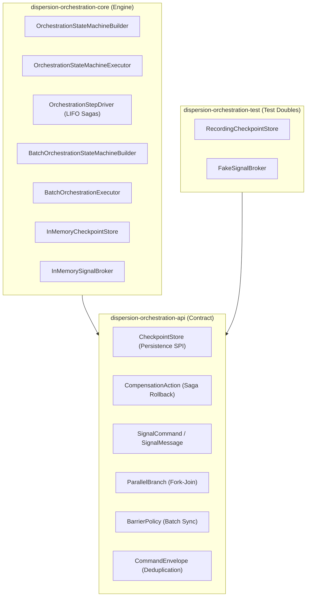

# Dispersion Orchestration Subsystem (`orchestration`)

The **Dispersion Orchestration Subsystem** delivers a distributed **Tier 2 (Saga Orchestration) and Tier 3 (Turn-Based Batching)** engine engineered for **Java 25+ Virtual Threads**. It coordinates long-running, multi-step distributed workflows, automated LIFO Saga compensation rollbacks, asynchronous signal suspensions, parallel fork-join branching, and batch barrier synchronization.

---

## 1. Module Structure & Hexagonal Architecture

The orchestration subsystem is divided into three decoupled modules following strict Ports-and-Adapters boundaries:



### Module Matrix

| Module | JPMS Module Name | Description |
| :--- | :--- | :--- |
| **`dispersion-orchestration-api`** | `com.github.f442y.dispersion.orchestration.api` | Contracts for checkpoints, compensation actions, saga commands, envelopes, broker messaging SPIs, and batch barrier policies. |
| **`dispersion-orchestration-core`** | `com.github.f442y.dispersion.orchestration.core` | Macro orchestration driver, virtual thread parallel executor, batch engine, signal watcher, and in-memory stores. |
| **`dispersion-orchestration-test`** | `com.github.f442y.dispersion.orchestration.test` | Reusable test doubles (`FakeSignalBroker`, `RecordingCheckpointStore`) for deterministic unit and saga recovery testing. |

---

## 2. Core Architectural Capabilities

### 1. Turn-Based Execution & Signal Suspension
Workflows execute in **turns**. A turn continues until:
* The workflow reaches a terminal state (`COMPLETED` or `FAILED`).
* The workflow encounters a `.waitForCommand(...)` or `.waitForSignal(...)` state.
When suspended, Dispersion snapshots the context into an `OrchestrationCheckpoint`, saves it via `CheckpointStore`, and unmounts the virtual thread. When an external signal arrives correlated by `correlationKey`, the workflow is rehydrated to execute the next turn.

### 2. Automated LIFO Saga Rollbacks
Each forward action can register a `CompensationAction`. If any downstream step fails:
1. Forward execution stops immediately.
2. The `OrchestrationStepDriver` unwinds the compensation stack in **reverse chronological order (Last-In, First-Out)**.
3. Each registered compensation executes safely on a virtual thread.
4. A `TurnCompensatedEvent` telemetry record is emitted.

### 3. Parallel Fork-Join Concurrency
Using `.parallel()`, Dispersion forks child branches concurrently across virtual threads. Workflows join when all branches finish or abort if any branch fails, immediately cancelling sibling tasks.

### 4. Turn-Based Batch Processing (`BatchOrchestrationExecutor`)
The batch engine processes collections of items through synchronized steps. Workflows support **Barrier Policies**:
* **`ALL_ITEMS`**: Every item in the batch must reach the barrier before the batch advances to the next step.
* **`QUORUM`**: The batch advances as soon as a defined quorum threshold of items reaches the barrier.

---

## 3. End-to-End Saga Orchestration Example

The following example demonstrates an e-commerce checkout workflow embedding a Tier 1 atomic inventory machine, reserving inventory, charging payment, and executing automated LIFO compensation rollbacks if payment declines:

```java
package com.example.orchestration;

import com.github.f442y.dispersion.fsm.config.StateMachineConfiguration;
import com.github.f442y.dispersion.fsm.context.StateMachineContext;
import com.github.f442y.dispersion.fsm.core.atomic.AtomicStateMachineBuilder;
import com.github.f442y.dispersion.fsm.state.StateKey;
import com.github.f442y.dispersion.orchestration.core.OrchestrationStateMachineBuilder;
import com.github.f442y.dispersion.orchestration.core.OrchestrationStateMachineExecutor;
import org.slf4j.Logger;
import org.slf4j.LoggerFactory;

import java.util.ArrayList;
import java.util.List;

public final class OrderSagaWorkflow {

    private static final Logger log = LoggerFactory.getLogger(OrderSagaWorkflow.class);

    public enum OrderState implements StateKey {
        VALIDATE,
        RESERVE_INVENTORY,
        PROCESS_PAYMENT,
        CONFIRMED,
        FAILED
    }

    public enum InventoryStep implements StateKey {
        CHECK_STOCK, DEDUCT_STOCK, COMPLETED
    }

    public static final class OrderContext implements StateMachineContext {
        public String orderId;
        public int amountCents;
        public boolean simulatePaymentFailure;
        public boolean inventoryAllocated;
        public boolean paymentSettled;
        public List<String> audit = new ArrayList<>();
    }

    public static final class InventoryContext implements StateMachineContext {
        public String sku;
        public boolean stockReserved;
    }

    public record OrderRequest(String orderId, int amountCents, boolean simulatePaymentFailure) {}

    public static void main(String[] args) throws Exception {
        // 1. Build Tier 1 Atomic Child Machine for Inventory
        StateMachineConfiguration<InventoryContext, InventoryStep, String, Boolean> inventoryMachine =
            AtomicStateMachineBuilder.<InventoryContext, InventoryStep, String, Boolean>create("InventoryEngine", InventoryStep.class)
                .context(InventoryContext::new)
                .initialState(InventoryStep.CHECK_STOCK)
                .endStates(InventoryStep.COMPLETED)
                .input((InventoryContext ctx, String sku) -> { ctx.sku = sku; return ctx; })
                .state(InventoryStep.CHECK_STOCK)
                    .action((InventoryContext ctx) -> ctx)
                    .transition(InventoryStep.DEDUCT_STOCK)
                .state(InventoryStep.DEDUCT_STOCK)
                    .action((InventoryContext ctx) -> { ctx.stockReserved = true; return ctx; })
                    .transition(InventoryStep.COMPLETED)
                .output((InventoryContext ctx) -> ctx.stockReserved)
                .build();

        // 2. Build Tier 2 Orchestration State Machine
        try (OrchestrationStateMachineExecutor<OrderContext, OrderState, OrderRequest, String> executor =
                 OrchestrationStateMachineBuilder.<OrderContext, OrderState, OrderRequest, String>create("OrderSaga", OrderState.class)
                     .context(OrderContext::new)
                     .initialState(OrderState.VALIDATE)
                     .endStates(OrderState.CONFIRMED, OrderState.FAILED)
                     .input((OrderContext ctx, OrderRequest req) -> {
                         ctx.orderId = req.orderId();
                         ctx.amountCents = req.amountCents();
                         ctx.simulatePaymentFailure = req.simulatePaymentFailure();
                         ctx.audit.add("VALIDATED");
                         return ctx;
                     })

                     // Step 1: Validate
                     .state(OrderState.VALIDATE)
                         .action((OrderContext ctx) -> ctx)
                         .compensate((OrderContext ctx) -> {
                             log.atWarn().addKeyValue("order_id", ctx.orderId).log("Compensating order validation");
                             ctx.audit.add("COMPENSATE_VALIDATION");
                             return ctx;
                         })
                         .transition(OrderState.RESERVE_INVENTORY)

                     // Step 2: Reserve Inventory (Embeds Tier 1 Atomic Machine + LIFO Compensation)
                     .state(OrderState.RESERVE_INVENTORY)
                         .atomicMachine(inventoryMachine)
                         .input((OrderContext ctx) -> "SKU-" + ctx.orderId)
                         .output((OrderContext ctx, Boolean reserved) -> {
                             ctx.inventoryAllocated = reserved;
                             ctx.audit.add("INVENTORY_RESERVED");
                             return ctx;
                         })
                         .compensate((OrderContext ctx) -> {
                             log.atWarn().addKeyValue("order_id", ctx.orderId).log("Releasing reserved inventory in saga rollback");
                             ctx.inventoryAllocated = false;
                             ctx.audit.add("RELEASE_INVENTORY");
                             return ctx;
                         })
                         .transition(OrderState.PROCESS_PAYMENT)

                     // Step 3: Process Payment (Simulated downstream failure)
                     .state(OrderState.PROCESS_PAYMENT)
                         .action((OrderContext ctx) -> {
                             if (ctx.simulatePaymentFailure) {
                                 throw new IllegalStateException("Payment declined: Insufficient funds");
                             }
                             ctx.paymentSettled = true;
                             ctx.audit.add("PAYMENT_SETTLED");
                             return ctx;
                         })
                         .compensate((OrderContext ctx) -> {
                             log.atWarn().addKeyValue("order_id", ctx.orderId).log("Refunding payment charge");
                             ctx.paymentSettled = false;
                             ctx.audit.add("REFUND_PAYMENT");
                             return ctx;
                         })
                         .transition(OrderState.CONFIRMED)

                     .output((OrderContext ctx) -> "Order " + ctx.orderId + " confirmed")
                     .buildExecutor()) {

            // Scenario: Payment Fails -> Triggers Automatic LIFO Rollback
            try {
                executor.dispatchSync(new OrderRequest("ORD-999", 5000, true));
            } catch (Exception ex) {
                log.atError().setCause(ex).log("Order saga caught downstream failure; LIFO rollbacks completed");
            }
        }
    }
}
```

---

## 4. Signal Suspensions & Rehydration

Workflows waiting for external signals (webhooks, manager approvals) suspend execution and release virtual threads:

```java
package com.example.orchestration;

import com.github.f442y.dispersion.fsm.context.StateMachineContext;
import com.github.f442y.dispersion.fsm.state.StateKey;
import com.github.f442y.dispersion.orchestration.OrchestrationTurnResult;
import com.github.f442y.dispersion.orchestration.command.SignalCommand;
import com.github.f442y.dispersion.orchestration.core.InMemoryCheckpointStore;
import com.github.f442y.dispersion.orchestration.core.OrchestrationStateMachineBuilder;
import com.github.f442y.dispersion.orchestration.core.OrchestrationStateMachineExecutor;
import org.jspecify.annotations.NonNull;
import org.slf4j.Logger;
import org.slf4j.LoggerFactory;

public final class ApprovalWorkflowExample {

    private static final Logger log = LoggerFactory.getLogger(ApprovalWorkflowExample.class);

    public enum DocState implements StateKey {
        DRAFT, PENDING_APPROVAL, APPROVED
    }

    public static final class DocContext implements StateMachineContext {
        public String docId;
        public String approvedBy;
    }

    public record ApprovalSignal(@NonNull String correlationKey, @NonNull String approver) implements SignalCommand {
        @Override
        @NonNull
        public String signalName() {
            return "ApprovalSignal";
        }
    }

    public void run() throws Exception {
        InMemoryCheckpointStore<DocContext, DocState> checkpointStore = new InMemoryCheckpointStore<>();

        try (OrchestrationStateMachineExecutor<DocContext, DocState, String, String> executor =
                 OrchestrationStateMachineBuilder.<DocContext, DocState, String, String>create("DocumentApproval", DocState.class)
                     .context(DocContext::new)
                     .initialState(DocState.DRAFT)
                     .endStates(DocState.APPROVED)
                     .checkpointStore(checkpointStore)
                     .correlationKey((DocContext ctx) -> ctx.docId)
                     .input((DocContext ctx, String docId) -> { ctx.docId = docId; return ctx; })

                     .state(DocState.DRAFT)
                         .action((DocContext ctx) -> ctx)
                         .transition(DocState.PENDING_APPROVAL)

                     // Suspends execution until ApprovalSignal arrives
                     .state(DocState.PENDING_APPROVAL)
                         .waitForCommand(ApprovalSignal.class, (DocContext ctx, ApprovalSignal sig) -> {
                             ctx.approvedBy = sig.approver();
                             return ctx;
                         })
                         .transition(DocState.APPROVED)

                     .output((DocContext ctx) -> "Doc " + ctx.docId + " approved by " + ctx.approvedBy)
                     .buildExecutor()) {

            // Turn 1: Starts and suspends
            OrchestrationTurnResult<DocContext, DocState, String> turn1 = executor.dispatchTurnSync("DOC-101", "DOC-101");
            log.atInfo()
               .addKeyValue("suspended", turn1.isSuspended())
               .addKeyValue("state", turn1.currentStateKey())
               .log("Turn 1 suspended awaiting external approval");

            // Turn 2: Signal arrives later from external webhook
            OrchestrationTurnResult<DocContext, DocState, String> turn2 =
                executor.dispatchSignalSync("DOC-101", new ApprovalSignal("DOC-101", "Alice (Security Lead)"));

            log.atInfo()
               .addKeyValue("completed", turn2.isCompleted())
               .addKeyValue("result", turn2.output())
               .log("Turn 2 rehydrated and completed successfully");
        }
    }
}
```

---

## 5. Testing Orchestrations (`dispersion-orchestration-test`)

Use `dispersion-orchestration-test` for deterministic saga and messaging verification:
* **`FakeSignalBroker`**: Synchronously routes signals in-memory.
* **`RecordingCheckpointStore`**: Captures saved, loaded, and deleted checkpoints for assertions.

```java
package com.example.orchestration;

import com.github.f442y.dispersion.fsm.test.TestStateContext;
import com.github.f442y.dispersion.fsm.test.TestStateKey;
import com.github.f442y.dispersion.orchestration.test.FakeSignalBroker;
import com.github.f442y.dispersion.orchestration.test.RecordingCheckpointStore;
import org.junit.jupiter.api.DisplayName;
import org.junit.jupiter.api.Test;

import static org.assertj.core.api.Assertions.assertThat;

public class OrchestrationTestingExampleTests {

    @Test
    @DisplayName("Should capture checkpoints and signals using test doubles")
    public void testCheckpointsAndSignals() {
        RecordingCheckpointStore<TestStateContext, TestStateKey> store = new RecordingCheckpointStore<>();
        FakeSignalBroker broker = new FakeSignalBroker();

        assertThat(store.savedCheckpoints()).isEmpty();
        assertThat(broker.publishedMessages()).isEmpty();
    }
}
```

---

## 6. Maven Dependency Setup

```xml
<dependencyManagement>
    <dependencies>
        <dependency>
            <groupId>com.github.f442y.dispersion</groupId>
            <artifactId>dispersion-bom</artifactId>
            <version>1.0.0-SNAPSHOT</version>
            <type>pom</type>
            <scope>import</scope>
        </dependency>
    </dependencies>
</dependencyManagement>

<dependencies>
    <!-- Public API Contract -->
    <dependency>
        <groupId>com.github.f442y.dispersion</groupId>
        <artifactId>dispersion-orchestration-api</artifactId>
    </dependency>

    <!-- Runtime Engine -->
    <dependency>
        <groupId>com.github.f442y.dispersion</groupId>
        <artifactId>dispersion-orchestration-core</artifactId>
    </dependency>

    <!-- Testing Doubles (Scope: Test) -->
    <dependency>
        <groupId>com.github.f442y.dispersion</groupId>
        <artifactId>dispersion-orchestration-test</artifactId>
        <scope>test</scope>
    </dependency>
</dependencies>
```
