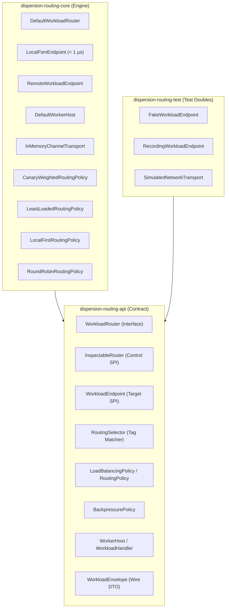

# Dispersion Workload Routing Subsystem (`routing`)

The **Dispersion Workload Routing Subsystem** delivers a high-throughput, **location-agnostic execution router** engineered for **Java 25+ Virtual Threads**. It enables state machine steps to execute interchangeably as **sub-microsecond in-process monolith calls** (< 1 µs latency, zero serialization, zero network) or as **distributed microservice worker invocations**, equipped with dynamic traffic control (Canary rolling updates, Developer Sandboxes), backpressure admission control, and live Control Plane observability.

---

## 1. Module Structure & Hexagonal Architecture

The routing subsystem adheres to strict hexagonal boundaries with pure API contracts, pluggable transports, and dedicated test doubles:



### Module Matrix

| Module | JPMS Module Name | Description |
| :--- | :--- | :--- |
| **`dispersion-routing-api`** | `com.github.f442y.dispersion.routing.api` | Pure contracts for `WorkloadRouter`, `InspectableRouter`, `WorkloadEndpoint`, tag selectors, backpressure policies, load balancing policies, and envelopes. |
| **`dispersion-routing-core`** | `com.github.f442y.dispersion.routing.core` | High-throughput concurrent router, local FSM endpoint, remote transport endpoint, worker host, and load-balancing policy implementations. |
| **`dispersion-routing-test`** | `com.github.f442y.dispersion.routing.test` | In-memory test kit with `FakeWorkloadEndpoint`, `RecordingWorkloadEndpoint`, and `SimulatedNetworkTransport` for deterministic integration testing. |

---

## 2. Core Capabilities

### 1. Location-Agnostic Execution
The orchestration engine interacts solely with `WorkloadRouter`. The physical location of the worker is abstracted behind `WorkloadEndpoint`:
* **In-Process Monolith (`LocalFsmEndpoint`):** Direct reference handoff on virtual threads. Sub-microsecond latency (< 1 µs), zero heap allocations on hot paths, and zero serialization overhead.
* **Distributed Microservice (`RemoteWorkloadEndpoint`):** Encapsulates outbound request-reply messaging over transports (Kafka, gRPC, RabbitMQ, or in-memory buses). Manages asynchronous correlation and timeout handling.

### 2. Developer Sandboxes & Tag-Based Isolation
Route specific requests to dedicated isolated worker nodes (e.g., a developer testing local changes in staging):
```java
// Match worker nodes tagged specifically for developer sandbox testing
RoutingSelector selector = RoutingSelector.requireTag("developer", "faizan");
```
When this selector is supplied, the router strictly directs traffic to workers registered with matching tags.

### 3. Canary Rolling Updates & Traffic Splitting
Safely roll out new service versions by splitting traffic dynamically across versions without redeploying callers:
```java
CanaryWeightedRoutingPolicy canaryPolicy = new CanaryWeightedRoutingPolicy(
    Map.of("version", "1.0.0"),  // 90% production baseline
    Map.of("version", "2.0.0"),  // 10% canary release
    10                           // Canary percentage
);
```

### 4. Backpressure & Admission Control
Protects worker nodes against cascading overload through configurable admission policies:
* **`FAIL_FAST`**: Rejects execution immediately with `BackpressureExceededException` when an endpoint reaches concurrency capacity.
* **`PARK_WITH_TIMEOUT`**: Parks the invoking virtual thread until capacity frees up or the timeout threshold is exceeded.

### 5. Hexagonal Control Plane Integration
`InspectableRouter` allows the router to be registered directly with `DefaultControlPlane` in the `control/` module. Operators can inspect:
* Total registered endpoints grouped by service name.
* Active endpoint health statuses and tags.
* Active concurrency counters and backpressure metrics.

---

## 3. End-to-End Usage Examples

### Example 1: In-Process Monolith Routing (< 1 µs Latency)

```java
import com.github.f442y.dispersion.routing.core.DefaultWorkloadRouter;
import com.github.f442y.dispersion.routing.core.endpoint.LocalFsmEndpoint;
import com.github.f442y.dispersion.routing.worker.WorkloadEnvelope;
import com.github.f442y.dispersion.routing.worker.WorkloadMetadata;
import java.time.Duration;

// 1. Initialize router
DefaultWorkloadRouter router = DefaultWorkloadRouter.createDefault();

// 2. Register in-process local endpoint for "pricing-service"
LocalFsmEndpoint<PricingRequest, PricingResult> localEndpoint = new LocalFsmEndpoint<>(
    "pricing-ep-1",
    "pricing-service",
    req -> new PricingResult(req.orderId(), req.baseAmount() * 0.9)
);
router.registerEndpoint(localEndpoint);

// 3. Dispatch synchronous virtual-thread call
PricingResult result = router.routeSync(
    "pricing-service",
    new PricingRequest("ORD-101", 100.0),
    WorkloadMetadata.builder("pricing-service", "corr-101").build(),
    Duration.ofSeconds(2)
);
```

### Example 2: Distributed Worker Node Setup

```java
import com.github.f442y.dispersion.routing.core.endpoint.RemoteWorkloadEndpoint;
import com.github.f442y.dispersion.routing.core.transport.InMemoryChannelTransport;
import com.github.f442y.dispersion.routing.core.worker.DefaultWorkerHost;
import com.github.f442y.dispersion.routing.worker.WorkloadEnvelope;
import java.util.Map;
import java.util.concurrent.CompletableFuture;

// 1. Shared message transport
InMemoryChannelTransport transport = new InMemoryChannelTransport();

// 2. Start worker host on remote worker node
DefaultWorkerHost workerHost = new DefaultWorkerHost(
    "worker-node-1",
    transport,
    100 // max concurrent in-flight executions
);
workerHost.registerHandler("inventory-service", (WorkloadEnvelope<ReserveRequest> env) -> {
    ReserveRequest req = env.payload();
    ReserveResponse res = new ReserveResponse(req.orderId(), "RES-999");
    return CompletableFuture.completedFuture(
        WorkloadEnvelope.success(env.correlationId(), env.serviceName(), env.metadata(), res)
    );
});
workerHost.start();

// 3. Register remote endpoint in orchestration controller
RemoteWorkloadEndpoint<ReserveRequest, ReserveResponse> remoteEndpoint = new RemoteWorkloadEndpoint<>(
    "worker-node-1-ep",
    "inventory-service",
    transport,
    Map.of("tier", "prod", "version", "1.0.0"),
    50
);
router.registerEndpoint(remoteEndpoint);
```

### Example 3: Integration with Orchestration Sagas

In `orchestration/core`, configure the router on the `OrchestrationBuilder` to invoke services and define routed compensations:

```java
builder.workloadRouter(router);

builder.state(OrderState.RESERVE_INVENTORY)
    .invoke("inventory-service", ReserveRequest.class, ReserveResponse.class)
        .input(ctx -> new ReserveRequest(ctx.orderId, ctx.items))
        .output((ctx, res) -> { ctx.reservationId = res.reservationId(); return ctx; })
        .routingSelector(RoutingSelector.requireTag("developer", "faizan"))
        .compensate(ctx -> new ReleaseRequest(ctx.reservationId)) // Network-routed compensation!
        .timeout(Duration.ofSeconds(5))
        .transition(OrderState.PROCESS_PAYMENT);
```

---

## 4. Deterministic Unit & Integration Testing (`routing-test`)

The `dispersion-routing-test` companion module provides lightweight in-memory test doubles:

```java
import com.github.f442y.dispersion.routing.test.FakeWorkloadEndpoint;
import com.github.f442y.dispersion.routing.test.SimulatedNetworkTransport;

// Simulate network latency and dropped frames
SimulatedNetworkTransport transport = new SimulatedNetworkTransport(Duration.ofMillis(10));

// Test endpoint with injected failures
FakeWorkloadEndpoint<String, String> fakeEndpoint = new FakeWorkloadEndpoint<>(
    "fake-1",
    "fraud-service",
    Map.of("env", "test")
);
fakeEndpoint.setSimulatedFailure(new IllegalStateException("Fraud service down"));
```

---

## 5. Architectural Invariants
* **Zero Inter-Engine Coupling:** `routing` depends purely on Java Standard Library, JSpecify, and SLF4J. It never couples to `fsm` or `orchestration`.
* **Zero Carrier Thread Pinning:** All asynchronous operations use Java 25 virtual threads with non-blocking futures and carrier-thread releasing synchronization primitives.
* **Strict Thread Safety:** Worker registry and metric tracking use lock-free concurrent collections (`ConcurrentHashMap`, `CopyOnWriteArrayList`, `AtomicInteger`).
