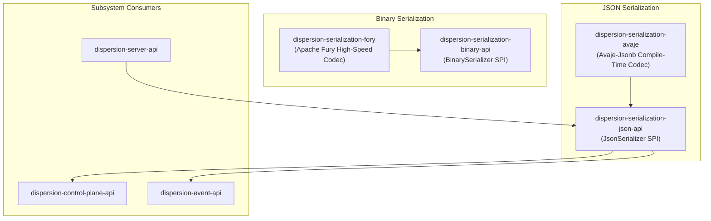

# Dispersion Serialization Subsystem (`serialization`)

The **Dispersion Serialization Subsystem** provides high-throughput, low-latency, reflection-free serialization contracts and implementations for telemetry events, control plane descriptors, checkpoints, and network envelopes.

---

## 1. Module Structure & Architecture

Dispersion decouples serialization through pure SPI abstractions (`dispersion-serialization-binary-api` and `dispersion-serialization-json-api`), allowing high-performance codecs to plug in seamlessly via standard Java `ServiceLoader`:



### Module Matrix

| Module | JPMS Module Name | Description |
| :--- | :--- | :--- |
| **`dispersion-serialization-binary-api`** | `com.github.f442y.dispersion.serialization.binary` | Abstract SPI contracts (`BinarySerializer`) for high-speed binary serialization of workflow states, context objects, and envelopes. |
| **`dispersion-serialization-fory`** | `com.github.f442y.dispersion.serialization.fory` | High-throughput binary serializer powered by **Apache Fury**, providing sub-microsecond serialization with zero reflection overhead. |
| **`dispersion-serialization-json-api`** | `com.github.f442y.dispersion.serialization.json` | SPI contracts (`JsonSerializer`) for serializing and deserializing `ExecutionEvent` streams, `MachineDescriptor`, and `ExecutionSummary` payloads. |
| **`dispersion-serialization-avaje`** | `com.github.f442y.dispersion.serialization.avaje` | Compile-time generated, reflection-free JSON codec powered by **Avaje-Jsonb** with native polymorphic `ExecutionEvent` mapping. |

---

## 2. JSON Serialization with Avaje-Jsonb

`dispersion-serialization-avaje` uses compile-time annotation processing to generate byte-efficient JSON serializers without runtime reflection, class scanning, or JVM warms:

### Polymorphic Telemetry Event Serialization
`ExecutionEventJsonAdapter` serializes and deserializes the entire `ExecutionEvent` hierarchy with a type discriminator field (`"type"`):

```java
import com.github.f442y.dispersion.event.ExecutionEvent;
import com.github.f442y.dispersion.serialization.avaje.AvajeJsonSerializer;
import com.github.f442y.dispersion.serialization.json.JsonSerializer;

JsonSerializer serializer = new AvajeJsonSerializer();

// Serialize any polymorphic ExecutionEvent
String json = serializer.toJson(turnStartedEvent);

// Deserialize polymorphically back into the exact record type
ExecutionEvent event = serializer.fromJson(json, ExecutionEvent.class);
```

### Supported Payloads
* `ExecutionEvent` hierarchy (turns, states, transitions, signals, compensations, batch barriers).
* `MachineDescriptor` and `ExecutionSummary` for control plane queries.
* `SignalDeliveryResult` and signal request bodies.

---

## 3. High-Speed Binary Serialization with Apache Fury

For high-throughput persistence, inter-node network routing, and checkpoint snapshots, `dispersion-serialization-fory` utilizes Apache Fury:

```java
import com.github.f442y.dispersion.serialization.binary.BinarySerializer;
import com.github.f442y.dispersion.serialization.fory.ForyBinarySerializer;

BinarySerializer serializer = new ForyBinarySerializer();

// Serialize context or checkpoint state to raw byte array
byte[] bytes = serializer.serialize(domainContext);

// Deserialize with zero reflection overhead
MyContext rehydrated = serializer.deserialize(bytes, MyContext.class);
```

---

## 4. Maven Dependency Setup

```xml
<dependencyManagement>
    <dependencies>
        <dependency>
            <groupId>com.github.f442y.dispersion</groupId>
            <artifactId>dispersion-bom</artifactId>
            <version>0.1.0-SNAPSHOT</version>
            <type>pom</type>
            <scope>import</scope>
        </dependency>
    </dependencies>
</dependencyManagement>

<dependencies>
    <!-- Compile-time Avaje JSON Serializer -->
    <dependency>
        <groupId>com.github.f442y.dispersion</groupId>
        <artifactId>dispersion-serialization-avaje</artifactId>
    </dependency>

    <!-- Apache Fury Binary Serializer (Optional) -->
    <dependency>
        <groupId>com.github.f442y.dispersion</groupId>
        <artifactId>dispersion-serialization-fory</artifactId>
    </dependency>
</dependencies>
```

---

## 🔗 Related Subsystems & Guides

* 🏠 [**Project Showcase (`README.md`)**](../README.md) — Architecture overview, quickstarts, and benchmarks.
* 🌐 [**Server Subsystem (`server/`)**](../server/README.md) — Virtual-thread HTTP/SSE hosting and Jakarta REST resource.
* 🔭 [**Control Plane Subsystem (`control-plane/`)**](../control-plane/README.md) — Registry, dynamic topologies, and signal routing.
* 📡 [**Event Subsystem (`event/`)**](../event/README.md) — Telemetry event definitions and virtual-thread bus.
