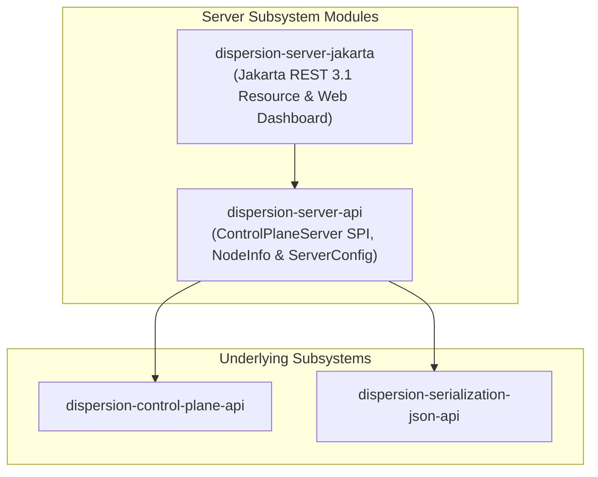

# Dispersion Server Subsystem (`server`)

The **Dispersion Server Subsystem** provides lightweight, embeddable HTTP, Server-Sent Events (SSE), and static Web Dashboard server hosts for the Dispersion Control Plane.

It allows monitoring tools, administrative scripts, and web dashboards to query machine topologies, inspect live and suspended executions, stream real-time telemetry events, and dispatch external signals into running workflows.

---

## 1. Module Structure & Architecture



### Module Matrix

| Module | JPMS Module Name | Description |
| :--- | :--- | :--- |
| **`dispersion-server-api`** | `com.github.f442y.dispersion.server.api` | SPI contracts (`ControlPlaneServer`, `ServerConfig`, `ControlPlaneNodeInfo`) defining server lifecycle and configuration. |
| **`dispersion-server-jakarta`** | `com.github.f442y.dispersion.server.jakarta` | Standard Jakarta RESTful Web Services 3.1 (`@Path`, `@GET`, `@POST`) adapter (`ControlPlaneResource`), CORS filter (`ControlPlaneCorsFilter`), and static UI dashboard host (`WebDashboardResource`) for Spring Boot, Quarkus, WildFly, or Jersey. |

---

## 2. Jakarta REST 3.1 Resource (`dispersion-server-jakarta`)

`dispersion-server-jakarta` provides full JAX-RS / Jakarta REST 3.1 compatible endpoints and embedded UI hosting without coupling to any specific servlet container or framework runtime:

```java
package com.example.web;

import com.github.f442y.dispersion.control.ControlPlane;
import com.github.f442y.dispersion.serialization.json.JsonSerializer;
import com.github.f442y.dispersion.server.api.ServerConfig;
import com.github.f442y.dispersion.server.jakarta.ControlPlaneCorsFilter;
import com.github.f442y.dispersion.server.jakarta.ControlPlaneResource;
import com.github.f442y.dispersion.server.jakarta.WebDashboardResource;
import org.glassfish.jersey.server.ResourceConfig;

public class MyJerseyConfig extends ResourceConfig {

    public MyJerseyConfig(ControlPlane controlPlane, JsonSerializer jsonSerializer, int port) {
        ServerConfig config = ServerConfig.builder()
                .port(port)
                .basePath("/api/v1")
                .environment("production")
                .clusterId("dispersion-cluster")
                .build();

        register(new ControlPlaneResource(controlPlane, jsonSerializer, config));
        register(new ControlPlaneCorsFilter(config));
        register(new WebDashboardResource());
    }
}
```

---

## 3. Endpoints Specification

All API endpoints are hosted relative to the configured base path (default `/api/v1`), while UI static assets and SPA routes are hosted at `/`:

| Method | Endpoint | Query / Body Parameters | Response Payload | Description |
| :--- | :--- | :--- | :--- | :--- |
| `GET` | `/` | — | HTML | Web Dashboard SPA entry point (`index.html`). |
| `GET` | `/{path}` | — | Binary / Text / HTML | Static assets (`.js`, `.css`, `.svg`, `.woff2`) with client-side SPA route fallback. |
| `GET` | `/api/v1/node` | — | JSON (`ControlPlaneNodeInfo`) | Node health, CPU cores, JVM version, uptime, and active machine count. |
| `GET` | `/api/v1/machines` | — | JSON Array of `MachineDescriptor` | List all registered machines. |
| `GET` | `/api/v1/machines/{name}` | — | JSON `MachineDescriptor` | Get descriptor and Mermaid graph string. |
| `POST` | `/api/v1/machines/{name}/dispatch` | JSON or String execution input | JSON result (`status`, `machine`, `result`) | Synchronously dispatch an execution turn. |
| `GET` | `/api/v1/executions` | `machine`, `status`, `limit` | JSON Array of `ExecutionSummary` | Query executions filtered by machine or status (`RUNNING`, `SUSPENDED`, `CANCELLED`, `COMPLETED`, `FAILED`). |
| `GET` | `/api/v1/executions/{id}` | — | JSON `ExecutionSummary` | Query status of a single execution. |
| `GET` | `/api/v1/executions/{id}/timeline` | `limit` (default 100) | JSON Array of `ExecutionEvent` | Get ordered chronological event timeline. |
| `GET` | `/api/v1/executions/{machine}/{key}/checkpoint` | — | JSON `OrchestrationCheckpoint` | Inspect durable checkpoint snapshot for a suspended execution. |
| `POST` | `/api/v1/executions/signal` | JSON `SignalRequest` | JSON `SignalDeliveryResult` | Route external signal to suspended workflow. |
| `POST` | `/api/v1/telemetry/events` | JSON Array of `ExecutionEvent` | JSON `{status: INGESTED, count: N}` | Ingest a batch of execution telemetry events. |
| `GET` | `/api/v1/events/stream` | `machine`, `executionId`, `tier` (`lifecycle` or `all`) | `text/event-stream` (SSE) | Live streaming of `ExecutionEvent` records with 15s heartbeat pings and dynamic tap support. |

### Example cURL Commands

```bash
# 1. Query node health and active machine count
curl -s http://localhost:8080/api/v1/node

# 2. Query all registered machine topologies
curl -s http://localhost:8080/api/v1/machines

# 3. Retrieve dynamic Mermaid diagram for rendering
curl -s http://localhost:8080/api/v1/machines/OrderWorkflow

# 4. Dispatch state machine execution directly via HTTP
curl -X POST http://localhost:8080/api/v1/machines/MetricsPipeline/dispatch \
  -H "Content-Type: application/json" -d "42.0"

# 5. Inspect suspended checkpoint snapshot
curl -s http://localhost:8080/api/v1/executions/OrderWorkflow/ORDER-DEMO-99/checkpoint

# 6. Stream live telemetry events in real time
curl -N http://localhost:8080/api/v1/events/stream

# 7. Deliver external signal to a suspended workflow
curl -X POST http://localhost:8080/api/v1/executions/signal \
  -H "Content-Type: application/json" \
  -d '{
    "machineName": "OrderWorkflow",
    "correlationKey": "ORDER-DEMO-99",
    "signalName": "PaymentSignal",
    "payload": {"paymentMethod": "CREDIT_CARD", "amountCents": 9995}
  }'
```

---

## 4. Maven Dependency Setup

```xml
<dependencyManagement>
    <dependencies>
        <dependency>
            <groupId>com.github.f442y.dispersion</groupId>
            <artifactId>dispersion-bom</artifactId>
            <version>0.1.0-SNAPSHOT</version>
            <type>pom</type>
            <scope>import</scope>
        </dependency>
    </dependencies>
</dependencyManagement>

<dependencies>
    <!-- Jakarta REST Server Adapter & UI Host -->
    <dependency>
        <groupId>com.github.f442y.dispersion</groupId>
        <artifactId>dispersion-server-jakarta</artifactId>
    </dependency>

    <!-- Avaje JSON Serializer Provider -->
    <dependency>
        <groupId>com.github.f442y.dispersion</groupId>
        <artifactId>dispersion-serialization-avaje</artifactId>
    </dependency>

    <!-- Jersey SSE Provider (when deploying in Jersey runtimes) -->
    <dependency>
        <groupId>org.glassfish.jersey.media</groupId>
        <artifactId>jersey-media-sse</artifactId>
    </dependency>
</dependencies>
```

---

## 🔗 Related Subsystems & Guides

* 🏠 [**Project Showcase (`README.md`)**](../README.md) — Architecture overview, quickstarts, and benchmarks.
* 📦 [**Serialization Subsystem (`serialization/`)**](../serialization/README.md) — Reflection-free Avaje JSON and Apache Fury codecs.
* 🔭 [**Control Plane Subsystem (`control-plane/`)**](../control-plane/README.md) — Registry, dual-pool memory topology, and descriptors.
* 💻 [**Interactive Demo Application (`examples/`)**](../examples/README.md) — Running the Spring Boot 4.1 demo application with embedded UI dashboard.
