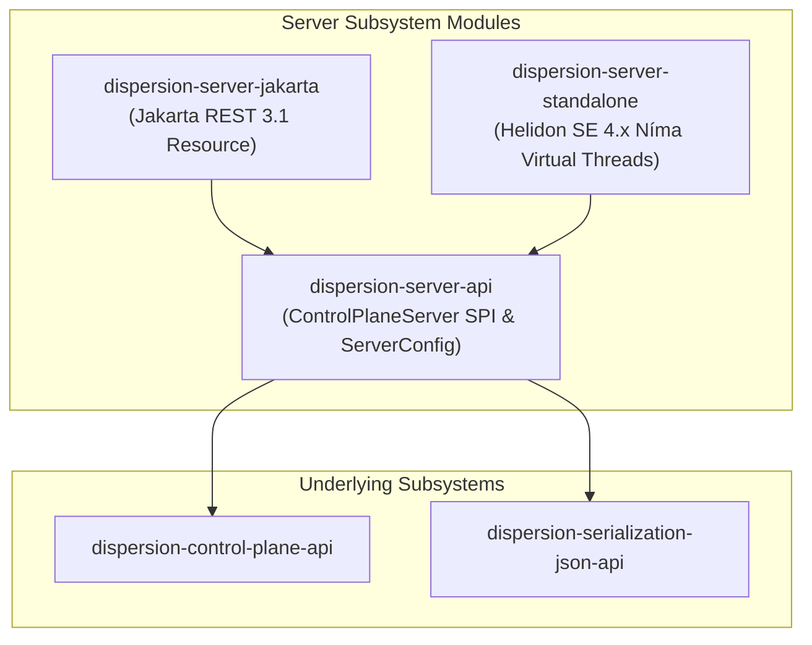

# Dispersion Server Subsystem (`server`)

The **Dispersion Server Subsystem** provides lightweight, embeddable HTTP and Server-Sent Events (SSE) server hosts for the Dispersion Control Plane.

It allows monitoring tools, administrative scripts, and web dashboards to query machine topologies, inspect live and suspended executions, stream real-time telemetry events, and dispatch external signals into running workflows.

---

## 1. Module Structure & Architecture



### Module Matrix

| Module | JPMS Module Name | Description |
| :--- | :--- | :--- |
| **`dispersion-server-api`** | `com.github.f442y.dispersion.server.api` | SPI contracts (`ControlPlaneServer`, `ControlPlaneServerFactory`, `ServerConfig`) defining server lifecycle and configuration. |
| **`dispersion-server-jakarta`** | `com.github.f442y.dispersion.server.jakarta` | Standard Jakarta RESTful Web Services 3.1 (`@Path`, `@GET`, `@POST`) adapter (`ControlPlaneResource`) for Quarkus, WildFly, or Jersey. |
| **`dispersion-server-standalone`** | `com.github.f442y.dispersion.server.standalone` | Ultra-lightweight standalone HTTP/SSE server powered natively by **Helidon SE 4.x Níma** on Java 25 virtual threads. |

---

## 2. Standalone Helidon SE Níma Server

`dispersion-server-standalone` requires no external application server. It mounts HTTP route handlers and SSE listeners directly on Java 25 virtual threads:

```java
import com.github.f442y.dispersion.control.core.DefaultControlPlane;
import com.github.f442y.dispersion.server.api.ControlPlaneServer;
import com.github.f442y.dispersion.server.api.ControlPlaneServerFactory;
import com.github.f442y.dispersion.server.api.ServerConfig;

// 1. Initialize Control Plane and register state machines
DefaultControlPlane controlPlane = new DefaultControlPlane();
controlPlane.register(myWorkflowExecutor.asInspectableMachine());

// 2. Configure and launch virtual-thread server
ServerConfig config = ServerConfig.builder()
    .port(8080)
    .basePath("/api/v1")
    .cors(true)
    .build();

ControlPlaneServer server = ControlPlaneServerFactory.create(controlPlane, config);
server.start();

System.out.println("Control Plane Server ready at " + server.boundAddress());
```

---

## 3. Endpoints Specification

All endpoints are hosted relative to the configured base path (default `/api/v1`):

| Method | Endpoint | Query / Body Parameters | Response Payload | Description |
| :--- | :--- | :--- | :--- | :--- |
| `GET` | `/node` | — | JSON (`uptime`, `cores`, `machines`) | Node health and cluster metrics. |
| `GET` | `/machines` | — | JSON Array of `MachineDescriptor` | List all registered machines. |
| `GET` | `/machines/{name}` | — | JSON `MachineDescriptor` | Get descriptor and Mermaid graph string. |
| `POST` | `/machines/{name}/dispatch` | JSON execution payload | JSON execution result | Synchronously dispatch a workflow turn. |
| `GET` | `/executions` | `machine`, `status`, `limit` | JSON Array of `ExecutionSummary` | Query executions by state or type. |
| `GET` | `/executions/{id}` | — | JSON `ExecutionSummary` | Query status of a single execution. |
| `GET` | `/executions/{id}/timeline` | — | JSON Array of `ExecutionEvent` | Get ordered event timeline. |
| `POST` | `/executions/signal` | JSON `SignalRequest` | JSON `SignalDeliveryResult` | Route external signal to suspended workflow. |
| `GET` | `/events/stream` | `machine`, `executionId` | `text/event-stream` (SSE) | Live streaming of `ExecutionEvent` records. |

### Example cURL Commands

```bash
# Query all registered machine topologies
curl -s http://localhost:8080/api/v1/machines

# Retrieve dynamic Mermaid diagram for rendering
curl -s http://localhost:8080/api/v1/machines/OrderWorkflow

# Stream live telemetry events in real time
curl -N http://localhost:8080/api/v1/events/stream

# Deliver external signal to a suspended workflow
curl -X POST http://localhost:8080/api/v1/executions/signal \
  -H "Content-Type: application/json" \
  -d '{
    "machineName": "OrderWorkflow",
    "correlationKey": "ORD-12345",
    "signalName": "PaymentSignal",
    "payload": {"method": "CREDIT_CARD", "amount": 100.0}
  }'
```

---

## 4. Jakarta REST 3.1 Resource (`dispersion-server-jakarta`)

For applications deployed within Jakarta EE or MicroProfile runtimes:

```java
import com.github.f442y.dispersion.control.ControlPlane;
import com.github.f442y.dispersion.serialization.json.JsonSerializer;
import com.github.f442y.dispersion.server.jakarta.ControlPlaneResource;
import jakarta.ws.rs.ApplicationPath;
import jakarta.ws.rs.core.Application;
import java.util.Set;

@ApplicationPath("/api/v1")
public class MyApplication extends Application {
    private final ControlPlaneResource resource;

    public MyApplication(ControlPlane controlPlane, JsonSerializer jsonSerializer) {
        this.resource = new ControlPlaneResource(controlPlane, jsonSerializer);
    }

    @Override
    public Set<Object> getSingletons() {
        return Set.of(resource);
    }
}
```

---

## 5. Maven Dependency Setup

```xml
<dependencyManagement>
    <dependencies>
        <dependency>
            <groupId>com.github.f442y.dispersion</groupId>
            <artifactId>dispersion-bom</artifactId>
            <version>0.1.0-SNAPSHOT</version>
            <type>pom</type>
            <scope>import</scope>
        </dependency>
    </dependencies>
</dependencyManagement>

<dependencies>
    <!-- Standalone Virtual-Thread Server Host -->
    <dependency>
        <groupId>com.github.f442y.dispersion</groupId>
        <artifactId>dispersion-server-standalone</artifactId>
    </dependency>

    <!-- Avaje JSON Serializer Provider -->
    <dependency>
        <groupId>com.github.f442y.dispersion</groupId>
        <artifactId>dispersion-serialization-avaje</artifactId>
    </dependency>
</dependencies>
```

---

## 🔗 Related Subsystems & Guides

* 🏠 [**Project Showcase (`README.md`)**](../README.md) — Architecture overview, quickstarts, and benchmarks.
* 📦 [**Serialization Subsystem (`serialization/`)**](../serialization/README.md) — Reflection-free Avaje JSON and Apache Fury codecs.
* 🔭 [**Control Plane Subsystem (`control-plane/`)**](../control-plane/README.md) — Registry, dual-pool memory topology, and descriptors.
* 💻 [**Interactive Demo Application (`examples/`)**](../examples/README.md) — Running the demo application with embedded server.
