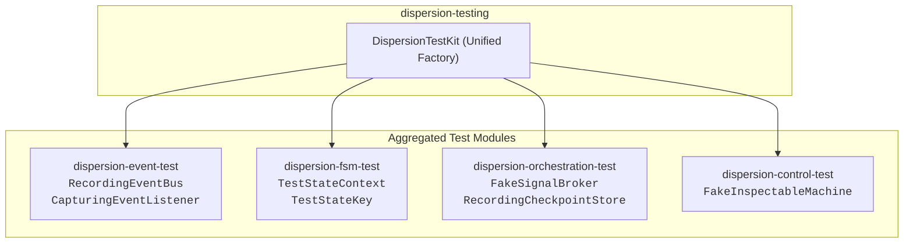

# Dispersion Testing Framework (`dispersion-testing`)

The **Dispersion Testing Framework** provides a unified, zero-dependency testing facade—`DispersionTestKit`—that aggregates all test doubles, in-memory brokers, and recording stores across all Dispersion subsystems. It eliminates the need for heavyweight bytecode-manipulating mock frameworks (such as Mockito or ByteBuddy) by providing first-class, thread-safe test doubles.

---

## 1. Architecture & Aggregated Test Doubles

`dispersion-testing` is an umbrella test dependency that depends exclusively on the `*-api` contracts and `*-test` companion modules:



### Test Double Catalog

| Test Double | Target Interface | Subsystem | Capabilities |
| :--- | :--- | :--- | :--- |
| **`RecordingEventBus`** | `EventBus` | `event` | Captures all published `ExecutionEvent`s synchronously with thread-safe access and assertion helpers. |
| **`CapturingEventListener`** | `ExecutionEventListener` | `event` | Direct listener capturing telemetry events in arrival order. |
| **`TestStateContext`** | `StateMachineContext` | `fsm` | Generic key-value context supporting quick prototyping without defining domain classes. |
| **`TestStateKey`** | `StateKey` | `fsm` | General-purpose state enum (`STATE_A`, `STATE_B`, `STATE_C`, etc.) for topology testing. |
| **`FakeSignalBroker`** | `SignalPublisher`, `SignalConsumer` | `orchestration` | Synchronous, in-memory pub-sub broker capturing all outbound messages and routing test signals. |
| **`RecordingCheckpointStore`** | `CheckpointStore` | `orchestration` | In-memory store tracking every `save`, `find`, and `remove` operation for saga verification. |
| **`FakeInspectableMachine`** | `InspectableMachine` | `control` | Configurable mock machine for testing Control Plane registries, dashboards, and signal endpoints. |

---

## 2. Factory Methods (`DispersionTestKit`)

All test doubles are instantiated via clean, static methods on `DispersionTestKit`:

```java
import com.github.f442y.dispersion.control.MachineType;
import com.github.f442y.dispersion.control.test.FakeInspectableMachine;
import com.github.f442y.dispersion.event.test.CapturingEventListener;
import com.github.f442y.dispersion.event.test.RecordingEventBus;
import com.github.f442y.dispersion.fsm.test.TestStateContext;
import com.github.f442y.dispersion.fsm.test.TestStateKey;
import com.github.f442y.dispersion.orchestration.test.FakeSignalBroker;
import com.github.f442y.dispersion.orchestration.test.RecordingCheckpointStore;
import com.github.f442y.dispersion.testing.DispersionTestKit;

// 1. Telemetry and Event Testing
RecordingEventBus eventBus = DispersionTestKit.recordingEventBus();
CapturingEventListener listener = DispersionTestKit.capturingListener();

// 2. State & Context Testing
TestStateContext context = DispersionTestKit.testContext("TEST-01");

// 3. Orchestration & Saga Testing
RecordingCheckpointStore<TestStateContext, TestStateKey> store = DispersionTestKit.recordingCheckpointStore();
FakeSignalBroker broker = DispersionTestKit.fakeSignalBroker();

// 4. Control Plane Testing
FakeInspectableMachine machine = DispersionTestKit.fakeMachine("MockEngine", MachineType.ORCHESTRATION);
```

---

## 3. Practical Testing Recipes

### Recipe 1: Verifying Telemetry Events in an Atomic Machine
Ensure that executing a state machine triggers the expected state transitions and telemetry events:

```java
package com.example.testing;

import com.github.f442y.dispersion.event.ExecutionEvent;
import com.github.f442y.dispersion.event.test.CapturingEventListener;
import com.github.f442y.dispersion.fsm.config.StateMachineConfiguration;
import com.github.f442y.dispersion.fsm.core.atomic.AtomicStateMachineBuilder;
import com.github.f442y.dispersion.fsm.core.atomic.AtomicStateMachineExecutor;
import com.github.f442y.dispersion.fsm.test.TestStateContext;
import com.github.f442y.dispersion.fsm.test.TestStateKey;
import com.github.f442y.dispersion.testing.DispersionTestKit;
import org.junit.jupiter.api.DisplayName;
import org.junit.jupiter.api.Test;

import java.util.List;

import static org.assertj.core.api.Assertions.assertThat;

public class AtomicMachineTestRecipe {

    @Test
    @DisplayName("Should capture state transitions in CapturingEventListener")
    public void testStateMachineTelemetry() throws Exception {
        CapturingEventListener listener = DispersionTestKit.capturingListener();

        StateMachineConfiguration<TestStateContext, TestStateKey, Integer, Integer> config =
            AtomicStateMachineBuilder.<TestStateContext, TestStateKey, Integer, Integer>create("TestFSM", TestStateKey.class)
                .context(TestStateContext::new)
                .initialState(TestStateKey.STATE_A)
                .endStates(TestStateKey.STATE_C)
                .eventListener(listener)
                .input((TestStateContext ctx, Integer val) -> { ctx.put("val", val); return ctx; })
                .state(TestStateKey.STATE_A)
                    .action((TestStateContext ctx) -> { ctx.put("val", ctx.<Integer>get("val") + 10); return ctx; })
                    .transition(TestStateKey.STATE_C)
                .output((TestStateContext ctx) -> ctx.<Integer>get("val"))
                .build();

        try (AtomicStateMachineExecutor<TestStateContext, TestStateKey, Integer, Integer> executor =
                 new AtomicStateMachineExecutor<>("test-exec", config, 10)) {

            int result = executor.dispatchSync(5);
            assertThat(result).isEqualTo(15);

            List<ExecutionEvent> events = listener.capturedEvents();
            assertThat(events).isNotEmpty();
            assertThat(events).anyMatch(e -> e instanceof ExecutionEvent.TurnStartedEvent);
            assertThat(events).anyMatch(e -> e instanceof ExecutionEvent.TurnCompletedEvent);
        }
    }
}
```

### Recipe 2: Verifying Checkpoint Persistence in a Suspended Saga
Verify that a long-running workflow accurately snapshots context when suspended and deletes checkpoints upon completion:

```java
package com.example.testing;

import com.github.f442y.dispersion.orchestration.OrchestrationTurnResult;
import com.github.f442y.dispersion.orchestration.command.SignalCommand;
import com.github.f442y.dispersion.orchestration.core.OrchestrationStateMachineBuilder;
import com.github.f442y.dispersion.orchestration.core.OrchestrationStateMachineExecutor;
import com.github.f442y.dispersion.orchestration.test.RecordingCheckpointStore;
import com.github.f442y.dispersion.fsm.test.TestStateContext;
import com.github.f442y.dispersion.fsm.test.TestStateKey;
import com.github.f442y.dispersion.testing.DispersionTestKit;
import org.jspecify.annotations.NonNull;
import org.junit.jupiter.api.DisplayName;
import org.junit.jupiter.api.Test;

import static org.assertj.core.api.Assertions.assertThat;

public class SagaSuspensionTestRecipe {

    public record ResumeSignal(@NonNull String correlationKey, @NonNull String data) implements SignalCommand {
        @Override
        @NonNull
        public String signalName() {
            return "ResumeSignal";
        }
    }

    @Test
    @DisplayName("Should save checkpoint when suspended and clean up when completed")
    public void testCheckpointLifecycle() throws Exception {
        RecordingCheckpointStore<TestStateContext, TestStateKey> store = DispersionTestKit.recordingCheckpointStore();

        try (OrchestrationStateMachineExecutor<TestStateContext, TestStateKey, String, String> executor =
                 OrchestrationStateMachineBuilder.<TestStateContext, TestStateKey, String, String>create("SuspensionWorkflow", TestStateKey.class)
                     .context(TestStateContext::new)
                     .initialState(TestStateKey.STATE_A)
                     .endStates(TestStateKey.STATE_C)
                     .checkpointStore(store)
                     .correlationKey((TestStateContext ctx) -> ctx.<String>get("key"))
                     .input((TestStateContext ctx, String key) -> { ctx.put("key", key); return ctx; })

                     .state(TestStateKey.STATE_A)
                         .action((TestStateContext ctx) -> ctx)
                         .transition(TestStateKey.STATE_B)

                     .state(TestStateKey.STATE_B)
                         .waitForCommand(ResumeSignal.class, (TestStateContext ctx, ResumeSignal sig) -> {
                             ctx.put("data", sig.data());
                             return ctx;
                         })
                         .transition(TestStateKey.STATE_C)

                     .output((TestStateContext ctx) -> ctx.<String>get("data"))
                     .buildExecutor()) {

            // Turn 1: Suspend at STATE_B
            OrchestrationTurnResult<TestStateContext, TestStateKey, String> turn1 = executor.dispatchTurnSync("CORR-99", "CORR-99");
            assertThat(turn1.isSuspended()).isTrue();

            // Assert store captured the save
            assertThat(store.saveCount()).isEqualTo(1);
            assertThat(store.savedCheckpoints()).containsKey("CORR-99");

            // Turn 2: Send Signal to complete
            OrchestrationTurnResult<TestStateContext, TestStateKey, String> turn2 =
                executor.dispatchSignalSync("CORR-99", new ResumeSignal("CORR-99", "Payload"));

            assertThat(turn2.isCompleted()).isTrue();
            assertThat(turn2.output()).isEqualTo("Payload");

            // Assert store captured checkpoint removal
            assertThat(store.removeCount()).isEqualTo(1);
        }
    }
}
```

---

## 4. Maven Dependency Setup

Add `dispersion-testing` with test scope to your project:

```xml
<dependencyManagement>
    <dependencies>
        <dependency>
            <groupId>com.github.f442y.dispersion</groupId>
            <artifactId>dispersion-bom</artifactId>
            <version>1.0.0-SNAPSHOT</version>
            <type>pom</type>
            <scope>import</scope>
        </dependency>
    </dependencies>
</dependencyManagement>

<dependencies>
    <!-- Umbrella Testing Dependency -->
    <dependency>
        <groupId>com.github.f442y.dispersion</groupId>
        <artifactId>dispersion-testing</artifactId>
        <scope>test</scope>
    </dependency>
</dependencies>
```
